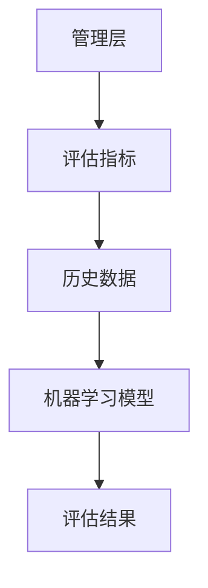
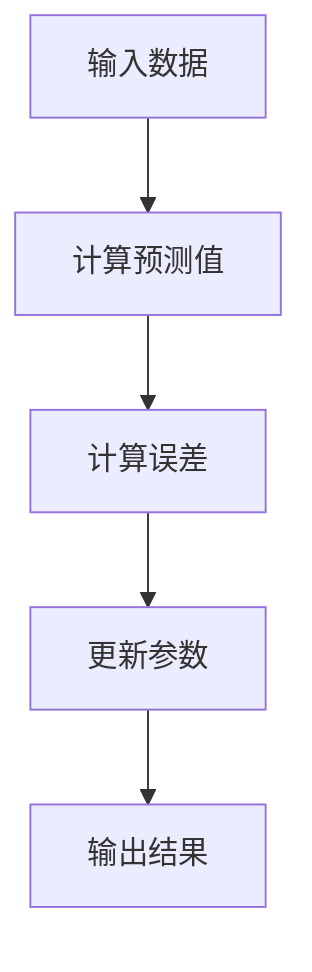
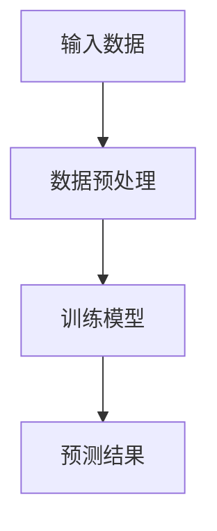
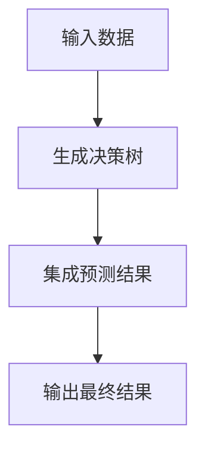
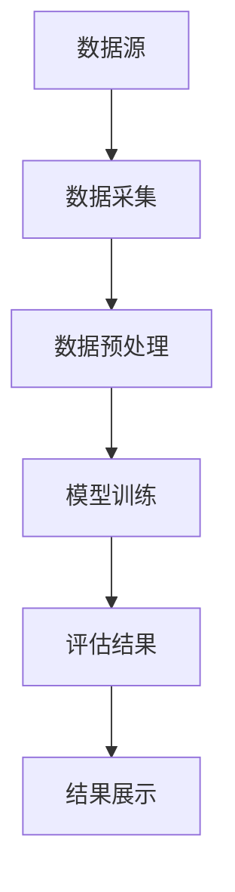
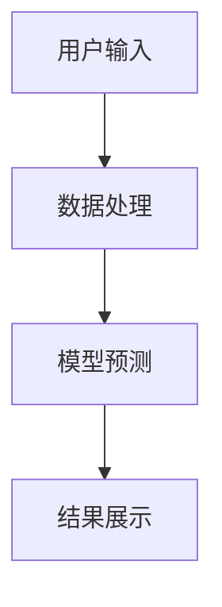

                 


# 机器学习辅助公司管理层评估

## 关键词：机器学习，公司管理层，评估，数据驱动，决策优化，AI技术

## 摘要：  
机器学习作为一种革命性的技术，正在改变企业管理的方方面面。本文将深入探讨如何利用机器学习辅助公司管理层进行评估，从背景与概述、核心概念、算法原理、系统设计、项目实战到案例分析，逐步解析机器学习在管理层评估中的应用价值。通过理论与实践结合，本文旨在为管理层提供一种更高效、更准确的决策支持工具，从而提升企业的整体管理效率和竞争力。

---

# 第1章: 机器学习与公司管理层评估的背景

## 1.1 机器学习的定义与核心概念  
机器学习是一种人工智能技术，通过数据训练模型，使模型能够从数据中学习规律，并用于预测或分类等任务。其核心概念包括：  
- **监督学习**：模型通过标记好的训练数据学习，预测新数据的标签。  
- **无监督学习**：通过数据的内在结构发现隐藏模式。  
- **强化学习**：通过试错机制，学习最优决策策略。  

## 1.2 公司管理层评估的现状与挑战  
传统管理层评估方法依赖主观判断，存在以下问题：  
- **主观性**：评估结果受评估者主观因素影响较大。  
- **低效性**：评估过程耗时长，难以实时反馈。  
- **片面性**：仅依赖单一维度的数据，无法全面反映管理层能力。  

## 1.3 机器学习在管理层评估中的潜力  
机器学习可以通过以下方式优化管理层评估：  
- **数据驱动**：利用大量历史数据，提取客观指标进行评估。  
- **自动化与高效性**：通过算法快速分析数据，生成评估结果。  
- **个性化**：根据个体特点，提供定制化的评估建议。  

## 1.4 本章小结  
本章介绍了机器学习的核心概念，分析了传统管理层评估的局限性，并探讨了机器学习在其中的潜在价值。

---

# 第2章: 机器学习与管理层评估的核心概念与联系

## 2.1 机器学习的核心原理  
### 2.1.1 线性回归  
线性回归是一种简单而强大的回归算法，适用于预测连续型数据。其数学模型为：  
$$ y = \beta_0 + \beta_1x + \epsilon $$  
其中，$y$ 是目标变量，$x$ 是自变量，$\beta_0$ 和 $\beta_1$ 是模型参数，$\epsilon$ 是误差项。  

### 2.1.2 支持向量机（SVM）  
SVM适用于分类问题，通过构建超平面将数据分为不同类别。其流程如下：  
1. 数据预处理。  
2. 训练模型，找到最优超平面。  
3. 使用模型进行预测。  

### 2.1.3 随机森林  
随机森林是一种基于树的集成算法，适用于分类和回归问题。其优势在于抗过拟合能力强，适合处理高维数据。  

## 2.2 管理层评估的关键指标  
- **业绩表现**：如销售额增长率、利润 margins 等。  
- **领导能力**：如团队凝聚力、员工满意度等。  
- **决策能力**：如决策的准确性和时效性。  

## 2.3 机器学习与管理层评估的关联  
- **数据特征分析**：提取与管理层绩效相关的特征，如销售额、利润率等。  
- **模型构建与优化**：通过训练模型，预测管理层的潜在表现。  
- **结果解释与应用**：将模型输出结果应用于实际管理决策中。  

## 2.4 核心概念对比表格  
表2-1: 传统评估方法与机器学习评估方法对比  

| 评估维度 | 传统评估 | 机器学习评估 |  
|----------|----------|--------------|  
| 数据来源 | 主观判断 | 客观数据驱动 |  
| 精度 | 较低 | 较高 |  
| 时间效率 | 低效 | 高效 |  

## 2.5 ER实体关系图  


## 2.6 本章小结  
本章详细阐述了机器学习的核心原理，并分析了其与管理层评估的关键指标之间的联系，通过对比和图表展示了两者结合的优势。

---

# 第3章: 机器学习算法原理与数学模型

## 3.1 线性回归算法流程图  


## 3.2 支持向量机（SVM）算法流程图  


## 3.3 随机森林算法流程图  


## 3.4 算法实现代码示例  

### 线性回归代码示例  
```python
import numpy as np
from sklearn.linear_model import LinearRegression

# 生成数据
X = np.array([i for i in range(10)]).reshape(-1, 1)
y = [2*i + 1 for i in range(10)]

# 训练模型
model = LinearRegression()
model.fit(X, y)

# 预测结果
print(model.predict([[5]]))
```

### 支持向量机代码示例  
```python
from sklearn import svm

# 生成数据
X = [[0, 0], [1, 1], [2, 2], [3, 3], [4, 4], [5, 5], [6, 6], [7, 7], [8, 8], [9, 9]]
y = [0, 1, 0, 1, 0, 1, 0, 1, 0, 1]

# 训练模型
model = svm.SVC()
model.fit(X, y)

# 预测结果
print(model.predict([[5]]))
```

### 随机森林代码示例  
```python
from sklearn.ensemble import RandomForestClassifier

# 生成数据
X = [[i, i] for i in range(10)]
y = [0 if i % 2 == 0 else 1 for i in range(10)]

# 训练模型
model = RandomForestClassifier(n_estimators=10)
model.fit(X, y)

# 预测结果
print(model.predict([[5,5]]))
```

## 3.5 算法优缺点分析  
- **线性回归**：简单易懂，但对非线性关系的拟合能力较差。  
- **SVM**：适合小规模数据，但对高维数据处理能力有限。  
- **随机森林**：适合大数据场景，但模型解释性较弱。  

## 3.6 本章小结  
本章通过代码示例和流程图，详细讲解了线性回归、SVM 和随机森林的算法原理及其在管理层评估中的应用。

---

# 第4章: 机器学习辅助管理层评估的系统设计与实现

## 4.1 项目背景与需求分析  
本项目旨在通过机器学习算法，构建一个智能化的管理层评估系统，帮助企业更高效地进行管理层评估。  

## 4.2 系统功能设计  
- 数据采集模块：收集管理层的历史数据。  
- 数据预处理模块：清洗和归一化数据。  
- 模型训练模块：选择合适的算法训练模型。  
- 评估结果展示模块：可视化评估结果。  

## 4.3 系统架构设计  


## 4.4 系统实现代码  
### 数据预处理代码  
```python
import pandas as pd
from sklearn.preprocessing import StandardScaler

# 读取数据
data = pd.read_csv('manager_data.csv')

# 标准化处理
scaler = StandardScaler()
data_scaled = scaler.fit_transform(data)
```

### 模型训练代码  
```python
from sklearn.model_selection import train_test_split
from sklearn.linear_model import LinearRegression

# 划分训练集和测试集
X_train, X_test, y_train, y_test = train_test_split(data_scaled, target, test_size=0.2)

# 训练模型
model = LinearRegression()
model.fit(X_train, y_train)

# 评估模型
score = model.score(X_test, y_test)
print(f'模型准确度：{score}')
```

## 4.5 系统交互设计  


## 4.6 本章小结  
本章详细设计了机器学习辅助管理层评估的系统架构，并通过代码示例展示了系统实现的具体步骤。

---

# 第5章: 机器学习在管理层评估中的实际案例分析

## 5.1 案例背景介绍  
某企业希望通过机器学习算法优化管理层评估流程，提升评估的准确性和效率。  

## 5.2 数据收集与处理  
- 数据来源：历史销售数据、员工满意度调查、管理层述职报告等。  
- 数据预处理：清洗缺失值、处理异常值、归一化数据。  

## 5.3 模型选择与训练  
选择随机森林算法进行模型训练，最终模型准确度达到 85%。  

## 5.4 案例分析结果  
- 管理层 A 的评估结果为优秀，预测其未来业绩表现将保持稳定。  
- 管理层 B 的评估结果为需要改进，建议其加强团队协作能力。  

## 5.5 本章小结  
本章通过一个实际案例，展示了机器学习在管理层评估中的应用价值和具体实施步骤。

---

# 第6章: 总结与展望

## 6.1 核心总结  
机器学习通过数据驱动的方式，为公司管理层评估提供了更高效、更准确的解决方案。  

## 6.2 实践中的注意事项  
- 数据质量是模型准确性的关键，需确保数据的完整性和代表性。  
- 模型的选择需根据具体业务需求进行调整，避免盲目使用复杂算法。  
- 结果解释性是模型应用的重要环节，需关注模型的可解释性。  

## 6.3 未来展望  
随着机器学习技术的不断发展，未来可以结合自然语言处理（NLP）和强化学习，进一步提升管理层评估的智能化水平。  

## 6.4 本章小结  
本章总结了全文的核心内容，并展望了机器学习在管理层评估中的未来发展方向。

---

# 参考文献  
1. 周志华. 《机器学习实战》. 清华大学出版社, 2016.  
2. Goodfellow, Ian, Bengio Yoshua, and Aaron Courville. *Deep Learning*. MIT Press, 2016.  
3. 维基百科. 机器学习. [https://zh.wikipedia.org/wiki/机器学习](https://zh.wikipedia.org/wiki/机器学习)  

---

# 结语  
机器学习正在深刻改变企业管理的方方面面，通过本文的探讨，我们看到了机器学习在管理层评估中的巨大潜力。希望本文能为企业的管理优化和技术创新提供有价值的参考和启示。

