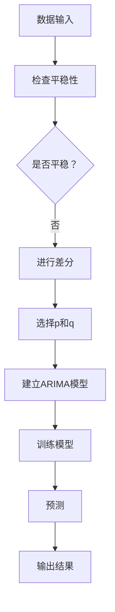
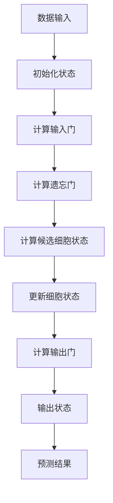
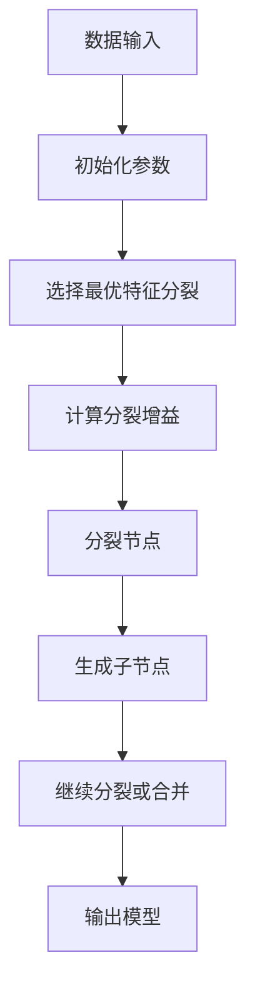
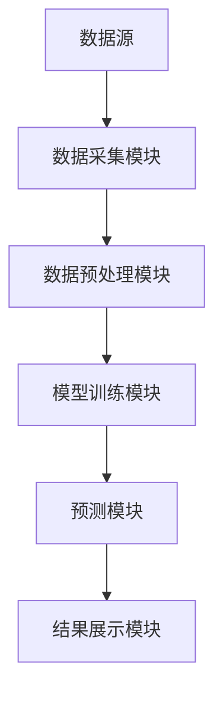
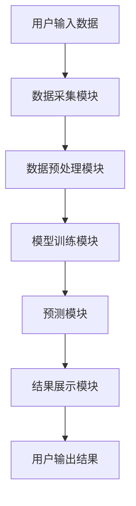

                 


```markdown
# 机器学习预测公司现金流波动性

> 关键词：机器学习，现金流波动性，时间序列分析，算法实现，系统架构，金融预测

> 摘要：本文详细探讨了机器学习在预测公司现金流波动性中的应用，从核心概念到算法实现，再到系统架构设计，全面解析了如何利用机器学习技术进行现金流预测，帮助企业优化财务决策。

---

## 第一部分: 机器学习预测公司现金流波动性概述

## 第1章: 现金流波动性预测的背景与意义

### 1.1 现金流波动性的定义与重要性

#### 1.1.1 现金流波动性的定义
现金流波动性是指公司在一定时期内现金流入和流出的变化程度，反映了企业财务状况的稳定性。

#### 1.1.2 现金流波动性对企业的意义
- 资金管理：帮助企业在资金短缺时及时调整策略。
- 风险评估：评估企业财务健康状况的重要指标。
- 投资决策：为投资者提供企业财务风险的参考依据。

#### 1.1.3 现金流波动性预测的挑战
- 数据复杂性：现金流受多种内外部因素影响。
- 时间序列特性：需要处理时间依赖性数据。
- 数据稀疏性：部分公司数据样本较少。

### 1.2 机器学习在现金流预测中的应用

#### 1.2.1 机器学习的定义与特点
- 机器学习：通过数据训练模型，使其能够进行预测或分类。
- 特点：数据驱动、自适应、可扩展。

#### 1.2.2 机器学习在金融领域的应用现状
- 股票价格预测：利用历史数据预测未来走势。
- 风险评估：评估客户或项目的信用风险。
- 市场趋势分析：识别市场中的潜在机会和风险。

#### 1.2.3 现金流预测中的机器学习优势
- 高准确性：通过复杂算法捕捉数据中的模式。
- 自适应性：能够自动调整模型参数以适应数据变化。
- 处理非线性关系：能够捕捉复杂的变量关系。

### 1.3 本章小结
本章介绍了现金流波动性的定义、重要性以及机器学习在其中的应用优势，为后续内容奠定了基础。

---

## 第二部分: 机器学习与现金流波动性预测的核心概念

## 第2章: 现金流波动性预测的核心概念与联系

### 2.1 现金流波动性预测的核心要素

#### 2.1.1 数据特征
- 时间序列特征：如趋势、周期性、季节性。
- 数据源：包括财务报表、市场数据、行业指标等。
- 数据质量：数据的完整性和准确性对预测结果有重要影响。

#### 2.1.2 时间序列特性
- 趋势：数据长期向上的或向下的趋势。
- 周期性：数据呈现规律性的周期波动。
- 季节性：数据在特定时间段内呈现的规律性变化。

#### 2.1.3 波动性指标
- 标准差：衡量数据的离散程度。
- 方差：标准差的平方，反映数据分布的集中程度。
- 波动率：一定时期内价格的变化程度。

### 2.2 机器学习算法与现金流预测的关系

#### 2.2.1 算法选择的影响因素
- 数据类型：时间序列数据适合使用LSTM、ARIMA等算法。
- 数据规模：大数据集适合使用高效的线性模型。
- 预测目标：是否需要解释模型的内部机制。

#### 2.2.2 算法与数据特征的匹配
- 线性模型（如ARIMA）适合线性关系明显的数据。
- 非线性模型（如LSTM）适合捕捉复杂的时间依赖关系。
- 集成模型（如XGBoost）适合处理高维数据和复杂特征。

#### 2.2.3 算法性能对比
| 算法 | 优点 | 缺点 |
|------|------|------|
| ARIMA | 善于捕捉线性趋势和周期性 | 不擅长处理非线性关系 |
| LSTM | 能够捕捉长期依赖关系 | 训练时间较长 |
| XGBoost | 高效，适合高维数据 | 不擅长处理时间序列 |

### 2.3 核心概念对比表格

| 概念 | 特征 |
|------|------|
| 时间序列 | 数据具有时间依赖性 |
| 波动性指标 | 反映数据的波动程度 |
| 机器学习算法 | 数据驱动的预测模型 |

### 2.4 ER实体关系图

```mermaid
erDiagram
    company {
        id
        name
        industry
    }
    cash_flow {
        id
        amount
        date
        company_id
    }
    prediction {
        id
        predicted_value
        date
        model_id
    }
    model {
        id
        type
        parameters
    }
    company --| cash_flow : has
    cash_flow --| prediction : predicts
    prediction --| model : uses
```

---

## 第三部分: 机器学习算法原理与数学模型

## 第3章: 时间序列分析与机器学习算法

### 3.1 时间序列分析的基本原理

#### 3.1.1 时间序列的分解
时间序列可以分解为趋势、周期性、季节性三个部分。

#### 3.1.2 时间序列预测的基本方法
- 常规方法：移动平均法、指数平滑法。
- 统计方法：ARIMA模型。

### 3.2 常见机器学习算法原理

#### 3.2.1 ARIMA算法原理

##### 3.2.1.1 ARIMA模型的数学公式
ARIMA(p, d, q)模型由三部分组成：
- 自回归部分（AR）：$ARIMA模型中的自回归部分用于捕捉数据中的自相关性，通过引入滞后值来预测当前值。
- 差分部分（d）：对数据进行d次差分，使数据变得平稳。
- 移动平均部分（MA）：$MA模型用于捕捉数据中的移动平均效应，通过引入误差项的滞后值来预测当前值。

##### 3.2.1.2 ARIMA算法流程图



#### 3.2.2 LSTM算法原理

##### 3.2.2.1 LSTM模型的数学公式
LSTM（长短期记忆网络）通过 gates 来控制信息的流动：
- 输入门：$i_t = \sigma(w_i x_t + u_i h_{t-1} + b_i)$
- 遗忘门：$f_t = \sigma(w_f x_t + u_f h_{t-1} + b_f)$
- 输出门：$o_t = \sigma(w_o x_t + u_o h_{t-1} + b_o)$
- 候选细胞状态：$c_t = \tanh(w_c x_t + u_c h_{t-1} + b_c)$
- 细胞状态：$c_t = f_t \cdot c_{t-1} + i_t \cdot c_t^{candidate}$
- 输出状态：$h_t = o_t \cdot \tanh(c_t)$

##### 3.2.2.2 LSTM算法流程图



#### 3.2.3 XGBoost算法原理

##### 3.2.3.1 XGBoost模型的数学公式
XGBoost 使用提升树算法，通过正则化和剪枝来优化模型：
- 目标函数：$L = \sum_{i=1}^n (y_i - \hat{y}_i)^2 + \lambda \sum_{j=1}^m \omega_j^2$
- 增益函数：$gain = \sum_{i \in leaf} (y_i - \hat{y}_i)^2 \times weight$

##### 3.2.3.2 XGBoost算法流程图



### 3.3 算法流程图

#### ARIMA算法流程图


#### LSTM算法流程图


---

## 第四部分: 系统分析与架构设计

## 第4章: 现金流波动性预测系统架构

### 4.1 项目背景与目标

#### 4.1.1 项目背景
现金流预测对企业财务管理至关重要，能够帮助企业优化资金使用效率，降低财务风险。

#### 4.1.2 项目目标
开发一个基于机器学习的现金流波动性预测系统，提供准确的预测结果，帮助企业做出科学的财务决策。

### 4.2 系统功能设计

#### 4.2.1 数据采集模块
- 数据来源：企业财务报表、市场数据、行业指标。
- 数据清洗：处理缺失值、异常值，确保数据质量。

#### 4.2.2 数据预处理模块
- 数据转换：将数据转换为适合算法输入的格式。
- 特征工程：提取有用的特征，如移动平均、标准差等。

#### 4.2.3 模型训练模块
- 算法选择：根据数据特征选择合适的算法。
- 模型训练：使用训练数据训练模型，调整参数以优化性能。

#### 4.2.4 预测与结果展示模块
- 模型预测：使用训练好的模型进行预测。
- 结果展示：将预测结果以图表形式展示，便于用户理解和分析。

### 4.3 系统架构设计

#### 4.3.1 系统架构图



#### 4.3.2 系统功能模块


### 4.4 系统接口设计

#### 4.4.1 接口描述
- 数据输入接口：接收原始数据。
- 数据处理接口：对数据进行清洗和转换。
- 模型调用接口：调用训练好的模型进行预测。
- 结果输出接口：输出预测结果和可视化图表。

#### 4.4.2 接口交互流程图



---

## 第五部分: 项目实战

## 第5章: 现金流波动性预测系统实现

### 5.1 环境安装与配置

#### 5.1.1 安装Python环境
- 安装Python 3.x。
- 安装必要的库：numpy、pandas、sklearn、keras、xgboost。

#### 5.1.2 安装Jupyter Notebook
- 用于数据处理和算法实现的交互式环境。

### 5.2 系统核心实现源代码

#### 5.2.1 数据采集与预处理代码

```python
import pandas as pd
import numpy as np

# 数据加载
df = pd.read_csv('cash_flow.csv')

# 数据清洗
df.dropna(inplace=True)
df = df[~df.duplicated()]

# 数据转换
df['date'] = pd.to_datetime(df['date'])
df.set_index('date', inplace=True)

# 特征提取
df['moving_avg'] = df['amount'].rolling(7).mean()
df['std_dev'] = df['amount'].rolling(7).std()
```

#### 5.2.2 模型训练代码

```python
from sklearn.model_selection import train_test_split
from sklearn.metrics import mean_squared_error
from xgboost import XGBRegressor
import numpy as np

# 数据分割
X = df[['moving_avg', 'std_dev']]
y = df['amount']
X_train, X_test, y_train, y_test = train_test_split(X, y, test_size=0.2, random_state=42)

# 模型训练
model = XGBRegressor(n_estimators=100, learning_rate=0.1, max_depth=6)
model.fit(X_train, y_train)

# 模型预测
y_pred = model.predict(X_test)

# 模型评估
mse = mean_squared_error(y_test, y_pred)
print(f'Mean Squared Error: {mse}')
```

### 5.3 代码应用解读与分析

#### 5.3.1 数据采集与预处理
- 数据加载：从CSV文件加载现金流数据。
- 数据清洗：删除缺失值和重复值。
- 数据转换：将日期设置为索引，方便后续处理。
- 特征提取：计算移动平均和标准差，作为模型的输入特征。

#### 5.3.2 模型训练与预测
- 数据分割：将数据分为训练集和测试集。
- 模型选择：选择XGBoost回归模型，适合处理高维数据和非线性关系。
- 模型训练：在训练数据上训练模型。
- 模型预测：使用测试数据进行预测，并计算均方误差作为评估指标。

### 5.4 实际案例分析与详细解读

#### 5.4.1 案例背景
某制造企业希望预测未来三个月的现金流波动性，以便优化资金管理。

#### 5.4.2 数据准备
使用过去三年的现金流数据进行模型训练。

#### 5.4.3 模型预测
通过XGBoost模型预测未来三个月的现金流，并分析其波动性。

#### 5.4.4 结果解读
- 预测结果显示未来三个月现金流波动性较大，企业需要提前做好资金储备。

### 5.5 项目小结
本章通过实际案例详细讲解了现金流波动性预测系统的实现过程，从数据采集到模型训练，再到结果展示，全面展示了如何利用机器学习技术进行现金流预测。

---

## 第六部分: 最佳实践与总结

## 第6章: 最佳实践、小结与注意事项

### 6.1 最佳实践
- 数据预处理：确保数据的完整性和准确性。
- 特征工程：提取有意义的特征，提高模型性能。
- 模型选择：根据数据特征选择合适的算法。
- 模型调优：通过参数调整和交叉验证优化模型性能。
- 结果解读：结合业务背景解读预测结果，避免误用。

### 6.2 项目小结
本项目通过机器学习技术实现了现金流波动性预测，验证了机器学习在金融领域的应用潜力，为企业财务管理提供了有力支持。

### 6.3 注意事项
- 数据隐私：确保数据的安全性和隐私性。
- 模型解释性：选择可解释的模型，便于业务人员理解。
- 模型更新：定期更新模型，确保预测结果的准确性。

### 6.4 拓展阅读
- 《机器学习实战》：深入理解机器学习算法的实现细节。
- 《时间序列分析》：掌握时间序列分析的基本方法和高级技巧。
- 《金融风险管理》：了解金融领域的风险管理策略和方法。

---

## 结语

机器学习在现金流波动性预测中的应用前景广阔，随着算法的不断进步和数据的积累，预测的准确性和可靠性将不断提升。企业可以利用这些技术优化财务管理，降低风险，提高竞争力。

---

## 参考文献

1. Hastie, T., Tibshirani, R., & Friedman, J. (2009). The Elements of Statistical Learning.
2. Hyndman, R. J., & Athanasopoulos, G. (2018). Forecasting: principles and practice.
3. 周志华. (2016). 机器学习.

---

## 附录

### 附录A: 代码实现细节
```python
# 更多代码细节...
```

### 附录B: 模型评估指标
- 均方误差（MSE）
- 均方根误差（RMSE）
- R²系数
- 每个算法的优缺点对比表格

---

## 感谢

感谢您的耐心阅读，希望本文对您在机器学习预测现金流波动性方面有所帮助。如需进一步探讨，欢迎随时联系。
```

