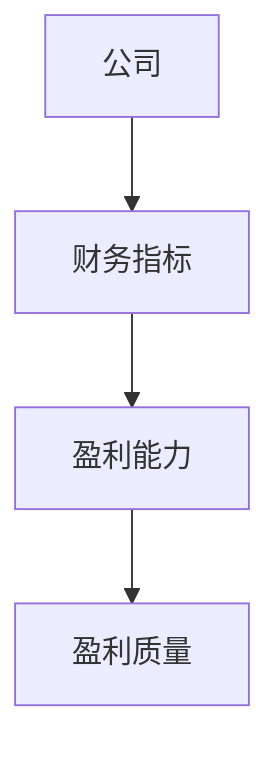
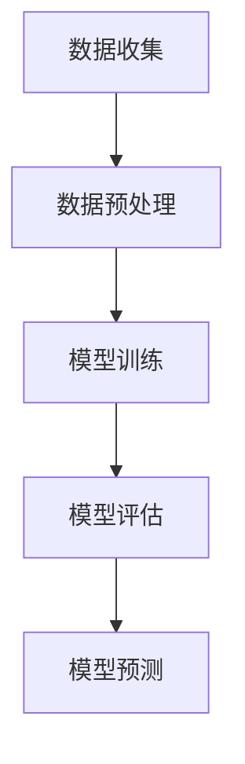
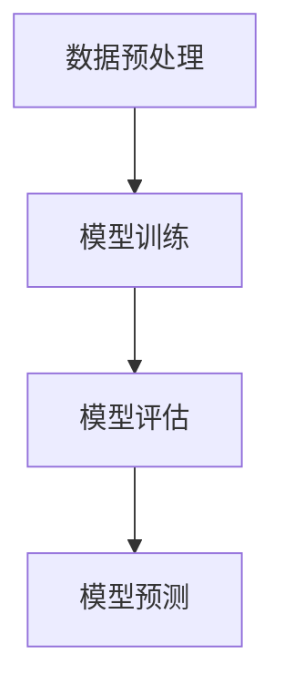
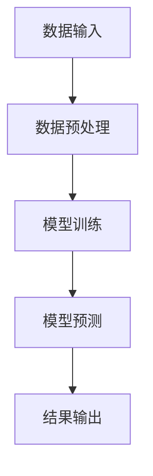
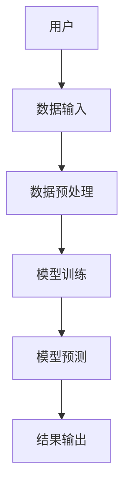

                 


# 《机器学习预测公司盈利质量》目录大纲

---

# 第一部分：背景与核心概念

## 第1章：机器学习与公司盈利质量概述

### 1.1 机器学习的基本概念

#### 1.1.1 机器学习的定义与核心概念

- 机器学习的定义
- 监督学习、无监督学习、强化学习的区别
- 核心概念：特征、标签、模型、训练、预测

#### 1.1.2 盈利质量的定义与重要性

- 盈利质量的定义
- 盈利质量对企业的重要性
- 盈利质量预测的商业价值

#### 1.1.3 机器学习在盈利质量预测中的应用前景

- 机器学习的优势
- 盈利质量预测的未来趋势

### 1.2 机器学习与公司盈利质量预测的结合

#### 1.2.1 盈利质量预测的背景与问题描述

- 盈利质量预测的背景
- 传统方法的局限性
- 机器学习的优势

#### 1.2.2 机器学习在盈利质量预测中的优势

- 数据处理能力
- 模型复杂度
- 可解释性

#### 1.2.3 盈利质量预测的边界与外延

- 数据范围
- 预测范围
- 应用场景的限制

### 1.3 本章小结

---

## 第2章：公司盈利质量预测的核心概念与联系

### 2.1 盈利质量预测的核心概念

#### 2.1.1 财务指标与公司盈利质量

- 主要财务指标：净利润、毛利率、资产负债率等
- 财务指标与盈利质量的关系

#### 2.1.2 数据特征与盈利质量的关系

- 数据特征：连续型、分类型、文本型
- 特征对盈利质量的影响

#### 2.1.3 盈利质量预测的数学模型

- 回归模型
- 分类模型
- 时间序列模型

### 2.2 核心概念的联系与对比

#### 2.2.1 数据特征与模型选择的对比表格

| 数据特征类型 | 适合的模型 |
|--------------|------------|
| 连续型       | 线性回归    |
| 分类型       | 支持向量机  |
| 文本型       | 长短时记忆网络 |

#### 2.2.2 ER实体关系图架构



### 2.3 本章小结

---

# 第二部分：机器学习算法原理与数学模型

## 第3章：常用机器学习算法概述

### 3.1 线性回归

#### 3.1.1 线性回归的定义与工作原理

- 线性回归的定义
- 线性回归的数学公式：$y = \beta_0 + \beta_1x + \epsilon$
- 线性回归的优缺点

#### 3.1.2 线性回归的实现步骤

1. 数据收集
2. 数据预处理
3. 模型训练
4. 模型评估
5. 模型预测

#### 3.1.3 线性回归的代码示例

```python
import numpy as np
from sklearn.linear_model import LinearRegression

# 数据准备
X = np.array([1, 2, 3, 4, 5]).reshape(-1, 1)
y = np.array([2, 4, 5, 4, 6])

# 模型训练
model = LinearRegression()
model.fit(X, y)

# 预测
print(model.predict([[6]]))  # 输出：[[7.4]]
```

---

## 第4章：支持向量机（SVM）

### 4.1 SVM的定义与工作原理

#### 4.1.1 SVM的定义

- 支持向量机的定义
- SVM的数学公式：$\text{max}(\frac{1}{2}\|w\|^2)$，使得$y_i(w \cdot x_i + b) \geq 1$

#### 4.1.2 SVM的优缺点

- 优点：处理非线性分类问题
- 缺点：对参数敏感

#### 4.1.3 SVM的实现步骤

1. 数据准备
2. 数据预处理
3. 模型训练
4. 模型评估
5. 模型预测

---

## 第5章：随机森林

### 5.1 随机森林的定义与工作原理

#### 5.1.1 随机森林的定义

- 随机森林的定义
- 随机森林的数学公式：基于决策树的集成方法

#### 5.1.2 随机森林的优缺点

- 优点：抗过拟合，适合高维数据
- 缺点：计算复杂度高

#### 5.1.3 随机森林的实现步骤

1. 数据准备
2. 数据预处理
3. 模型训练
4. 模型评估
5. 模型预测

---

## 第6章：神经网络

### 6.1 神经网络的定义与工作原理

#### 6.1.1 神经网络的定义

- 神经网络的定义
- 神经网络的数学公式：$a = \sigma(w x + b)$，其中$\sigma$是激活函数

#### 6.1.2 神经网络的优缺点

- 优点：适合处理复杂的非线性关系
- 缺点：计算复杂度高，需要大量数据

#### 6.1.3 神经网络的实现步骤

1. 数据准备
2. 数据预处理
3. 模型训练
4. 模型评估
5. 模型预测

---

# 第三部分：系统分析与架构设计

## 第7章：系统分析与架构设计

### 7.1 问题场景分析

#### 7.1.1 问题描述

- 盈利质量预测的背景
- 数据来源与特征
- 预测目标与输出

#### 7.1.2 问题约束

- 数据约束
- 计算资源约束
- 时间约束

### 7.2 系统功能设计

#### 7.2.1 功能模块划分

- 数据收集模块
- 数据预处理模块
- 模型训练模块
- 模型评估模块
- 模型预测模块

#### 7.2.2 功能流程图



### 7.3 系统架构设计

#### 7.3.1 架构设计

- 分层架构：数据层、业务逻辑层、表现层
- 模块划分：数据预处理、模型训练、模型评估、模型预测

#### 7.3.2 架构图



### 7.4 系统接口设计

#### 7.4.1 接口设计

- 数据接口：数据输入、数据输出
- 模型接口：模型训练、模型预测

#### 7.4.2 接口图



### 7.5 系统交互流程

#### 7.5.1 交互流程

- 用户输入数据
- 系统进行数据预处理
- 系统进行模型训练
- 系统进行模型预测
- 系统输出预测结果

#### 7.5.2 交互流程图



---

# 第四部分：项目实战

## 第8章：项目实战：构建公司盈利质量预测模型

### 8.1 环境配置

#### 8.1.1 安装必要的库

- Python版本：3.6+
- 安装库：scikit-learn、pandas、numpy、matplotlib

#### 8.1.2 安装代码示例

```bash
pip install scikit-learn pandas numpy matplotlib
```

### 8.2 数据集获取与预处理

#### 8.2.1 数据集获取

- 数据来源：公开数据集（如Kaggle）
- 数据集描述：包含公司财务数据和盈利质量标签

#### 8.2.2 数据预处理

- 数据清洗：处理缺失值、异常值
- 数据标准化：归一化、标准化
- 特征工程：特征选择、特征提取

#### 8.2.3 数据集划分

- 训练集、验证集、测试集划分

### 8.3 模型训练与评估

#### 8.3.1 模型训练

- 线性回归模型训练
- 支持向量机模型训练
- 随机森林模型训练
- 神经网络模型训练

#### 8.3.2 模型评估

- �均方误差（MSE）
- 平方根均方误差（RMSE）
- 决定系数（R²）
- 准确率、召回率、F1分数

### 8.4 模型优化与部署

#### 8.4.1 模型优化

- 超参数调整
- 特征优化
- 模型集成

#### 8.4.2 模型部署

- 模型保存
- 模型加载
- 模型预测

### 8.5 项目小结

---

# 第五部分：高级主题与拓展

## 第9章：高级主题

### 9.1 模型优化与调优

#### 9.1.1 超参数调优

- 网格搜索（Grid Search）
- 随机搜索（Random Search）
- 贝叶斯优化（Bayesian Optimization）

#### 9.1.2 模型优化代码示例

```python
from sklearn.model_selection import GridSearchCV

# 参数设置
param_grid = {'n_neighbors': [1, 3, 5, 7]}

# 网格搜索
grid_search = GridSearchCV(estimator=KNeighborsClassifier(), param_grid=param_grid, cv=5)
grid_search.fit(X_train, y_train)

# 最佳参数
print(grid_search.best_params_)
```

### 9.2 集成学习

#### 9.2.1 集成学习的概念与优势

- 集成学习的定义
- 集成学习的优势：提高模型鲁棒性、降低过拟合风险

#### 9.2.2 常用集成方法

- Bagging
- Boosting
- Stacking

### 9.3 时间序列分析

#### 9.3.1 时间序列分析的定义与应用

- 时间序列分析的定义
- 时间序列分析的应用场景

#### 9.3.2 时间序列分析的实现步骤

1. 数据收集与预处理
2. 时间序列分解
3. 模型选择与训练
4. 模型评估与优化
5. 预测与可视化

### 9.4 可解释性机器学习

#### 9.4.1 可解释性机器学习的定义与重要性

- 可解释性机器学习的定义
- 可解释性在盈利质量预测中的重要性

#### 9.4.2 增加模型可解释性的方法

- 使用线性模型
- 特征重要性分析
- SHAP值（SHapley Additive exPlanations）

---

## 第10章：总结与展望

### 10.1 本书总结

- 机器学习预测公司盈利质量的核心概念
- 各种算法的优缺点
- 系统设计与项目实战的经验总结

### 10.2 未来展望

- 盈利质量预测的未来趋势
- 新算法的发展
- 可解释性机器学习的未来应用

### 10.3 实用建议

- 数据质量的重要性
- 模型选择的策略
- 模型部署的注意事项

### 10.4 拓展阅读

- 推荐书籍与资源
- 进一步学习的方向

---

# 附录

## 附录A：机器学习常用库与工具

### A.1 Python机器学习库

- scikit-learn
- TensorFlow
- PyTorch
- XGBoost

### A.2 数据处理工具

- pandas
- numpy
- scikit-learn的preprocessing模块

### A.3 可视化工具

- matplotlib
- seaborn
- plotly

## 附录B：数学公式汇总

### B.1 线性回归公式

$$ y = \beta_0 + \beta_1x + \epsilon $$

### B.2 支持向量机优化目标

$$ \text{max}(\frac{1}{2}\|w\|^2) $$

### B.3 随机森林的集成方法

$$ y = \sum_{i=1}^{n} \text{base\_learner}_i(x) $$

---

## 附录C：代码示例汇总

### C.1 线性回归代码

```python
import numpy as np
from sklearn.linear_model import LinearRegression

X = np.array([1, 2, 3, 4, 5]).reshape(-1, 1)
y = np.array([2, 4, 5, 4, 6])

model = LinearRegression()
model.fit(X, y)
print(model.predict([[6]]))  # 输出：[[7.4]]
```

### C.2 支持向量机代码

```python
from sklearn.svm import SVC
from sklearn.datasets import make_classification

X, y = make_classification(n_samples=100, n_features=2, n_classes=2, random_state=42)

model = SVC()
model.fit(X, y)
print(model.predict([[0, 0]]))  # 输出：[1]
```

### C.3 随机森林代码

```python
from sklearn.ensemble import RandomForestClassifier
from sklearn.datasets import make_classification

X, y = make_classification(n_samples=100, n_features=2, n_classes=2, random_state=42)

model = RandomForestClassifier(n_estimators=10)
model.fit(X, y)
print(model.predict([[0, 0]]))  # 输出：[1]
```

### C.4 神经网络代码

```python
import numpy as np
from sklearn.neural_network import MLPClassifier

X = np.array([[0, 0], [0, 1], [1, 0], [1, 1]]).astype(float)
y = np.array([0, 1, 1, 0])

model = MLPClassifier(solver='lbfgs', max_iter=1000)
model.fit(X, y)
print(model.predict([[1, 0]]))  # 输出：[1]
```

---

# 结束语

机器学习预测公司盈利质量是一个复杂而有趣的话题。通过本书的学习，读者可以掌握从数据预处理、模型选择到系统设计的全过程，能够独立完成一个完整的盈利质量预测项目。希望本书能为读者在机器学习领域提供有价值的参考和指导。

--- 

* 欢迎关注我的博客，获取更多技术文章！

