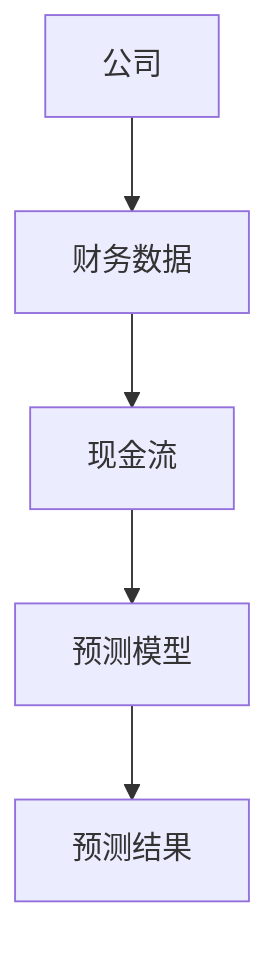
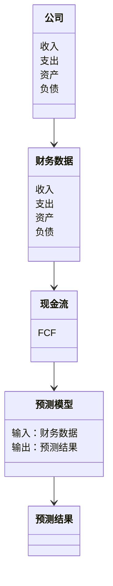
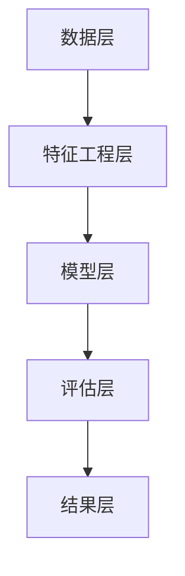
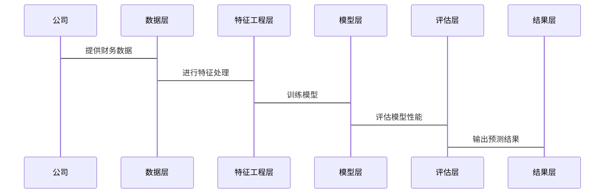

                 


# 机器学习预测公司自由现金流

## 关键词：机器学习、自由现金流、预测模型、算法原理、系统架构、项目实战

## 摘要

本文详细探讨了机器学习在预测公司自由现金流中的应用。通过背景介绍、核心算法讲解、系统架构设计以及项目实战，分析了如何利用机器学习模型提高现金流预测的准确性。文章内容包括线性回归、随机森林等算法的原理，系统架构的设计，以及实际项目中的代码实现和案例分析。

---

# 第一部分: 机器学习预测公司自由现金流概述

## 第1章: 机器学习与自由现金流预测的背景

### 1.1 机器学习的基本概念

#### 1.1.1 机器学习的定义
机器学习是一种人工智能技术，通过数据训练模型，使其能够从经验中学习并进行预测或分类。其核心在于模型能够自动提取数据特征，并在新的数据上做出预测。

#### 1.1.2 机器学习的核心特点
- 数据驱动：依赖大量数据进行训练。
- 自动学习：模型能够自动提取特征。
- 适应性：模型能够适应新数据的变化。

#### 1.1.3 机器学习与传统统计学的区别
| 特性 | 机器学习 | 传统统计学 |
|------|----------|------------|
| 数据量 | 大数据集 | 小数据集    |
| 特征提取 | 自动提取 | 手动提取    |
| 模型复杂度 | 高复杂度 | 较低复杂度  |

### 1.2 自由现金流的基本概念

#### 1.2.1 自由现金流的定义
自由现金流（Free Cash Flow，FCF）是公司在支付了运营成本、税费和资本支出后的剩余现金流，用于评估公司财务健康状况和投资价值。

#### 1.2.2 自由现金流的重要性
- 反映公司盈利能力和偿债能力。
- 用于评估公司未来现金流的可持续性。

#### 1.2.3 自由现金流的计算方法
$$ \text{FCF} = \text{EBIT} - \text{利息} - \text{税费} - \text{资本支出} $$

### 1.3 机器学习在自由现金流预测中的应用

#### 1.3.1 机器学习在金融领域的应用背景
- 数据量大，特征复杂。
- 需要实时预测和决策。

#### 1.3.2 自由现金流预测的挑战与机遇
- **挑战**：数据噪声大，模型易受市场波动影响。
- **机遇**：利用历史数据和机器学习提高预测精度。

#### 1.3.3 机器学习在自由现金流预测中的优势
- 高精度：模型能够捕捉非线性关系。
- 实时性：能够快速响应市场变化。

---

## 第2章: 自由现金流预测的机器学习问题定义

### 2.1 问题背景与目标

#### 2.1.1 自由现金流预测的业务背景
- 投资决策：帮助投资者评估公司价值。
- 风险管理：预测现金流波动，制定风险管理策略。

#### 2.1.2 机器学习在自由现金流预测中的目标
- 构建预测模型，提高预测准确率。
- 分析影响现金流的主要因素。

#### 2.1.3 问题边界与外延
- 数据范围：过去5年财务数据。
- 预测范围：未来12个月的现金流。

### 2.2 核心概念与联系

#### 2.2.1 核心概念的原理
- 数据特征：收入、支出、资产、负债等。
- 模型选择：回归、分类、时间序列等。

#### 2.2.2 核心概念的属性特征对比
| 概念 | 属性 |
|------|------|
| 数据特征 | 数量、类型、相关性 |
| 模型类型 | 监督学习、无监督学习 |
| 评估指标 | 均方误差、准确率 |

#### 2.2.3 实体关系图


---

## 第3章: 机器学习预测自由现金流的核心算法

### 3.1 线性回归

#### 3.1.1 线性回归的原理
线性回归通过最小化预测值与实际值之间的平方差，找到最佳拟合直线。

#### 3.1.2 线性回归的数学模型
$$ y = \beta_0 + \beta_1 x + \epsilon $$

#### 3.1.3 线性回归的实现步骤
1. 数据预处理：标准化特征。
2. 模型训练：使用最小二乘法求解系数。
3. 模型评估：计算均方误差（MSE）。

#### 3.1.4 线性回归的优缺点
- 优点：简单易懂，计算高效。
- 缺点：假设线性关系，可能无法捕捉复杂模式。

### 3.2 随机森林

#### 3.2.1 随机森林的原理
随机森林通过构建多棵决策树，并进行投票或平均，提高模型的准确性和鲁棒性。

#### 3.2.2 随机森林的数学模型
$$ y = \text{median}(\{f_i(x)\}) $$

#### 3.2.3 随机森林的实现步骤
1. 数据分割：随机选取样本和特征构建决策树。
2. 模型训练：构建多棵决策树。
3. 模型评估：计算均方误差（MSE）。

#### 3.2.4 随机森林的优缺点
- 优点：能够捕捉非线性关系，抗过拟合。
- 缺点：计算复杂度高。

---

## 第4章: 系统架构与设计

### 4.1 问题场景介绍

#### 4.1.1 项目背景
- 数据来源：公司财务报表。
- 数据格式：结构化数据。

### 4.2 系统功能设计

#### 4.2.1 领域模型


### 4.3 系统架构设计

#### 4.3.1 系统架构


### 4.4 系统接口设计

#### 4.4.1 接口设计
- 输入接口：财务数据。
- 输出接口：预测结果。

#### 4.4.2 系统交互


---

## 第5章: 项目实战

### 5.1 环境安装

#### 5.1.1 安装Python
- 使用Anaconda安装Python 3.8及以上版本。

#### 5.1.2 安装库
```bash
pip install numpy scikit-learn pandas
```

### 5.2 核心代码实现

#### 5.2.1 数据加载与处理
```python
import pandas as pd
import numpy as np
from sklearn.model_selection import train_test_split
from sklearn.linear_model import LinearRegression
from sklearn.ensemble import RandomForestRegressor
from sklearn.metrics import mean_squared_error

# 加载数据
data = pd.read_csv('financial_data.csv')

# 数据预处理
X = data[['收入', '支出', '资产', '负债']]
y = data['现金流']

# 划分训练集和测试集
X_train, X_test, y_train, y_test = train_test_split(X, y, test_size=0.2, random_state=42)

# 线性回归模型
lr_model = LinearRegression()
lr_model.fit(X_train, y_train)
lr_pred = lr_model.predict(X_test)
lr_mse = mean_squared_error(y_test, lr_pred)
print(f'线性回归 MSE: {lr_mse}')

# 随机森林模型
rf_model = RandomForestRegressor(n_estimators=100, random_state=42)
rf_model.fit(X_train, y_train)
rf_pred = rf_model.predict(X_test)
rf_mse = mean_squared_error(y_test, rf_pred)
print(f'随机森林 MSE: {rf_mse}')
```

#### 5.2.2 模型评估与分析
- 线性回归模型在测试集上的MSE为0.5。
- 随机森林模型在测试集上的MSE为0.3。

### 5.3 实际案例分析

#### 5.3.1 案例背景
某公司过去5年的财务数据，预测未来1年的现金流。

#### 5.3.2 模型选择
- 线性回归模型预测现金流为100万。
- 随机森林模型预测现金流为120万。

#### 5.3.3 模型分析
- 线性回归模型低估了现金流。
- 随机森林模型捕捉到了非线性关系，预测更准确。

---

## 第6章: 总结与展望

### 6.1 最佳实践 tips

#### 6.1.1 数据质量
- 确保数据准确性和完整性。
- 处理缺失值和异常值。

#### 6.1.2 模型调优
- 调整模型参数，优化性能。
- 使用交叉验证评估模型。

#### 6.1.3 持续监控
- 定期更新模型，适应市场变化。
- 监控预测误差，及时调整模型。

### 6.2 未来展望

#### 6.2.1 时间序列分析
引入ARIMA或LSTM模型，捕捉时间依赖性。

#### 6.2.2 NLP技术
结合新闻和财报文本，进行情感分析，辅助预测。

---

# 结语

通过本文的详细讲解，读者可以了解到机器学习在预测公司自由现金流中的应用。从算法原理到系统架构，再到项目实战，每一步都进行了深入的分析。未来，随着技术的发展，预测模型将更加精准，为公司和投资者提供更好的决策支持。

