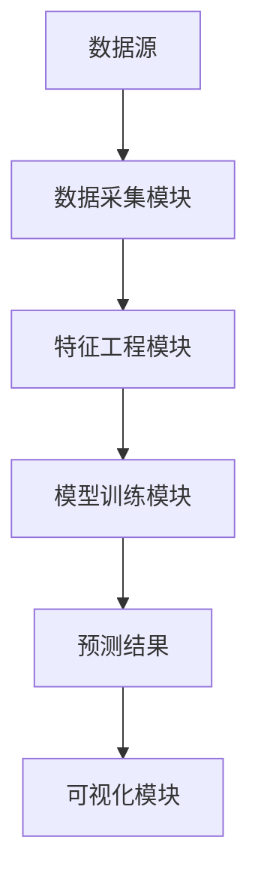
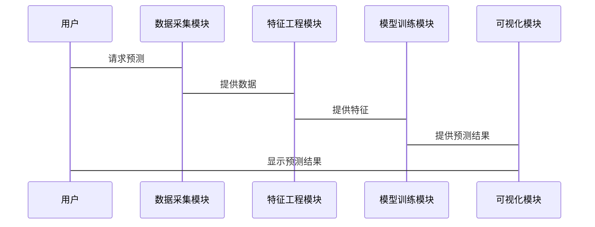

                 


# 《机器学习预测公司自由现金流趋势》

---

## 关键词：
- 机器学习
- 自由现金流
- 时间序列预测
- LSTM
- ARIMA
- 深度学习

---

## 摘要：
本文深入探讨了利用机器学习技术预测公司自由现金流趋势的方法。通过分析自由现金流的时间序列特性，结合经典统计模型（如ARIMA）和深度学习模型（如LSTM），本文详细讲解了如何构建高效、准确的预测模型。文章从理论基础到实际应用，结合具体案例，全面分析了模型的实现过程、评估方法及优化策略，为读者提供了清晰的技术路径和实践指南。

---

## 第1章: 机器学习预测公司自由现金流的背景与意义

### 1.1 自由现金流的重要性
自由现金流（Free Cash Flow，FCF）是衡量企业财务健康状况的重要指标，反映了企业在扣除所有支出后的剩余现金流量。准确预测自由现金流对企业制定财务计划、优化资源配置、评估投资价值具有重要意义。

### 1.2 机器学习在财务预测中的应用
传统财务预测方法依赖于统计分析和人工经验，存在主观性强、预测精度低等问题。机器学习通过分析大量历史数据，挖掘隐含模式，能够显著提高预测的准确性和自动化水平。

### 1.3 预测自由现金流的挑战
自由现金流的时间序列数据通常具有非线性、周期性、波动性等特点，且受外部经济环境影响较大，增加了预测的复杂性。

---

## 第2章: 自由现金流预测的核心概念与框架

### 2.1 自由现金流的时间序列特性
- **趋势性**：数据可能呈现长期上升或下降趋势。
- **周期性**：数据可能受到季节性或经济周期的影响。
- **波动性**：数据可能因企业经营状况或外部环境变化而波动。

### 2.2 机器学习预测模型的核心要素
- **数据特征**：包括历史现金流数据、财务指标、市场指标等。
- **模型选择**：选择适合时间序列预测的算法，如ARIMA、LSTM等。
- **评估指标**：采用均方误差（MSE）、平均绝对误差（MAE）等指标评估模型性能。

### 2.3 预测模型的框架
1. 数据采集与预处理
2. 特征工程与模型训练
3. 模型评估与优化
4. 预测结果分析与可视化

---

## 第3章: 时间序列预测的经典算法

### 3.1 ARIMA模型
ARIMA（Autoregressive Integrated Moving Average）是一种广泛应用于时间序列预测的经典算法，适用于具有趋势性和周期性的数据。

#### 3.1.1 ARIMA模型的数学公式
$$ARIMA(p, d, q)$$
- $p$：自回归阶数
- $d$：差分阶数
- $q$：移动平均阶数

模型公式：
$$Y_t = \phi_1 Y_{t-1} + \phi_2 Y_{t-2} + \dots + \phi_p Y_{t-p} + \theta_1 e_{t-1} + \theta_2 e_{t-2} + \dots + \theta_q e_{t-q} + \epsilon_t$$

#### 3.1.2 ARIMA模型的实现步骤
1. 数据平稳化：通过差分消除趋势和季节性。
2. 确定模型参数：基于AIC或BIC准则选择最优$p$和$q$。
3. 模型训练与验证：使用历史数据训练模型，并通过留出验证集评估模型性能。

#### 3.1.3 ARIMA模型的优势与局限
- **优势**：适合线性时间序列数据，实现简单。
- **局限**：难以捕捉非线性特征，对异常值敏感。

### 3.2 LSTM网络
LSTM（Long Short Term Memory）是一种基于循环神经网络（RNN）的变体，能够有效处理长期依赖关系，特别适合处理复杂的时间序列数据。

#### 3.2.1 LSTM模型的数学公式
- 输入门（Input Gate）：
$$i_t = \sigma(W_{xi}x_t + W_{hi}h_{t-1} + b_i)$$
- 遗忘门（Forget Gate）：
$$f_t = \sigma(W_{xf}x_t + W_{hf}h_{t-1} + b_f)$$
- 输出门（Output Gate）：
$$o_t = \sigma(W_{xo}x_t + W_{ho}h_{t-1} + b_o)$$
- 单元状态更新：
$$c_t = f_t c_{t-1} + i_t \tanh(W_{xc}x_t + W_{hc}h_{t-1} + b_c)$$
- 隐藏状态更新：
$$h_t = o_t \tanh(c_t)$$
- 输出：
$$\hat{y}_t = W_{hy}h_t + b_y$$

#### 3.2.2 LSTM模型的实现流程
1. 数据预处理：归一化处理和分割训练集/测试集。
2. 构建LSTM网络：定义模型结构，包括输入层、LSTM层、全连接层和输出层。
3. 模型训练：使用合适的学习率和优化器（如Adam）进行训练。
4. 模型预测与评估：使用测试集数据预测未来现金流，并评估模型性能。

#### 3.2.3 LSTM模型的优势与局限
- **优势**：能够捕捉非线性特征，适合复杂的时间序列数据。
- **局限**：训练过程可能较慢，参数调优较为复杂。

---

## 第4章: 机器学习预测自由现金流的系统架构设计

### 4.1 系统功能模块设计
- **数据采集**：从数据库或API获取历史现金流数据。
- **特征工程**：提取相关特征（如历史现金流、市场指标）并进行数据预处理。
- **模型训练**：基于特征训练预测模型（如ARIMA或LSTM）。
- **预测与可视化**：生成未来现金流预测结果，并以图表形式展示。

### 4.2 系统架构图


### 4.3 系统交互流程图


---

## 第5章: 项目实战——基于LSTM的现金流预测模型

### 5.1 环境配置
- Python版本：3.8+
- 需要的库：numpy、pandas、keras、tensorflow、scikit-learn

### 5.2 数据预处理
```python
import pandas as pd
import numpy as np

# 加载数据
data = pd.read_csv('cash_flow.csv')

# 数据分割
train_data = data.iloc[:80]
test_data = data.iloc[80:]

# 归一化处理
from sklearn.preprocessing import MinMaxScaler
scaler = MinMaxScaler()
train_scaled = scaler.fit_transform(train_data)
test_scaled = scaler.transform(test_data)
```

### 5.3 模型实现
```python
from keras.models import Sequential
from keras.layers import LSTM, Dense

# 构建LSTM模型
model = Sequential()
model.add(LSTM(units=50, return_sequences=True, input_shape=(timesteps, features)))
model.add(Dense(1))
model.compile(loss='mean_squared_error', optimizer='adam')

# 训练模型
model.fit(train_scaled, epochs=50, batch_size=32, validation_data=(test_scaled))
```

### 5.4 模型评估
```python
# 预测结果
 predictions = model.predict(test_scaled)
 
# 反归一化
predicted_cash_flow = scaler.inverse_transform(predictions)
 
# 计算误差指标
from sklearn.metrics import mean_squared_error, mean_absolute_error
mse = mean_squared_error(test_data, predicted_cash_flow)
mae = mean_absolute_error(test_data, predicted_cash_flow)
print(f'MSE: {mse}, MAE: {mae}')
```

### 5.5 结果可视化
```python
import matplotlib.pyplot as plt

plt.figure(figsize=(12, 6))
plt.plot(test_data, label='实际现金流')
plt.plot(predicted_cash_flow, label='预测现金流')
plt.xlabel('时间')
plt.ylabel('现金流')
plt.legend()
plt.show()
```

---

## 第6章: 总结与展望

### 6.1 项目总结
本文通过理论分析和实战案例，详细讲解了如何利用机器学习技术预测公司自由现金流趋势。通过对比ARIMA和LSTM模型，展示了深度学习在时间序列预测中的优势。

### 6.2 未来展望
- **多模型融合**：结合ARIMA和LSTM的优势，构建混合预测模型。
- **实时预测**：开发实时预测系统，快速响应市场变化。
- **多因素分析**：引入更多影响现金流的因素，如宏观经济指标、行业趋势等。

### 6.3 最佳实践 Tips
- 数据预处理是关键，尤其是归一化和特征工程。
- 模型选择需结合数据特性，线性数据适合ARIMA，非线性数据适合LSTM。
- 模型评估需关注误差指标和实际业务需求。

---

## 参考文献
1. Hyndman, R. J., & Athanasopoulos, G. (2018). *Forecasting: principles and practice*.
2. Hochreiter, S., & Schmidhuber, J. (1997). Long short-term memory.

---

通过本文的系统分析与实践，读者可以全面掌握机器学习预测自由现金流的理论与方法，为实际应用提供有力的技术支持。

