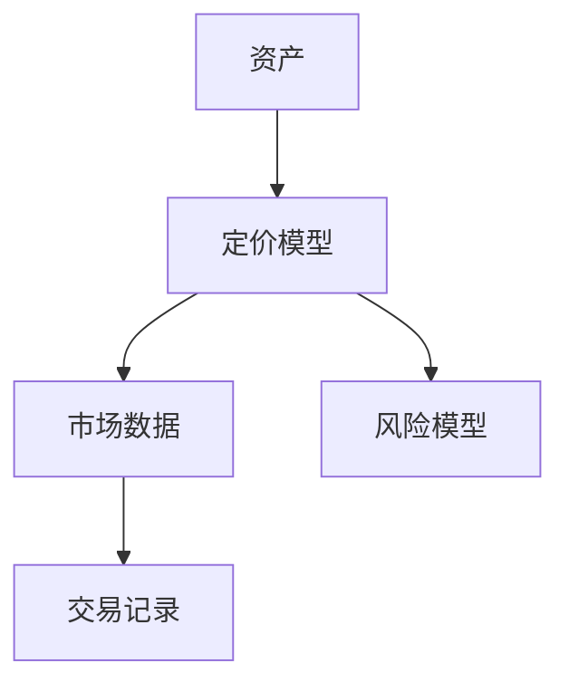
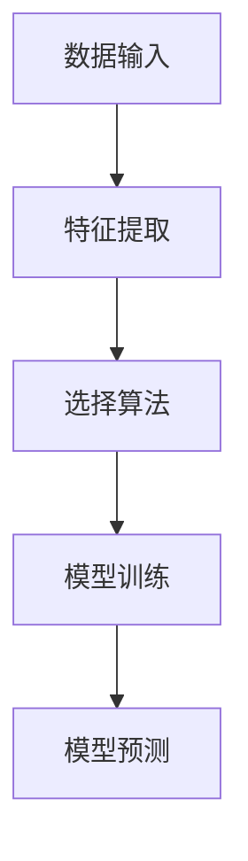
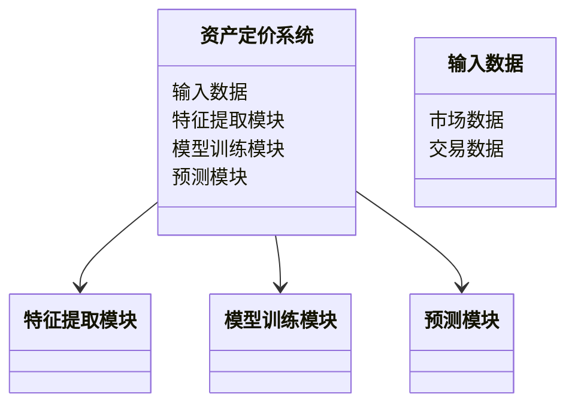
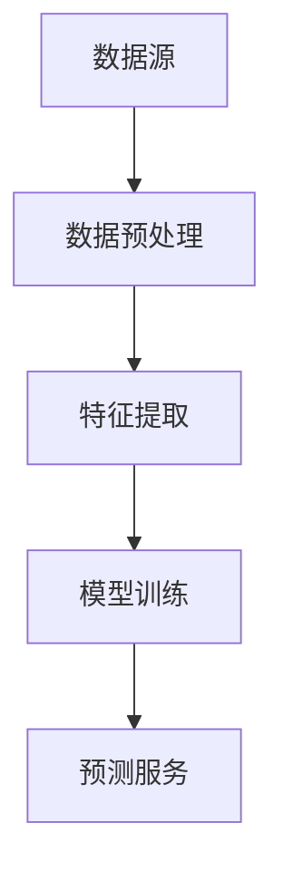
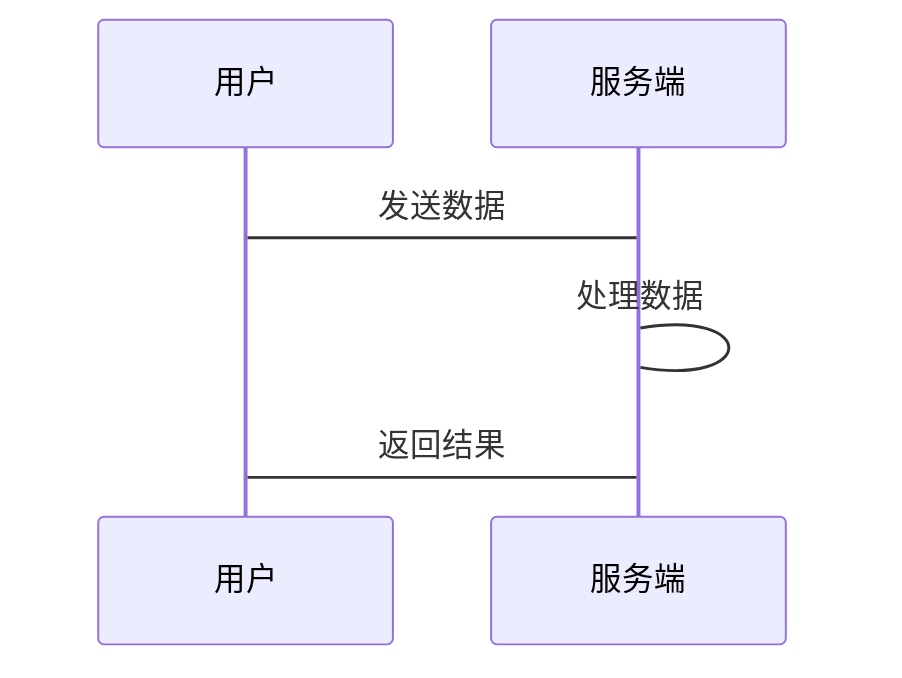

                 


# 《机器学习驱动的动态资产定价模型》

---

## 关键词：
- 机器学习
- 动态资产定价
- 金融模型
- 算法优化
- 风险评估

---

## 摘要：
本文探讨了机器学习在动态资产定价中的应用，分析了传统定价模型的局限性，详细讲解了机器学习算法及其在资产定价中的实现。通过构建动态资产定价模型，本文展示了如何利用机器学习技术提升资产定价的准确性和时效性，同时提供了项目实战和系统设计的详细指导。

---

# 第一部分: 机器学习驱动的动态资产定价模型概述

---

## 第1章: 背景介绍

### 1.1 机器学习与动态资产定价的背景
#### 1.1.1 传统资产定价模型的局限性
传统资产定价模型（如CAPM和APT）基于假设，难以捕捉市场中的复杂动态。它们在处理非线性关系、异常值和高频数据时表现不足。

#### 1.1.2 机器学习在金融领域的应用前景
机器学习擅长处理高维数据和非线性关系，能够捕捉市场中的隐含模式。在金融领域，机器学习被广泛应用于风险评估、信用评分和资产定价。

#### 1.1.3 动态资产定价的定义与意义
动态资产定价是指根据市场变化实时调整资产价格。其意义在于提高定价的时效性和准确性，帮助投资者做出更明智的决策。

### 1.2 问题背景与问题描述
#### 1.2.1 资产定价的核心问题
资产定价的核心在于预测资产的未来价值，考虑市场风险、流动性等因素。

#### 1.2.2 传统定价模型的不足
传统模型假设稳定，无法应对市场的剧烈波动和复杂性。

#### 1.2.3 机器学习如何解决这些问题
机器学习通过非线性建模和自适应学习，能够捕捉市场动态，提供实时定价支持。

### 1.3 问题解决与边界
#### 1.3.1 机器学习在资产定价中的应用
机器学习用于预测价格、评估风险和优化投资组合。

#### 1.3.2 动态资产定价模型的边界与外延
模型的边界包括数据质量和市场假设，外延则涉及实时定价和风险控制。

#### 1.3.3 核心要素与组成结构
核心要素包括数据特征、算法选择和模型优化。

---

## 第2章: 核心概念与联系

### 2.1 核心概念原理
#### 2.1.1 机器学习模型的基本原理
机器学习模型通过数据训练，学习特征与目标变量之间的关系。

#### 2.1.2 动态资产定价模型的构建原理
动态模型根据市场变化实时调整参数，更新预测结果。

#### 2.1.3 两者的联系与区别
机器学习提供工具，动态模型应用这些工具进行实时定价。

### 2.2 核心概念对比
#### 2.2.1 传统定价模型与机器学习模型的对比
| 特性 | 传统模型 | 机器学习模型 |
|------|----------|--------------|
| 假设 | 稳定性 | 动态适应性 |
| 数据需求 | 少 | 大 |

#### 2.2.2 不同机器学习算法的对比
- 线性回归：简单，适合线性关系。
- 支持向量机：适合高维数据。
- 随机森林：鲁棒，适合复杂数据。

#### 2.2.3 动态与静态资产定价的对比
动态模型实时更新，静态模型定期更新。

### 2.3 ER实体关系图


---

## 第3章: 机器学习算法原理

### 3.1 算法原理
#### 3.1.1 线性回归
数学模型：$$ y = \beta_0 + \beta_1x + \epsilon $$
代码示例：
```python
import numpy as np
from sklearn.linear_model import LinearRegression

X = np.array([[1], [2], [3]])
y = np.array([2, 4, 6])
model = LinearRegression()
model.fit(X, y)
print(model.coef_)
```

#### 3.1.2 支持向量机
数学模型：最大化间隔分类。
代码示例：
```python
from sklearn.svm import SVC
X = [[1, 0], [0, 1], [0, 0]]
y = [1, 1, 0]
model = SVC()
model.fit(X, y)
print(model.predict([[1,1]]))
```

#### 3.1.3 随机森林
数学模型：集成多个决策树。
代码示例：
```python
from sklearn.ensemble import RandomForestClassifier
X = [[1, 2], [3, 4], [5, 6]]
y = [0, 1, 0]
model = RandomForestClassifier(n_estimators=3)
model.fit(X, y)
print(model.predict([[2,3]]))
```

#### 3.1.4 神经网络
数学模型：多层感知机。
代码示例：
```python
from sklearn.neural_network import MLPClassifier
X = [[0.1, 0.2], [0.3, 0.4], [0.5, 0.6]]
y = [0, 1, 0]
model = MLPClassifier(hidden_layer_sizes=(2,))
model.fit(X, y)
print(model.predict([[0.2, 0.3]]))
```

### 3.2 算法流程图


---

## 第4章: 动态资产定价模型的构建

### 4.1 数据特征
- 市场数据：开盘价、收盘价、成交量。
- 风险指标：波动率、VaR。
- 其他特征：宏观经济指标。

### 4.2 模型选择与优化
- 特征选择：使用递归消除法。
- 超参数调优：网格搜索。
- 评估指标：均方误差（MSE）、R平方。

### 4.3 系统架构


---

## 第5章: 项目实战

### 5.1 环境安装
- Python 3.8+
- scikit-learn、pandas、numpy。

### 5.2 数据获取与预处理
使用Yahoo Finance API获取股票数据，进行标准化处理。

### 5.3 模型实现
```python
from sklearn.ensemble import RandomForestRegressor
import pandas as pd

data = pd.read_csv('stock_data.csv')
X = data[['open', 'high', 'low', 'volume']]
y = data['close']
model = RandomForestRegressor()
model.fit(X, y)
```

### 5.4 模型评估
```python
from sklearn.metrics import mean_squared_error
y_pred = model.predict(X)
print(mean_squared_error(y, y_pred))
```

### 5.5 实际案例分析
以苹果股票为例，展示模型预测结果。

---

## 第6章: 系统分析与架构设计

### 6.1 系统架构图


### 6.2 接口设计
- REST API接口：提供数据输入和结果输出。

### 6.3 交互流程图


---

## 第7章: 模型优化与部署

### 7.1 模型调优
- 调整超参数：如学习率、树深度。
- 使用交叉验证。

### 7.2 模型部署
使用Flask或FastAPI部署模型为Web服务。

### 7.3 模型监控
定期更新模型，监控性能指标。

---

## 第8章: 总结与展望

### 8.1 总结
机器学习为动态资产定价提供了强大的工具，通过模型优化和系统设计，可以提升定价的准确性和实时性。

### 8.2 未来展望
- 更多数据源的整合。
- 深度学习的应用。
- 风险控制的优化。

### 8.3 学习与实践
建议读者深入研究算法原理，实践项目，持续关注行业动态。

---

## 参考文献
- 引用相关书籍和论文，提供详细的文献列表。

---

通过以上结构，文章详细探讨了机器学习在动态资产定价中的应用，从理论到实践，为读者提供了全面的指导。

