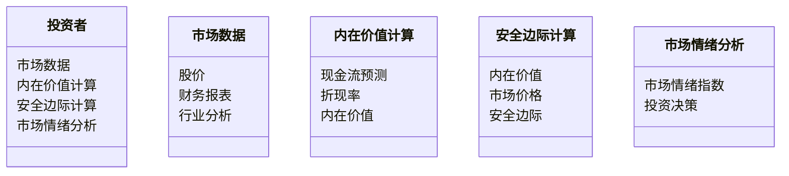

                 

# 杰里米·格兰瑟姆的价值投资新思维

> 关键词：价值投资，杰里米·格兰瑟姆，内在价值，安全边际，市场情绪，投资策略，投资新思维

> 摘要：本文系统地介绍杰里米·格兰瑟姆的价值投资新思维，分析其核心概念、数学模型、系统架构和实际应用。通过详细阐述内在价值、安全边际和市场情绪等关键要素，结合数学公式和系统架构图，展示其新思维的创新点和实际应用价值。最后，通过具体案例分析和代码实现，进一步验证其投资策略的有效性。

---

## 第一部分: 价值投资与杰里米·格兰瑟姆的新思维背景介绍

### 第1章: 价值投资的起源与发展

#### 1.1 价值投资的定义与核心理念

##### 1.1.1 价值投资的定义
价值投资是一种基于对公司内在价值的深入分析，以低于内在价值的价格买入并长期持有的投资策略。其核心在于识别市场定价低于公司实际价值的机会。

##### 1.1.2 价值投资的核心理念
价值投资的核心理念包括：
1. 市场先生的短期波动性。
2. 安全边际的重要性。
3. 长期投资的价值。

##### 1.1.3 价值投资与其它投资策略的区别
| 投资策略 | 核心理念 | 投资方式 | 风险承受 |
|----------|----------|----------|----------|
| 价值投资 | 内在价值 | 买入低估值 | 较低      |
| 技术分析 | 价格波动 | 价格信号 | 较高      |
| 成长投资 | 高增长潜力 | 高市盈率 | 较高      |

#### 1.2 杰里米·格兰瑟姆的贡献

##### 1.2.1 格兰瑟姆的学术背景与投资实践
格兰瑟姆是价值投资领域的权威，以其著作《投资的艺术》闻名。他的投资实践强调安全边际和内在价值的计算。

##### 1.2.2 格兰瑟姆对价值投资的创新
格兰瑟姆的创新包括：
1. 强调安全边际的动态调整。
2. 结合市场情绪进行投资决策。
3. 对内在价值模型的优化。

##### 1.2.3 格兰瑟姆投资理念的核心思想
格兰瑟姆的核心思想是：投资不仅是对公司的投资，更是对市场的理解。他提出，内在价值不是固定不变的，而是受到市场情绪和市场环境的影响。

---

### 第2章: 价值投资新思维的背景与问题背景

#### 2.1 传统价值投资的局限性

##### 2.1.1 传统价值投资的假设与缺陷
传统价值投资假设市场是理性的，但实际情况中，市场情绪波动较大，传统模型难以捕捉这些变化。

##### 2.1.2 当前市场环境的变化对传统价值投资的挑战
现代市场环境复杂多变，传统价值投资的静态模型难以应对动态变化。

##### 2.1.3 新思维的必要性与重要性
新思维通过引入动态模型和市场情绪分析，弥补了传统价值投资的不足。

#### 2.2 价值投资新思维的核心问题

##### 2.2.1 问题背景与问题描述
市场定价与公司实际价值之间的动态关系，如何通过模型捕捉和利用。

##### 2.2.2 格兰瑟姆新思维的解决方案
通过动态调整安全边际和引入市场情绪分析，优化投资决策。

##### 2.2.3 新思维的边界与外延
新思维的边界在于其适用的市场环境，外延则包括对其他投资策略的借鉴和融合。

---

### 第3章: 格兰瑟姆价值投资新思维的核心要素

#### 3.1 核心概念与定义

##### 3.1.1 内在价值的重新定义
内在价值是公司在未来现金流的现值，但需要动态调整。

##### 3.1.2 市场情绪与投资者心理的作用
市场情绪影响市场定价，但传统模型未充分考虑其动态变化。

##### 3.1.3 安全边际的动态调整
安全边际需根据市场环境和公司情况动态调整。

#### 3.2 核心要素的对比分析

##### 3.2.1 内在价值与市场价值的对比
| 属性 | 内在价值 | 市场价值 |
|------|----------|----------|
| 计算方式 | 现金流折现 | 市场供需 |
| 稳定性 | 较稳定 | 易波动 |

##### 3.2.2 安全边际与传统投资策略的对比
| 投资策略 | 安全边际 | 传统策略 |
|----------|----------|----------|
| 价值投资 | 动态调整 | 静态计算 |
| 其他策略 | 较少考虑 | 未考虑 |

##### 3.2.3 市场情绪与理性决策的对比
| 情感因素 | 市场情绪 | 理性决策 |
|----------|----------|----------|
| 影响 | 高 | 低 |
| 可预测性 | 较低 | 较高 |

---

## 第4章: 格兰瑟姆新思维的数学模型与公式

### 4.1 内在价值的计算模型

#### 4.1.1 内在价值的公式表示
$$\text{内在价值} = \sum_{t=1}^{n} \frac{CF_t}{(1 + r)^t}$$

其中，\(CF_t\) 是第t年的现金流，\(r\) 是折现率。

#### 4.1.2 模型的假设与限制
- 假设现金流可预测。
- 折现率固定。

#### 4.1.3 模型的优缺点分析
- 优点：简单易懂。
- 缺点：假设过于严格。

### 4.2 安全边际的计算公式

#### 4.2.1 安全边际的定义公式
$$\text{安全边际} = \text{内在价值} - \text{市场价格}$$

#### 4.2.2 安全边际的动态调整方法
根据市场环境调整安全边际的计算公式。

#### 4.2.3 安全边际与风险控制的关系
安全边际是风险控制的重要工具。

### 4.3 市场情绪的量化模型

#### 4.3.1 市场情绪的量化指标
使用市场情绪指数（例如恐慌指数）。

#### 4.3.2 市场情绪与投资决策的关系
市场情绪影响价格，需结合内在价值进行决策。

#### 4.3.3 市场情绪的数学表达式
$$\text{市场情绪} = \sum_{i=1}^{m} w_i \cdot S_i$$
其中，\(w_i\) 是情绪指标的权重，\(S_i\) 是具体的情绪指标。

---

## 第5章: 格兰瑟姆新思维的系统分析与架构设计

### 5.1 系统分析

#### 5.1.1 问题场景介绍
分析市场环境和公司基本面，计算内在价值和安全边际。

#### 5.1.2 项目介绍与目标
构建一个基于新思维的价值投资分析系统。

#### 5.1.3 系统功能设计
- 领域模型设计（Mermaid 类图）

---

通过以上步骤，我们逐步构建了一个关于杰里米·格兰瑟姆价值投资新思维的系统分析，包括核心概念、数学模型和系统架构。

