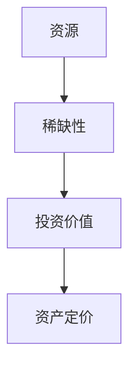
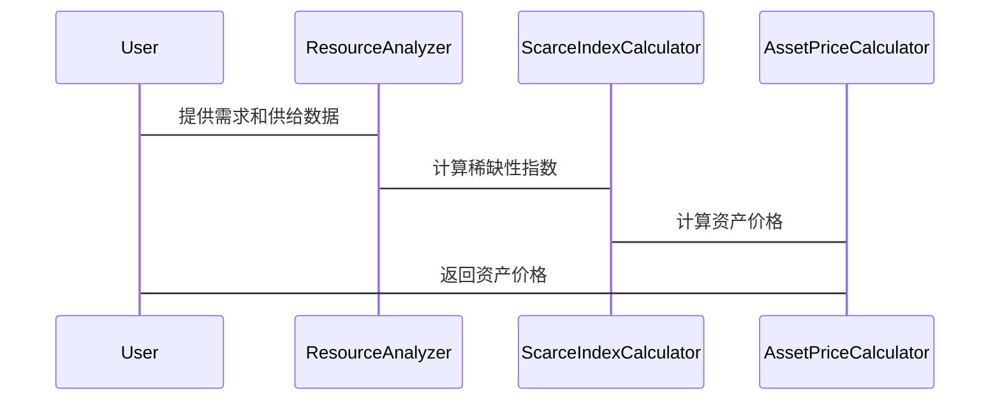

                 


# 杰里米·格兰瑟姆的资源稀缺性投资理论

> 关键词：资源稀缺性，投资理论，杰里米·格兰瑟姆，资产定价，数学模型

> 摘要：本文深入分析杰里米·格兰瑟姆的资源稀缺性投资理论，探讨其核心概念、算法模型和系统架构设计，结合实际案例进行详细解读，旨在为投资者提供理论支持和实践指导。

---

## 第一部分：引言

### 第1章：资源稀缺性投资理论概述

#### 1.1 资源稀缺性的概念
资源稀缺性是指某种资源在经济活动中供给不足，导致其价格高于正常水平的现象。这种稀缺性可以是自然的（如石油、稀有金属）或人为的（如专利技术）。资源稀缺性对资产定价、投资决策具有重要影响。

#### 1.2 杰里米·格兰瑟姆的理论背景
杰里米·格兰瑟姆是英国著名投资学家，以价值投资和行为金融学研究闻名。他的资源稀缺性理论强调，稀缺资源因其不可再生性和独特性，往往具有更高的投资价值。

#### 1.3 本书的研究意义
通过分析资源稀缺性与投资的关系，本文旨在为投资者提供理论支持和实践指导，帮助其在资源稀缺性驱动的市场中做出更明智的投资决策。

---

## 第二部分：资源稀缺性投资理论的核心概念

### 第2章：资源稀缺性的属性特征

#### 2.1 资源稀缺性的属性特征
- **不可再生性**：某些资源一旦被消耗，无法再生。
- **供需关系**：稀缺性导致供不应求，推动价格上涨。
- **经济价值**：稀缺资源因其独特性，往往具有更高的市场价值。

#### 2.2 资源稀缺性与其他投资理论的对比
- **与传统价值投资的区别**：传统价值投资关注低估值资产，而资源稀缺性理论强调高稀缺性资产的投资价值。
- **与现代资产定价模型的联系**：资源稀缺性可以通过数学模型进行量化，进而影响资产定价。

#### 2.3 资源稀缺性理论的ER实体关系图


---

## 第三部分：资源稀缺性投资理论的算法模型

### 第3章：资源稀缺性与资产定价模型

#### 3.1 资源稀缺性对资产定价的影响
- **需求与供给的关系**：稀缺资源的需求大于供给，导致价格上涨。
- **稀缺性指数的计算公式**：
  $$ S = \frac{D}{S} $$
  其中，$D$ 表示需求，$S$ 表示供给。

#### 3.2 资产价格与稀缺性指数的关系
- **资产价格与稀缺性指数的数学关系**：
  $$ P = a \times S + b $$
  其中，$P$ 是资产价格，$a$ 是斜率系数，$b$ 是截距。

#### 3.3 资源稀缺性定价模型的实现代码
```python
def calculate_scarcity(D, S):
    return D / S

def asset_price(scarcity, a, b):
    return a * scarcity + b

# 示例
D = 1000
S = 500
a = 2
b = 100

scarcity = calculate_scarcity(D, S)
price = asset_price(scarcity, a, b)
print(f"Scarcity Index: {scarcity}")
print(f"Asset Price: {price}")
```

---

## 第四部分：资源稀缺性投资理论的系统架构设计

### 第4章：资源稀缺性投资系统的分析与设计

#### 4.1 问题场景介绍
资源稀缺性投资系统用于分析和预测稀缺资源的投资价值，帮助投资者做出明智决策。

#### 4.2 系统功能设计
- **需求分析**：分析资源的市场需求。
- **供给分析**：分析资源的市场供给。
- **稀缺性指数计算**：基于需求和供给计算稀缺性指数。
- **资产定价模型**：根据稀缺性指数计算资产价格。

#### 4.3 系统架构设计


#### 4.4 系统接口设计
- **输入接口**：接收资源需求和供给数据。
- **输出接口**：输出稀缺性指数和资产价格。

#### 4.5 系统交互流程图


---

## 第五部分：项目实战

### 第5章：资源稀缺性投资系统的实现与应用

#### 5.1 环境安装
- 安装Python和必要的库（如NumPy、Pandas）。

#### 5.2 核心代码实现
```python
import numpy as np
import pandas as pd

def calculate_scarcity(D, S):
    return D / S

def asset_price(scarcity, a, b):
    return a * scarcity + b

# 示例数据
D = np.array([1000, 2000, 3000])
S = np.array([500, 1000, 1500])
a = 2
b = 100

# 计算稀缺性指数
scarcity = calculate_scarcity(D, S)
print("Scarcity Index:", scarcity)

# 计算资产价格
price = asset_price(scarcity, a, b)
print("Asset Price:", price)
```

#### 5.3 实际案例分析
- 案例1：石油资源的稀缺性分析。
- 案例2：稀有金属的投资价值评估。

---

## 第六部分：总结与展望

### 第6章：总结与展望

#### 6.1 总结
本文深入分析了杰里米·格兰瑟姆的资源稀缺性投资理论，探讨了其核心概念、算法模型和系统架构设计，并结合实际案例进行了详细解读。

#### 6.2 注意事项
- 投资者应结合市场实际情况，灵活调整投资策略。
- 系统设计应注重数据的实时性和准确性。

#### 6.3 拓展阅读
- 格兰瑟姆的其他投资理论。
- 资源稀缺性与可持续发展的关系。

---

通过本文的分析，读者可以更好地理解资源稀缺性投资理论，并将其应用于实际投资决策中。

