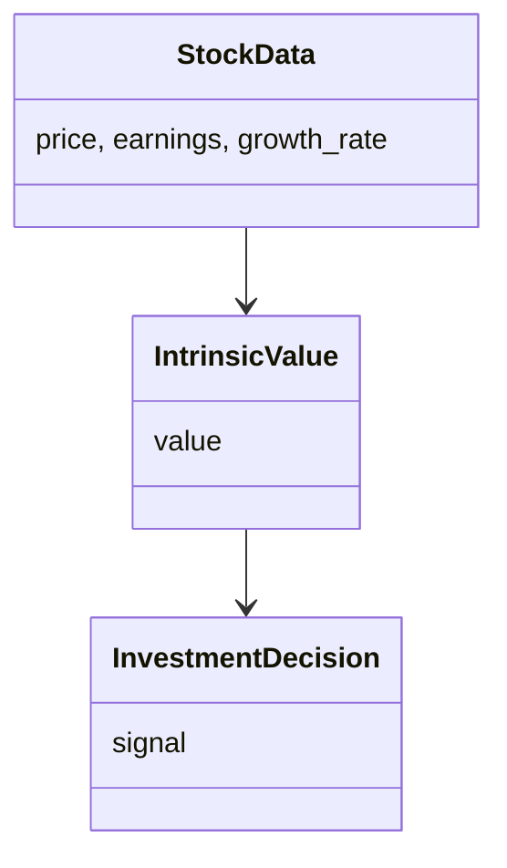
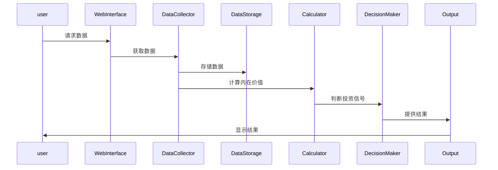

                 


# 杰里米格兰瑟姆的均值回归理论

## 关键词：
- 均值回归理论，杰里米格兰瑟姆，投资策略，价值投资，股票估值

## 摘要：
杰里米·格兰瑟姆的均值回归理论是一种基于长期市场均值的投资策略，广泛应用于价值投资和风险管理。本文详细介绍了均值回归理论的背景、核心概念、算法原理、系统架构设计及实际应用案例，帮助读者全面理解该理论及其在投资中的应用。

---

# 第1章：均值回归理论的背景与起源

## 1.1 均值回归的起源与发展

### 1.1.1 均值回归的定义与核心概念
均值回归是一种统计学概念，指变量在长时间内趋向于其历史平均值的趋势。格兰瑟姆将这一理论应用于投资领域，认为市场价格会围绕其内在价值波动，并最终回归。

### 1.1.2 均值回归在投资领域的应用
格兰瑟姆将均值回归与价值投资结合，强调购买被市场低估的股票。这种方法在长期投资中表现出色，尤其是在市场波动时。

### 1.1.3 杰里米·格兰瑟姆与均值回归理论的联系
格兰瑟姆是价值投资的倡导者，他的均值回归理论强调市场非理性波动，为投资者提供了寻找低估资产的机会。

## 1.2 均值回归的数学基础

### 1.2.1 均值回归的数学公式与模型
$$\text{均值回归模型} = \mu + \beta(t - \mu)$$

### 1.2.2 均值回归的核心假设与限制条件
- 市场存在非理性波动
- 投资者情绪影响价格
- 长期价格趋向均值

### 1.2.3 均值回归与统计学的关系
均值回归是统计学中的回归分析，用于预测变量的趋势。

## 1.3 均值回归在金融市场的实际应用

### 1.3.1 均值回归在股票估值中的作用
通过分析历史价格，识别低估或高估的股票。

### 1.3.2 均值回归与价值投资的结合
寻找价格低于内在价值的股票，长期持有以实现收益。

### 1.3.3 均值回归在风险控制中的应用
通过识别极端偏离，制定止损策略，降低风险。

---

# 第2章：均值回归理论的核心概念与原理

## 2.1 均值回归的核心要素

### 2.1.1 均值回归的基本假设
- 价格趋向均值
- 市场存在非理性波动
- 长期趋势可预测

### 2.1.2 均值回归的核心公式与模型
$$\text{内在价值} = \frac{Earnings}{\text{合理的长期增长率}}$$

### 2.1.3 均值回归与市场有效性的关系
均值回归假设市场存在无效性，认为价格会回归均值。

## 2.2 均值回归的数学模型与公式

### 2.2.1 均值回归的数学表达式
$$P_t = \mu + \beta(P_{t-1} - \mu) + \epsilon_t$$

### 2.2.2 均值回归的统计学解释
分析价格与均值的偏离程度，判断投资机会。

### 2.2.3 均值回归的假设检验与验证
通过回归分析检验模型的有效性。

## 2.3 均值回归与投资策略的结合

### 2.3.1 均值回归在股票筛选中的应用
识别价格低于均值的股票，进行投资。

### 2.3.2 均值回归与资产配置的关系
通过分散投资降低风险，提高收益。

### 2.3.3 均值回归与风险管理的结合
制定止损策略，避免过度偏离。

---

# 第3章：均值回归理论的算法原理与实现

## 3.1 均值回归算法的基本原理

### 3.1.1 均值回归算法的输入与输出
- 输入：历史价格数据
- 输出：内在价值与投资建议

### 3.1.2 均值回归算法的核心步骤
1. 计算历史平均值
2. 分析当前价格偏离
3. 判断投资机会

### 3.1.3 均值回归算法的实现流程
- 数据收集
- 计算均值
- 判断偏离
- 提供投资建议

## 3.2 均值回归算法的数学模型

### 3.2.1 均值回归的数学公式
$$\text{内在价值} = \frac{\text{现金流}}{\text{贴现率}}$$

### 3.2.2 均值回归的参数估计与优化
使用回归分析优化模型参数。

### 3.2.3 均值回归的假设检验与验证
验证模型的有效性和准确性。

## 3.3 均值回归算法的代码实现

### 3.3.1 环境安装与依赖库配置
安装Python和相关库（如pandas、numpy）。

### 3.3.2 均值回归算法的Python代码实现

```python
import pandas as pd
import numpy as np

def calculate_intrinsic_value(earnings, growth_rate):
    return earnings / growth_rate

data = pd.read_csv('stock_data.csv')
mean_value = calculate_intrinsic_value(data['earnings'], data['growth_rate'])
data['signal'] = (data['price'] < mean_value).astype(int)
print(data)
```

### 3.3.3 代码运行与结果解读
- 计算内在价值
- 判断价格偏离
- 提供投资信号

---

# 第4章：均值回归理论的系统分析与架构设计

## 4.1 系统分析与需求分析

### 4.1.1 问题场景介绍
投资者需要快速判断股票是否低估。

### 4.1.2 系统功能需求
- 数据收集与处理
- 均值回归计算
- 投资决策支持

### 4.1.3 系统性能需求
- 高效计算
- 稳定运行
- 用户友好

## 4.2 系统架构设计

### 4.2.1 系统功能设计（领域模型）



### 4.2.2 系统架构设计（架构图）


### 4.2.3 系统接口设计与交互



---

# 第5章：项目实战

## 5.1 环境安装

### 5.1.1 依赖库配置
安装Python和pandas、numpy库。

## 5.2 核心代码实现

### 5.2.1 均值回归算法的Python代码实现

```python
import pandas as pd
import numpy as np

def calculate_intrinsic_value(earnings, growth_rate):
    return earnings / growth_rate

data = pd.DataFrame({
    'price': [100, 120, 90, 80, 70],
    'earnings': [10, 12, 9, 8, 7],
    'growth_rate': [0.1, 0.1, 0.1, 0.1, 0.1]
})

data['intrinsic_value'] = calculate_intrinsic_value(data['earnings'], data['growth_rate'])
data['signal'] = (data['price'] < data['intrinsic_value']).astype(int)
print(data)
```

### 5.2.2 代码运行与结果解读
输出结果表，判断每只股票的投资信号。

## 5.3 实际案例分析

### 5.3.1 案例分析
以苹果公司为例，分析其股价是否被低估。

## 5.4 代码应用解读与分析

### 5.4.1 投资信号解读
- 1：低估，值得买入
- 0：高估，考虑卖出

## 5.5 项目小结

---

# 第6章：总结与展望

## 6.1 最佳实践 tips
- 定期更新数据
- 结合其他指标
- 风险控制

## 6.2 小结
均值回归理论为投资者提供了科学的决策工具，帮助识别低估资产。

## 6.3 注意事项
- 市场波动性
- 数据质量
- 模型假设

## 6.4 拓展阅读
推荐书籍和资源，深入学习均值回归理论。

---

# 结语
通过本文的学习，读者可以全面理解杰里米格兰瑟姆的均值回归理论，并在实际投资中应用该理论，做出更明智的投资决策。

