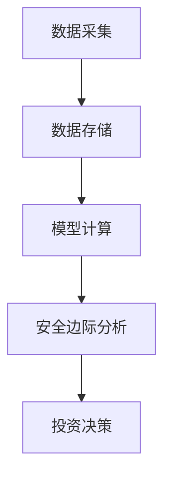

                 


# 杰里米格兰瑟姆的资产定价理论

## 关键词
- 资产定价理论  
- 价值投资  
- 内在价值  
- 市场估值  
- 安全边际  

## 摘要
杰里米·格兰瑟姆的资产定价理论是价值投资领域的经典理论，其核心思想是通过基本面分析来确定资产的内在价值，并通过安全边际的概念来指导投资决策。本文将从资产定价的基本概念出发，详细探讨格兰瑟姆的理论体系，包括其数学模型、系统架构以及实际应用中的项目实战。通过本文的分析，读者将能够深入理解格兰瑟姆的资产定价理论，并将其应用到实际投资中。

---

## 第1章 资产定价的基本概念与背景

### 1.1 资产定价的定义与历史演变
#### 1.1.1 资产定价的定义
资产定价是指通过分析资产的内在价值、市场环境和投资者心理等因素，确定资产在市场上的合理价格的过程。资产定价的核心在于平衡资产的内在价值与市场参与者对资产的估值。

#### 1.1.2 资产定价的历史演变
资产定价理论的发展经历了多个阶段，从古典经济学到现代金融学，逐步形成了完善的理论体系。其中，格兰瑟姆的理论基于基本面分析，强调资产的内在价值和市场估值之间的差异。

#### 1.1.3 资产定价的核心问题与边界
资产定价的核心问题是如何准确评估资产的内在价值，并在市场中找到合适的买入和卖出价格。格兰瑟姆的理论特别关注安全边际的概念，即内在价值与市场价格之间的差距。

### 1.2 格兰瑟姆资产定价理论的背景
#### 1.2.1 资产定价的主要学派对比
资产定价理论主要包括两类：一类是基于市场有效性的现代金融学理论（如CAPM），另一类是基于基本面分析的价值投资理论。格兰瑟姆的理论属于后者，强调市场的非有效性以及资产的内在价值。

#### 1.2.2 格兰瑟姆的学术贡献与思想体系
格兰瑟姆是价值投资的代表人物之一，他的理论强调通过分析企业的基本面数据来确定其内在价值，并在此基础上寻找市场低估的资产。

#### 1.2.3 格兰瑟姆理论的现实意义与应用
格兰瑟姆的理论在实际投资中具有重要的指导意义，尤其是在市场波动和经济周期变化中，通过安全边际的概念来规避风险。

---

## 第2章 格兰瑟姆的价值投资理论

### 2.1 格兰瑟姆投资理论的核心原则
#### 2.1.1 价值投资的核心理念
价值投资的核心理念是寻找市场价格低于内在价值的资产，并在市场恐慌时买入，市场狂热时卖出。

#### 2.1.2 格兰瑟姆的安全边际概念
安全边际是指资产的内在价值与市场价格之间的差距，它为投资者提供了风险缓冲区。格兰瑟姆认为，安全边际越大，投资的确定性越高。

#### 2.1.3 资产定价与市场估值的关系
资产定价与市场估值密切相关，但市场估值往往受到投资者情绪的影响，导致市场价格偏离内在价值。

### 2.2 内在价值与市场价值的对比
#### 2.2.1 内在价值的定义与计算方法
内在价值是基于企业基本面数据（如盈利能力、成长性、财务状况等）计算出的资产真实价值。常用的计算方法包括现金流贴现模型和股息贴现模型。

#### 2.2.2 市场价值的波动性与周期性
市场价值受投资者情绪和市场环境的影响，具有明显的波动性和周期性。格兰瑟姆认为，市场价值往往会在短期偏离内在价值，但长期会回归。

#### 2.2.3 内在价值与市场价值的动态平衡
内在价值与市场价值之间存在动态平衡关系。当市场价格低于内在价值时，是买入的良机；当市场价格高于内在价值时，应考虑卖出。

### 2.3 资产定价的多因素模型
#### 2.3.1 多因素模型的基本框架
多因素模型通常包括宏观经济因素、行业因素、公司特有因素等多方面的因素。格兰瑟姆的理论强调公司特有因素（如盈利能力、财务状况）的重要性。

#### 2.3.2 格兰瑟姆理论中的关键因素
格兰瑟姆理论的关键因素包括企业的盈利能力、成长性、财务状况、分红政策等。

#### 2.3.3 模型的优缺点与适用场景
多因素模型的优势在于考虑了多种因素，但其复杂性可能导致计算难度较大。格兰瑟姆的理论更注重基本面分析，适用于寻找低估资产的投资场景。

---

## 第3章 资产定价的核心数学模型与算法

### 3.1 资产定价的数学模型概述
资产定价的数学模型通常基于现金流贴现（DCF）模型，通过对企业未来现金流的折现来计算内在价值。格兰瑟姆的理论在此基础上增加了安全边际的概念。

### 3.2 格兰瑟姆定价模型的数学推导
#### 3.2.1 模型的公式表示
$$ P = \frac{D}{k} $$
其中，$P$ 是市场价格，$D$ 是股息，$k$ 是折现率。

#### 3.2.2 模型的变量解释与假设
- 股息（$D$）：企业的盈利能力和分红政策。
- 折现率（$k$）：基于市场利率和风险的综合因素。

#### 3.2.3 模型的数学推导过程
通过对企业未来现金流的贴现，计算出资产的内在价值，再与市场价格进行对比，确定安全边际。

### 3.3 模型的验证与优化
#### 3.3.1 模型的验证方法
通过历史数据验证模型的准确性，分析模型在不同市场环境下的表现。

#### 3.3.2 模型的参数优化
调整折现率和其他参数，以提高模型的预测精度。

#### 3.3.3 模型的改进与扩展
结合其他因素（如成长性）对模型进行改进，使其更加适用于实际投资场景。

---

## 第4章 资产定价的系统架构与实现

### 4.1 系统架构设计
#### 4.1.1 系统模块划分
- 数据采集模块：收集企业的财务数据和市场数据。
- 模型计算模块：基于DCF模型计算内在价值。
- 安全边际分析模块：计算内在价值与市场价格的差距。
- 投资决策模块：根据分析结果制定投资策略。

#### 4.1.2 系统功能设计
- 数据可视化：展示资产的内在价值与市场价格。
- 模型计算：通过代码实现DCF模型的计算。
- 投资决策：根据分析结果生成买入或卖出信号。

#### 4.1.3 系统架构图


### 4.2 系统实现

#### 4.2.1 环境安装
- Python 3.8+
- pandas、numpy、matplotlib等库的安装。

#### 4.2.2 核心代码实现
```python
import pandas as pd
import numpy as np

def calculate_intrinsic_value(revenue, profit_margin, growth_rate, discount_rate):
    # 计算未来现金流
    cash_flows = []
    for i in range(5):
        cash_flow = revenue * (1 + growth_rate) ** i * profit_margin
        cash_flows.append(cash_flow)
    # 计算终值
    terminal_value = cash_flows[-1] / (discount_rate - growth_rate)
    # 计算总价值
    total_value = sum(cash_flows) + terminal_value
    return total_value / (1 + discount_rate) ** 5

# 示例数据
revenue = 100
profit_margin = 0.1
growth_rate = 0.05
discount_rate = 0.08

iv = calculate_intrinsic_value(revenue, profit_margin, growth_rate, discount_rate)
print("内在价值：", iv)
```

---

## 第5章 项目实战

### 5.1 数据收集与清洗
通过公开数据源收集目标资产的财务数据和市场数据，清洗数据并进行预处理。

### 5.2 模型应用
将清洗后的数据输入DCF模型，计算资产的内在价值，并与市场价格进行对比。

### 5.3 实际案例分析
以某公司为例，展示如何通过格兰瑟姆的理论进行资产定价，并制定投资策略。

---

## 第6章 最佳实践与小结

### 6.1 最佳实践
- 保持对市场的关注，定期更新数据和模型。
- 结合市场环境和个人风险承受能力，灵活调整投资策略。

### 6.2 小结
格兰瑟姆的资产定价理论通过基本面分析和安全边际的概念，为投资者提供了科学的投资方法。在实际应用中，需要结合市场环境和企业具体情况，灵活调整模型参数，以实现稳健的投资收益。

---

## 总结
通过本文的分析，读者可以深入理解格兰瑟姆的资产定价理论，并将其应用于实际投资中。格兰瑟姆的理论不仅是一种投资方法，更是一种思维方式，帮助投资者在复杂的市场环境中做出明智的决策。

