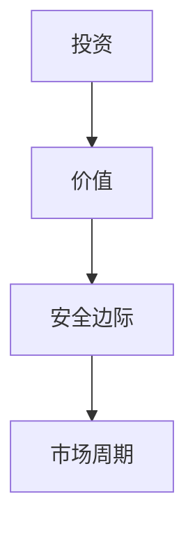
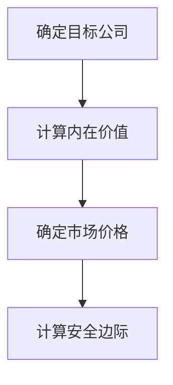
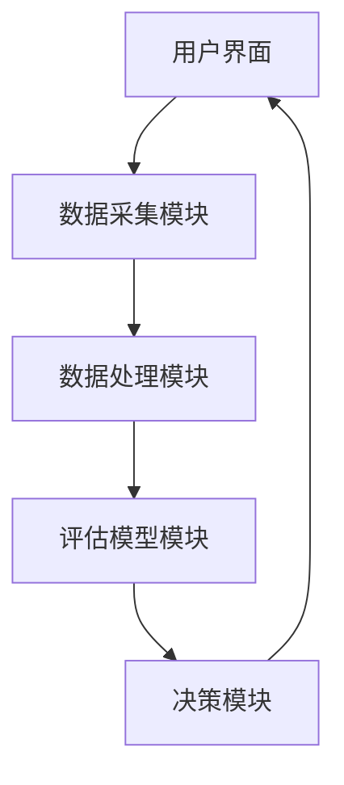
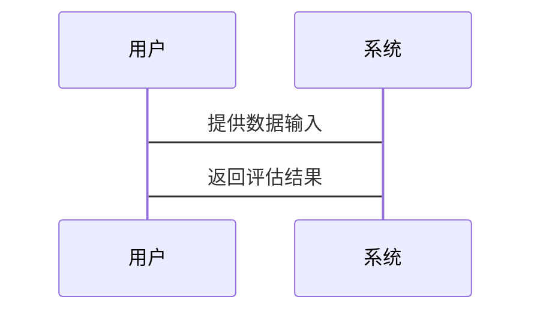

                 


# 杰里米格兰瑟姆的长期价值投资

## 关键词：杰里米格兰瑟姆，长期价值投资，安全边际，内在价值，投资策略

## 摘要：  
本文详细探讨杰里米格兰瑟姆的长期价值投资理论，分析其核心概念、算法原理、系统架构，并通过实际案例展示其应用。文章结构清晰，内容丰富，适合投资领域专业人士参考。

---

# 目录大纲

## 第一部分：长期价值投资的背景与核心概念

### 第1章：长期价值投资的背景介绍

#### 1.1 长期价值投资的定义与核心要素
- **1.1.1 投资的基本概念与问题背景**
  - 投资的定义与分类
  - 价值投资的起源与发展
  - 长期投资的核心意义
- **1.1.2 格兰瑟姆的长期价值投资理论**
  - 格兰瑟姆的学术背景与贡献
  - 长期价值投资的核心理念
  - 投资中的风险与收益平衡
- **1.1.3 长期价值投资的核心要素与边界**
  - 价值、价格与时间的关系
  - 投资决策的关键因素
  - 理论的适用范围与局限性

#### 1.2 长期价值投资的理论基础
- **1.2.1 格兰瑟姆的投资哲学**
  - 市场波动与理性决策
  - 投资中的安全边际概念
  - 投资者心理与行为分析
- **1.2.2 长期价值投资与市场周期的关系**
  - 市场周期的定义与阶段划分
  - 价值投资在不同周期的应用
  - 如何在市场波动中保持长期策略
- **1.2.3 格兰瑟姆的市场分析方法**
  - 基本面分析的核心要素
  - 财务报表分析技巧
  - 市场估值指标的运用

#### 1.3 长期价值投资与其他投资策略的对比
- **1.3.1 价值投资与成长投资的异同**
  - 价值投资的特征与适用场景
  - 成长投资的定义与策略
  - 两者在投资目标和方法上的差异
- **1.3.2 技术分析与基本面分析的对比**
  - 技术分析的理论基础与方法
  - 基本面分析的核心要素
  - 两种方法的优缺点及应用场景
- **1.3.3 长期价值投资的适用场景与局限性**
  - 适合长期持有的资产类型
  - 短期市场波动对策略的影响
  - 在不同经济环境下的表现分析

### 第2章：长期价值投资的核心概念与联系

#### 2.1 核心概念原理
- **2.1.1 安全边际的概念与计算**
  - 安全边际的定义与作用
  - 安全边际的计算公式与方法
  - 如何通过安全边际筛选投资标的
- **2.1.2 内在价值的评估方法**
  - 内在价值的定义与计算模型
  - 不同资产的内在价值评估方法
  - 影响内在价值的关键因素分析
- **2.1.3 股票估值的多维度分析**
  - 股票估值的主要维度
  - 各维度之间的相互关系
  - 如何结合多维度分析做出投资决策

#### 2.2 核心概念属性特征对比表格
| 概念       | 特性1 | 特性2 | 特性3 |
|------------|-------|-------|-------|
| 安全边际   | 数量   | 质量   | 时间   |
| 内在价值   | 现值   | 未来现金流 | 风险调整 |

#### 2.3 ER实体关系图（Mermaid）


---

## 第二部分：长期价值投资的算法原理

### 第3章：长期价值投资的算法原理

#### 3.1 投资评估模型的数学模型
- **3.1.1 内在价值计算公式**
  $$ V = \sum_{t=1}^{n} \frac{CF_t}{(1 + r)^t} $$
  - 其中，\( CF_t \) 是第 \( t \) 年的现金流，\( r \) 是折现率。
  - 示例：假设现金流分别为 $100, 150, 200，折现率为 10%，计算其内在价值。

#### 3.2 安全边际计算流程


#### 3.3 算法实现代码
```python
def calculate_intrinsic_value(cash_flows, discount_rate):
    return sum(cf / (1 + discount_rate)**t for t, cf in enumerate(cash_flows))

# 示例：
cash_flows = [100, 150, 200]
discount_rate = 0.10
intrinsic_value = calculate_intrinsic_value(cash_flows, discount_rate)
print(f"内在价值为：{intrinsic_value}")
```

---

## 第三部分：长期价值投资的系统分析与架构设计

### 第4章：长期价值投资的系统分析与架构设计

#### 4.1 投资分析系统功能设计
- **4.1.1 数据采集模块**
  - 数据源的获取与处理
  - 数据清洗与预处理方法
  - 数据存储与管理方案
- **4.1.2 评估模型模块**
  - 内在价值评估算法的选择与实现
  - 安全边际计算的系统实现
  - 结果输出与可视化展示
- **4.1.3 决策模块**
  - 投资决策的逻辑与规则
  - 决策输出的格式与展示方式
  - 系统反馈与优化机制

#### 4.2 系统架构设计
- **4.2.1 系统功能模块划分**
  - 数据采集模块、数据处理模块、评估模型模块、决策模块
- **4.2.2 系统架构图（Mermaid）**


#### 4.3 系统接口设计
- **4.3.1 数据接口**
  - 数据输入接口的设计与实现
  - 数据输出接口的设计与实现
  - 接口的兼容性与扩展性考虑
- **4.3.2 评估模型接口**
  - 模型输入接口的设计与实现
  - 模型输出接口的设计与实现
  - 接口的性能与稳定性考虑

#### 4.4 系统交互流程（Mermaid序列图）


---

## 第四部分：长期价值投资的项目实战

### 第5章：长期价值投资的项目实战

#### 5.1 项目环境配置
- **5.1.1 系统运行环境**
  - 操作系统要求
  - 软件依赖与安装方法
  - 数据库配置与连接方法
- **5.1.2 投资分析系统的安装与配置**
  - 安装步骤与注意事项
  - 系统配置的详细说明
  - 数据库的初始化与测试

#### 5.2 核心代码实现
- **5.2.1 数据采集与处理代码**
```python
import pandas as pd

def collect_data(tickers):
    # 数据采集逻辑
    pass

def preprocess_data(df):
    # 数据清洗与预处理逻辑
    pass
```
- **5.2.2 评估模型实现代码**
```python
def calculate_intrinsic_value(...):
    # 内在价值计算逻辑
    pass

def calculate_margin_of_safety(...):
    # 安全边际计算逻辑
    pass
```

#### 5.3 项目案例分析
- **5.3.1 案例背景介绍**
  - 案例选择的标准与依据
  - 案例的基本信息与数据
  - 案例的分析目标与问题
- **5.3.2 案例分析与结果解读**
  - 数据采集与处理过程
  - 评估模型的实现与结果
  - 投资决策的制定与实施
- **5.3.3 分析结果与经验总结**
  - 分析结果的具体展示
  - 实施过程中的经验与教训
  - 对未来投资策略的启示

#### 5.4 项目小结
- **5.4.1 项目目标的实现情况**
  - 是否达到预期目标
  - 实现过程中遇到的问题与解决方法
- **5.4.2 项目的创新点与不足**
  - 系统设计的创新点
  - 实施过程中的不足与改进建议
- **5.4.3 项目的价值与意义**
  - 对投资理论的贡献
  - 对投资实践的指导意义

---

## 第五部分：长期价值投资的最佳实践

### 第6章：长期价值投资的最佳实践

#### 6.1 投资策略的小结
- **6.1.1 核心概念的回顾**
  - 安全边际与内在价值的再认识
  - 长期投资策略的总结
  - 理论与实践的结合
- **6.1.2 投资策略的优化**
  - 根据市场变化调整策略
  - 结合新技术与新方法优化投资决策
  - 定期回顾与调整投资组合

#### 6.2 投资中的注意事项
- **6.2.1 风险管理的重要性**
  - 风险控制的策略与方法
  - 如何在波动市场中保持稳定
  - 投资组合的风险分散技术
- **6.2.2 投资心态的培养**
  - 长期投资心态的塑造
  - 如何避免短期市场波动的干扰
  - 投资纪律的建立与执行
- **6.2.3 信息获取与分析能力的提升**
  - 高效信息获取渠道的选择
  - 数据分析能力的培养
  - 市场趋势的准确把握

#### 6.3 扩展阅读与深入学习
- **6.3.1 推荐书籍与文献**
  - 格兰瑟姆的经典著作
  - 其他价值投资领域的优秀书籍
  - 相关学术论文与研究报告
- **6.3.2 专业论坛与社群**
  - 投资领域的专业论坛推荐
  - 优秀投资博主与社交媒体账号
  - 专业社群的加入与参与
- **6.3.3 实践与交流机会**
  - 参与投资实践项目的机会
  - 专业交流活动与研讨会
  - 投资经验的分享与学习

---

## 总结
本文系统地探讨了杰里米格兰瑟姆的长期价值投资理论，从核心概念到算法实现，再到系统架构与项目实战，层层深入，为读者提供了全面而深入的分析。通过实际案例的分析与解读，帮助读者更好地理解与应用这一投资策略。同时，文章还提供了丰富的扩展阅读与实践建议，为投资者提供了进一步学习与提升的方向。

