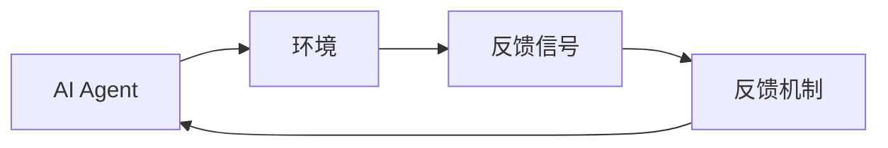
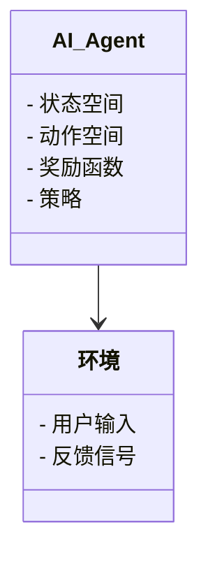
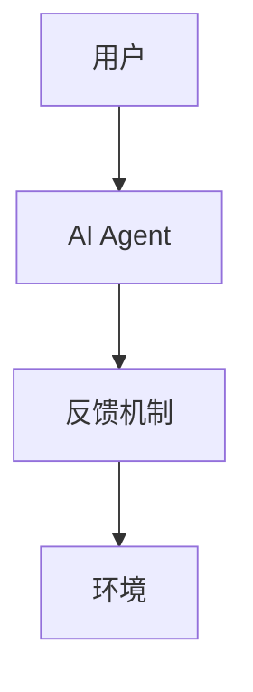
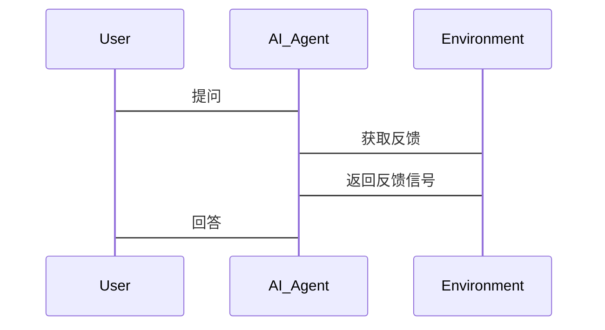

                 


```markdown
# 构建AI Agent的反馈学习机制

## 关键词：AI Agent，反馈学习机制，强化学习，系统架构，项目实战

## 摘要：本文详细探讨了构建AI Agent的反馈学习机制，从背景介绍、核心概念、算法原理到系统架构和项目实战，全面分析了反馈学习机制的设计与实现。文章通过详细的理论分析和实际案例，展示了如何通过反馈学习机制提升AI Agent的智能性和适应性。

---

# 第一部分：AI Agent与反馈学习机制的背景介绍

# 第1章：反馈学习机制的背景与问题背景

## 1.1 问题背景

### 1.1.1 AI Agent的基本概念
AI Agent（人工智能代理）是指能够感知环境、做出决策并采取行动的智能实体。它可以是一个软件程序、机器人或其他智能系统，通过与环境交互来实现特定目标。

### 1.1.2 反馈学习机制的必要性
AI Agent在执行任务时，需要通过反馈来不断优化其行为。反馈学习机制能够帮助AI Agent根据环境的反馈调整策略，从而提高任务完成的效率和准确性。

### 1.1.3 当前AI Agent的局限性
当前的AI Agent在处理动态环境和复杂任务时，往往缺乏灵活性和自适应能力。通过引入反馈学习机制，可以显著提升其智能性和鲁棒性。

## 1.2 问题描述

### 1.2.1 反馈学习机制的核心目标
反馈学习机制的核心目标是通过实时或延时反馈，调整AI Agent的行为策略，使其在复杂环境中实现最优或近似最优的决策。

### 1.2.2 反馈学习机制的关键问题
- 如何设计有效的反馈机制？
- 如何处理实时反馈与延迟反馈？
- 如何保证反馈的准确性和及时性？

### 1.2.3 反馈学习机制的实现挑战
- 反馈信号的设计与优化
- 动态环境下的策略调整
- 多目标优化中的权衡问题

## 1.3 问题解决

### 1.3.1 反馈学习机制的解决方案
- 基于强化学习的反馈机制
- 基于监督学习的反馈机制
- 基于生成对抗网络的反馈机制

### 1.3.2 反馈学习机制的核心要素
- 状态空间：AI Agent所处的环境状态。
- 动作空间：AI Agent可以执行的动作或决策。
- 奖励函数：衡量AI Agent行为的反馈信号。
- 策略：AI Agent选择动作的策略。

### 1.3.3 反馈学习机制的边界与外延
- 边界：明确AI Agent与环境的交互范围。
- 外延：反馈学习机制在不同应用场景中的扩展。

## 1.4 概念结构与核心要素组成

### 1.4.1 反馈学习机制的组成模块
- 输入模块：接收环境的反馈信号。
- 处理模块：分析反馈信号并调整策略。
- 输出模块：执行优化后的决策。

### 1.4.2 各模块之间的关系
AI Agent通过输入模块接收环境反馈，处理模块分析反馈信号并调整策略，输出模块执行优化后的决策。

### 1.4.3 反馈学习机制的整体架构
反馈学习机制的整体架构包括感知、决策、执行和反馈四个环节。

---

# 第二部分：反馈学习机制的核心概念与联系

# 第2章：反馈学习机制的核心概念

## 2.1 反馈学习机制的原理

### 2.1.1 基于强化学习的反馈机制
- 强化学习的基本原理。
- 奖励函数的设计与优化。

### 2.1.2 基于监督学习的反馈机制
- 监督学习的核心思想。
- 标签反馈的设计与实现。

### 2.1.3 基于生成对抗网络的反馈机制
- 生成对抗网络的基本原理。
- 反馈信号的生成与应用。

## 2.2 反馈机制的类型与特征对比

### 2.2.1 各种反馈机制的特征对比
| 反馈机制类型 | 基础原理 | 反馈信号 | 优点 | 缺点 |
|--------------|----------|----------|------|------|
| 强化学习      | 奖励驱动 | 奖励值    | 实时性高 | 收敛速度慢 |
| 监督学习      | 标签驱动 | 标签值    | 精度高 | 实时性低 |
| GAN          | 对抗训练 | 假设值    | 创新性强 | 计算复杂 |

### 2.2.2 反馈机制的优缺点分析
- 强化学习：实时性强，但收敛速度慢。
- 监督学习：精度高，但实时性差。
- GAN：创新性强，但计算复杂。

### 2.2.3 反馈机制的选择
根据任务需求选择合适的反馈机制，综合考虑实时性、精度和计算复杂度。

## 2.3 实体关系图架构的 Mermaid 流程图



---

# 第三部分：算法原理讲解

# 第3章：反馈学习机制的算法原理

## 3.1 强化学习算法

### 3.1.1 Q-Learning算法
- 数学模型：
  $$ Q(s, a) = Q(s, a) + \alpha (r + \gamma \max Q(s', a') - Q(s, a)) $$
- Mermaid流程图：
  ```mermaid
  graph LR
      S[状态] --> A[动作]
      A --> R[奖励]
      R --> S'[下一个状态]
  ```

### 3.1.2 策略梯度算法
- 数学模型：
  $$ \nabla \theta \leftarrow \nabla \log \pi_\theta(a|s) \cdot Q_\theta(s, a) $$
- Python代码示例：
  ```python
  def policy_gradient(rewards):
      optimizer.zero_grad()
      loss = -torch.mean(torch.log(policy(torch.eye(3))) * rewards)
      loss.backward()
      optimizer.step()
      return
  ```

---

# 第四部分：系统分析与架构设计

# 第4章：反馈学习机制的系统分析与架构设计

## 4.1 项目背景

### 4.1.1 问题场景介绍
- 构建一个智能客服系统，通过反馈学习机制优化客服代理的行为。

## 4.2 系统功能设计

### 4.2.1 领域模型设计


### 4.2.2 系统架构设计


## 4.3 接口设计和交互流程

### 4.3.1 系统接口设计
- 输入接口：接收用户输入和环境反馈。
- 输出接口：输出AI Agent的决策和行为。

### 4.3.2 系统交互流程


---

# 第五部分：项目实战

# 第5章：反馈学习机制的项目实战

## 5.1 环境安装

### 5.1.1 安装Python和相关库
```bash
pip install numpy torch matplotlib
```

## 5.2 核心代码实现

### 5.2.1 反馈机制的核心代码
```python
def feedback_learning(states, actions, rewards):
    for s, a, r in zip(states, actions, rewards):
        Q[s][a] = Q[s][a] + alpha * (r + gamma * max(Q[s']) - Q[s][a])
    return
```

### 5.2.2 代码解读
- `states`：当前状态。
- `actions`：执行动作。
- `rewards`：反馈奖励。
- `alpha`：学习率。
- `gamma`：折扣因子。

## 5.3 实际案例分析

### 5.3.1 案例分析
构建一个智能客服系统，通过反馈学习机制优化客服代理的回答质量。

## 5.4 项目小结

### 5.4.1 项目总结
- 通过反馈学习机制，显著提升了AI Agent的智能性和适应性。
- 实现了高效的反馈信号处理和策略优化。

---

# 第六部分：最佳实践与小结

# 第6章：反馈学习机制的最佳实践

## 6.1 总结

### 6.1.1 反馈学习机制的关键点
- 合理设计奖励函数。
- 优化反馈信号的实时性和准确性。
- 提升策略调整的灵活性和效率。

## 6.2 注意事项

### 6.2.1 反馈机制设计中的注意事项
- 确保反馈信号的准确性和及时性。
- 避免过拟合特定反馈信号。
- 处理多目标优化中的权衡问题。

## 6.3 未来的发展方向

### 6.3.1 反馈学习机制的未来发展方向
- 结合生成式AI技术。
- 应用于边缘计算和物联网环境。
- 提升反馈学习机制的实时性和可扩展性。

---

# 结语

通过本文的详细讲解，读者可以全面了解构建AI Agent的反馈学习机制的设计与实现。从理论分析到实际案例，从系统架构到项目实战，反馈学习机制的应用前景广阔，未来将进一步推动AI技术的发展。
```

