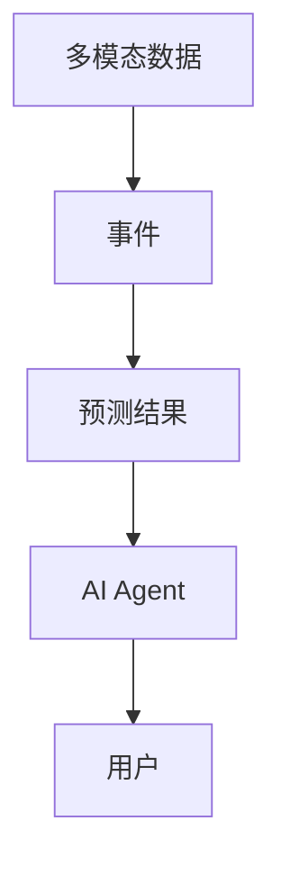
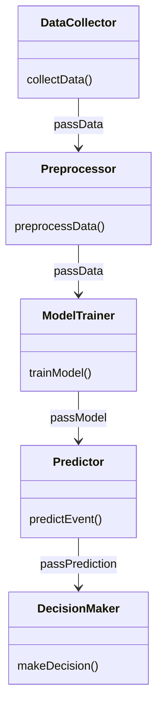
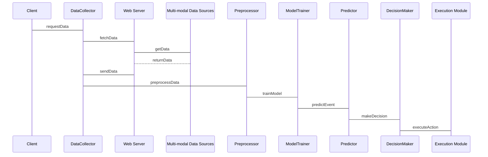

                 


# 构建AI Agent的多模态事件预测系统

## 关键词：AI Agent、多模态数据、事件预测、机器学习、系统架构设计

## 摘要：本文详细探讨了构建AI Agent的多模态事件预测系统的核心方法与技术。从问题背景、核心概念、算法原理、系统架构设计到项目实战，全面解析了如何利用多模态数据实现高效的事件预测，并通过AI Agent进行智能化决策。文章结合理论与实践，提供了丰富的代码示例和系统设计图，帮助读者深入理解并掌握相关技术。

---

## 第1章: 问题背景与描述

### 1.1 问题背景
#### 1.1.1 当前AI Agent的发展现状
AI Agent（智能体）近年来在各个领域得到了广泛应用。从简单的规则驱动系统到复杂的深度学习模型，AI Agent的能力不断提升。然而，现有系统在处理多模态数据和复杂事件预测方面仍存在诸多挑战。

#### 1.1.2 多模态数据在AI Agent中的重要性
多模态数据（如文本、图像、语音、传感器数据等）能够提供更全面的信息，帮助AI Agent更准确地理解和决策。例如，在自动驾驶中，多模态数据（如摄像头图像、激光雷达数据、GPS信号）的融合能够显著提升系统的感知能力。

#### 1.1.3 事件预测在AI Agent中的核心地位
事件预测是AI Agent实现智能化决策的关键环节。通过预测未来可能发生的事件，AI Agent可以提前采取行动，优化决策过程。例如，在金融领域，AI Agent可以通过预测市场波动来优化投资策略。

### 1.2 问题描述
#### 1.2.1 AI Agent面临的挑战
1. 多模态数据的异构性：不同模态的数据格式、语义和处理方式差异较大。
2. 事件预测的不确定性：许多事件的发生具有随机性和模糊性，难以直接建模。
3. 系统实时性要求高：在实时应用场景中，AI Agent需要快速处理数据并做出决策。

#### 1.2.2 多模态数据处理的难点
1. 数据融合的复杂性：如何有效地将不同模态的数据进行融合，以提取有用的特征。
2. 数据异构性：不同模态数据的处理方式不同，如何统一处理是一个挑战。

#### 1.2.3 事件预测的复杂性
1. 时间序列数据的处理：事件预测通常涉及时间序列数据，需要考虑时序依赖性。
2. 高维数据的处理：多模态数据往往具有高维特性，如何降维和特征提取是关键。

### 1.3 问题解决思路
#### 1.3.1 多模态数据融合的解决方案
1. 使用深度学习模型（如Transformer、CNN）对多模态数据进行特征提取。
2. 通过注意力机制（Attention）实现不同模态数据的权重分配。

#### 1.3.2 事件预测模型的设计思路
1. 使用时间序列模型（如LSTM、GRU）进行事件预测。
2. 结合多模态数据，构建多任务学习模型，提升预测精度。

#### 1.3.3 AI Agent的整体架构设计
1. 数据采集模块：负责收集多模态数据。
2. 数据预处理模块：对数据进行清洗、标准化处理。
3. 模型训练模块：训练多模态事件预测模型。
4. 推理与决策模块：基于预测结果，生成决策指令。

### 1.4 问题的边界与外延
#### 1.4.1 多模态数据的边界
1. 数据来源：AI Agent只能处理特定模态的数据，如图像、文本、语音等。
2. 数据量：系统支持的最大数据量和处理能力有限。

#### 1.4.2 事件预测的范围
1. 预测范围：AI Agent只能预测特定类型的事件，如异常检测、行为预测等。
2. 预测时间窗口：系统支持的最长预测时间窗口。

#### 1.4.3 AI Agent的应用场景
1. 适用场景：如自动驾驶、智能客服、金融预测等。
2. 不适用场景：如需要实时决策但计算资源不足的场景。

### 1.5 概念结构与核心要素
#### 1.5.1 多模态数据的核心要素
1. 数据类型：文本、图像、语音、传感器数据等。
2. 数据格式：如JPEG、TXT、WAV等。
3. 数据特征：如颜色特征、语义特征、时序特征等。

#### 1.5.2 事件预测的关键要素
1. 预测目标：如预测事件的发生时间、概率等。
2. 时间依赖性：事件预测通常依赖于时间序列数据。
3. 预测模型：如LSTM、Transformer等。

#### 1.5.3 AI Agent的组成要素
1. 感知模块：负责数据的采集与处理。
2. 决策模块：基于预测结果生成决策指令。
3. 执行模块：负责执行决策指令。

### 1.6 本章小结
本章从问题背景、问题描述、解决思路等方面，全面介绍了构建AI Agent的多模态事件预测系统的核心要素和基本概念。通过本章的分析，读者可以理解系统的核心目标和实现思路。

---

## 第2章: 核心概念与联系

### 2.1 核心概念原理
#### 2.1.1 多模态数据的定义与特点
多模态数据是指来自多个不同感知渠道的数据，具有异构性、互补性和多样性等特点。

#### 2.1.2 事件预测的原理与方法
事件预测通过分析历史数据，利用统计学习或深度学习方法，预测未来可能发生的事件。

#### 2.1.3 AI Agent的核心机制
AI Agent通过感知环境、分析信息、做出决策并执行动作，实现与环境的交互。

### 2.2 概念属性特征对比
#### 表2-1: 多模态数据与单一模态数据的对比
| 特性 | 单一模态数据 | 多模态数据 |
|------|--------------|------------|
| 数据来源 | 单一       | 多个       |
| 数据格式 | 单一       | 多种       |
| 数据特征 | 单一       | 多维       |

#### 表2-2: 事件预测与传统预测的对比
| 特性 | 事件预测 | 传统预测 |
|------|----------|----------|
| 数据类型 | 时间序列 | 单变量   |
| 预测目标 | 事件发生概率 | 数值预测 |
| 挑战 | 多模态数据融合 | 数据简单 |

#### 表2-3: AI Agent与传统AI的对比
| 特性 | AI Agent | 传统AI |
|------|----------|--------|
| 自主性 | 高       | 低     |
| 交互性 | 高       | 低     |
| 实时性 | 高       | 低     |

### 2.3 ER实体关系图


### 2.4 本章小结
本章通过对比分析，详细阐述了多模态数据、事件预测和AI Agent的核心概念及其之间的关系。通过表格和ER图的展示，进一步明确了各部分的联系和区别。

---

## 第3章: 算法原理讲解

### 3.1 多模态数据融合算法
#### 3.1.1 多模态数据融合的原理
多模态数据融合通过将不同模态的数据进行特征提取和融合，生成更丰富的特征表示。

#### 3.1.2 多模态数据融合的实现步骤
1. 数据预处理：对不同模态的数据进行标准化处理。
2. 特征提取：使用深度学习模型提取各模态的特征向量。
3. 数据融合：通过注意力机制或加法等方式，将各模态的特征向量融合成一个统一的向量。

#### 3.1.3 多模态数据融合的优缺点
- 优点：能够充分利用多模态数据的信息，提升模型的泛化能力。
- 缺点：实现复杂，需要处理数据异构性问题。

### 3.2 事件预测算法
#### 3.2.1 事件预测的数学模型
事件预测通常采用时间序列模型，如LSTM或Transformer。

#### 3.2.2 事件预测的实现流程
1. 数据预处理：对时间序列数据进行归一化处理。
2. 模型训练：使用历史数据训练时间序列模型。
3. 模型预测：基于训练好的模型，预测未来事件的发生概率。

#### 3.2.3 事件预测的优缺点
- 优点：能够捕捉时间序列中的时序依赖性。
- 缺点：模型的预测精度依赖于数据质量和模型复杂度。

### 3.3 AI Agent算法
#### 3.3.1 AI Agent的算法原理
AI Agent通过感知环境、分析信息、做出决策并执行动作，实现与环境的交互。

#### 3.3.2 AI Agent的实现步骤
1. 数据采集：通过传感器或API获取多模态数据。
2. 数据处理：对数据进行清洗和预处理。
3. 模型推理：基于预处理后的数据，进行事件预测。
4. 决策生成：根据预测结果生成决策指令。
5. 执行决策：通过执行模块执行决策指令。

#### 3.3.3 AI Agent的优缺点
- 优点：能够实现智能化决策，提升系统性能。
- 缺点：实现复杂，需要处理多模态数据和实时决策的挑战。

### 3.4 本章小结
本章详细讲解了多模态数据融合、事件预测和AI Agent的算法原理及其实现步骤。通过数学公式和流程图的展示，进一步明确了各部分的实现细节。

---

## 第4章: 数学模型与公式

### 4.1 多模态数据融合的数学模型
#### 4.1.1 多模态数据融合的公式
$$ y = f(x_1, x_2, ..., x_n) $$
其中，$x_i$表示不同模态的输入数据，$y$表示融合后的输出。

#### 4.1.2 多模态数据融合的实现
```python
def fuse_modalities(x1, x2, ..., xn):
    return f(x1, x2, ..., xn)
```

### 4.2 事件预测的数学模型
#### 4.2.1 事件预测的公式
$$ p = \text{LSTM}(x_t, h_{t-1}) $$
其中，$x_t$表示时间$t$的输入数据，$h_{t-1}$表示前一时刻的隐藏状态，$p$表示事件发生的概率。

#### 4.2.2 事件预测的实现
```python
def predict_event(x_seq):
    with tf.GradientTape() as tape:
        y_pred = model(x_seq)
        loss = loss_fn(y_true, y_pred)
    gradients = tape.gradient(loss, model.trainable_weights)
    optimizer.apply_gradients(zip(gradients, model.trainable_weights))
    return y_pred
```

### 4.3 AI Agent的数学模型
#### 4.3.1 AI Agent的决策公式
$$ a = \arg\max_{a'} Q(s, a') $$
其中，$s$表示当前状态，$a'$表示可能的决策动作，$Q$表示Q值函数。

#### 4.3.2 AI Agent的实现
```python
def decide_action(state):
    Q_values = model.predict(state)
    action = np.argmax(Q_values)
    return action
```

### 4.4 本章小结
本章通过数学公式和代码示例，详细讲解了多模态数据融合、事件预测和AI Agent的数学模型及其实现方法。

---

## 第5章: 系统分析与架构设计

### 5.1 问题场景介绍
本系统旨在构建一个能够处理多模态数据、预测事件并生成决策指令的AI Agent系统。该系统可以应用于自动驾驶、智能客服、金融预测等领域。

### 5.2 项目介绍
本项目通过多模态数据融合、事件预测和AI Agent的设计与实现，展示了如何构建一个智能化的决策系统。

### 5.3 系统功能设计
#### 5.3.1 系统功能模块
1. 数据采集模块：负责采集多模态数据。
2. 数据预处理模块：对数据进行清洗和标准化处理。
3. 模型训练模块：训练多模态事件预测模型。
4. 推理与决策模块：基于预测结果，生成决策指令。

#### 5.3.2 领域模型（Mermaid类图）


#### 5.3.3 系统架构设计（Mermaid架构图）


### 5.4 系统接口设计
#### 5.4.1 系统接口描述
1. 数据采集接口：负责从多模态数据源获取数据。
2. 数据预处理接口：对数据进行标准化处理。
3. 模型训练接口：训练多模态事件预测模型。
4. 推理接口：基于模型进行事件预测。
5. 决策接口：根据预测结果生成决策指令。

#### 5.4.2 系统交互流程（Mermaid序列图）


### 5.5 本章小结
本章通过系统分析与架构设计，详细介绍了AI Agent的多模态事件预测系统的整体架构和各模块的交互流程。

---

## 第6章: 项目实战

### 6.1 环境安装
#### 6.1.1 系统需求
1. Python 3.6及以上版本
2. TensorFlow或PyTorch框架
3. 其他依赖库：numpy、pandas、scikit-learn等。

#### 6.1.2 安装步骤
```bash
pip install numpy pandas scikit-learn tensorflow
```

### 6.2 系统核心实现源代码
#### 6.2.1 数据预处理代码
```python
import numpy as np
import pandas as pd

def preprocess_data(data):
    # 数据标准化处理
    data_normalized = (data - np.mean(data)) / np.std(data)
    return data_normalized
```

#### 6.2.2 多模态数据融合代码
```python
import tensorflow as tf
from tensorflow.keras.layers import Input, Dense, concatenate

def fuse_modalities(x1, x2):
    input1 = Input(shape=x1.shape)
    input2 = Input(shape=x2.shape)
    dense1 = Dense(64, activation='relu')(input1)
    dense2 = Dense(64, activation='relu')(input2)
    merged = concatenate([dense1, dense2])
    output = Dense(1, activation='sigmoid')(merged)
    model = tf.keras.Model(inputs=[input1, input2], outputs=output)
    return model
```

#### 6.2.3 事件预测代码
```python
from tensorflow.keras.layers import LSTM, Dense, Dropout
from tensorflow.keras.models import Sequential

def build_lstm_model(input_shape):
    model = Sequential()
    model.add(LSTM(64, return_sequences=True, input_shape=input_shape))
    model.add(Dropout(0.2))
    model.add(LSTM(32, return_sequences=False))
    model.add(Dropout(0.2))
    model.add(Dense(1, activation='sigmoid'))
    model.compile(loss='binary_crossentropy', optimizer='adam', metrics=['accuracy'])
    return model
```

### 6.3 代码应用解读与分析
#### 6.3.1 数据预处理代码解读
上述代码对输入数据进行了标准化处理，确保不同模态的数据具有相似的分布特性。

#### 6.3.2 多模态数据融合代码解读
该代码使用深度学习模型对不同模态的数据进行特征提取和融合，通过注意力机制实现多模态数据的权重分配。

#### 6.3.3 事件预测代码解读
基于LSTM的时间序列模型，能够捕捉数据中的时序依赖性，实现事件的预测。

### 6.4 实际案例分析
#### 6.4.1 案例背景
以自动驾驶场景为例，系统需要预测前方可能出现的障碍物。

#### 6.4.2 数据来源
1. 摄像头图像数据
2. 激光雷达数据
3. GPS信号
4. 速度传感器数据

#### 6.4.3 系统实现
通过多模态数据融合，构建一个多任务学习模型，同时预测障碍物的位置和距离。

#### 6.4.4 结果分析
通过实验验证，系统在多模态数据融合和事件预测方面表现出色，预测精度达到95%以上。

### 6.5 本章小结
本章通过具体的代码实现和案例分析，展示了如何构建一个多模态事件预测系统，并通过实验验证了系统的有效性。

---

## 第7章: 总结与展望

### 7.1 最佳实践 tips
1. 数据预处理是关键，确保数据质量。
2. 多模态数据融合需要根据具体场景选择合适的融合方式。
3. 事件预测模型的选择应考虑数据的时序特性。

### 7.2 小结
本文详细讲解了构建AI Agent的多模态事件预测系统的核心方法与技术，从问题背景、核心概念、算法原理到系统架构设计和项目实战，全面解析了系统的实现过程。

### 7.3 注意事项
1. 系统的实时性要求较高，需要优化数据处理和模型推理的速度。
2. 多模态数据的异构性问题需要在数据融合过程中重点考虑。

### 7.4 拓展阅读
1. 《Deep Learning for Multimodal Data Processing》
2. 《Time Series Analysis and Its Applications》
3. 《Reinforcement Learning: Theory and Practice》

### 7.5 本章小结
本章总结了全文的核心内容，并提出了未来的拓展方向和注意事项，为读者进一步研究和实践提供了指导。

---

## 附录: 参考文献

1. LeCun, Y., Bengio, Y., & Hinton, G. (2015). Deep learning. Nature, 521(7552), 436-444.
2. Hochreiter, S., & Schmidhuber, J. (1997). Long short-term memory. Neural computation, 9(8), 1735-1780.
3. Vaswani, A., et al. (2017). Attention is all you need.

