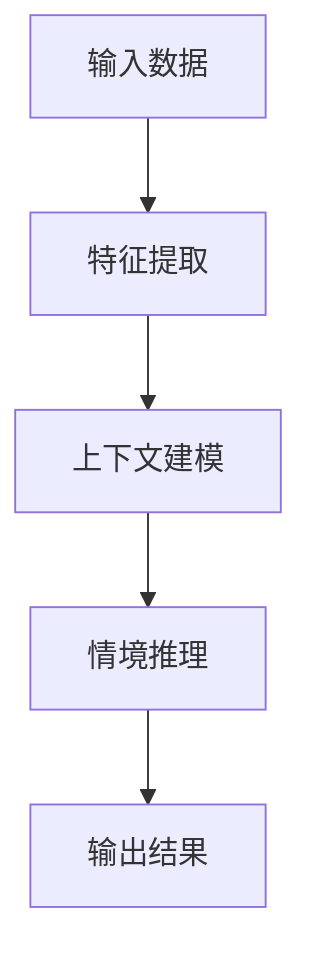
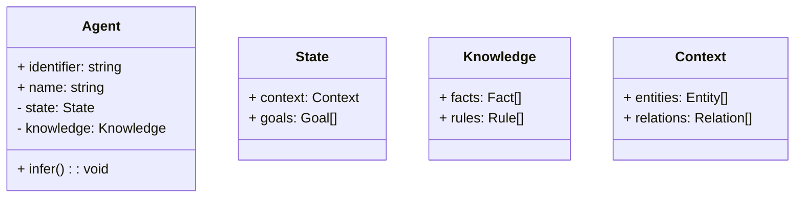
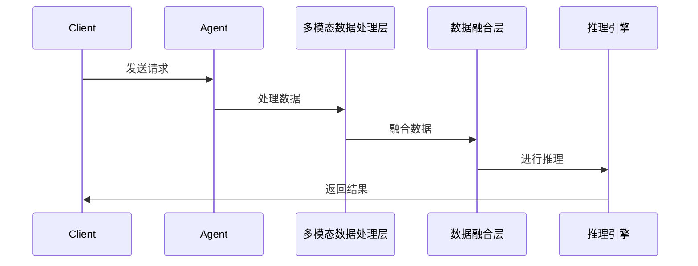

                 


# 构建AI Agent的多模态情境理解与推理系统

> 关键词：AI Agent, 多模态数据, 情境理解, 推理机制, 系统架构

> 摘要：构建一个具备多模态情境理解与推理能力的AI Agent，需要整合文本、图像、语音等多种数据类型，通过复杂的算法处理和推理机制，实现对复杂情境的深入理解与决策能力。本文从背景介绍、核心概念、算法原理、系统设计、项目实战到总结展望，全面解析构建这一系统的各个方面，为读者提供详细的技术指导。

---

## 第一部分: AI Agent的多模态情境理解与推理系统背景介绍

### 第1章: 问题背景与重要性

#### 1.1 多模态数据处理的必要性
- 多模态数据的定义与特点：包括文本、图像、语音、视频等多种数据类型，具有多样性和互补性。
- 多模态数据处理的重要性：通过整合多模态信息，提升AI Agent的理解能力，使其能够处理更复杂的问题。

#### 1.2 AI Agent的情境理解需求
- 情境理解的核心概念：AI Agent需要理解当前情境中的语义、情感和意图。
- 情境理解的挑战与解决方案：数据异构性、语义关联性等挑战，解决方案包括多模态数据融合和跨模态推理。

#### 1.3 推理机制在AI Agent中的作用
- 推理机制的定义与分类：基于符号逻辑的推理和基于机器学习的推理。
- 推理在AI Agent中的应用场景：决策支持、问题解决、对话生成等。

#### 1.4 本章小结
- 总结本章内容，强调多模态数据处理和情境理解的重要性。

---

## 第二部分: 核心概念与联系

### 第2章: 多模态数据处理原理

#### 2.1 多模态数据的融合方法
- 晚融合与早融合的对比：晚融合在特征层面融合，早融合在决策层面融合。
- 多模态数据融合的数学模型：
  $$ y = f(x_1, x_2, ..., x_n) $$
  其中，$x_i$ 表示不同模态的输入数据，$f$ 是融合函数。

#### 2.2 情境理解的模型构建
- 情境理解的层次划分：感知层、语义层和意图层。
- 情境理解的特征提取方法：基于深度学习的特征提取，如CNN、RNN等。

#### 2.3 推理机制的算法原理
- 推理算法的分类与对比：符号逻辑推理、概率推理、机器学习推理。
- 推理算法的数学模型：
  $$ p(y|x) = \text{推理模型}(x) $$

#### 2.4 核心概念的ER实体关系图
```mermaid
er
  actor(Agent, identifier, name)
  actor(Scene, identifier, description)
  actor has many Relationship
  relationship(关联类型, 关联强度)
```

### 第3章: 算法原理与数学模型

#### 3.1 多模态数据处理的算法流程
- 数据预处理：归一化、特征提取。
- 数据融合算法：使用注意力机制或加性融合。
- 数据处理的数学模型：
  $$ z = \text{融合函数}(x_1, x_2) $$

#### 3.2 情境理解的算法实现
- 情境理解的算法步骤：
  1. 多模态数据输入。
  2. 特征提取。
  3. 上下文建模。
  4. 情境推理。
- 情境理解的数学公式：
  $$ p(c|x) = \text{模型}(x) $$

#### 3.3 推理机制的算法实现
- 推理算法的实现步骤：
  1. 输入多模态数据。
  2. 状态表示。
  3. 推理过程。
  4. 输出结果。
- 推理算法的数学公式：
  $$ y = \text{推理模型}(x) $$

#### 3.4 算法流程图（Mermaid）


### 第4章: 系统分析与架构设计

#### 4.1 问题场景
- AI Agent需要处理多模态数据，理解复杂情境，并做出推理决策。

#### 4.2 项目介绍
- 项目目标：构建一个多模态情境理解与推理系统。

#### 4.3 系统功能设计（领域模型Mermaid类图）


#### 4.4 系统架构设计（Mermaid架构图）


#### 4.5 系统接口设计
- 输入接口：接收多模态数据。
- 输出接口：返回推理结果。

#### 4.6 系统交互（Mermaid序列图）


---

## 第三部分: 项目实战

### 第5章: 项目实战与代码实现

#### 5.1 环境安装
- 安装Python、TensorFlow、Keras、PyTorch等工具。

#### 5.2 核心实现源代码
```python
# 数据融合代码示例
def fuse_modalities(x1, x2):
    return x1 + x2

# 情境理解代码示例
def context_inference(x):
    with tf.keras.backend as K
    model = Sequential([
        Dense(64, activation='relu'),
        Dense(1, activation='sigmoid')
    ])
    model.compile(optimizer='adam', loss='binary_crossentropy')
    return model.predict(x)

# 推理机制代码示例
def infer(x):
    # 使用预训练模型进行推理
    pass
```

#### 5.3 代码应用解读与分析
- 代码功能说明：数据融合、情境理解、推理机制。
- 代码实现细节：模型结构、训练过程、评估指标。

#### 5.4 案例分析与详细讲解
- 实际案例：AI Agent在智能客服中的应用。
- 案例分析：如何处理多模态数据，理解情境，做出推理决策。

#### 5.5 项目小结
- 总结项目实现过程，提出改进建议。

---

## 第四部分: 总结与展望

### 第6章: 总结与展望

#### 6.1 核心内容总结
- 复习本文的主要内容，强调多模态数据处理和情境理解的重要性。

#### 6.2 未来研究方向
- 提出当前研究的局限性，展望未来的研究方向，如更高效的融合方法、更智能的推理机制等。

#### 6.3 最佳实践 Tips
- 提供实际项目中的经验教训和建议，如数据预处理的重要性、模型调参的技巧等。

#### 6.4 本章小结
- 总结全文，强调构建多模态情境理解与推理系统的重要性和挑战。

---

## 第五部分: 附录与参考文献

### 附录A: 术语解释
- 解释文章中出现的专业术语，如多模态数据、情境理解、推理机制等。

### 附录B: 额外资源
- 推荐相关书籍、论文和在线资源，供读者深入学习。

### 参考文献
- 列出文章中引用的主要文献和资料。

---

通过以上目录结构，本文系统地介绍了构建AI Agent的多模态情境理解与推理系统的各个方面，从理论到实践，为读者提供了全面的技术指导。

