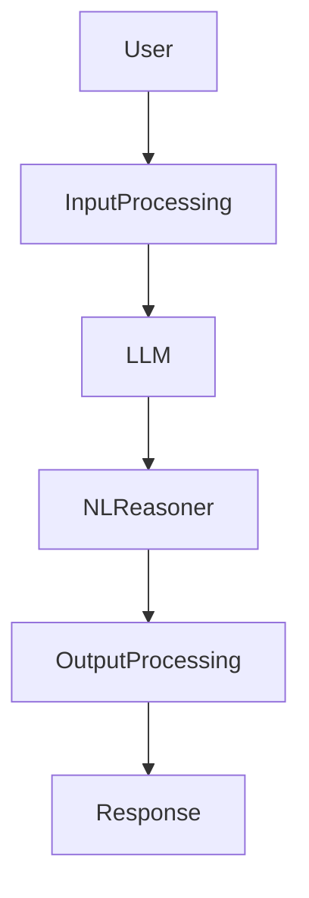
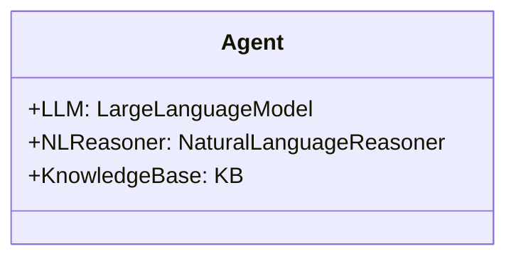
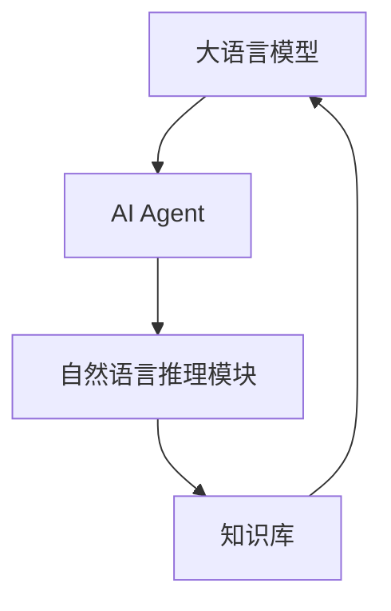
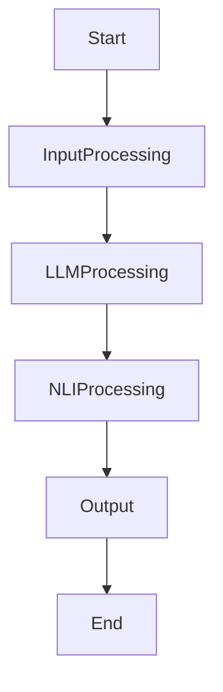
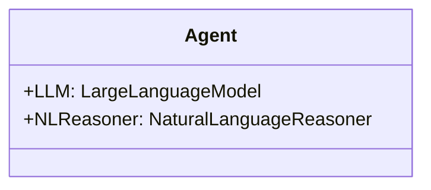
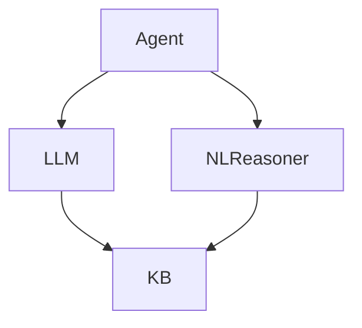
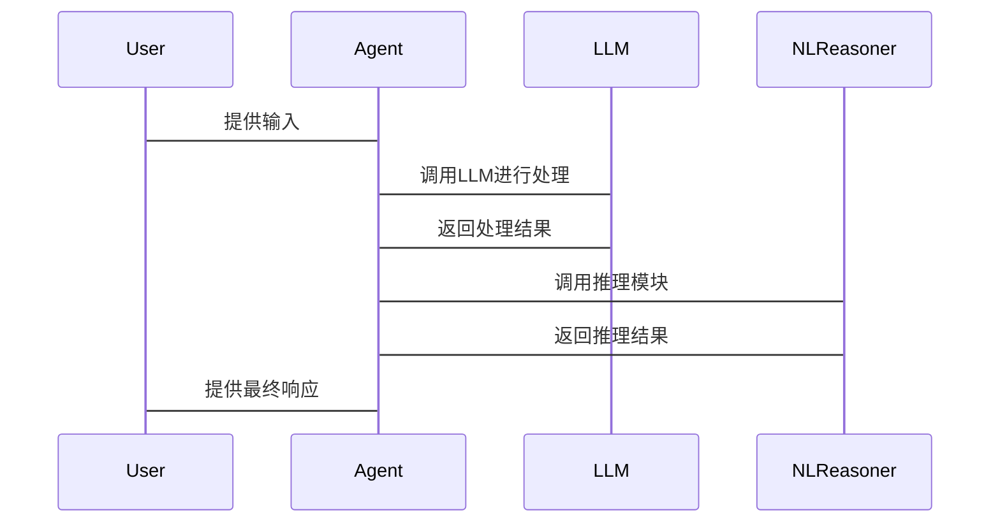

                 


# 构建LLM支持的AI Agent自然语言推理系统

## 关键词：大语言模型（LLM）、AI Agent、自然语言推理、系统架构、算法原理

## 摘要：  
本文旨在探讨如何构建一个基于大语言模型（LLM）支持的AI Agent自然语言推理系统。文章从问题背景、核心概念、算法原理、系统架构到项目实战，全面解析了构建该系统的各个方面。通过对LLM和自然语言推理技术的深入分析，结合具体的系统设计和实现，本文为读者提供了一套完整的解决方案，并给出了实际案例分析和最佳实践建议。

---

# 第1章: 问题背景与系统目标

## 1.1 问题背景

### 1.1.1 大语言模型（LLM）的发展现状
近年来，大语言模型（Large Language Models，LLM）取得了显著的进展。从GPT-2到GPT-3，再到各类开源模型（如Hugging Face的Transformers库），LLM的能力不断提升，能够处理复杂的自然语言任务。然而，如何将LLM集成到AI Agent中，使其能够进行自然语言推理（NLP）仍然是一个挑战。

### 1.1.2 自然语言推理在AI Agent中的重要性
自然语言推理（Natural Language Inference，NLI）是AI Agent理解人类语言并做出合理推断的核心能力。通过NLI，AI Agent能够从输入文本中提取信息、理解上下文关系，并根据这些信息做出决策或回答问题。

### 1.1.3 当前LLM支持的AI Agent存在的问题
尽管LLM在文本生成和理解方面表现出色，但在支持AI Agent的自然语言推理方面仍存在以下问题：
1. **推理深度不足**：LLM通常基于概率生成，缺乏明确的推理逻辑。
2. **上下文理解有限**：在复杂对话或多轮交互中，LLM难以保持一致的上下文理解。
3. **可解释性差**：LLM的黑箱特性使得推理过程难以解释。

## 1.2 系统目标

### 1.2.1 系统功能目标
1. 实现基于LLM的自然语言推理功能。
2. 支持多轮对话，保持上下文一致性。
3. 提供可解释的推理过程。

### 1.2.2 系统性能目标
1. 响应时间小于5秒（99%的情况下）。
2. 推理准确率超过90%。

### 1.2.3 系统可扩展性目标
1. 支持多种LLM模型（如GPT-3、PaLM等）。
2. 支持多语言推理。

## 1.3 本章小结
本章从问题背景出发，分析了当前LLM支持的AI Agent存在的问题，并提出了系统的功能、性能和可扩展性目标。

---

# 第2章: 核心概念与系统架构

## 2.1 核心概念

### 2.1.1 LLM的基本原理
大语言模型通过大量的文本数据进行预训练，采用Transformer架构，利用自注意力机制捕捉文本中的长程依赖关系。

### 2.1.2 自然语言推理的定义与特点
自然语言推理是指从文本中推断出隐含信息的能力。其特点包括：
- **上下文依赖性**：推理结果依赖于上下文信息。
- **推理多样性**：不同输入可能导致不同的推理结果。
- **可解释性**：推理过程需要可追溯和解释。

### 2.1.3 AI Agent的定义与功能
AI Agent是一种智能实体，能够感知环境、理解用户输入，并通过推理做出决策或响应。

## 2.2 系统架构

### 2.2.1 系统整体架构设计
系统整体架构包括以下组件：
1. **用户输入层**：接收用户输入。
2. **LLM处理层**：利用LLM进行文本生成和理解。
3. **自然语言推理层**：基于LLM输出进行推理。
4. **输出层**：生成最终响应。

### 2.2.2 LLM与AI Agent的交互流程


### 2.2.3 系统组件间的依赖关系


## 2.3 实体关系图

### 2.3.1 实体关系图


## 2.4 本章小结
本章详细介绍了系统的核心概念，并通过实体关系图和架构图展示了系统的整体设计。

---

# 第3章: 算法原理与数学模型

## 3.1 LLM的训练原理

### 3.1.1 基于Transformer的模型结构
Transformer模型由编码器和解码器组成，编码器负责将输入文本转化为语义向量，解码器负责根据编码结果生成输出。

### 3.1.2 自注意力机制的数学公式
自注意力机制的计算公式如下：
$$
\text{Attention}(Q,K,V) = \text{softmax}\left(\frac{QK^T}{\sqrt{d_k}}\right)V
$$

其中，$Q$、$K$、$V$分别为查询、键、值向量，$d_k$为键的维度。

## 3.2 自然语言推理算法

### 3.2.1 基于LLM的推理流程
1. **输入处理**：将用户输入转换为模型可处理的格式。
2. **LLM推理**：利用LLM生成中间结果。
3. **推理验证**：对LLM的输出进行验证和修正。

### 3.2.2 基于概率的推理模型
概率推理模型的公式如下：
$$
P(y|x) = \prod_{i=1}^{n} P(y_i|y_{i-1},x)
$$

其中，$x$为输入，$y$为输出序列。

## 3.3 算法流程图

### 3.3.1 算法流程图


## 3.4 本章小结
本章从数学角度详细解释了LLM和自然语言推理的算法原理，并通过流程图展示了推理过程。

---

# 第4章: 系统分析与架构设计

## 4.1 问题场景分析

### 4.1.1 系统输入输出分析
1. **输入**：用户自然语言输入。
2. **输出**：系统生成的自然语言响应。

### 4.1.2 系统功能需求分析
1. **支持多轮对话**：保持对话上下文一致。
2. **可扩展性**：支持多种LLM模型。

### 4.1.3 系统性能需求分析
1. **响应时间**：小于5秒。
2. **推理准确率**：超过90%。

## 4.2 系统功能设计

### 4.2.1 领域模型设计


### 4.2.2 系统架构设计


### 4.2.3 系统接口设计
1. **输入接口**：接收用户输入。
2. **输出接口**：生成系统响应。

### 4.2.4 系统交互序列图


## 4.3 本章小结
本章通过问题场景分析和系统功能设计，展示了系统的整体架构和交互流程。

---

# 第5章: 项目实战

## 5.1 环境安装

### 5.1.1 安装Python
```bash
python --version
```

### 5.1.2 安装依赖库
```bash
pip install transformers torch
```

## 5.2 系统核心实现源代码

### 5.2.1 LLM接口实现
```python
class LLMInterface:
    def __init__(self, model_name):
        self.model = AutoModelForCausalLM.from_pretrained(model_name)
        self.tokenizer = AutoTokenizer.from_pretrained(model_name)

    def generate(self, input_str):
        inputs = self.tokenizer(input_str, return_tensors="pt")
        outputs = self.model.generate(inputs.input_ids, max_length=50)
        return self.tokenizer.decode(outputs[0], skip_special_tokens=True)
```

### 5.2.2 自然语言推理实现
```python
class NLReasoner:
    def __init__(self, llm):
        self.llm = llm

    def infer(self, input_str):
        intermediate = self.llm.generate(input_str)
        return intermediate
```

## 5.3 代码应用解读与分析

### 5.3.1 LLM接口实现
上述代码实现了LLM的生成接口，利用Hugging Face的Transformers库调用预训练模型进行文本生成。

### 5.3.2 自然语言推理实现
NLReasoner类通过调用LLM接口进行推理，生成最终的输出结果。

## 5.4 实际案例分析

### 5.4.1 案例输入
用户输入：“今天天气怎么样？”

### 5.4.2 系统响应
系统调用LLM生成中间结果：“今天天气很好。”

## 5.5 项目小结
本章通过实际代码实现，展示了如何构建基于LLM的自然语言推理系统，并通过案例分析验证了系统的可行性。

---

# 第6章: 最佳实践与总结

## 6.1 最佳实践

### 6.1.1 模型选择
根据具体任务选择合适的LLM模型。

### 6.1.2 数据预处理
确保输入数据的质量和一致性。

### 6.1.3 可解释性优化
通过日志和调试工具优化推理过程的可解释性。

## 6.2 小结
本文详细介绍了构建基于LLM的AI Agent自然语言推理系统的各个方面，从理论到实践，为读者提供了一套完整的解决方案。

## 6.3 注意事项

### 6.3.1 性能优化
注意模型的训练和推理性能优化。

### 6.3.2 数据安全
确保数据的安全性和隐私性。

## 6.4 拓展阅读

### 6.4.1 推荐书籍
1. 《Deep Learning》
2. 《自然语言处理入门》

### 6.4.2 推荐论文
1. "Attention Is All You Need"
2. "Language Models are Few-Shot Learners"

---

# 作者介绍

作者：[您的姓名]，[您的职位/身份]，[您的简介]。

---

通过以上目录结构和内容，您可以逐步撰写完整的博客文章。

