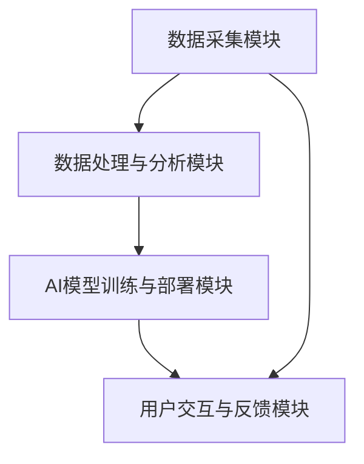

                 


# 构建企业级AI客户生命周期管理助手

> **关键词**：客户生命周期管理、人工智能、企业级系统、机器学习、数据驱动决策

> **摘要**：随着企业数字化转型的深入，客户生命周期管理（CLM）在企业运营中的重要性日益凸显。传统的客户管理方法逐渐暴露出效率低下、数据孤岛和决策滞后等问题。借助人工智能技术，企业可以更精准地预测客户行为，优化客户体验，提升运营效率。本文将从AI在客户生命周期管理中的应用出发，详细探讨其核心概念、算法原理、系统架构设计及项目实战，为企业构建智能化的客户管理助手提供理论支持和实践指导。

---

# 第1章: AI客户生命周期管理概述

## 1.1 客户生命周期管理的定义与重要性

客户生命周期管理（Customer Lifecycle Management, CLM）是指通过对企业与客户之间所有接触点的管理，从客户识别、获取、保留到客户流失的全过程进行优化和监控，以最大化客户价值和企业收益。在企业级管理中，CLM不仅仅是记录客户信息，更是通过数据驱动的方式，洞察客户需求、行为和偏好，从而制定精准的营销策略和客户服务方案。

### 1.1.1 客户生命周期管理的重要性

在数字化转型的背景下，企业竞争的核心已经从产品转向客户体验。通过CLM，企业可以：

1. **提升客户满意度**：通过个性化服务和精准触达，提高客户对品牌的忠诚度。
2. **优化运营效率**：通过自动化流程和数据驱动决策，降低管理成本。
3. **提升营销效果**：通过客户分层和行为预测，制定更有针对性的营销策略。
4. **挖掘潜在价值**：通过客户全生命周期的分析，发现潜在的市场机会。

---

## 1.2 AI在客户生命周期管理中的应用

人工智能技术的引入，为CLM带来了革命性的变化。AI能够从海量数据中提取有价值的信息，帮助企业在客户管理的各个阶段做出更明智的决策。

### 1.2.1 AI驱动的客户画像

通过机器学习算法，企业可以构建客户画像，识别不同客户的特征和行为模式。例如，使用聚类算法将客户分为不同的群体，每个群体具有相似的消费习惯和偏好。

### 1.2.2 客户行为预测

利用时间序列分析和深度学习模型，企业可以预测客户的未来行为，例如预测客户何时可能流失或购买新产品。

### 1.2.3 自动化决策

AI可以通过规则引擎和预测模型，自动触发相应的客户管理动作，例如在客户流失风险较高的阶段，自动发送优惠券或提供个性化服务。

---

# 第2章: 企业级AI客户管理的核心概念

## 2.1 数据驱动的客户分层

### 2.1.1 客户分层的算法选择

客户分层是CLM中的重要环节。常用的算法包括：

1. **聚类算法**：如K-means，用于将客户分为不同的群体。
2. **决策树**：用于根据客户特征进行分类。

### 2.1.2 数据特征提取

在客户分层中，特征工程是关键。例如，提取客户的购买频率、客单价、最近一次购买时间等特征，用于构建客户画像。

---

## 2.2 客户行为预测的数学模型

### 2.2.1 时间序列分析

时间序列分析是一种用于预测未来行为的常用方法。例如，使用ARIMA模型预测客户的购买频率。

$$ ARIMA(p, d, q) $$

其中，\( p \) 是自回归阶数，\( d \) 是差分阶数，\( q \) 是移动平均阶数。

### 2.2.2 深度学习模型

深度学习模型（如LSTM）在时间序列预测中表现优异，尤其适用于复杂的行为模式。

---

# 第3章: AI客户生命周期管理的系统架构设计

## 3.1 系统模块划分

### 3.1.1 数据采集模块

数据采集模块负责从企业内部系统（如CRM、ERP）和外部渠道（如社交媒体）获取客户数据。

### 3.1.2 数据处理与分析模块

该模块负责对数据进行清洗、特征提取和建模分析。

### 3.1.3 AI模型训练与部署模块

通过训练好的模型，对客户行为进行预测，并将结果反馈到系统中。

### 3.1.4 用户交互与反馈模块

用户可以通过界面查看客户画像、预测结果，并根据反馈优化模型。

---

## 3.2 系统架构图



---

# 第4章: 项目实战

## 4.1 环境搭建与数据准备

### 4.1.1 环境配置

安装必要的开发工具和库，例如Python、TensorFlow、Pandas等。

### 4.1.2 数据清洗与预处理

对数据进行清洗，处理缺失值和异常值。

---

## 4.2 AI模型实现

### 4.2.1 客户分层实现

使用K-means算法对客户进行分层。

```python
from sklearn.cluster import KMeans

# 假设X为特征矩阵
model = KMeans(n_clusters=3, random_state=42)
model.fit(X)
```

### 4.2.2 客户行为预测

使用LSTM模型预测客户购买行为。

```python
from tensorflow.keras import layers

model = tf.keras.Sequential()
model.add(layers.LSTM(64, input_shape=(timesteps, features)))
model.add(layers.Dense(1))
model.compile(optimizer='adam', loss='mean_squared_error')
```

---

## 4.3 系统部署与优化

### 4.3.1 模型优化

通过调参和模型评估，优化AI模型的性能。

### 4.3.2 系统优化

优化系统架构，提高系统的响应速度和稳定性。

---

# 第5章: 总结与展望

## 5.1 项目总结

本文详细探讨了AI在客户生命周期管理中的应用，从核心概念到系统架构设计，再到项目实战，为企业构建智能化的客户管理助手提供了全面的指导。

## 5.2 未来展望

随着AI技术的不断发展，企业级客户生命周期管理将更加智能化和个性化。未来，可以结合区块链、大数据等技术，进一步提升客户管理的效率和精准度。

---

通过本文的学习，读者可以掌握构建企业级AI客户生命周期管理助手的关键技术，并在实际项目中灵活应用。

