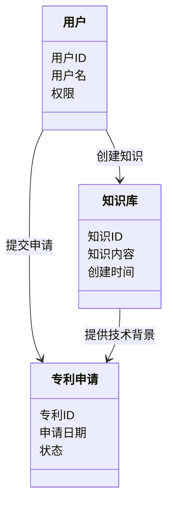
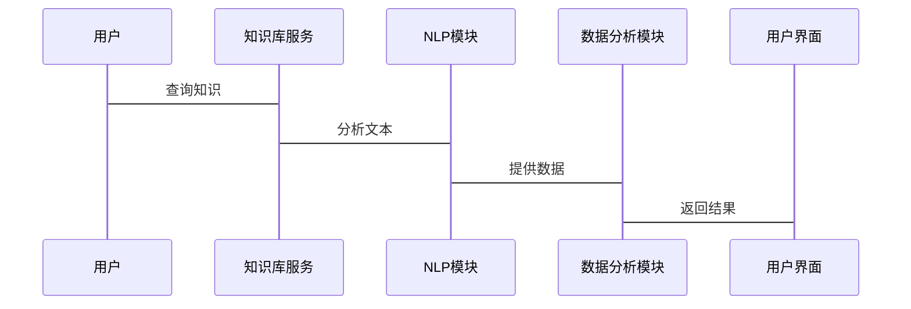

                 


# 构建企业级AI研发助手：加速创新与专利申请

> 关键词：企业级AI研发助手、知识库构建、自然语言处理、数据分析、专利申请、创新支持

> 摘要：企业级AI研发助手是一种利用人工智能技术来加速企业创新和专利申请的工具，通过构建知识库、自然语言处理和数据分析模块，结合支持向量机和神经网络算法，优化研发流程，提升效率。本文详细探讨了其核心概念、系统架构、实现方案及实际应用。

---

# 第一部分：企业级AI研发助手的背景与价值

## 第1章：企业级AI研发助手的背景与需求

### 1.1 企业研发面临的挑战

#### 1.1.1 创新压力与资源限制
企业在研发过程中面临巨大的创新压力，但受限于资源和时间，难以高效地整合内部知识和外部信息。

#### 1.1.2 知识管理的复杂性
知识分散在各个部门和文档中，难以系统化管理，导致知识浪费和重复劳动。

#### 1.1.3 研发效率的提升需求
企业希望通过技术手段提高研发效率，减少试错成本，加快产品迭代。

### 1.2 AI技术在研发中的应用潜力

#### 1.2.1 AI在知识管理中的作用
AI能够自动整理和检索海量知识，帮助研发人员快速获取所需信息。

#### 1.2.2 AI在创新支持中的优势
通过自然语言处理和数据分析，AI可以生成创新建议，预测技术趋势。

#### 1.2.3 企业级AI研发助手的概念
企业级AI研发助手是一种结合知识库、NLP和数据分析的智能化工具，旨在加速创新和专利申请。

---

## 第2章：企业级AI研发助手的核心价值

### 2.1 提升研发效率的关键点

#### 2.1.1 自动化知识检索与整理
AI助手能够自动从企业文档和外部资源中提取知识，构建结构化的知识库。

#### 2.1.2 智能化创新建议生成
基于知识库和数据分析，AI助手可以为研发人员提供创新方向和建议。

#### 2.1.3 专利申请流程优化
AI助手可以辅助撰写专利申请文件，自动检测潜在的专利机会。

### 2.2 企业级AI研发助手的功能模块

#### 2.2.1 知识库构建与管理
模块功能：整合企业内外部知识，构建结构化的知识库。

#### 2.2.2 自然语言处理模块
功能特点：支持文本分析、关键词提取和语义理解。

#### 2.2.3 数据分析与挖掘模块
应用场景：分析研发数据，预测技术趋势，挖掘潜在机会。

### 2.3 企业级AI研发助手的市场前景

#### 2.3.1 市场需求分析
随着企业对创新和效率的需求增加，AI研发助手的市场潜力巨大。

#### 2.3.2 企业案例分享
通过实际案例展示AI研发助手在企业中的应用效果。

#### 2.3.3 技术发展趋势
探讨AI技术的未来发展方向及其对企业研发的影响。

---

## 第3章：企业级AI研发助手的核心概念与联系

### 3.1 核心概念原理

#### 3.1.1 知识库构建原理
使用爬虫和NLP技术从企业文档中提取知识，构建知识图谱。

#### 3.1.2 自然语言处理机制
通过词袋模型和TF-IDF算法进行文本分析和关键词提取。

#### 3.1.3 数据分析与挖掘算法
使用支持向量机和神经网络进行数据分析和预测。

### 3.2 核心概念对比表

| 模块功能       | 知识库构建 | 自然语言处理 | 数据分析与挖掘 |
|----------------|------------|--------------|----------------|
| **特征**       | 结构化知识 | 文本分析     | 数据预测       |
| **功能**       | 存储知识    | 语义理解     | 趋势预测       |
| **应用场景**   | 知识检索   | 创新建议     | 专利分析       |

### 3.3 系统架构ER图

```mermaid
erDiagram
    用户 {
        <属性> 用户ID : integer
        <属性> 用户名 : string
        <属性> 权限 : string
    }
    知识库 {
        <属性> 知识ID : integer
        <属性> 知识内容 : string
        <属性> 创建时间 : datetime
    }
    专利申请 {
        <属性> 专利ID : integer
        <属性> 申请日期 : datetime
        <属性> 状态 : string
    }
    用户 --> 知识库 : 创建知识
    用户 --> 专利申请 : 提交申请
    知识库 --> 专利申请 : 提供技术背景
```

---

## 第4章：企业级AI研发助手的算法原理

### 4.1 支持向量机（SVM）算法

#### 4.1.1 算法原理
支持向量机是一种监督学习算法，适用于分类和回归问题。

#### 4.1.2 专利分析中的应用
通过SVM算法分析专利数据，预测技术趋势和潜在机会。

#### 4.1.3 代码实现

```python
from sklearn import svm
import numpy as np

# 示例数据
X = np.array([[0, 0], [1, 1], [1, 0], [0, 1]])
y = np.array([0, 1, 1, 0])

# 创建SVM模型并训练
model = svm.SVC()
model.fit(X, y)

# 预测新样本
print(model.predict([[0.5, 0.5]]))
```

### 4.2 神经网络算法

#### 4.2.1 算法原理
神经网络是一种模拟人脑结构和功能的深度学习算法，适用于复杂数据处理。

#### 4.2.2 创新建议生成中的应用
通过神经网络生成创新方向和建议。

#### 4.2.3 代码实现

```python
import tensorflow as tf
from tensorflow.keras import layers

# 创建神经网络模型
model = tf.keras.Sequential([
    layers.Dense(64, activation='relu'),
    layers.Dense(1, activation='sigmoid')
])

# 编译模型
model.compile(optimizer='adam', loss='binary_crossentropy', metrics=['accuracy'])

# 训练模型
model.fit(X_train, y_train, epochs=10, batch_size=32)
```

---

## 第5章：企业级AI研发助手的系统架构设计

### 5.1 系统应用场景

#### 5.1.1 知识库构建
从企业文档中提取知识，构建结构化的知识库。

#### 5.1.2 创新支持
基于知识库生成创新建议，辅助研发人员。

#### 5.1.3 专利申请
辅助撰写专利申请文件，优化申请流程。

### 5.2 系统功能设计

#### 5.2.1 领域模型设计



#### 5.2.2 系统架构设计


#### 5.2.3 系统接口设计
设计RESTful API接口，实现知识库查询、NLP分析和数据分析功能。

#### 5.2.4 系统交互流程



---

## 第6章：企业级AI研发助手的项目实战

### 6.1 环境安装

#### 6.1.1 安装Python
安装最新版本的Python，推荐使用Anaconda。

#### 6.1.2 安装依赖库
使用pip安装所需库：
```bash
pip install numpy tensorflow scikit-learn
```

### 6.2 核心代码实现

#### 6.2.1 知识库构建

```python
import os
import json

# 创建知识库
knowledge_base = {}

def add_knowledge(key, value):
    knowledge_base[key] = value

add_knowledge('技术领域', '人工智能')
```

#### 6.2.2 NLP模块实现

```python
from sklearn.feature_extraction.text import TfidfVectorizer

vectorizer = TfidfVectorizer()
text = "人工智能 自然语言处理"
vectorized = vectorizer.fit_transform([text])
print(vectorized.shape)
```

#### 6.2.3 数据分析模块

```python
import numpy as np
from sklearn.svm import SVC

X = np.array([[0, 0], [1, 1], [1, 0], [0, 1]])
y = np.array([0, 1, 1, 0])

model = SVC()
model.fit(X, y)
print(model.predict([[0.5, 0.5]]))
```

### 6.3 项目测试与优化

#### 6.3.1 功能测试
测试各模块的功能，确保知识库构建、NLP分析和数据分析功能正常。

#### 6.3.2 性能优化
优化算法和代码，提高系统的运行效率。

#### 6.3.3 用户反馈
收集用户反馈，不断改进系统功能。

---

## 第7章：企业级AI研发助手的最佳实践

### 7.1 最佳实践

#### 7.1.1 小结
总结企业级AI研发助手的核心价值和实际应用。

#### 7.1.2 注意事项
在实施过程中需要注意数据安全、算法选择和系统维护等问题。

#### 7.1.3 拓展阅读
推荐相关书籍和论文，供读者深入学习。

### 7.2 项目总结

#### 7.2.1 项目小结
回顾整个项目的实施过程，总结经验和教训。

#### 7.2.2 未来展望
展望企业级AI研发助手的发展方向和技术趋势。

---

# 结语

企业级AI研发助手作为一种新兴的技术工具，正在为企业研发带来革命性的变化。通过构建知识库、自然语言处理和数据分析模块，结合先进的AI算法，企业可以显著提升研发效率，加速创新和专利申请。未来，随着技术的不断进步，企业级AI研发助手将发挥更大的作用，成为企业研发的核心助手。

