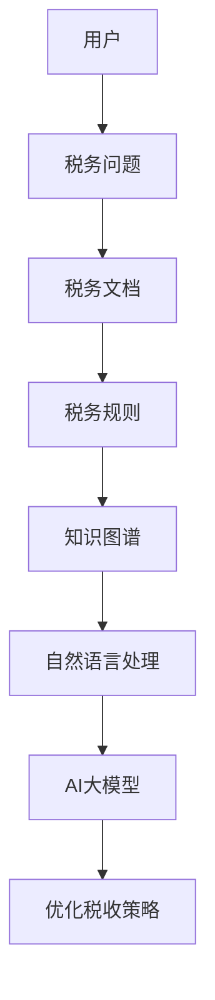

                 


# 构建企业级AI税务顾问：优化税收策略

## 关键词：AI税务顾问、税收优化、企业级系统、自然语言处理、知识图谱

## 摘要：  
企业级AI税务顾问通过整合人工智能、自然语言处理和知识图谱等技术，为企业提供智能化的税收优化策略。本文详细探讨了构建这一系统的核心概念、算法原理、系统架构及项目实战，旨在为企业提供高效的税务管理解决方案。

---

# 第1章: AI税务顾问的背景与应用

## 1.1 人工智能在税务领域的应用背景

### 1.1.1 税务咨询行业的现状与挑战
传统税务咨询依赖人工分析，效率低且易出错。企业需要实时的税收优化策略，但现有工具难以满足复杂需求。

### 1.1.2 人工智能技术在税务领域的优势
AI技术能够快速处理大量税务数据，提供精准的优化建议。自然语言处理（NLP）技术使系统能够解析复杂税务文档。

### 1.1.3 企业级AI税务顾问的定义与目标
企业级AI税务顾问是一种智能系统，利用AI技术为企业提供定制化的税收优化策略，目标是提高效率、降低风险并提升决策能力。

## 1.2 企业级AI税务顾问的技术基础

### 1.2.1 AI大模型在税务咨询中的应用
大模型能够理解上下文，生成符合税法的建议。例如，GPT-3.5可以用于生成税务报告。

### 1.2.2 自然语言处理技术在税务文档分析中的作用
NLP技术用于解析复杂的税务文档，提取关键信息，生成优化建议。例如，使用BERT模型进行文本分类。

### 1.2.3 知识图谱在税务规则推理中的应用
知识图谱整合税法条款，构建规则库，辅助系统进行推理。例如，构建企业所得税优惠政策的知识图谱。

## 1.3 企业级AI税务顾问的应用价值

### 1.3.1 提高税收策略优化效率
AI系统能够快速分析数据，提供优化建议，显著提高效率。

### 1.3.2 降低税务合规风险
通过实时分析，AI系统能够识别潜在风险，帮助企业避免税务问题。

### 1.3.3 提升企业财务决策能力
AI税务顾问提供数据驱动的建议，帮助企业做出更明智的财务决策。

## 1.4 本章小结
本章介绍了企业级AI税务顾问的背景、技术基础及其应用价值，为后续章节奠定了基础。

---

# 第2章: 核心概念的原理与联系

## 2.1 AI税务顾问的核心原理

### 2.1.1 大模型在税务咨询中的工作流程
1. 数据预处理：清洗和标注税务数据。
2. 模型训练：使用NLP模型进行训练。
3. 微调：针对税务领域进行优化。
4. 推理：生成优化策略。

### 2.1.2 自然语言处理的税务文档分析
NLP技术用于解析文档，提取关键信息。例如，使用分词技术处理税务报告。

### 2.1.3 知识图谱的税务规则推理
知识图谱整合税法条款，辅助系统进行推理。例如，构建企业所得税优惠政策的知识图谱。

## 2.2 核心概念的属性特征对比

### 2.2.1 AI大模型与传统税务咨询工具的对比
| 特性       | AI大模型                         | 传统工具                       |
|------------|----------------------------------|--------------------------------|
| 处理能力   | 高效，支持复杂问题               | 低效，仅支持简单查询           |
| 学习能力   | 可以自适应新数据                 | 无法自适应                     |

### 2.2.2 知识图谱与传统税务规则库的对比
| 特性       | 知识图谱                         | 传统规则库                   |
|------------|----------------------------------|--------------------------------|
| 结构化程度 | 高，支持语义推理                 | 低，仅支持关键字匹配         |

### 2.2.3 自然语言处理与传统文本分析的对比
| 特性       | 自然语言处理                     | 传统文本分析                 |
|------------|----------------------------------|--------------------------------|
| 理解深度   | 高，支持上下文理解               | 低，仅支持关键词提取         |

## 2.3 核心概念的ER实体关系图



## 2.4 本章小结
本章详细讲解了企业级AI税务顾问的核心原理和概念之间的关系，为后续章节的系统设计奠定了基础。

---

# 第3章: 大模型在税务咨询中的算法原理

## 3.1 大模型的训练与优化

### 3.1.1 数据预处理流程

1. 数据清洗：去除无关信息。
2. 数据标注：标注关键信息。
3. 数据分割：分为训练集、验证集和测试集。

### 3.1.2 模型训练的数学公式

损失函数：交叉熵损失函数
$$ \text{损失函数} = -\sum_{i=1}^{n} y_i \log(p_i) + (1 - y_i) \log(1 - p_i) $$

优化目标：最小化损失函数
$$ \min L = \text{损失函数} $$

### 3.1.3 模型微调

在预训练的基础上，使用税务领域数据进行微调。例如，使用少量标注数据进行迁移学习。

## 3.2 推理过程

### 3.2.1 推理步骤

1. 输入税务问题。
2. 模型生成初步建议。
3. 知识图谱验证建议的合法性。
4. 输出优化策略。

### 3.2.2 优化策略生成

系统根据知识图谱和NLP分析结果，生成优化策略。例如，生成企业所得税申报建议。

## 3.3 本章小结
本章详细讲解了大模型在税务咨询中的训练和推理过程，展示了如何通过算法优化实现高效的税收策略生成。

---

# 第4章: 系统架构设计与实现

## 4.1 系统设计思路

### 4.1.1 总体设计思路
系统分为数据处理、模型训练、推理引擎和知识库四个模块。

### 4.1.2 系统功能设计
- 数据处理模块：负责数据预处理。
- 模型训练模块：负责模型训练和微调。
- 推理引擎：负责生成优化策略。
- 知识库：存储税法条款和企业信息。

## 4.2 系统架构设计

### 4.2.1 系统架构图


### 4.2.2 接口设计
- 数据接口：提供数据输入和输出接口。
- 模型接口：提供训练和推理接口。
- 知识库接口：提供知识查询接口。

### 4.2.3 交互流程

1. 用户输入税务问题。
2. 数据处理模块接收请求。
3. 模型训练模块生成建议。
4. 知识库验证建议。
5. 推理引擎输出优化策略。

## 4.3 本章小结
本章详细讲解了系统架构设计，展示了如何通过模块化设计实现高效的税务咨询服务。

---

# 第5章: 项目实战

## 5.1 环境搭建

### 5.1.1 环境要求
- Python 3.8+
- PyTorch 1.9+
- Hugging Face Transformers库

### 5.1.2 安装依赖
```bash
pip install torch transformers
```

## 5.2 核心代码实现

### 5.2.1 数据预处理

```python
def preprocess_data(data):
    # 数据清洗
    cleaned_data = data.dropna()
    # 数据标注
    labeled_data = cleaned_data.apply(label_tax_document)
    # 数据分割
    train_data, val_data, test_data = split_dataset(labeled_data)
    return train_data, val_data, test_data
```

### 5.2.2 模型训练

```python
def train_model(train_data):
    model = AutoModelForSequenceClassification.from_pretrained('bert-base-uncased')
    optimizer = AdamW(model.parameters(), lr=2e-5)
    loss_fn = nn.CrossEntropyLoss()
    for epoch in range(num_epochs):
        for batch in train_loader:
            inputs, labels = batch
            outputs = model(**inputs)
            loss = loss_fn(outputs.logits, labels)
            loss.backward()
            optimizer.step()
    return model
```

### 5.2.3 优化策略生成

```python
def generate_strategy(question):
    inputs = tokenize(question)
    outputs = model(**inputs)
    predicted_label = outputs.logits.argmax().item()
    strategy = strategies[predicted_label]
    return strategy
```

## 5.3 项目小结
本章通过实际项目展示了如何构建企业级AI税务顾问，从环境搭建到代码实现，详细讲解了每个步骤的操作和实现细节。

---

# 第6章: 案例分析

## 6.1 案例背景

### 6.1.1 案例介绍
某企业需要优化增值税申报策略，使用企业级AI税务顾问进行分析。

## 6.2 需求分析

### 6.2.1 问题识别
识别增值税申报中的潜在风险和优化点。

## 6.3 方案设计

### 6.3.1 技术方案
使用NLP技术分析历史申报数据，生成优化建议。

## 6.4 实施步骤

### 6.4.1 数据分析
分析过去三年的申报数据，识别优化空间。

### 6.4.2 系统运行
运行AI税务顾问，生成优化建议。

### 6.4.3 结果分析
评估优化建议的效果，调整策略。

## 6.5 本章小结
本章通过实际案例展示了企业级AI税务顾问的应用，分析了需求、设计和实施步骤，帮助读者理解实际应用中的问题和解决方法。

---

# 第7章: 总结与展望

## 7.1 全文总结

### 7.1.1 核心内容回顾
企业级AI税务顾问利用AI技术，为企业提供高效的税收优化策略。

## 7.1.2 技术优势总结
AI技术提高了效率，降低了风险，提升了决策能力。

## 7.2 挑战与未来展望

### 7.2.1 当前挑战
- 数据隐私问题
- 模型可解释性
- 实时性要求

### 7.2.2 未来展望
- 更先进的NLP技术
- 更强大的知识图谱
- 更高效的推理算法

## 7.3 最佳实践 tips

### 7.3.1 实施建议
- 确保数据安全
- 定期更新模型
- 提供用户培训

### 7.3.2 注意事项
- 保护数据隐私
- 监控系统性能
- 定期评估效果

## 7.4 拓展阅读

### 7.4.1 推荐书籍
- 《深度学习》
- 《自然语言处理实战》

### 7.4.2 技术博客
- Hugging Face官方博客
- TensorFlow官方博客

## 7.5 本章小结
本章总结了全文内容，分析了当前挑战和未来展望，提供了最佳实践建议和拓展阅读资源。

---

# 结语

企业级AI税务顾问是人工智能技术在税务领域的应用，通过优化税收策略，帮助企业提高效率、降低风险。随着技术的进步，AI税务顾问将在未来发挥更大的作用。

---

