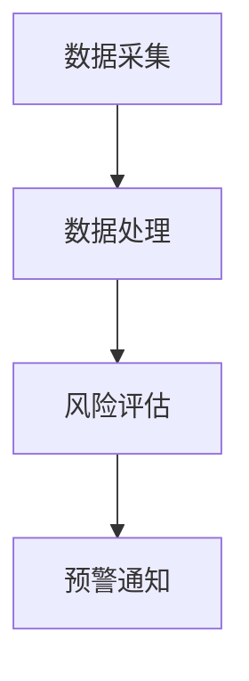
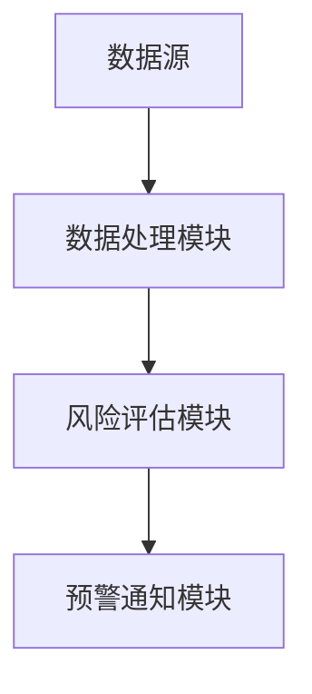

                 


# 构建企业级AI风控助手：实时监控与风险预警

## 关键词：AI风控助手, 风险监控, 实时预警, 企业级系统, 异常检测

## 摘要：本文详细探讨了如何构建一个企业级AI风控助手，实现对风险的实时监控与预警。从背景、核心概念、算法原理、系统架构到项目实战，文章全面分析了构建该系统的关键步骤与技术要点。通过本文，读者将能够理解并掌握如何利用AI技术提升企业的风险管理能力。

---

# 第1章: 企业级AI风控助手概述

## 1.1 问题背景与目标

### 1.1.1 风险监控的必要性
在企业运营中，风险无处不在。市场波动、操作失误、欺诈行为等都可能对企业造成重大损失。传统的风险管理依赖人工监控和事后处理，效率低且难以覆盖所有风险点。引入AI技术，可以实现实时监控和自动化预警，显著提升风险管理能力。

### 1.1.2 问题描述
企业在风险管理中面临以下挑战：
- 数据量大且复杂，难以实时处理。
- 风险因素多样，传统方法难以捕捉所有风险点。
- 灵活性不足，难以应对动态变化的市场环境。

### 1.1.3 解决思路
通过AI技术，构建一个实时监控和风险预警系统，能够：
- 自动采集和分析多源数据。
- 利用机器学习模型识别潜在风险。
- 实时触发预警并提供应对策略。

---

## 1.2 核心概念与联系

### 1.2.1 核心概念
- **数据流**：从数据源到处理模块再到模型输入的过程。
- **模型训练**：基于历史数据训练风险评估模型。
- **预警机制**：根据模型输出触发预警通知。

### 1.2.2 实体关系图（ER图）
```mermaid
er
  %% Enterprise AI Risk Monitoring System ER Diagram
  title 企业级AI风控系统实体关系图

  系统角色: System Role
  风险事件: Risk Event
  用户: User
  风险指标: Risk Indicator
  预警通知: Alert Notification

  系统角色 --|> 风险事件: 监控
  风险事件 --|> 风险指标: 包含
  风险指标 --|> 预警通知: 触发
  预警通知 --|> 用户: 通知
```

---

# 第2章: 时间序列分析与异常检测

## 2.1 时间序列分析基础

### 2.1.1 常见的时间序列模型
- **ARIMA**：自回归积分滑动模型。
- **LSTM**：长短期记忆网络。
- **Prophet**：基于时间序列分解的模型。

### 2.1.2 AI在时间序列分析中的应用
- 异常检测：识别数据中的异常点。
- 预测：预测未来的风险趋势。

---

## 2.2 异常检测算法原理

### 2.2.1 基于统计的方法
- Z-score：通过标准差检测异常。
- 热图分析：识别数据中的异常区域。

### 2.2.2 基于机器学习的方法
- Isolation Forest：隔离森林算法。
- One-Class SVM：单类支持向量机。

### 2.2.3 基于深度学习的方法
- Autoencoder：自编码器。
- GAN：生成对抗网络。

---

## 2.3 风险评估与预测模型

### 2.3.1 常见的风险评估模型
- 线性回归：预测风险值。
- logistic回归：分类风险等级。

### 2.3.2 基于AI的预测模型
- XGBoost：梯度提升树。
- Random Forest：随机森林。

---

## 2.4 本章小结

---

# 第3章: 企业级AI风控助手系统架构

## 3.1 系统功能模块设计

### 3.1.1 数据采集模块
- 实时采集数据。
- 数据预处理。

### 3.1.2 数据处理模块
- 数据清洗。
- 特征提取。

### 3.1.3 风险评估模块
- 模型训练。
- 风险预测。

### 3.1.4 预警通知模块
- 预警触发。
- 通知用户。

---

## 3.2 系统架构设计

### 3.2.1 分层架构设计


### 3.2.2 微服务架构设计
```mermaid
service architecture
    service1 --> service2
    service2 --> service3
    service3 --> service4
```

---

## 3.3 数据流与实体关系设计

### 3.3.1 数据流图


---

# 第4章: 项目实战：构建企业级AI风控助手

## 4.1 环境搭建与工具安装

### 4.1.1 Python环境配置
- 安装Python和pip。
- 安装所需的库：pandas、numpy、scikit-learn、tensorflow。

---

## 4.2 核心功能实现

### 4.2.1 数据采集与预处理
```python
import pandas as pd
data = pd.read_csv('risk_data.csv')
data.head()
```

---

## 4.2.2 风险评估模型训练
```python
from sklearn.ensemble import RandomForestClassifier
model = RandomForestClassifier()
model.fit(X_train, y_train)
```

---

## 4.2.3 预警通知实现
```python
import smtplib
from email.mime.text import MIMEText
msg = MIMEText('风险预警：检测到潜在风险，请及时处理。', 'plain', 'utf-8')
msg['Subject'] = '风险预警通知'
msg['From'] = 'admin@example.com'
msg['To'] = 'alert@example.com'
s = smtplib.SMTP('smtp.example.com', 587)
s.sendmail(msg)
```

---

## 4.3 本章小结

---

# 第5章: 最佳实践与总结

## 5.1 小结
- 介绍了企业级AI风控助手的构建过程。
- 推荐了相关的工具和技术。

## 5.2 注意事项
- 数据隐私保护。
- 模型的可解释性。
- 系统的可扩展性。

## 5.3 拓展阅读
- 《机器学习实战》。
- 《深度学习入门》。

---

# 结语

通过本文的详细讲解，读者可以系统地了解如何构建一个企业级AI风控助手，实现实时监控与风险预警。希望本文能够为企业的风险管理提供有价值的参考和指导。

