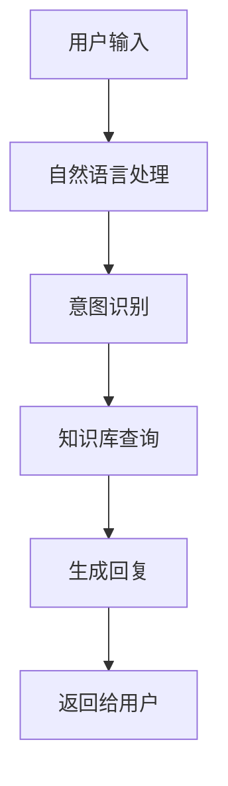
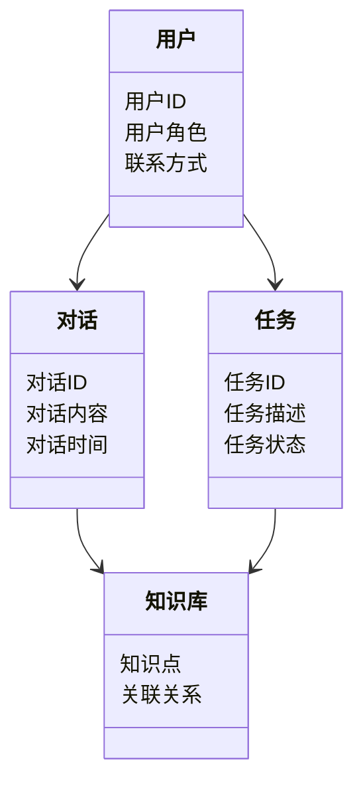
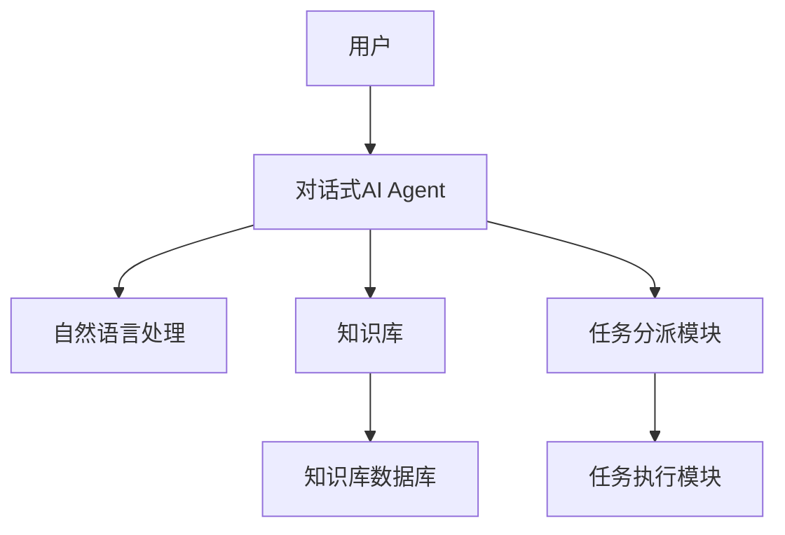
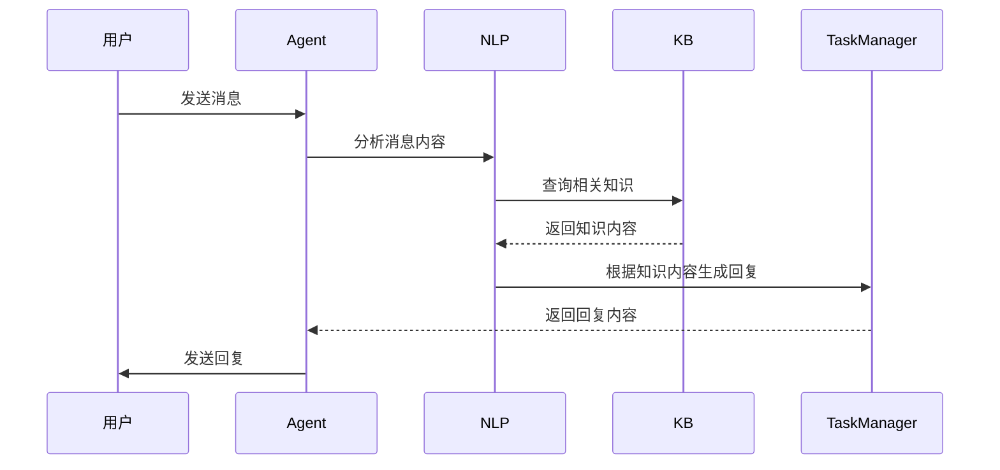

                 


# 构建企业级对话式AI Agent：提升内部沟通效率

> 关键词：企业级对话式AI Agent，内部沟通效率，自然语言处理，知识图谱，对话系统，系统架构设计

> 摘要：随着企业规模的不断扩大，内部沟通效率成为影响企业发展的关键因素。本文详细探讨了构建企业级对话式AI Agent的核心原理、系统架构设计、算法实现以及实际应用案例，为企业提升内部沟通效率提供了系统化的解决方案。

---

# 第一部分：企业级对话式AI Agent概述

## 第1章：背景介绍

### 1.1 问题背景

#### 1.1.1 企业内部沟通效率的痛点
企业在快速发展过程中，内部沟通效率低下成为制约企业发展的关键问题。传统沟通工具（如邮件、即时通讯工具）存在以下痛点：
- **信息冗余**：信息分散在不同工具中，难以快速检索和共享。
- **响应延迟**：人工处理请求耗时较长，难以满足高效沟通需求。
- **知识孤岛**：员工无法快速获取所需的知识和信息，导致工作效率下降。

#### 1.1.2 对话式AI的出现与发展趋势
随着人工智能技术的快速发展，对话式AI技术逐渐成熟，为企业提供了新的解决方案。企业级对话式AI Agent可以通过自然语言处理技术，实现智能化的信息检索、任务分派和知识共享。

#### 1.1.3 企业级AI Agent的核心价值
企业级对话式AI Agent的核心价值在于：
- **提升沟通效率**：通过自动化处理常见问题，减少人工干预。
- **降低沟通成本**：智能化分派任务，优化资源配置。
- **增强知识共享**：通过知识图谱实现信息快速检索和传递。

### 1.2 问题描述

#### 1.2.1 传统沟通工具的局限性
传统沟通工具主要依赖人工操作，存在以下问题：
- **信息分散**：员工需要在多个工具之间切换，效率低下。
- **缺乏智能支持**：无法自动识别任务优先级和关键信息。
- **知识传递不畅**：难以快速找到所需的知识和经验。

#### 1.2.2 信息孤岛对企业效率的影响
信息孤岛导致以下问题：
- **重复劳动**：员工需要多次查找相同信息。
- **决策延迟**：关键信息无法快速传递，影响决策效率。
- **团队协作困难**：不同部门之间信息不透明，协作效率降低。

#### 1.2.3 对话式AI在企业场景中的应用潜力
对话式AI在企业场景中的应用潜力主要体现在：
- **智能化信息检索**：通过自然语言处理技术快速定位信息。
- **自动化任务分派**：根据对话内容自动触发相关任务。
- **知识共享与传承**：通过知识图谱实现企业知识的高效传递。

### 1.3 问题解决

#### 1.3.1 对话式AI Agent的定义与目标
对话式AI Agent的定义：一种基于自然语言处理技术，能够理解和生成人类语言的智能化对话系统。其目标是通过自动化处理对话内容，提升企业内部沟通效率。

#### 1.3.2 企业级AI Agent的功能定位
企业级AI Agent的功能定位包括：
- **信息检索**：快速定位和返回所需信息。
- **任务分派**：根据对话内容自动分派任务。
- **知识共享**：通过知识图谱实现企业知识的高效传递。
- **实时反馈**：提供对话内容的实时反馈和建议。

#### 1.3.3 解决企业内部沟通效率的核心思路
解决企业内部沟通效率的核心思路是：
- **智能化对话处理**：通过自然语言处理技术实现对话的自动化处理。
- **知识图谱构建**：建立企业知识库，支持快速信息检索。
- **任务自动化**：根据对话内容自动触发相关任务。

### 1.4 边界与外延

#### 1.4.1 对话式AI Agent的应用边界
对话式AI Agent的应用边界包括：
- **对话内容的深度**：目前主要适用于浅层对话，复杂任务仍需人工干预。
- **数据隐私**：需要确保对话内容和企业数据的安全性。
- **系统性能**：对实时性和响应速度有较高要求。

#### 1.4.2 与传统客服系统的区别
与传统客服系统的区别主要体现在：
- **智能化程度**：对话式AI Agent具有更强的自动化能力。
- **应用场景**：对话式AI Agent适用于企业内部沟通，而传统客服系统主要面向外部用户。

#### 1.4.3 与其他企业级AI工具的对比
与其他企业级AI工具的对比：
- **目标不同**：对话式AI Agent专注于对话处理，其他工具可能侧重于数据分析或流程优化。
- **交互方式**：对话式AI Agent通过自然语言处理实现人机交互，其他工具可能采用图形界面或命令行方式。

### 1.5 概念结构与核心要素

#### 1.5.1 对话式AI Agent的核心要素
对话式AI Agent的核心要素包括：
- **自然语言处理引擎**：负责对话内容的理解和生成。
- **知识图谱**：支持信息的快速检索和关联。
- **任务分派引擎**：根据对话内容自动触发相关任务。
- **对话历史记录**：记录和管理对话内容，支持后续分析。

#### 1.5.2 功能模块的划分与交互流程
功能模块划分与交互流程如下：
1. 用户发起对话请求。
2. 对话式AI Agent通过自然语言处理理解对话内容。
3. 根据理解的内容，查询知识图谱获取相关信息。
4. 根据任务分派规则，自动触发相关任务。
5. 将处理结果反馈给用户。

#### 1.5.3 系统架构的初步框架
系统架构的初步框架包括：
- **前端界面**：用户与AI Agent交互的界面。
- **对话处理模块**：负责对话内容的理解和生成。
- **知识图谱模块**：支持信息的快速检索和关联。
- **任务分派模块**：根据对话内容自动触发相关任务。
- **后端服务**：支持系统的运行和数据存储。

---

## 第2章：对话式AI Agent的核心概念与联系

### 2.1 核心概念原理

#### 2.1.1 对话式AI的实现原理
对话式AI的实现原理主要包括：
- **自然语言理解（NLU）**：通过词法分析、句法分析和语义理解技术，理解对话内容。
- **对话管理（DM）**：根据对话历史和上下文，生成合适的回复。
- **自然语言生成（NLG）**：根据对话内容生成自然流畅的回复。

#### 2.1.2 自然语言处理（NLP）的作用
自然语言处理在对话式AI中的作用包括：
- **信息提取**：从对话中提取关键信息。
- **意图识别**：识别用户的意图和需求。
- **实体识别**：识别对话中的实体信息。

#### 2.1.3 知识图谱在对话中的应用
知识图谱在对话中的应用包括：
- **信息检索**：通过知识图谱快速定位相关信息。
- **关联推理**：根据知识图谱进行关联推理，提供更准确的回复。
- **知识共享**：通过知识图谱实现企业知识的高效传递。

### 2.2 概念属性特征对比

#### 2.2.1 对话式AI Agent与传统聊天机器人的对比
对话式AI Agent与传统聊天机器人的对比：

| 对比维度 | 对话式AI Agent | 传统聊天机器人 |
|----------|----------------|-----------------|
| 智能化程度 | 高 | 低 |
| 应用场景 | 企业内部沟通 | 外部客户服务 |
| 功能定位 | 提升沟通效率 | 提供信息服务 |

#### 2.2.2 不同企业级AI工具的特性分析
不同企业级AI工具的特性分析：

| 工具类型 | 对话式AI Agent | 数据分析工具 | 流程优化工具 |
|----------|----------------|---------------|---------------|
| 核心功能 | 智能对话处理 | 数据分析 | 流程优化 |
| 交互方式 | 自然语言对话 | 图形界面 | 命令行 |
| 应用场景 | 企业内部沟通 | 数据处理 | 流程优化 |

### 2.3 ER实体关系图

```mermaid
er
  actor: 用户
  agent: 对话式AI Agent
  message: 消息
  knowledge_base: 知识库
  interaction: 交互记录
  relation: 关联关系
  actor -|创建| message
  message -|查询| knowledge_base
  agent -|处理| message
  interaction -|记录| message
  knowledge_base -|关联| relation
```

---

## 第3章：对话式AI Agent的算法原理

### 3.1 算法原理概述

#### 3.1.1 基于规则的对话管理
基于规则的对话管理是一种简单有效的对话管理方法，适用于任务简单、规则明确的场景。

#### 3.1.2 基于统计的对话模型
基于统计的对话模型通过统计学习方法，从大量对话数据中学习对话模式，生成合适的回复。

#### 3.1.3 基于深度学习的对话生成
基于深度学习的对话生成通过预训练语言模型（如GPT）生成自然流畅的对话内容。

### 3.2 算法流程图



### 3.3 数学模型与公式

#### 3.3.1 概率模型
概率模型用于意图识别和实体识别，公式如下：
$$ P(\text{intent} | \text{message}) = \frac{P(\text{message} | \text{intent}) \cdot P(\text{intent})}{P(\text{message})} $$

#### 3.3.2 优化算法
优化算法用于模型训练，公式如下：
$$ \text{loss} = -\sum_{i=1}^{n} \log P(y_i | x_i) $$
$$ \theta = \theta - \eta \cdot \frac{\partial \text{loss}}{\partial \theta} $$

---

## 第4章：系统分析与架构设计

### 4.1 系统功能设计

#### 4.1.1 领域模型
领域模型用于描述系统的核心功能模块，如下：
- **用户模块**：管理用户信息。
- **对话模块**：处理对话内容。
- **知识库模块**：存储和管理知识图谱。
- **任务分派模块**：根据对话内容分派任务。

#### 4.1.2 领域模型类图



### 4.2 系统架构设计

#### 4.2.1 系统架构图



### 4.3 系统接口设计

#### 4.3.1 API接口定义
API接口定义如下：
- **POST /api/message**：接收用户消息，返回处理结果。
- **GET /api/knowledge**：根据查询条件，返回相关知识。
- **POST /api/task**：根据任务描述，分派任务。

#### 4.3.2 API接口示例

```python
import requests

# 发送消息
response = requests.post(
    "http://localhost:8000/api/message",
    json={"message": "我需要查询2023年销售数据"}
)
print(response.json())

# 查询知识库
response = requests.get(
    "http://localhost:8000/api/knowledge",
    params={"keyword": "销售数据"}
)
print(response.json())

# 分派任务
response = requests.post(
    "http://localhost:8000/api/task",
    json={"task": "生成销售报告"}
)
print(response.json())
```

### 4.4 系统交互流程

#### 4.4.1 系统交互序列图



---

## 第5章：项目实战

### 5.1 环境安装

#### 5.1.1 安装Python环境
```bash
python -m pip install --upgrade pip
pip install python-dotenv
pip install requests
pip install mermaid
```

#### 5.1.2 安装对话式AI Agent
```bash
git clone https://github.com/yourusername/enterprise-ai-agent.git
cd enterprise-ai-agent
pip install -r requirements.txt
```

### 5.2 系统核心实现源代码

#### 5.2.1 对话处理模块

```python
import requests

def send_message(message):
    response = requests.post(
        "http://localhost:8000/api/message",
        json={"message": message}
    )
    return response.json()

def get_knowledge(keyword):
    response = requests.get(
        "http://localhost:8000/api/knowledge",
        params={"keyword": keyword}
    )
    return response.json()

def dispatch_task(task):
    response = requests.post(
        "http://localhost:8000/api/task",
        json={"task": task}
    )
    return response.json()
```

#### 5.2.2 知识图谱模块

```python
from py2neo import Graph, Node, Relationship

graph = Graph("http://localhost:7474", auth=("neo4j", "password"))

def create_knowledge(node1, relationship, node2):
    n1 = Node(node1['label'], **node1['properties'])
    n2 = Node(node2['label'], **node2['properties'])
    r = Relationship(n1, relationship, n2)
    graph.create(r)

def query_knowledge(keyword):
    results = graph.run(
        "MATCH (a {name: $keyword}) "
        "RETURN a"
    , keyword=keyword)
    return list(results)
```

### 5.3 实际案例分析

#### 5.3.1 案例背景
某企业希望利用对话式AI Agent实现内部沟通效率的提升，主要需求包括：
- **信息快速检索**：员工可以通过对话快速找到所需知识。
- **任务自动化**：对话式AI Agent可以根据对话内容自动分派任务。
- **知识共享**：通过知识图谱实现企业知识的高效传递。

#### 5.3.2 案例实现步骤
1. **知识图谱构建**：收集和整理企业知识，构建知识图谱。
2. **对话系统开发**：开发对话式AI Agent，实现信息检索和任务分派功能。
3. **系统集成**：将对话式AI Agent与企业现有系统集成，实现无缝对接。

#### 5.3.3 实施效果
实施效果包括：
- **沟通效率提升**：对话式AI Agent能够快速处理常见问题，减少人工干预。
- **知识共享增强**：通过知识图谱实现企业知识的高效传递。
- **任务自动化**：对话式AI Agent可以根据对话内容自动分派任务，提升工作效率。

---

## 第6章：总结与展望

### 6.1 最佳实践

#### 6.1.1 对话式AI Agent的使用建议
- **数据隐私保护**：确保对话内容和企业数据的安全性。
- **知识图谱优化**：定期更新和优化知识图谱，确保信息的准确性。
- **任务分派规则**：根据企业需求制定合理的任务分派规则。

#### 6.1.2 小结
对话式AI Agent通过智能化对话处理和知识共享，能够有效提升企业内部沟通效率。在实际应用中，需要结合企业的具体需求，制定合理的实施策略。

#### 6.1.3 注意事项
- **数据安全**：确保对话内容和企业数据的安全性。
- **系统性能**：对话式AI Agent需要具备较高的实时性和响应速度。
- **用户体验**：设计良好的用户界面，提升用户体验。

### 6.2 拓展阅读

#### 6.2.1 推荐书籍
- 《自然语言处理实战：基于Python的深度学习方法》
- 《知识图谱：概念、方法与应用》

#### 6.2.2 推荐技术博客
- [Towards Data Science](https://towardsdatascience.com/)
- [Medium - AI专栏](https://medium.com/ai)

---

通过构建企业级对话式AI Agent，企业可以显著提升内部沟通效率，优化资源配置，实现更高效的内部管理。对话式AI Agent的应用前景广阔，随着技术的不断进步，其在企业中的应用将更加广泛和深入。

