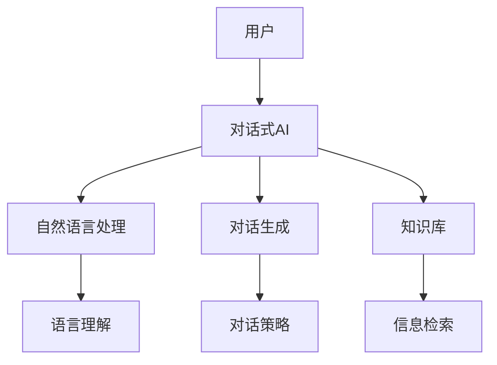
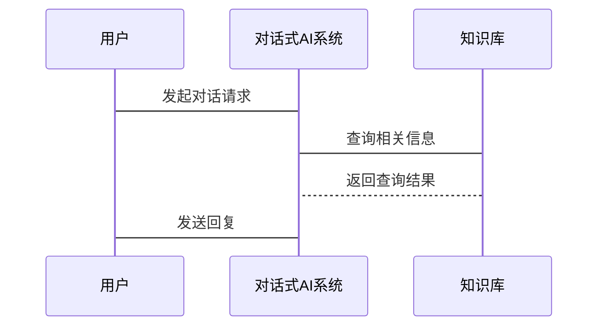

                 


```markdown
# 构建企业级对话式AI：提升内部沟通效率

> 关键词：企业级对话式AI，内部沟通效率，自然语言处理，深度学习，系统架构设计

> 摘要：本文详细探讨了构建企业级对话式AI系统的各个方面，从背景分析到技术实现，再到实际应用，旨在为企业提供提升内部沟通效率的有效解决方案。通过自然语言处理和深度学习技术，结合企业级系统架构设计，本文展示了如何构建一个高效、智能的对话式AI系统，以满足企业在内部沟通中的多样化需求。

---

# 第一部分: 企业级对话式AI的背景与核心概念

## 第1章: 企业级对话式AI的背景与问题背景

### 1.1 问题背景

#### 1.1.1 企业内部沟通效率的痛点
企业内部沟通效率低下是一个长期存在的问题。传统的企业沟通工具如邮件、即时通讯工具等，存在信息分散、响应速度慢、信息检索困难等问题，导致员工工作效率低下。

#### 1.1.2 对话式AI的定义与目标
对话式AI是一种能够理解和生成自然语言的智能系统，旨在通过提供实时、智能的对话支持，提升企业内部沟通效率，减少重复性工作，提高员工生产力。

#### 1.1.3 企业级对话式AI的应用场景
企业级对话式AI可以应用于内部员工咨询、信息查询、任务分配、知识共享等多个场景，帮助员工更快地解决问题，提升整体工作效率。

### 1.2 问题描述

#### 1.2.1 传统企业沟通工具的局限性
传统的企业沟通工具存在以下问题：
- 信息分散：员工需要在多个工具中查找信息，效率低下。
- 响应速度慢：邮件等工具的响应速度较慢，尤其是在处理复杂问题时。
- 缺乏智能性：无法自动理解和解决常见问题，需要人工干预。

#### 1.2.2 对话式AI在企业内部沟通中的角色
对话式AI作为企业内部的智能助手，可以实时响应员工的需求，提供快速、准确的信息检索和问题解决支持，帮助员工更高效地完成工作任务。

#### 1.2.3 企业级对话式AI的核心目标
- 提升内部沟通效率：通过自动化处理常见问题，减少人工干预。
- 提高员工生产力：员工可以更快地获取所需信息，减少时间浪费。
- 优化企业知识管理：整合企业知识库，提升对话的准确性和深度。

### 1.3 问题解决

#### 1.3.1 对话式AI如何提升沟通效率
- 自动化处理：通过对话式AI自动处理常见问题，减少人工干预。
- 实时响应：提供实时对话支持，快速响应员工需求。
- 智能检索：基于自然语言处理技术，快速检索企业知识库中的信息。

#### 1.3.2 企业级对话式AI的技术实现路径
- 引入自然语言处理技术，提升对话系统的理解和生成能力。
- 构建企业级知识库，整合企业内部信息资源。
- 设计高效的对话管理机制，确保对话的连贯性和准确性。

#### 1.3.3 对话式AI在企业内部的知识管理与协作
- 知识整合：将企业内部的知识库与对话式AI系统结合，提升对话的准确性。
- 协作支持：通过对话式AI辅助员工协作，优化工作流程。

### 1.4 边界与外延

#### 1.4.1 对话式AI的适用范围与限制
- 适用范围：适用于企业内部员工之间的沟通与协作。
- 限制：目前无法处理复杂决策问题，需要人工干预。

#### 1.4.2 与其他企业级工具的协同关系
- 协同关系：与ERP、CRM等系统集成，形成完整的生态系统。

#### 1.4.3 对话式AI的未来发展与可能性
- 未来发展：随着技术进步，对话式AI将更加智能化和个性化。

### 1.5 概念结构与核心要素

#### 1.5.1 对话式AI的核心要素分析
- 自然语言处理：理解用户输入。
- 对话生成：生成自然语言回复。
- 知识库：存储企业信息。

#### 1.5.2 企业级对话式AI的系统架构
- 分层架构：数据层、业务逻辑层、API接口层。
- 关键模块：用户界面、对话管理、知识库。

#### 1.5.3 对话式AI与企业业务流程的结合
- 业务流程优化：通过对话式AI优化企业内部流程。
- 个性化服务：根据员工需求提供个性化支持。

## 第2章: 对话式AI的核心概念与技术原理

### 2.1 对话式AI的定义与分类

#### 2.1.1 对话式AI的定义
对话式AI是一种能够理解和生成自然语言的智能系统，通过模拟人类对话方式，提供实时、智能的对话支持。

#### 2.1.2 对话式AI的主要分类
- 基于规则的系统：通过预定义规则处理对话。
- 基于统计的系统：利用统计模型生成回复。
- 基于深度学习的系统：使用神经网络模型进行对话生成。

#### 2.1.3 企业级对话式AI的特点
- 高可用性：确保系统稳定运行。
- 安全性：保护企业数据安全。
- 可扩展性：支持企业规模扩展。

### 2.2 对话式AI的工作原理

#### 2.2.1 自然语言处理（NLP）基础
- 分词：将文本分割成词语或短语。
- 语法分析：分析句子的语法结构。
- 实体识别：识别文本中的实体。

#### 2.2.2 对话生成机制
- 序列到序列模型：编码器-解码器结构。
- 注意力机制：提升上下文理解能力。

#### 2.2.3 对话上下文管理
- 保持对话连贯性。
- 处理多轮对话。

### 2.3 对话式AI的核心技术

#### 2.3.1 语言模型
- 用于理解和生成语言。
- 常见模型：BERT、GPT。

#### 2.3.2 对话管理
- 定义对话流程。
- 处理用户输入。

#### 2.3.3 知识库与检索
- 存储企业信息。
- 快速检索信息。

### 2.4 对话式AI的实体关系图


---

# 第二部分: 对话式AI的算法原理

## 第3章: 对话式AI的算法原理

### 3.1 对话式AI的数学模型

#### 3.1.1 语言模型的训练
- 使用深度学习模型，如Transformer。
- 损失函数：交叉熵损失。
- 优化算法：Adam优化器。

#### 3.1.2 对话生成机制
- 序列到序列模型：编码器-解码器结构。
- 注意力机制：提升上下文理解能力。

### 3.2 对话式AI的代码实现

#### 3.2.1 环境安装
- 安装Python 3.8及以上版本。
- 安装TensorFlow、Keras、Flask等依赖包。

#### 3.2.2 代码示例
```python
import tensorflow as tf
from tensorflow.keras.layers import Input, LSTM, Dense
from tensorflow.keras.models import Model

# 定义编码器
encoder_input = Input(shape=(None, 128))
encoder_lstm = LSTM(128)(encoder_input)
encoder_output = Dense(128, activation='relu')(encoder_lstm)

# 定义解码器
decoder_input = Input(shape=(None, 128))
decoder_lstm = LSTM(128)(decoder_input)
decoder_output = Dense(128, activation='softmax')(decoder_lstm)

# 组合模型
model = Model(inputs=[encoder_input, decoder_input], outputs=decoder_output)
model.compile(optimizer='adam', loss='sparse_categorical_crossentropy')
```

#### 3.2.3 代码解读
- 编码器：将输入序列编码为固定长度的向量。
- 解码器：基于编码器输出生成回复。
- 模型训练：使用训练数据进行训练，优化模型参数。

### 3.3 对话式AI的系统架构

#### 3.3.1 系统架构设计
- 分层架构：数据层、业务逻辑层、API接口层。
- 数据库设计：关系型数据库，存储用户信息、对话记录等。

#### 3.3.2 接口设计
- RESTful API：定义清晰的接口规范，便于与其他系统集成。
- 交互流程：用户发起请求，系统处理并返回结果。

#### 3.3.3 交互流程图


---

# 第三部分: 项目实战

## 第4章: 项目实战

### 4.1 环境安装

#### 4.1.1 安装Python
- 安装Python 3.8及以上版本。

#### 4.1.2 安装依赖包
```bash
pip install tensorflow==2.5.0 keras==2.5.0 flask==2.0.1
```

### 4.2 核心代码实现

#### 4.2.1 数据预处理
- 清洗数据：去除噪声数据。
- 标注数据：标注对话的开始和结束。

#### 4.2.2 模型训练
- 使用预处理后的数据训练对话生成模型。
- 定义损失函数和优化器。

#### 4.2.3 API开发
- 实现RESTful API，提供对话接口。
- 定义请求和响应格式。

### 4.3 案例分析

#### 4.3.1 案例背景
- 某企业希望构建内部对话式AI系统，用于员工信息查询。

#### 4.3.2 案例实现
- 数据预处理：清洗和标注对话数据。
- 模型训练：训练对话生成模型。
- API开发：实现对话接口。

#### 4.3.3 案例分析
- 系统性能：响应时间、准确率。
- 用户反馈：用户体验、功能完善性。

### 4.4 项目小结

#### 4.4.1 项目总结
- 成功构建企业级对话式AI系统。
- 提升了内部沟通效率。

#### 4.4.2 经验教训
- 数据质量对系统性能的影响。
- 模型调优的重要性。

---

# 第四部分: 最佳实践

## 第5章: 最佳实践

### 5.1 小结

#### 5.1.1 核心内容回顾
- 企业级对话式AI的背景与核心概念。
- 对话式AI的算法原理。
- 项目实战与系统架构设计。

### 5.2 注意事项

#### 5.2.1 数据隐私
- 确保内部数据的安全性。
- 遵守数据隐私保护法规。

#### 5.2.2 系统稳定性
- 保证系统的高可用性。
- 定期进行系统维护。

#### 5.2.3 用户体验
- 设计友好、直观的交互界面。
- 提供多语言支持。

### 5.3 拓展阅读

#### 5.3.1 推荐书籍
- 《深度学习》（Deep Learning）—— Ian Goodfellow 等著。
- 《自然语言处理入门》——Jurafsky 和 Martin 著。

#### 5.3.2 在线资源
- TensorFlow官方文档：https://www.tensorflow.org
- Keras官方文档：https://keras.io
- 自然语言处理相关博客和开源项目。

---

# 总结

通过本文的详细探讨，我们了解了构建企业级对话式AI系统的各个方面，从背景分析到技术实现，再到实际应用。通过自然语言处理和深度学习技术，结合企业级系统架构设计，我们可以构建一个高效、智能的对话式AI系统，以满足企业在内部沟通中的多样化需求。未来，随着技术的不断发展，对话式AI将在企业内部发挥更大的作用，为企业创造更多的价值。
```

