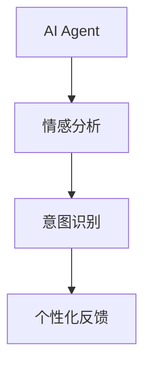
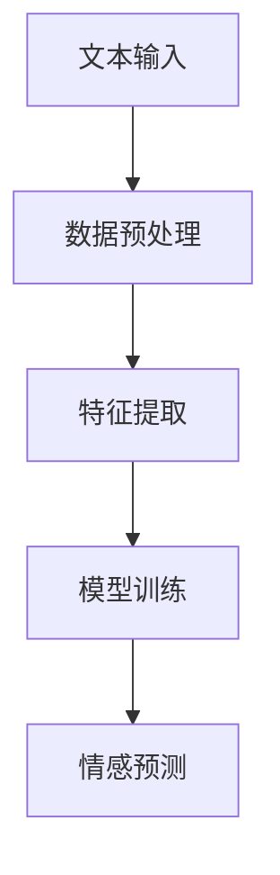
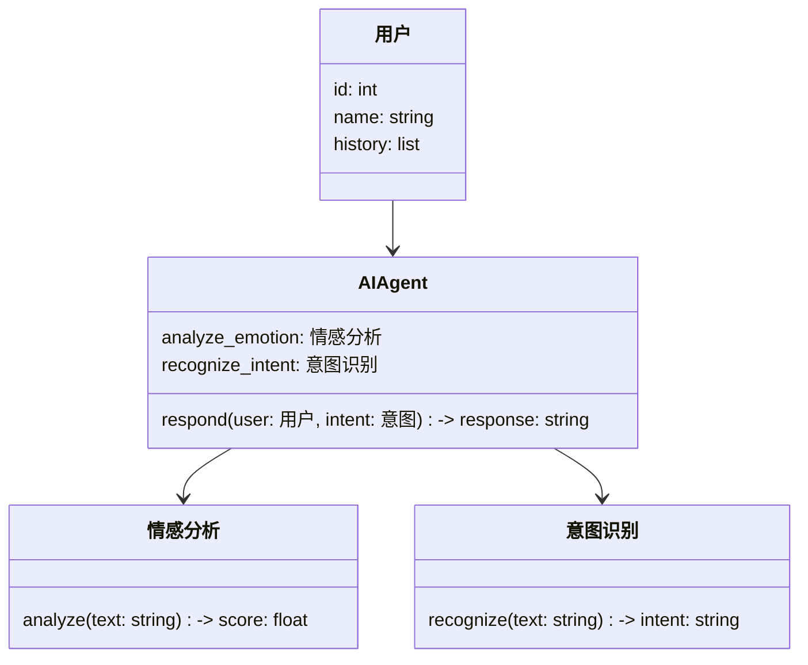
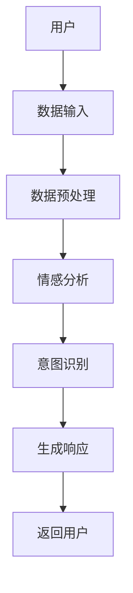
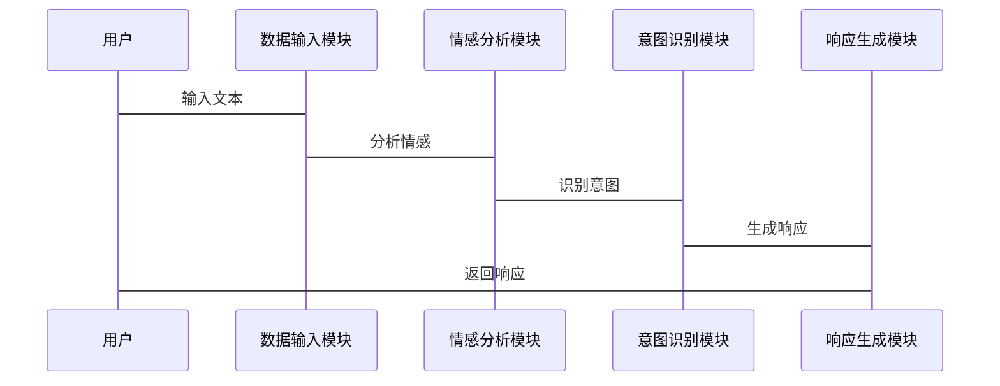

                 


# 构建具有同理心的AI Agent交互系统

> 关键词：AI Agent，同理心，情感分析，意图识别，人机交互，系统设计

> 摘要：本文探讨如何构建一个具有同理心的AI Agent交互系统，通过分析同理心在人机交互中的重要性，结合情感分析和意图识别算法，设计并实现一个能够理解用户情感和需求的AI Agent系统。

---

## 第1章：引言

### 1.1 背景介绍

在人工智能技术迅速发展的今天，AI Agent（智能体）已经广泛应用于各个领域，如智能助手、聊天机器人、智能家居等。然而，现有的AI Agent交互系统往往缺乏对用户情感和需求的深度理解，导致用户体验不佳。如何让AI Agent具备“同理心”，即能够理解并共情用户的情感和需求，成为当前研究的重要方向。

**同理心**是指个体能够理解并分享他人情感状态的能力。在人机交互中，赋予AI Agent同理心意味着系统能够通过用户的语言、语气、行为等信息，推断出用户的情感状态和潜在需求，从而提供更加贴心和个性化的服务。

### 1.2 问题背景与目标

#### 问题背景
- 当前AI Agent交互系统主要依赖关键词匹配和规则引擎，难以处理复杂的情感需求。
- 用户在与AI Agent交互时，常常感到被忽视或误解，导致体验差。
- 情感分析和意图识别技术尚未完全成熟，难以实现精准的情感理解。

#### 问题解决
- 通过引入情感分析和意图识别技术，提升AI Agent对用户情感和需求的理解能力。
- 构建一个能够实时感知用户情感状态，并根据情感反馈调整交互策略的系统。

#### 目标
- 实现一个具有同理心的AI Agent交互系统，能够理解用户情感和需求。
- 提供个性化、贴心的交互体验，提升用户满意度。

---

## 第2章：同理心与AI Agent的核心概念

### 2.1 同理心的定义与特征

#### 定义
同理心是指个体能够理解和分享他人情感状态的能力。在人机交互中，同理心意味着AI Agent能够通过分析用户的行为、语言和情感，推断出用户的需求和情感状态。

#### 特征
- **情感感知**：能够识别和理解用户的情感状态。
- **需求推理**：能够根据情感信息推断出用户的需求。
- **个性化反馈**：能够根据情感信息生成个性化的交互反馈。

### 2.2 AI Agent的基本原理

#### 定义
AI Agent是一种能够感知环境、自主决策并执行任务的智能实体。它可以是一个软件程序、机器人或其他智能设备。

#### 分类
- **简单反射型Agent**：基于预设规则进行简单响应。
- **基于模型的反射型Agent**：基于环境模型进行决策。
- **目标驱动型Agent**：基于目标进行自主决策。
- **效用驱动型Agent**：基于效用函数进行优化决策。

#### 核心要素
- **感知**：通过传感器或数据接口获取环境信息。
- **推理**：通过算法对信息进行处理和分析。
- **决策**：基于推理结果做出决策。
- **执行**：根据决策执行具体操作。

### 2.3 同理心与AI Agent的关系

#### 同理心在AI Agent中的作用
- 提升用户体验：通过理解用户情感和需求，提供更加贴心的服务。
- 增强交互效果：通过情感反馈优化交互流程，提高用户满意度。
- 扩展应用领域：在教育、医疗、客服等领域，同理心AI Agent能够提供更优质的服务。

#### 同理心与AI Agent的关系图



---

## 第3章：情感分析算法

### 3.1 情感分析的基本原理

#### 定义
情感分析是一种通过分析文本内容，判断文本情感倾向（如正面、负面、中性）的技术。

#### 常见方法
- **基于规则的方法**：通过预设情感词典匹配关键词。
- **机器学习方法**：使用特征工程和分类算法（如SVM、随机森林）进行训练。
- **深度学习方法**：使用神经网络（如LSTM、BERT）进行情感分析。

#### 情感分析的流程



### 3.2 情感分析的实现步骤

#### 数据预处理
- 分词：将文本分割成词语或短语。
- 去停用词：移除无意义的词汇（如“的”、“了”等）。
- 词干提取：将词汇转换为词干形式。

#### 模型训练
- 选择模型：如LSTM、BERT等。
- 数据标注：将文本分为正面、负面、中性三类。
- 训练模型：使用训练数据训练情感分析模型。

#### 结果评估
- 准确率：正确预测的情感数量占总数量的比例。
- 召回率：正确预测的情感数量占实际情感数量的比例。
- F1分数：准确率和召回率的调和平均数。

### 3.3 情感分析的数学模型

#### 情感得分计算公式
$$\text{score} = \sum_{i=1}^{n} w_i \times x_i$$

其中：
- $w_i$ 是第$i$个情感词的权重。
- $x_i$ 是第$i$个情感词的出现次数。

#### 情感分类模型
使用深度学习模型（如BERT）进行情感分类的损失函数：
$$\text{loss} = -\sum_{i=1}^{m} y_i \log(p_i) + (1 - y_i) \log(1 - p_i)$$

其中：
- $y_i$ 是真实标签（0或1）。
- $p_i$ 是模型预测的概率。

---

## 第4章：意图识别算法

### 4.1 意图识别的基本原理

#### 定义
意图识别是通过分析用户输入，推断用户的意图或目标。

#### 常见方法
- **基于关键词的意图识别**：通过匹配关键词推断意图。
- **基于规则的意图识别**：通过预设规则匹配用户输入。
- **基于机器学习的意图识别**：使用分类算法（如SVM、随机森林）训练意图识别模型。

### 4.2 意图识别的实现步骤

#### 数据预处理
- 分词：将文本分割成词语或短语。
- 去停用词：移除无意义的词汇。
- 词干提取：将词汇转换为词干形式。

#### 模型训练
- 选择模型：如SVM、随机森林等。
- 数据标注：将文本分为不同的意图类别。
- 训练模型：使用训练数据训练意图识别模型。

#### 结果评估
- 准确率：正确预测的意图数量占总数量的比例。
- 召回率：正确预测的意图数量占实际意图数量的比例。
- F1分数：准确率和召回率的调和平均数。

### 4.3 意图识别的数学模型

#### 意图分类模型
使用随机森林进行意图分类的损失函数：
$$\text{loss} = \sum_{i=1}^{m} \sum_{j=1}^{n} y_{ij} \log(p_{ij})$$

其中：
- $y_{ij}$ 是真实标签（0或1）。
- $p_{ij}$ 是模型预测的概率。

---

## 第5章：系统架构设计

### 5.1 问题场景介绍

假设我们正在设计一个智能客服系统，用户通过文本或语音与AI Agent交互，希望能够解决用户的问题并提供个性化的服务。

### 5.2 系统功能设计

#### 领域模型


#### 系统架构


#### 系统接口设计
- 用户接口：文本输入、语音输入。
- 系统接口：情感分析接口、意图识别接口。
- 第三方接口：自然语言处理API（如百度AI、阿里云NLP）。

#### 系统交互流程


---

## 第6章：项目实战

### 6.1 环境安装

#### Python环境
- 安装Python 3.8及以上版本。
- 安装必要的库：
  ```bash
  pip install numpy
  pip install pandas
  pip install scikit-learn
  pip install transformers
  ```

### 6.2 核心代码实现

#### 情感分析代码

```python
from sklearn.feature_extraction.text import TfidfVectorizer
from sklearn.svm import SVC
from sklearn.pipeline import Pipeline
import numpy as np

# 数据预处理
def preprocess(text):
    return text.lower().strip()

# 情感分析模型
model = Pipeline([
    ('tfidf', TfidfVectorizer()),
    ('svc', SVC())
])

# 训练模型
X_train = ['正面', '负面', '中性']
y_train = ['正面', '负面', '中性']

model.fit(X_train, y_train)

# 情感分析函数
def analyze_emotion(text):
    return model.predict([text])[0]
```

#### 意图识别代码

```python
from sklearn.feature_extraction.text import TfidfVectorizer
from sklearn.naive_bayes import MultinomialNB
from sklearn.pipeline import Pipeline

# 数据预处理
def preprocess(text):
    return text.lower().strip()

# 意图识别模型
model = Pipeline([
    ('tfidf', TfidfVectorizer()),
    ('nb', MultinomialNB())
])

# 训练模型
X_train = ['预订酒店', '查询天气', '其他']
y_train = ['预订酒店', '查询天气', '其他']

model.fit(X_train, y_train)

# 意图识别函数
def recognize_intent(text):
    return model.predict([text])[0]
```

### 6.3 代码解读与分析

- 情感分析代码使用了TF-IDF和SVM进行情感分类。
- 意图识别代码使用了TF-IDF和朴素贝叶斯进行意图分类。
- 两个模型都通过管道化处理，简化了代码实现。

### 6.4 实际案例分析

#### 案例1：情感分析
输入文本：“我对这个服务非常不满意。”
输出：负面

#### 案例2：意图识别
输入文本：“请帮我预订明天的酒店。”
输出：预订酒店

### 6.5 项目小结

- 成功实现了情感分析和意图识别功能。
- 通过代码实现了一个简单的具有同理心的AI Agent交互系统。
- 未来可以进一步优化模型，引入更复杂的算法（如BERT）提升性能。

---

## 第7章：最佳实践

### 7.1 小结

- 构建具有同理心的AI Agent交互系统，需要结合情感分析和意图识别技术。
- 通过系统设计和代码实现，可以提升用户体验和交互效果。

### 7.2 注意事项

- 数据质量：确保训练数据的多样性和代表性。
- 模型优化：不断优化情感分析和意图识别模型的性能。
- 用户隐私：注意保护用户数据的隐私和安全。

### 7.3 拓展阅读

- 《深度学习入门：基于Python的理论与实现》
- 《自然语言处理实战：基于Python的机器学习与深度学习》
- 《人机交互设计：情感计算与用户体验优化》

---

## 第8章：总结

通过本文的探讨，我们了解了如何构建一个具有同理心的AI Agent交互系统。从情感分析和意图识别的基本原理，到系统架构设计和项目实战，我们逐步构建了一个能够理解用户情感和需求的AI Agent系统。未来，随着技术的进步，具有同理心的AI Agent将在更多领域发挥重要作用，为人类带来更加智能化和个性化的服务体验。

--- 

> **温馨提示**：如果需要进一步的技术支持或代码优化，请随时联系我！

