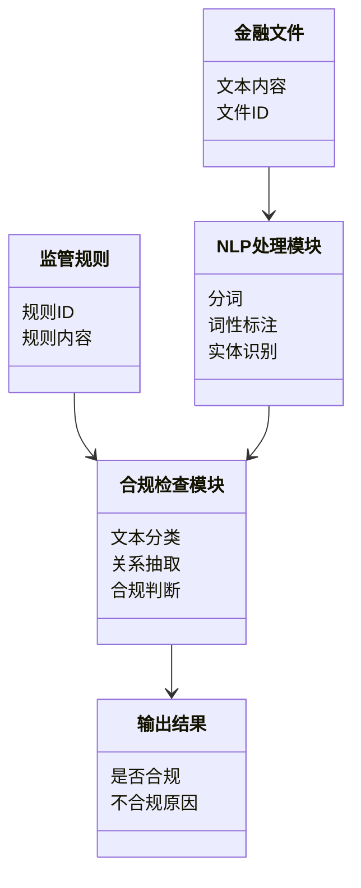
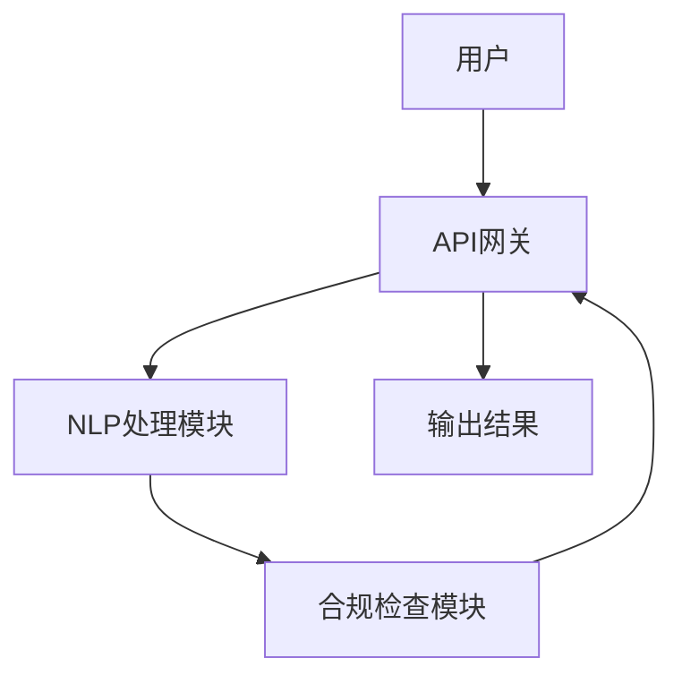
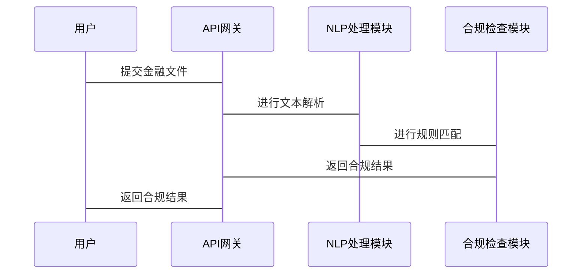
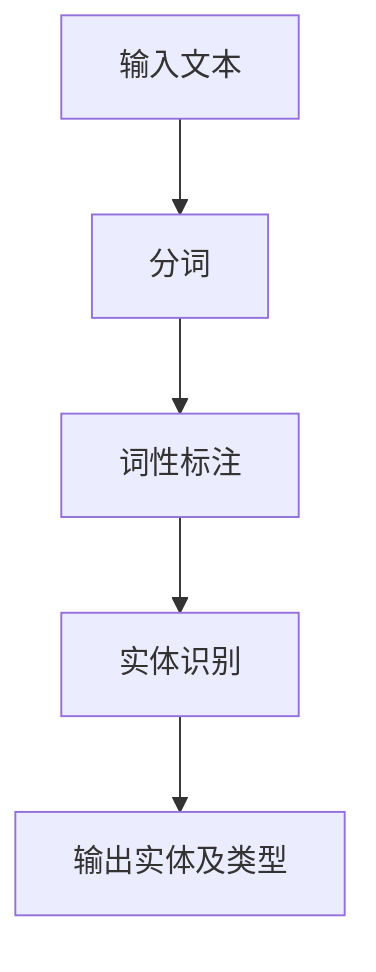
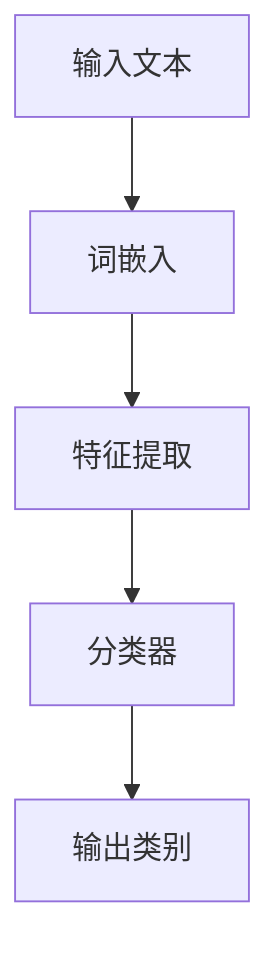

                 


# 构建基于NLP的金融监管文件遵从性自动检查系统

## 关键词：NLP、金融监管、自然语言处理、文件合规性、机器学习、文本挖掘

## 摘要：  
本文将深入探讨如何利用自然语言处理（NLP）技术构建一个高效的金融监管文件遵从性自动检查系统。通过分析金融监管文件的复杂性与多样性，结合NLP的核心技术，提出一套完整的系统设计与实现方案。文章内容涵盖系统背景、NLP技术基础、系统架构设计、核心算法实现以及实际案例分析，旨在为金融监管领域的技术实践者提供理论支持与实践指导。

---

## 第一部分: 背景介绍与核心概念

### 第1章: 金融监管文件遵从性自动检查的背景与问题

#### 1.1 金融监管的重要性与挑战
##### 1.1.1 金融监管的核心目标  
金融监管是指通过法律法规和规章制度，对金融机构的业务活动进行监督和管理，以确保市场秩序、保护投资者利益、维护金融稳定。监管的核心目标包括合规性、透明性和风险控制。

##### 1.1.2 传统金融监管的痛点  
传统的金融监管主要依赖人工审查，存在以下痛点：  
- **效率低**：人工审查耗时长，尤其是在处理大量文件时，效率难以提升。  
- **误差高**：人为疏忽可能导致漏检或误判。  
- **成本高**：需要大量专业人员，增加了企业的运营成本。  
- **复杂性高**：金融文件通常涉及复杂的法律术语和结构，人工处理难度大。  

##### 1.1.3 技术驱动监管创新的必要性  
随着技术的进步，利用人工智能（AI）和自然语言处理（NLP）技术可以显著提高金融监管的效率和准确性。NLP技术能够从非结构化文本中提取关键信息，帮助监管机构快速判断文件的合规性。

#### 1.2 自然语言处理在金融监管中的应用
##### 1.2.1 NLP技术的基本概念  
自然语言处理（NLP）是人工智能的一个分支，旨在使计算机能够理解、处理和生成人类语言。核心任务包括文本分割、词性标注、实体识别、关系抽取、文本分类和情感分析等。

##### 1.2.2 NLP在金融监管中的潜在价值  
在金融监管中，NLP技术可以用于以下场景：  
- **自动提取关键信息**：从监管文件中提取公司名称、金额、日期等实体信息。  
- **合规性检查**：基于预定义的监管规则，自动判断文件是否符合相关规定。  
- **风险预警**：通过分析文本中的情感倾向，识别潜在的风险信号。  

##### 1.2.3 金融监管文件的复杂性与多样性  
金融监管文件通常包括年报、财务报表、合同协议等，内容复杂且格式多样。文件中的信息可能涉及多个领域，如法律、财务和业务等，这使得NLP处理的难度增加。

#### 1.3 问题背景与目标
##### 1.3.1 问题背景的详细描述  
本文的目标是设计一个基于NLP的金融监管文件遵从性自动检查系统，能够快速、准确地判断文件是否符合相关监管规定。

##### 1.3.2 问题解决的核心目标  
- 提供高效的文件处理流程，减少人工干预。  
- 提高合规性检查的准确率，降低误判和漏判的风险。  
- 实现系统的可扩展性，支持多种文件格式和监管规则。  

##### 1.3.3 边界与外延的界定  
系统仅关注文件内容的合规性检查，不涉及文件生成或修改的过程。

##### 1.3.4 核心概念与要素的结构化分析  
核心概念包括：  
- **金融文件**：需要检查的文件，如年报、合同等。  
- **监管规则**：用于判断文件是否合规的法规和标准。  
- **NLP处理模块**：负责文本解析和信息提取。  
- **合规检查模块**：基于提取的信息判断文件是否符合监管要求。  

---

## 第二部分: 基于NLP的金融监管文件分析技术

### 第2章: 自然语言处理技术基础

#### 2.1 NLP核心概念与原理
##### 2.1.1 词法分析与句法分析  
词法分析将文本分割成词语，并标注词性；句法分析研究词语之间的语法关系。  

##### 2.1.2 实体识别（NER）与关系抽取  
实体识别（Named Entity Recognition, NER）用于从文本中提取人名、地名、组织名等实体。关系抽取识别实体之间的关系，如“公司A向公司B投资100万元”。  

##### 2.1.3 文本分类与情感分析  
文本分类将文本划分为不同的类别，如合规与不合规；情感分析判断文本的情感倾向，如正面、负面或中性。  

#### 2.2 NLP技术在金融领域的应用
##### 2.2.1 金融文本的特征与挑战  
金融文本通常具有专业术语多、格式复杂、内容冗长等特点，增加了NLP处理的难度。  

##### 2.2.2 基于NLP的金融信息提取  
通过NLP技术提取金融文件中的关键信息，如公司名称、金额、日期等。  

##### 2.2.3 金融文本的情感分析与风险评估  
分析金融文本的情感倾向，识别潜在的风险信号，帮助监管机构提前预警。  

#### 2.3 金融监管文件的NLP处理流程
##### 2.3.1 文件预处理与数据清洗  
- 分词：将文本分割成词语。  
- 去停用词：移除常见词汇，如“的”、“了”等。  
- 标注词性：为每个词语标注词性。  

##### 2.3.2 文本表示与特征提取  
- 词袋模型：将文本表示为词频向量。  
- 词嵌入：使用如Word2Vec等模型生成词向量。  

##### 2.3.3 模型训练与优化  
- 使用机器学习算法（如SVM、随机森林）或深度学习模型（如LSTM、BERT）进行训练和优化。  

---

## 第三部分: 系统设计与架构

### 第3章: 系统分析与架构设计方案

#### 3.1 问题场景介绍
##### 3.1.1 系统目标与用户需求  
系统目标：实现金融监管文件的自动合规性检查。  
用户需求：快速、准确地判断文件是否符合监管要求。  

##### 3.1.2 金融监管文件的典型场景  
包括年报、财务报表、合同协议等文件的合规性检查。  

##### 3.1.3 系统功能的边界与限制  
系统仅负责合规性检查，不涉及文件生成或修改。  

#### 3.2 系统功能设计
##### 3.2.1 领域模型设计（Mermaid类图）  


##### 3.2.2 系统架构设计（Mermaid架构图）  


##### 3.2.3 系统接口设计  
- 输入接口：接收金融文件和监管规则。  
- 输出接口：返回合规性结果和原因。  

##### 3.2.4 系统交互流程（Mermaid序列图）  


---

## 第四部分: 项目实战与算法实现

### 第4章: 系统核心算法实现

#### 4.1 基于NLP的金融实体识别
##### 4.1.1 实体识别算法原理（Mermaid流程图）  


##### 4.1.2 实现代码示例  
```python
import spacy

nlp = spacy.load("en_core_web_sm")
doc = nlp("Apple invests $100 million in Google.")
for ent in doc.ents:
    print(f"Text: {ent.text}, Label: {ent.label_}")
```

#### 4.2 基于深度学习的文本分类
##### 4.2.1 文本分类算法原理（Mermaid流程图）  


##### 4.2.2 实现代码示例  
```python
from sklearn.feature_extraction.text import TfidfVectorizer
from sklearn.svm import SVC

vectorizer = TfidfVectorizer()
clf = SVC()

# 假设corpus是文本列表，labels是对应的标签
X = vectorizer.fit_transform(corpus)
clf.fit(X, labels)
```

---

## 第五部分: 总结与展望

### 5.1 总结
本文详细介绍了如何利用NLP技术构建金融监管文件遵从性自动检查系统，涵盖了系统背景、技术原理、系统架构、算法实现和项目实战等内容。通过NLP技术的应用，可以显著提高金融监管的效率和准确性。

### 5.2 未来展望
未来，随着NLP技术的不断进步，金融监管文件的自动检查系统将更加智能化和自动化。可能的研究方向包括：  
- 更先进的NLP模型（如BERT、GPT）的应用。  
- 多语言金融文本的处理。  
- 结合区块链技术实现更高效的监管流程。  

---

## 小结

本文从背景到实现，详细探讨了基于NLP的金融监管文件遵从性自动检查系统的构建过程。通过理论分析和实践案例的结合，为读者提供了全面的技术指导。希望本文能为金融监管领域的技术实践者提供有价值的参考。

