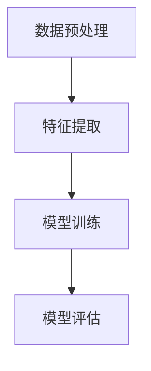
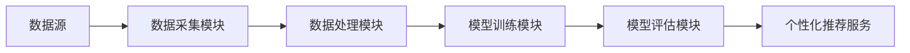
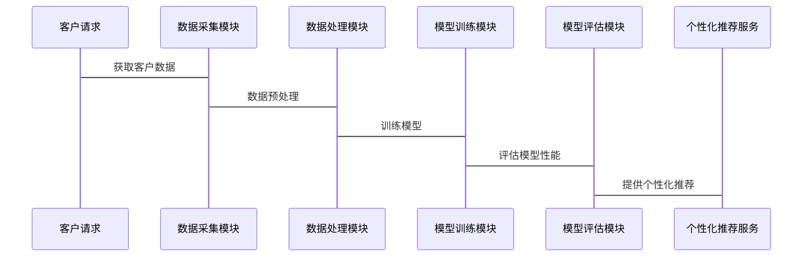

                 


# 构建客户洞察AI：深度分析与个性化服务实现

> 关键词：客户洞察，人工智能，个性化服务，机器学习，深度学习

> 摘要：本文将详细探讨如何利用人工智能技术构建客户洞察系统，通过深度分析客户数据，实现个性化的客户服务。文章从背景介绍、核心概念、算法原理、系统架构设计到项目实战，全面解析客户洞察AI的实现过程，最后总结最佳实践和未来发展方向。

---

# 第1章: 客户洞察AI的背景与核心概念

## 1.1 客户洞察AI的背景介绍

### 1.1.1 数据驱动决策的时代背景
在当今数字化时代，企业面对海量数据，如何从数据中提取有价值的信息，成为决策的关键。客户洞察AI正是基于数据驱动的决策，通过分析客户的行为、偏好和需求，为企业提供精准的客户画像和个性化的服务策略。

### 1.1.2 AI技术在客户洞察中的应用现状
人工智能技术的快速发展，使得客户洞察AI在各个行业的应用越来越广泛。通过机器学习和深度学习算法，企业能够从非结构化数据中提取特征，识别客户行为模式，并预测客户的需求。

### 1.1.3 个性化服务的市场需求
随着消费者对个性化体验的需求不断增加，企业需要通过AI技术实现精准的客户画像和个性化的服务推荐，以提升客户满意度和忠诚度。

## 1.2 客户洞察AI的核心问题

### 1.2.1 客户行为分析的挑战
客户行为数据具有多样性和复杂性，如何从海量数据中提取有用的特征，并识别客户的潜在需求，是客户洞察AI的核心挑战。

### 1.2.2 个性化服务实现的关键问题
个性化服务需要结合客户的实时行为和历史数据，动态调整推荐策略。如何在实时性、准确性和计算效率之间找到平衡点，是实现个性化服务的关键。

### 1.2.3 数据隐私与安全的边界
客户数据的隐私保护是客户洞察AI实现中的重要问题。如何在保护客户隐私的前提下，最大化数据的价值，是企业在设计客户洞察系统时需要考虑的重要因素。

## 1.3 客户洞察AI的核心概念

### 1.3.1 客户数据的全生命周期管理
客户数据的全生命周期包括数据采集、存储、处理、分析和应用。通过数据的全生命周期管理，企业能够更好地理解和利用客户数据。

### 1.3.2 AI驱动的客户画像构建
客户画像通过整合客户的多维度数据，构建客户的立体画像。AI技术能够从海量数据中提取关键特征，生成动态更新的客户画像。

### 1.3.3 个性化服务的实现机制
个性化服务通过分析客户的画像和实时行为，动态调整服务策略。实现机制包括实时推荐引擎、动态定价策略和个性化内容生成。

## 1.4 本章小结
本章从背景介绍、核心问题和核心概念三个方面，详细探讨了客户洞察AI的实现背景和关键问题。通过理解这些内容，读者可以更好地把握客户洞察AI的核心价值和实现路径。

---

# 第2章: 客户洞察AI的核心概念与联系

## 2.1 核心概念原理

### 2.1.1 数据采集与预处理
数据采集是客户洞察AI的第一步，包括从多种数据源（如日志文件、数据库、API接口等）获取客户数据。数据预处理包括数据清洗、特征提取和数据标准化。

### 2.1.2 客户画像构建
客户画像是通过整合客户的多维度数据，构建客户的立体画像。包括客户的基本信息、行为特征、兴趣偏好等。

### 2.1.3 个性化推荐算法
个性化推荐算法是客户洞察AI的核心，通过分析客户的画像和行为数据，实现精准的推荐策略。包括基于协同过滤、基于内容的推荐和基于深度学习的推荐算法。

## 2.2 核心概念属性对比表

| 概念         | 属性             | 描述                                                                 |
|--------------|------------------|----------------------------------------------------------------------|
| 数据源       | 类型             | 结构化数据（如数据库表）、非结构化数据（如文本、图像）                              |
| 数据预处理   | 方法             | 数据清洗（去除噪声）、数据转换（标准化、归一化）、特征提取                           |
| 客户画像     | 维度             | 基本信息（年龄、性别）、行为特征（点击率、购买频率）、兴趣偏好（爱好、偏好）           |
| 个性化推荐   | 算法类型         | 协同过滤、基于内容的推荐、基于深度学习的推荐                                       |
| 数据隐私     | 保护措施         | 数据加密、匿名化处理、访问权限控制                                                 |

## 2.3 ER实体关系图

```mermaid
er
    Customer
    ----
    id: string
    name: string
    age: int
    gender: string
    ...
    CustomerBehavior
    ----
    customerId: string
    timestamp: datetime
    action: string
    ...
    CustomerPreference
    ----
    customerId: string
    preferenceCategory: string
    preferenceValue: float
    ...
```

## 2.4 本章小结
本章通过核心概念的对比和实体关系图，详细分析了客户洞察AI系统中各个核心概念之间的关系。通过理解这些关系，读者可以更好地设计和实现客户洞察AI系统。

---

# 第3章: 客户洞察AI的算法原理

## 3.1 机器学习算法原理

### 3.1.1 线性回归
线性回归是一种简单的回归算法，适用于预测连续型变量。其数学模型如下：

$$ y = \beta_0 + \beta_1 x + \epsilon $$

其中，$y$ 是目标变量，$x$ 是自变量，$\beta_0$ 和 $\beta_1$ 是回归系数，$\epsilon$ 是误差项。

### 3.1.2 支持向量机
支持向量机（SVM）是一种监督学习算法，适用于分类和回归问题。其核心思想是通过找到一个超平面，将数据点分为两类。

### 3.1.3 随机森林
随机森林是一种基于决策树的集成学习算法，通过构建多个决策树并进行投票或平均，提高模型的准确性和鲁棒性。

## 3.2 深度学习算法原理

### 3.2.1 神经网络基础
神经网络是一种模拟人脑结构和功能的算法，由多个神经元组成，通过权重和激活函数进行信息传递。

### 3.2.2 卷积神经网络
卷积神经网络（CNN）是一种适用于图像处理的深度学习算法，通过卷积层、池化层和全连接层进行特征提取和分类。

### 3.2.3 循环神经网络
循环神经网络（RNN）是一种适用于序列数据的深度学习算法，通过循环层处理序列数据，捕捉时间依赖关系。

## 3.3 算法流程图



## 3.4 本章小结
本章详细介绍了机器学习和深度学习算法的原理，包括线性回归、支持向量机、随机森林、神经网络等算法的数学模型和流程图。通过理解这些算法，读者可以更好地选择和实现适合客户洞察AI的算法。

---

# 第4章: 客户洞察AI的系统分析与架构设计

## 4.1 系统功能设计

### 4.1.1 数据采集模块
数据采集模块负责从多种数据源获取客户数据，包括数据库、API接口和日志文件等。

### 4.1.2 数据处理模块
数据处理模块负责对采集到的数据进行清洗、转换和特征提取，为后续的分析提供干净的数据。

### 4.1.3 模型训练模块
模型训练模块负责基于处理后的数据，训练客户洞察AI模型，生成客户画像和个性化推荐策略。

### 4.1.4 模型评估模块
模型评估模块负责对训练好的模型进行评估，包括准确率、召回率、F1分数等指标，确保模型的性能。

## 4.2 系统架构设计



## 4.3 系统接口设计

### 4.3.1 数据接口
数据接口负责与外部数据源进行数据交互，包括数据库、API接口和文件系统等。

### 4.3.2 模型接口
模型接口负责与模型训练模块进行交互，接收训练好的模型，并提供预测服务。

## 4.4 系统交互流程



## 4.5 本章小结
本章从系统功能设计、架构设计、接口设计和交互流程四个方面，详细介绍了客户洞察AI系统的实现过程。通过理解这些内容，读者可以更好地设计和实现客户洞察AI系统。

---

# 第5章: 客户洞察AI的项目实战

## 5.1 环境安装

### 5.1.1 Python环境配置
安装Python 3.8及以上版本，并安装必要的库，如numpy、pandas、scikit-learn和tensorflow。

### 5.1.2 数据库安装
安装MySQL或PostgreSQL数据库，并配置好数据源。

## 5.2 核心实现

### 5.2.1 数据预处理
```python
import pandas as pd
from sklearn.preprocessing import StandardScaler

# 加载数据
data = pd.read_csv('customer_data.csv')

# 特征提取
features = data[['age', 'gender', 'click_rate']]
```

### 5.2.2 模型训练
```python
from sklearn.ensemble import RandomForestClassifier
from sklearn.model_selection import train_test_split

# 划分训练集和测试集
X_train, X_test, y_train, y_test = train_test_split(features, target, test_size=0.2)

# 训练模型
model = RandomForestClassifier()
model.fit(X_train, y_train)
```

### 5.2.3 模型评估
```python
from sklearn.metrics import accuracy_score

# 预测结果
y_pred = model.predict(X_test)

# 计算准确率
print(accuracy_score(y_test, y_pred))
```

### 5.2.4 个性化推荐
```python
import numpy as np

# 生成推荐列表
recommendations = model.predict_proba(new_customer_features) > 0.5
```

## 5.3 案例分析

### 5.3.1 数据分析结果
通过分析客户的购买记录和点击行为，发现年轻客户更倾向于购买电子产品，而中年客户更倾向于购买家居产品。

### 5.3.2 推荐策略调整
根据客户的兴趣偏好和行为特征，动态调整推荐策略。例如，对于喜欢电子产品的新客户，推荐最新的智能手机和电脑。

## 5.4 本章小结
本章通过项目实战，详细讲解了客户洞察AI系统的实现过程，包括环境配置、数据预处理、模型训练和个性化推荐等步骤。通过实际案例分析，读者可以更好地理解如何在实际项目中应用这些技术。

---

# 第6章: 客户洞察AI的最佳实践与注意事项

## 6.1 项目经验总结

### 6.1.1 数据质量管理
确保数据的准确性和完整性，避免因数据质量问题影响模型的性能。

### 6.1.2 模型调优
通过参数调整和模型优化，提高模型的准确率和计算效率。

## 6.2 注意事项

### 6.2.1 数据隐私保护
遵守数据隐私保护法规，确保客户数据的安全和隐私。

### 6.2.2 模型解释性
在实际应用中，模型的解释性非常重要。选择具有较高解释性的模型，方便调试和优化。

## 6.3 未来发展方向

### 6.3.1 多模态数据融合
未来，可以通过融合文本、图像等多种模态数据，提高客户洞察的准确性和全面性。

### 6.3.2 实时推荐系统
随着技术的发展，实时推荐系统将成为客户洞察AI的重要发展方向，能够更快地响应客户需求。

## 6.4 本章小结
本章总结了客户洞察AI项目中的最佳实践和注意事项，包括数据质量管理、模型调优、数据隐私保护和模型解释性等方面。同时，展望了未来的发展方向，为读者提供了进一步思考和实践的空间。

---

# 附录: 工具安装与参考文献

## 附录A: 工具安装指南

### 附录A.1 Python环境配置
安装Python 3.8及以上版本，并安装必要的库，如numpy、pandas、scikit-learn和tensorflow。

### 附录A.2 数据库安装
安装MySQL或PostgreSQL数据库，并配置好数据源。

## 附录B: 参考文献

1. 《机器学习实战》, 周志华
2. 《深度学习》, Ian Goodfellow
3. 《Python机器学习》，Andreas Müller

---

# 本文章到此结束，感谢您的阅读！

