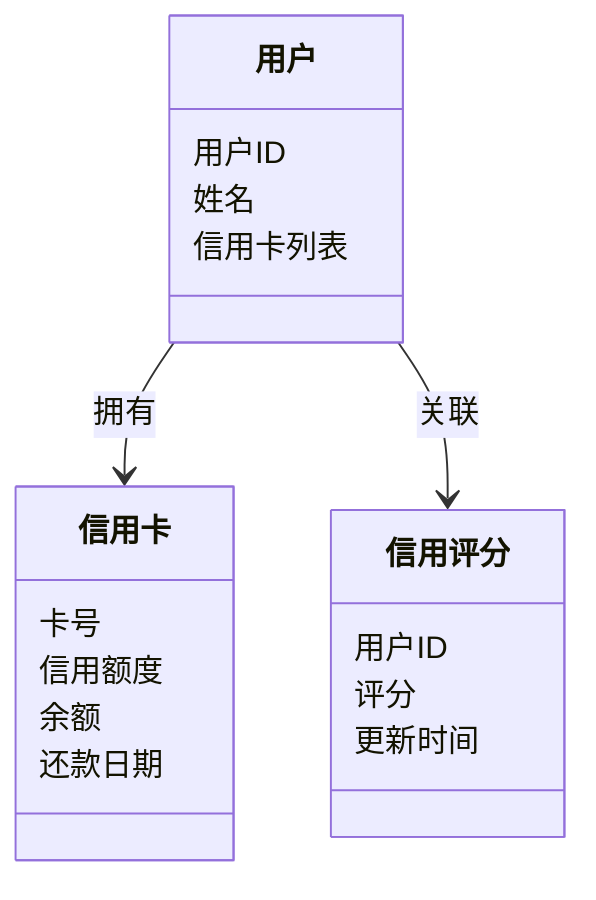

                 


# 构建智能化的个人信用卡使用优化助手

> 关键词：信用卡优化、人工智能、大数据分析、机器学习、风险管理、信用评分

> 摘要：随着信用卡的普及，如何通过智能化手段优化信用卡使用成为一个重要课题。本文将介绍如何利用人工智能和大数据分析技术，构建一个智能化的个人信用卡使用优化助手，帮助用户提高资金使用效率，降低风险，提升用户体验。

---

# 第一部分：背景介绍

## 第1章：信用卡使用优化助手的背景与意义

### 1.1 核心概念术语说明

#### 信用卡优化助手
- **定义**：基于人工智能和大数据分析技术，帮助用户优化信用卡使用行为的工具。
- **目标**：提高资金使用效率，降低信用风险，提升用户体验。

#### 关键技术
- **人工智能（AI）**：用于模式识别、预测和自动化决策。
- **大数据分析**：用于处理和分析海量信用卡交易数据。
- **机器学习**：用于构建预测模型，优化信用评分和交易推荐。

### 1.2 问题背景

#### 信用卡普及带来的问题
- **过度消费**：用户可能因缺乏自我约束而产生高额债务。
- **信用评分下降**：频繁的逾期还款或高额透支会影响信用评分。
- **风险管理困难**：银行难以实时监控和预测用户的信用风险。

#### 信用卡使用中的常见痛点
- **账单管理复杂**：用户难以有效管理多张信用卡的账单。
- **还款安排不合理**：用户可能因疏忽而产生额外利息。
- **优惠信息繁多**：用户难以筛选最适合自己的优惠活动。

### 1.3 问题解决

#### 信用卡优化助手的作用
- **智能化管理**：通过AI算法分析用户的消费行为，提供个性化的使用建议。
- **风险预警**：实时监控用户的信用评分变化，预警潜在风险。
- **优化建议**：推荐最优的还款策略和消费计划，帮助用户节省利息支出。

### 1.4 边界与外延

#### 边界
- **仅针对个人用户**：不涉及企业或商业用途。
- **基于现有数据**：依赖用户的信用卡交易数据和行为数据。

#### 外延
- **扩展至其他金融产品**：优化助手的概念可扩展至其他金融工具，如借记卡、投资账户等。
- **结合区块链技术**：未来可探索基于区块链的信用评分管理系统。

### 1.5 核心要素组成

| 核心要素 | 描述 |
|----------|------|
| 用户数据 | 消费记录、信用历史、还款行为等 |
| AI算法 | 用于预测和推荐的机器学习模型 |
| 数据分析 | 数据挖掘、统计分析、可视化等 |
| 用户界面 | 提供优化建议和交互的前端界面 |

## 1.6 本章小结
本章介绍了信用卡优化助手的背景、核心概念和作用，明确了其目标和边界，并列出了关键组成部分。

---

# 第二部分：核心概念与联系

## 第2章：信用卡优化助手的核心概念与联系

### 2.1 核心概念原理

#### 用户消费行为分析
- **定义**：通过分析用户的消费记录，识别消费习惯和模式。
- **方法**：使用聚类分析将用户分为不同的消费类型，如冲动型、理性型等。

#### 信用评分模型
- **定义**：基于用户的信用历史和消费行为，评估其信用风险。
- **方法**：使用逻辑回归模型预测用户违约概率。

#### 风险控制策略
- **定义**：通过实时监控用户的交易行为，识别异常交易，防止欺诈。

### 2.2 概念属性特征对比

| 概念       | 特征对比 |
|------------|----------|
| 消费行为分析 | 数据驱动、实时性、个性化 |
| 信用评分模型 | 可解释性、动态性、准确性 |
| 风险控制策略 | 实时性、预防性、动态调整 |

### 2.3 实体关系图

```mermaid
erDiagram
    actor 用户
    actor 助手系统
    actor 银行
    database 信用卡数据
    database 用户数据
    database 信用评分
    用户 --> 助手系统 : 提供消费数据
    银行 --> 助手系统 : 提供信用数据
    助手系统 --> 用户 : 提供优化建议
    助手系统 --> 银行 : 提供风险预警
```

## 2.4 本章小结
本章详细阐述了信用卡优化助手的核心概念，包括用户消费行为分析、信用评分模型和风险控制策略，并通过对比和实体关系图展示了各概念之间的联系。

---

# 第三部分：算法原理讲解

## 第3章：信用卡优化助手的算法原理与实现

### 3.1 算法原理

#### 线性回归模型
- **用途**：预测用户的信用评分。
- **公式**：
  $$ y = \beta_0 + \beta_1 x_1 + \beta_2 x_2 + \ldots + \beta_n x_n $$
  其中，$y$ 是信用评分，$x_i$ 是影响信用评分的因素，如还款历史、消费频率等。

#### 聚类分析
- **用途**：识别用户的消费模式。
- **算法步骤**：
  1. 数据预处理：标准化特征。
  2. 选择聚类方法：K-means。
  3. 训练模型并分配簇。

### 3.2 算法实现

#### 线性回归模型代码示例

```python
import pandas as pd
from sklearn.linear_model import LinearRegression
from sklearn.metrics import mean_squared_error

# 加载数据
data = pd.read_csv('credit_data.csv')

# 定义特征和目标变量
X = data[['income', 'debt', 'age']]
y = data['credit_score']

# 训练模型
model = LinearRegression()
model.fit(X, y)

# 预测
predictions = model.predict(X)

# 评估
 mse = mean_squared_error(y, predictions)
 print(f"均方误差: {mse}")
```

#### 聚类分析代码示例

```python
from sklearn.cluster import KMeans
from sklearn.preprocessing import StandardScaler

# 数据预处理
scaler = StandardScaler()
X_scaled = scaler.fit_transform(X)

# 训练模型
kmeans = KMeans(n_clusters=3, random_state=42)
kmeans.fit(X_scaled)

# 分配簇
clusters = kmeans.predict(X_scaled)
```

### 3.3 本章小结
本章详细讲解了信用卡优化助手的核心算法，包括线性回归和聚类分析，并通过代码示例展示了如何实现这些算法。

---

# 第四部分：系统分析与架构设计

## 第4章：信用卡优化助手的系统分析与架构设计

### 4.1 问题场景介绍

#### 用户场景
- 用户希望通过优化助手管理多张信用卡，降低利息支出，提升信用评分。

### 4.2 系统功能设计

#### 领域模型



### 4.3 系统架构设计

#### 系统架构图


### 4.4 系统接口设计

#### API接口
- **获取优化建议**：`GET /api/optimization`
- **更新信用评分**：`POST /api/credit_score`

### 4.5 本章小结
本章通过系统分析和架构设计，展示了信用卡优化助手的整体结构和各部分的交互关系。

---

# 第五部分：项目实战

## 第5章：信用卡优化助手的项目实战

### 5.1 环境安装

#### 安装依赖
```bash
pip install pandas scikit-learn mermaid4j
```

### 5.2 核心代码实现

#### 数据处理代码

```python
import pandas as pd

# 加载数据
data = pd.read_csv('credit_data.csv')

# 数据清洗
data.dropna(inplace=True)
data['消费金额'] = data['消费金额'].astype(int)
```

#### 模型训练代码

```python
from sklearn.model_selection import train_test_split
from sklearn.ensemble import RandomForestClassifier

# 划分训练集和测试集
X_train, X_test, y_train, y_test = train_test_split(X, y, test_size=0.2, random_state=42)

# 训练模型
model = RandomForestClassifier()
model.fit(X_train, y_train)

# 预测
predictions = model.predict(X_test)
```

### 5.3 案例分析

#### 案例：优化用户的还款计划

- **用户情况**：信用卡欠款总额为$10,000，年利率为18%。
- **优化建议**：优先偿还高利率的分期付款，减少利息支出。

### 5.4 本章小结
本章通过实际案例展示了如何使用信用卡优化助手优化用户的还款计划，并提供了详细的代码实现。

---

# 第六部分：最佳实践

## 第6章：信用卡优化助手的最佳实践

### 6.1 Tips

#### 数据隐私保护
- 使用加密技术保护用户数据。
- 遵守数据隐私法规，如GDPR。

#### 模型优化
- 定期更新模型参数。
- 使用交叉验证提高模型准确性。

### 6.2 小结
总结全文内容，强调信用卡优化助手的重要性和实际应用价值。

### 6.3 注意事项
- 数据安全：确保用户数据的安全性和隐私性。
- 模型维护：定期更新模型以适应新的数据和业务需求。

### 6.4 拓展阅读
- 推荐书籍：《Python机器学习实战》、《数据挖掘导论》。
- 推荐博客：人工智能和大数据分析领域的技术博客。

## 6.5 本章小结
本章提供了信用卡优化助手的最佳实践建议，包括数据安全、模型维护和进一步学习的资源。

---

# 总结

通过本文的详细介绍，读者可以深入了解如何构建智能化的个人信用卡使用优化助手，从背景、核心概念、算法实现到系统设计和项目实战，全面掌握其构建方法和应用价值。希望本文能为读者在优化信用卡使用方面提供有价值的参考和指导。

--- 

# END

