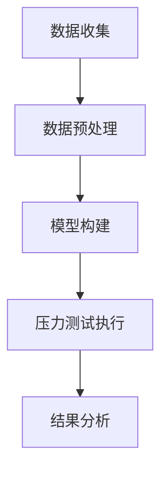
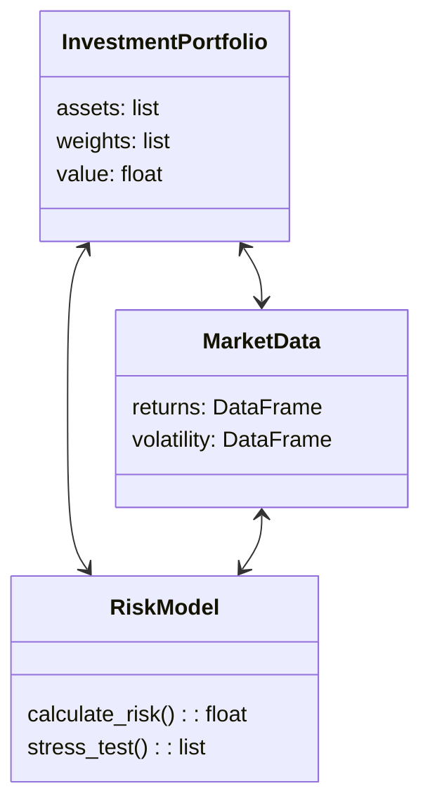
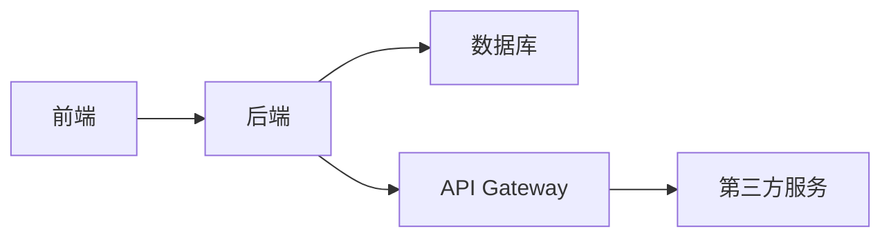
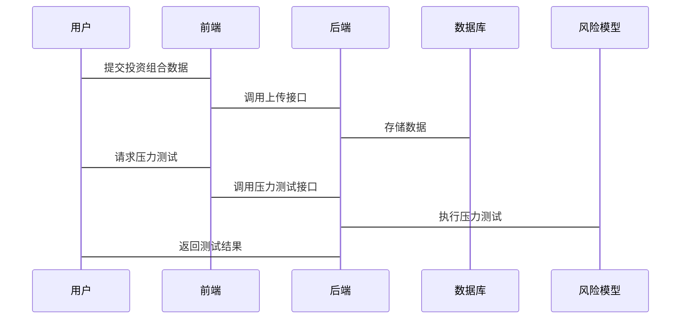

                 


```markdown
# 构建智能化的个人投资组合压力测试工具

## 关键词：个人投资组合，压力测试，风险管理，智能化工具，算法原理，系统架构，项目实战

## 摘要：
本文详细探讨了构建智能化个人投资组合压力测试工具的各个方面。从背景介绍到核心概念，从算法原理到系统架构设计，再到项目实战和最佳实践，为读者提供了一套完整的解决方案。通过对比分析不同压力测试方法，结合具体代码实现和数学模型，帮助读者理解并掌握如何构建一个高效、智能的压力测试工具。

---

## 第一部分: 背景介绍

### 第1章: 个人投资组合压力测试的背景与意义

#### 1.1 问题背景
- **投资组合风险控制的重要性**：在金融市场中，投资组合的价值会受到市场波动的影响，压力测试是评估投资组合在极端情况下的表现的重要手段。
- **现有压力测试工具的局限性**：传统工具通常基于静态模型，缺乏动态调整和智能化分析，难以应对复杂多变的市场环境。
- **智能化压力测试工具的必要性**：通过引入机器学习和大数据分析，能够更准确地预测和评估投资组合的风险。

#### 1.2 问题描述
- **投资组合压力测试的核心目标**：评估投资组合在极端市场条件下的表现和潜在损失。
- **市场波动对投资组合的影响**：市场波动可能导致投资组合的价值大幅波动，压力测试需要考虑多种极端情景。
- **用户需求与工具功能的匹配**：用户需要一个能够快速、准确地进行压力测试，并提供可视化结果的工具。

#### 1.3 问题解决
- **智能化压力测试工具的设计思路**：结合大数据分析和机器学习算法，构建动态调整的模型，能够实时更新数据并进行压力测试。
- **数据驱动与模型驱动的结合**：利用历史数据和市场数据进行建模，同时结合实时数据进行动态调整。
- **工具的可扩展性与适应性**：工具应具备良好的扩展性，能够适应不同规模和类型的投资组合。

#### 1.4 边界与外延
- **工具的功能边界**：主要集中在压力测试和风险评估，不涉及投资组合的具体交易和管理。
- **工具的适用范围与限制**：适用于个人投资者和小型机构，对于大型机构可能需要更复杂的系统。
- **相关概念的外延与区别**：压力测试与风险评估、投资组合优化等其他概念的区别和联系。

#### 1.5 核心概念结构与组成
- **投资组合压力测试的核心要素**：市场数据、投资组合构成、压力测试模型、评估指标。
- **工具功能模块的构成**：数据采集模块、模型构建模块、压力测试执行模块、结果展示模块。
- **用户与工具的交互关系**：用户输入投资组合信息，工具生成压力测试结果并提供可视化展示。

---

## 第二部分: 核心概念与联系

### 第2章: 智能化压力测试工具的核心概念与联系

#### 2.1 核心概念原理
- **数据驱动的风险评估**：通过分析历史市场数据，识别潜在风险点，并预测未来可能的风险情景。
- **模型驱动的压力测试**：利用数学模型模拟不同市场条件下的投资组合表现，评估其抗风险能力。
- **智能算法的优化作用**：通过机器学习算法优化压力测试模型，提高预测准确性和效率。

#### 2.2 核心概念对比分析
- **压力测试方法对比表格**
| 方法 | 描述 | 优点 | 缺点 |
|------|------|------|------|
| 历史模拟法 | 使用历史数据模拟极端情况 | 数据来源可靠 | 依赖历史数据的完整性 |
| 蒙特卡洛模拟法 | 基于概率分布生成模拟数据 | 能够模拟非历史情况 | 计算复杂度高 |
| 情景分析法 | 预定义极端市场情景 | 可控性强 | 情景假设可能不够全面 |

- **ER实体关系图**


---

## 第三部分: 算法原理与实现

### 第3章: 压力测试算法原理与实现

#### 3.1 算法原理
- **压力测试流程**


#### 3.2 算法实现
- **数据预处理代码**
```python
import pandas as pd

def preprocess_data(data):
    # 去除缺失值
    data = data.dropna()
    # 标准化数据
    from sklearn.preprocessing import StandardScaler
    scaler = StandardScaler()
    data_scaled = scaler.fit_transform(data)
    return data_scaled
```

- **模型构建代码**
```python
from sklearn.linear_model import LinearRegression

def build_model(data, labels):
    model = LinearRegression()
    model.fit(data, labels)
    return model
```

- **压力测试执行代码**
```python
def perform_stress_test(model, test_data):
    predictions = model.predict(test_data)
    return predictions
```

- **数学模型与公式**
  - **VaR（Value at Risk）**：衡量在一定置信水平下，投资组合的最大可能损失。
    $$ VaR = \alpha \times \sigma $$
    其中，α是置信水平对应的分位数，σ是投资组合的收益率标准差。
  - **CVaR（Conditional Value at Risk）**：在VaR的基础上，计算超过VaR值的部分的平均损失。
    $$ CVaR = \frac{1}{N} \sum_{i=1}^{N} (x_i - VaR) $$

---

## 第四部分: 系统分析与架构设计

### 第4章: 系统分析与架构设计

#### 4.1 项目介绍
- **项目背景**：构建一个智能化的个人投资组合压力测试工具，帮助用户评估投资组合在极端市场情况下的表现。
- **项目目标**：提供一个高效、准确的压力测试工具，满足个人投资者的需求。

#### 4.2 系统功能设计
- **领域模型类图**


- **系统架构设计**


#### 4.3 系统接口设计
- **API接口**
  - `/api/v1/portfolio/upload`：上传投资组合数据
  - `/api/v1/stress_test/run`：执行压力测试
  - `/api/v1/results/download`：下载测试结果

#### 4.4 系统交互流程
- **序列图**


---

## 第五部分: 项目实战

### 第5章: 项目实战

#### 5.1 环境安装
- **安装Python和必要的库**
  ```bash
  pip install numpy pandas scikit-learn matplotlib
  ```

#### 5.2 核心代码实现
- **数据处理**
```python
import pandas as pd
import numpy as np
from sklearn.linear_model import LinearRegression

def load_data(file_path):
    data = pd.read_csv(file_path)
    return data

def preprocess_data(data):
    data = data.dropna()
    return data

def train_model(data, labels):
    model = LinearRegression()
    model.fit(data, labels)
    return model

def stress_test(model, test_data):
    predictions = model.predict(test_data)
    return predictions
```

- **模型训练与测试**
```python
data = load_data('market_data.csv')
processed_data = preprocess_data(data)
labels = processed_data['returns']
features = processed_data.drop('returns', axis=1)
model = train_model(features, labels)
test_data = processed_data.iloc[-100:]
test_predictions = stress_test(model, test_data)
```

#### 5.3 代码解读与分析
- **数据加载**：从CSV文件加载市场数据，包括资产回报率、波动率等。
- **数据预处理**：去除缺失值，标准化数据。
- **模型训练**：使用线性回归模型训练风险评估模型。
- **压力测试**：使用训练好的模型对测试数据进行压力测试，生成预测结果。

#### 5.4 实际案例分析
- **案例背景**：假设有一个包含股票、债券和黄金的投资组合，用户希望评估在市场崩盘情况下的损失。
- **测试执行**：使用模型预测在极端市场情况下的投资组合价值。
- **结果分析**：根据测试结果，用户可以调整投资组合的构成，以降低潜在风险。

#### 5.5 项目小结
- **项目总结**：通过实际案例展示了智能化压力测试工具的应用，验证了工具的有效性和准确性。
- **经验教训**：在数据预处理和模型选择中，需要注意数据的质量和模型的适用性。
- **改进建议**：未来可以引入更复杂的算法，如随机森林或神经网络，进一步提高预测精度。

---

## 第六部分: 最佳实践与总结

### 第6章: 最佳实践与总结

#### 6.1 最佳实践
- **数据来源的选择**：优先选择高质量、全面的市场数据，确保模型的准确性。
- **模型的调优**：根据具体需求调整模型参数，优化预测效果。
- **结果的可视化**：使用图表和仪表盘直观展示测试结果，方便用户理解和决策。

#### 6.2 小结
- **文章总结**：本文详细介绍了构建智能化个人投资组合压力测试工具的各个方面，从理论到实践，为读者提供了完整的解决方案。
- **工具的优势**：智能化工具能够帮助用户快速、准确地评估投资组合风险，制定有效的风险管理策略。

#### 6.3 注意事项
- **数据隐私**：确保用户数据的安全性和隐私性，遵守相关法律法规。
- **模型的局限性**：压力测试工具的结果仅供参考，实际投资决策需要结合多方面因素。

#### 6.4 拓展阅读
- **相关书籍**：《风险管理与金融工具》、《机器学习在金融中的应用》
- **在线资源**：投资组合压力测试的开源工具、金融数据分析的实战案例

---

## 参考文献
- 文献1：风险管理与金融工具
- 文献2：机器学习在金融中的应用
- 文献3：投资组合优化与压力测试

---

## 结语
构建智能化的个人投资组合压力测试工具是一个复杂但极具价值的项目，通过本文的详细讲解，读者可以掌握从理论到实践的全过程，为投资决策提供有力支持。
```

