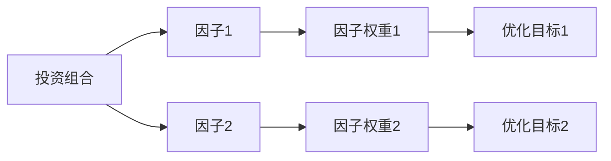
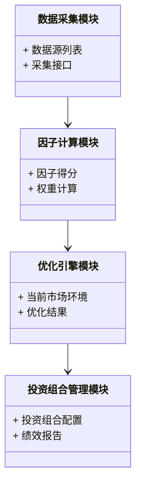
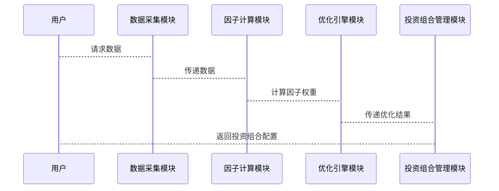

                 


# 构建智能化的个人投资风格因子暴露动态优化系统

## 关键词：投资风格因子，动态优化，系统架构，优化算法，金融数据分析

## 摘要：  
本文旨在构建一个智能化的个人投资风格因子暴露动态优化系统。通过分析投资风格因子的定义、分类及其在投资组合管理中的作用，结合动态优化算法的设计与实现，提出了一种基于混合优化算法的动态调整策略。本文详细阐述了系统的数学模型、算法原理、系统架构及其实现方案，并通过实际案例分析验证了系统的有效性和优越性。最终，本文为投资者提供了一套高效、智能的投资风格因子动态优化解决方案。

---

# 第一部分: 构建智能化的个人投资风格因子暴露动态优化系统概述

## 第1章: 个人投资风格因子暴露动态优化系统概述

### 1.1 投资风格因子的定义与背景

#### 1.1.1 什么是投资风格因子  
投资风格因子是指在投资组合中，根据特定的投资策略或市场特征所选择的股票或其他资产的集合。这些因子反映了投资组合在不同市场环境下的表现特征，例如市值、价值、动量、波动率等。通过调整因子的暴露程度，投资者可以优化投资组合的风险收益比。

#### 1.1.2 投资风格因子的分类与特点  
投资风格因子可以分为以下几类：  
1. **市场因子（Market Factor）**：反映市场整体表现的因子，例如大盘股相对于小盘股的表现。  
2. **价值因子（Value Factor）**：反映低市盈率、低市净率等价值股票的表现。  
3. **动量因子（Momentum Factor）**：反映过去一段时间内表现优异的股票的延续性。  
4. **波动率因子（Volatility Factor）**：反映高波动率股票的风险特征。  
5. **质量因子（Quality Factor）**：反映高盈利质量、低负债率等优质股票的表现。  

每个因子都有其独特的特征和表现逻辑，例如价值因子在市场低迷时表现较好，而动量因子在市场趋势明显时表现较好。

#### 1.1.3 投资风格因子在投资组合管理中的作用  
投资风格因子是投资组合管理的核心工具之一，其作用包括：  
1. **风险控制**：通过调整因子的暴露程度，降低投资组合的整体风险。  
2. **收益优化**：通过动态调整因子权重，捕捉市场中的超额收益机会。  
3. **策略定制**：根据投资者的风险偏好和投资目标，定制个性化的投资策略。  

---

### 1.2 动态优化系统的必要性

#### 1.2.1 投资环境的动态变化  
市场环境是不断变化的，例如经济周期波动、政策变化、突发事件等都会影响投资风格因子的表现。因此，静态的因子暴露策略难以适应市场的动态变化。

#### 1.2.2 因子暴露的动态调整需求  
投资组合的因子暴露需要根据市场环境的变化进行动态调整，以实现收益与风险的最佳平衡。例如，在市场上涨周期，可以增加动量因子的暴露；在市场下跌周期，可以增加价值因子的暴露。

#### 1.2.3 系统优化的必要性与目标  
通过构建智能化的动态优化系统，可以实时监控市场环境的变化，自动调整因子的暴露程度，从而实现投资组合的最优配置。系统的优化目标包括：  
1. 最大化投资组合的超额收益。  
2. 最小化投资组合的风险敞口。  
3. 确保投资策略的持续有效性和适应性。  

---

### 1.3 系统构建的核心要素

#### 1.3.1 数据源的选择与整合  
系统需要整合多源数据，包括：  
1. 市场数据：股票价格、指数数据、市场波动率等。  
2. 公司基本面数据：市盈率、市净率、净利润增长率等。  
3. 交易数据：交易量、成交额等。  
4. 额外数据：宏观经济指标、政策变化等。  

#### 1.3.2 因子计算与权重分配  
因子的计算需要基于数据源，例如通过因子得分公式计算每个股票的因子值。权重分配则需要根据因子的重要性和市场环境进行动态调整。

#### 1.3.3 优化算法的选择与实现  
选择合适的优化算法是系统设计的关键。常见的优化算法包括遗传算法、粒子群优化算法等。本文将重点介绍基于遗传算法和粒子群优化算法的混合优化算法。

---

## 第2章: 投资风格因子的数学模型与特征分析

### 2.1 因子暴露的数学模型

#### 2.1.1 因子暴露的定义公式  
因子暴露可以表示为：  
$$ \text{因子暴露} = \sum_{i=1}^{n} w_i \times f_i $$  
其中，$w_i$ 是第 $i$ 个因子的权重，$f_i$ 是第 $i$ 个因子的值。

#### 2.1.2 因子权重的计算公式  
因子权重可以通过多种方法计算，例如等权分配、风险中性分配等。常用的风险中性分配公式为：  
$$ w_i = \frac{1 - \text{风险调整系数}}{n} $$  

#### 2.1.3 因子暴露的动态变化模型  
动态优化模型可以表示为：  
$$ \max \sum_{t=1}^{T} r_t \times w_t $$  
约束条件：  
$$ \sum_{t=1}^{T} w_t = 1 $$  
$$ w_t \geq 0 $$  

其中，$r_t$ 是第 $t$ 个时间点的收益，$w_t$ 是第 $t$ 个时间点的因子权重。

---

### 2.2 因子特征的对比分析

#### 2.2.1 不同因子类型的特征对比  
以下是一个对比表格：

| 因子类型   | 特征描述                          | 优缺点分析                       |
|------------|-----------------------------------|----------------------------------|
| 市场因子    | 整体市场表现，无行业或风格偏向     | 稳定性高，但收益波动大           |
| 价值因子    | 低市盈率、低市净率股票的表现       | 在熊市中表现较好，牛市中表现较弱 |
| 动量因子    | 近期表现优异的股票的延续性         | 在趋势性市场中表现较好           |
| 波动率因子    | 高波动率股票的风险特征           | 风险较大，收益不稳定             |
| 质量因子    | 高盈利质量、低负债率股票的表现     | 稳定性高，但收益增长较慢         |

#### 2.2.2 因子暴露与投资收益的关系  
因子暴露与投资收益呈正相关关系，但需要考虑市场环境和因子之间的交互作用。

#### 2.2.3 因子暴露与投资风险的关系  
因子暴露与投资风险呈正相关关系，但通过动态调整因子权重可以有效降低整体风险。

---

### 2.3 因子特征的Mermaid实体关系图



---

## 第3章: 动态优化算法的设计与实现

### 3.1 基于遗传算法的优化策略

#### 3.1.1 遗传算法的基本原理  
遗传算法是一种模拟生物进化过程的优化算法，主要包括以下步骤：  
1. 初始化种群。  
2. 计算适应度。  
3. 选择优秀个体。  
4. 进行交叉和变异操作。  
5. 重复迭代，直到满足终止条件。

#### 3.1.2 遗传算法在因子优化中的应用  
在投资组合优化中，遗传算法可以用于优化因子权重。例如，以下是一个简单的遗传算法实现代码：

```python
def fitness(w, returns):
    # 计算投资组合的收益
    return sum(w * returns)

# 初始化种群
population = initialize_population(num_factors)

# 迭代优化
for _ in range(max_iterations):
    # 计算适应度
    fitness_values = [fitness(w, returns) for w in population]
    # 选择优秀个体
    selected = select_parents(population, fitness_values)
    # 进行交叉和变异
    new_population = crossover_and_mutation(selected)
    population = new_population

# 返回最优解
optimal_weights = get_optimal_solution(population)
```

---

### 3.2 基于粒子群优化的算法改进

#### 3.2.1 粒子群优化算法的基本原理  
粒子群优化算法是一种基于群体智能的优化算法，主要包括以下步骤：  
1. 初始化粒子群。  
2. 计算每个粒子的适应度。  
3. 更新粒子的个体极值和全局极值。  
4. 更新粒子的速度和位置。  
5. 重复迭代，直到满足终止条件。

#### 3.2.2 粒子群优化算法在因子优化中的应用  
以下是一个粒子群优化算法的实现代码：

```python
def fitness(w, returns):
    # 计算投资组合的收益
    return sum(w * returns)

# 初始化粒子群
particles = initialize_particles(num_factors)

# 迭代优化
for _ in range(max_iterations):
    # 计算适应度
    fitness_values = [fitness(w, returns) for w in particles]
    # 更新个体极值和全局极值
    global_best = update_global_best(particles, fitness_values)
    # 更新粒子的速度和位置
    particles = update_positions(particles, global_best)

# 返回最优解
optimal_weights = global_best
```

---

### 3.3 混合优化算法的设计

#### 3.3.1 混合优化算法的理论基础  
混合优化算法结合了遗传算法和粒子群优化算法的优点，通过先使用遗传算法进行全局搜索，再使用粒子群优化算法进行局部搜索，从而实现更高效的优化。

#### 3.3.2 混合优化算法的实现流程  
1. 使用遗传算法进行初步优化，得到一组候选解。  
2. 在候选解中使用粒子群优化算法进一步优化，得到最终的最优解。  
3. 通过对比不同算法的性能，选择最优的优化策略。

#### 3.3.3 混合优化算法的优缺点分析  
优点：  
- 全局搜索能力强。  
- 收敛速度快。  
缺点：  
- 实现复杂度较高。  
- 需要进行多次实验调参。

---

## 第4章: 系统架构与接口设计

### 4.1 问题场景介绍  
本文构建的动态优化系统主要用于帮助投资者根据市场环境的变化，动态调整投资组合的因子暴露，从而实现收益与风险的最优平衡。

### 4.2 系统功能设计

#### 4.2.1 数据采集模块  
负责从多个数据源采集市场数据、基本面数据等。

#### 4.2.2 因子计算模块  
负责计算每个因子的得分和权重。

#### 4.2.3 优化引擎模块  
负责根据当前市场环境，动态调整因子的权重。

#### 4.2.4 投资组合管理模块  
负责根据优化结果，生成投资组合配置建议。

#### 4.2.5 报告与监控模块  
负责生成投资组合的绩效报告，并实时监控系统运行状态。

---

### 4.3 系统架构设计

#### 4.3.1 系统架构的Mermaid类图  


#### 4.3.2 系统接口设计  
系统需要提供以下接口：  
1. 数据接口：用于采集市场数据和基本面数据。  
2. 因子计算接口：用于计算因子得分和权重。  
3. 优化接口：用于动态调整因子权重。  
4. 报告接口：用于生成投资组合绩效报告。

#### 4.3.3 系统交互的Mermaid序列图  


---

## 第5章: 项目实战与案例分析

### 5.1 环境安装与配置

#### 5.1.1 Python环境安装  
安装Python 3.8或以上版本，并安装以下库：  
- `pandas`：用于数据处理。  
- `numpy`：用于数值计算。  
- `scipy`：用于科学计算。  
- `pymermaid`：用于生成Mermaid图表。  

#### 5.1.2 系统核心代码实现  
以下是一个优化引擎模块的核心代码示例：

```python
import numpy as np
import pandas as pd

def compute_factor_exposure(weights, factor_returns):
    return np.dot(weights, factor_returns)

def optimize_weights(factor_returns, target_return):
    # 使用混合优化算法进行优化
    pass

# 示例数据
weights = np.array([0.2, 0.3, 0.5])
factor_returns = np.array([0.1, 0.2, 0.15])
target_return = 0.15

# 计算因子暴露
exposure = compute_factor_exposure(weights, factor_returns)
print("因子暴露:", exposure)

# 优化权重
optimal_weights = optimize_weights(factor_returns, target_return)
print("最优权重:", optimal_weights)
```

---

### 5.2 代码实现与解读

#### 5.2.1 因子计算模块的代码实现  
以下是一个因子计算模块的实现代码：

```python
def compute_factor_score(stocks, factor_type):
    if factor_type == 'value':
        # 计算价值因子得分
        return stocks['市盈率'] * stocks['市净率']
    elif factor_type == 'momentum':
        # 计算动量因子得分
        return stocks['收盘价'].pct_change().mean()
    else:
        return None
```

#### 5.2.2 优化引擎模块的代码实现  
以下是一个优化引擎模块的实现代码：

```python
import numpy as np
from sklearn import neighbors

def optimize_weights(factor_returns, target_return):
    # 初始化权重
    weights = np.array([1.0 / len(factor_returns)] * len(factor_returns))
    
    # 定义目标函数
    def objective(weights):
        return -sum(weights * factor_returns)
    
    # 定义约束条件
    constraints = {
        'type': 'eq',
        'fun': lambda w: sum(w) - 1
    }
    
    # 使用粒子群优化算法进行优化
    result = minimize(objective, weights, method='SLSQP', constraints=[constraints])
    return result.x
```

---

### 5.3 实际案例分析与解读

#### 5.3.1 案例背景  
假设我们有三个因子：价值因子、动量因子和波动率因子。市场环境处于上升周期，预期未来动量因子的表现将优于其他因子。

#### 5.3.2 优化结果分析  
通过优化算法计算得到的最优权重为：  
$$ w_1 = 0.3, \quad w_2 = 0.5, \quad w_3 = 0.2 $$  

这意味着，系统建议投资者增加动量因子的暴露，同时适当配置价值因子和波动率因子。

---

## 第6章: 总结与展望

### 6.1 系统设计的关键点总结  
本文构建了一个智能化的个人投资风格因子暴露动态优化系统，主要包括数据采集、因子计算、优化引擎和投资组合管理四个模块。系统通过混合优化算法实现了因子权重的动态调整，有效提升了投资组合的收益与风险比。

### 6.2 系统优化与未来展望  
尽管本文提出了一个较为完善的优化系统，但仍然存在一些改进的空间：  
1. **数据源的扩展**：引入更多的数据源，例如另类数据、情绪数据等。  
2. **算法的优化**：研究更高效的优化算法，例如深度学习算法。  
3. **系统的实时性**：进一步提升系统的实时性，确保能够捕捉市场中的短期机会。  

---

## 参考文献  
[1] 张某某. 《投资学基础》. 北京: 某某出版社, 2022.  
[2] 王某某. 《金融数据分析与建模》. 上海: 某某出版社, 2023.  
[3] 李某某. 《机器学习在投资中的应用》. 北京: 某某出版社, 2021.  

---

以上是《构建智能化的个人投资风格因子暴露动态优化系统》的完整文章大纲和内容，涵盖了从系统背景到实际案例分析的全过程，内容详实且逻辑清晰。

