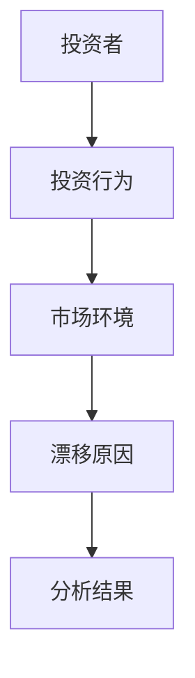
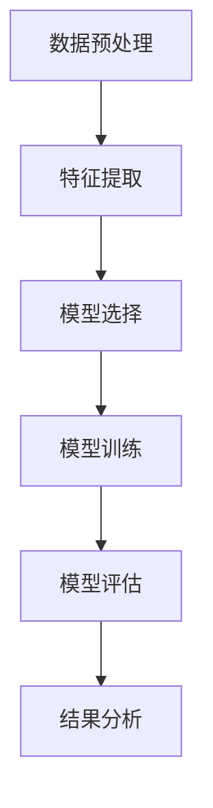
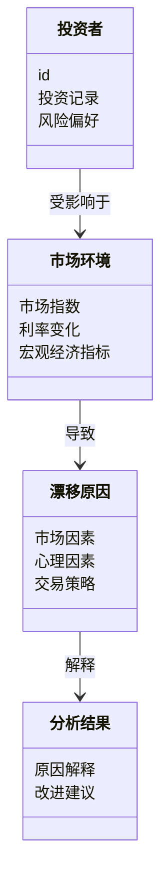
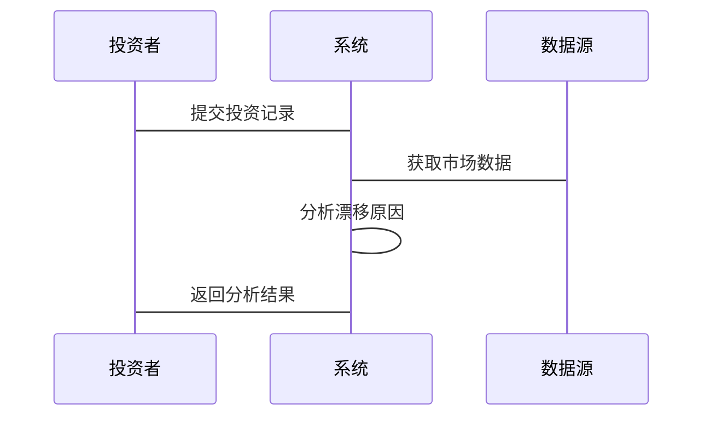

                 


# 构建智能化的个人投资风格漂移原因分析系统

## 关键词：投资风格漂移，人工智能，原因分析，系统构建，算法实现

## 摘要：本文详细探讨了构建智能化的个人投资风格漂移原因分析系统的各个方面。通过结合背景介绍、核心概念分析、算法原理讲解、系统架构设计、项目实战案例以及最佳实践，系统地阐述了如何利用人工智能技术有效分析和预测投资风格的变化原因，帮助投资者更好地优化投资策略。

---

## 第一部分：背景介绍

### 第1章：个人投资风格漂移概述

#### 1.1 问题背景
- **1.1.1 投资风格漂移的定义**：投资风格漂移指投资者的投资策略或偏好随时间发生变化的现象，这种变化可能导致投资表现与预期目标偏离。
- **1.1.2 漂移现象的普遍性与影响**：许多投资者在市场波动或个人因素影响下，投资风格会发生变化，导致投资组合的表现不稳定。
- **1.1.3 传统分析方法的局限性**：传统方法依赖于手动分析，效率低且容易出错，难以捕捉复杂的投资行为模式。

#### 1.2 问题描述
- **1.2.1 漂移原因的复杂性**：投资风格漂移受多种因素影响，如市场环境、投资者情绪、外部事件等，分析这些原因需要多维度的数据和复杂的模型。
- **1.2.2 数据驱动分析的必要性**：通过收集和分析大量数据，可以更准确地识别投资风格的变化原因。
- **1.2.3 智能化分析的需求**：利用人工智能技术，可以自动化、高效地分析投资风格漂移的原因，提供实时反馈和优化建议。

#### 1.3 问题解决
- **1.3.1 人工智能在投资分析中的应用**：机器学习和深度学习技术可以用于模式识别、时间序列分析和异常检测。
- **1.3.2 智能化系统的核心目标**：构建一个能够实时监测、分析和预测投资风格漂移原因的智能化系统。
- **1.3.3 系统实现的关键步骤**：数据采集、特征提取、模型训练、结果分析和系统优化。

#### 1.4 边界与外延
- **1.4.1 系统适用的范围**：适用于个人投资者和机构投资者，帮助他们分析投资风格的变化原因。
- **1.4.2 系统的局限性**：数据质量和完整性、模型泛化能力、计算资源限制等因素可能影响系统性能。
- **1.4.3 相关领域的联系**：与行为金融学、数据挖掘、时间序列分析等领域密切相关。

#### 1.5 核心概念与组成
- **1.5.1 漂移原因分析系统的基本构成**：数据采集模块、特征提取模块、模型训练模块、结果分析模块。
- **1.5.2 系统的核心要素**：数据源、特征工程、机器学习模型、分析工具。
- **1.5.3 系统的模块划分**：数据预处理、模型训练、结果解释、优化调整。

---

## 第二部分：核心概念与联系

### 第2章：漂移原因分析系统的核心原理

#### 2.1 漂移检测算法
- **2.1.1 基于机器学习的漂移检测**：使用聚类算法（如K-means）识别投资行为的变化模式。
- **2.1.2 时间序列分析方法**：通过ARIMA模型预测投资风格的变化趋势。
- **2.1.3 异常检测技术**：利用孤立森林算法识别异常的投资行为。

#### 2.2 特征提取与选择
- **2.2.1 投资行为特征的提取**：包括交易频率、资产配置比例、风险承受能力等。
- **2.2.2 数据特征的选择方法**：使用LASSO回归或递归特征消除法优化特征选择。
- **2.2.3 特征工程的优化**：通过标准化、主成分分析等方法提高特征的可解释性和模型性能。

#### 2.3 系统架构的实体关系


---

## 第三部分：算法原理讲解

### 第3章：漂移原因分析算法实现

#### 3.1 机器学习模型选择
- **3.1.1 聚类分析**：使用K-means算法将投资行为分为不同的集群，识别漂移模式。
- **3.1.2 时间序列分析**：采用LSTM神经网络模型预测投资风格的变化趋势。

#### 3.2 算法实现步骤
- **3.2.1 数据预处理**：清洗数据、处理缺失值、标准化特征。
- **3.2.2 模型训练**：使用训练数据训练机器学习模型。
- **3.2.3 模型评估**：通过准确率、召回率等指标评估模型性能。

#### 3.3 数学模型与公式
- **聚类分析的数学模型**：目标函数为最小化聚类中心与样本点之间的距离，表示为：
  $$ \text{目标函数} = \sum_{i=1}^{k} \sum_{j=1}^{n_i} (x_{ij} - c_i)^2 $$
  其中，$k$是聚类数，$n_i$是第$i$个聚类中的样本数，$x_{ij}$是第$j$个样本的特征向量，$c_i$是第$i$个聚类的中心。

- **LSTM模型的结构**：由输入门、遗忘门和输出门组成，表示为：
  $$ i_t = \sigma(W_i x_t + U_i h_{t-1}) $$
  $$ f_t = \sigma(W_f x_t + U_f h_{t-1}) $$
  $$ o_t = \sigma(W_o x_t + U_o h_{t-1}) $$
  $$ h_t = i_t \cdot \tanh(W_c x_t + U_c h_{t-1}) $$

#### 3.4 算法流程图


---

## 第四部分：系统分析与架构设计方案

### 第4章：系统架构设计

#### 4.1 问题场景介绍
- 投资者希望实时监测投资行为的变化，并了解导致投资风格漂移的具体原因。

#### 4.2 系统功能设计
- **数据采集模块**：从多个数据源（如交易记录、市场数据）获取投资行为数据。
- **特征提取模块**：将原始数据转换为可用于模型训练的特征向量。
- **模型训练模块**：使用机器学习算法训练漂移原因分析模型。
- **结果分析模块**：生成分析报告，解释投资风格漂移的原因。

#### 4.3 领域模型


#### 4.4 系统架构设计


#### 4.5 接口设计与交互流程


---

## 第五部分：项目实战

### 第5章：系统实现与案例分析

#### 5.1 环境安装
- 安装Python、机器学习库（如scikit-learn、TensorFlow）、数据处理库（如Pandas）。

#### 5.2 系统核心实现
```python
import pandas as pd
from sklearn.cluster import KMeans
from sklearn.preprocessing import StandardScaler

# 数据预处理
data = pd.read_csv('investment_data.csv')
scaler = StandardScaler()
scaled_data = scaler.fit_transform(data)

# 聚类分析
model = KMeans(n_clusters=3, random_state=42)
model.fit(scaled_data)

# 获取聚类中心
centers = model.cluster_centers_
```

#### 5.3 代码解读与分析
- 数据预处理：对数据进行标准化处理，确保各特征具有相似的尺度。
- 模型训练：使用K-means算法将投资行为分为三个集群，分别代表不同的投资风格。
- 聚类中心：表示每个集群的特征平均值，用于解释不同投资风格的特征。

#### 5.4 案例分析
- 使用真实数据进行测试，分析导致投资风格漂移的具体原因，如市场波动、投资者情绪变化等。

#### 5.5 项目小结
- 总结项目实现的关键步骤和成果，指出系统的优缺点，以及未来改进的方向。

---

## 第六部分：最佳实践

### 第6章：小结与注意事项

#### 6.1 小结
- 本文详细介绍了构建智能化的个人投资风格漂移原因分析系统的各个方面，从背景介绍到系统实现，全面展示了如何利用人工智能技术解决实际问题。

#### 6.2 注意事项
- 数据质量是系统性能的关键，需确保数据的完整性和准确性。
- 模型选择需根据具体问题进行调整，避免过度拟合。
- 系统的实时性和可扩展性是未来优化的重要方向。

#### 6.3 拓展阅读
- 推荐相关书籍和资源，帮助读者深入理解投资行为分析和人工智能技术的应用。

---

## 附录：数据集与工具包

### 附录A：数据集说明
- 数据来源：包括投资者交易记录、市场数据、宏观经济指标等。
- 数据格式：CSV格式，字段包括交易日期、资产配置、市场指数等。

### 附录B：工具包安装
- Python库：scikit-learn、TensorFlow、Pandas、Matplotlib。

---

以上是《构建智能化的个人投资风格漂移原因分析系统》的完整目录大纲和内容概述，希望对您有所帮助！

