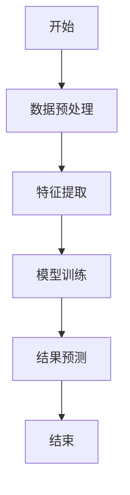
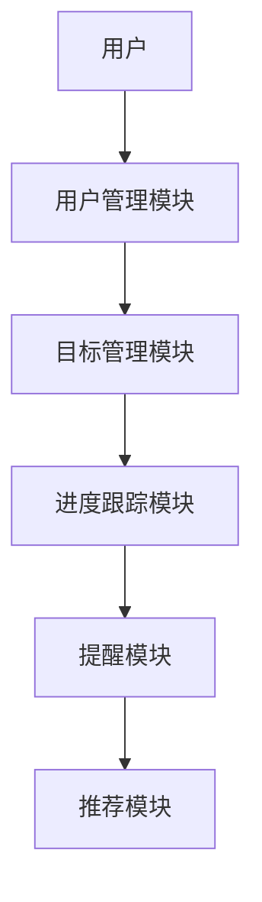

                 


# 第3章: 智能化目标跟踪助手的算法原理

## 3.1 推荐算法原理

### 3.1.1 基于协同过滤的推荐算法

协同过滤是一种常见的推荐算法，它基于用户之间的相似性来进行推荐。在财富管理目标跟踪中，协同过滤可以用于向用户推荐适合的财务目标或投资策略。

协同过滤的核心思想是：如果两个用户在过去的行为（如购买、评价等）相似，那么他们未来的行为也可能相似。在财富管理中，这可以应用于基于用户过去的财务行为推荐新的目标。

#### 协同过滤的实现步骤

1. **数据收集**：收集用户的历史数据，包括财务目标、投资行为等。
2. **相似度计算**：计算用户之间的相似度，常用的方法有余弦相似度、皮尔逊相关系数等。
3. **推荐生成**：根据相似用户的财务目标，推荐给当前用户。

### 3.1.2 基于内容的推荐算法

基于内容的推荐算法依赖于物品的属性来进行推荐。在财富管理中，这可以用于根据目标的属性推荐相关的目标。

#### 实现步骤

1. **特征提取**：从目标数据中提取特征，如目标类型、风险等级等。
2. **相似度计算**：计算目标之间的相似度。
3. **推荐生成**：根据当前用户的特征，推荐相似的目标。

### 3.1.3 混合推荐算法

混合推荐算法结合了协同过滤和基于内容的推荐算法的优点。它可以根据用户的行为和目标的属性进行推荐，从而提高推荐的准确性和多样性。

### 3.2 算法流程图



## 3.3 算法实现代码

以下是一个简单的协同过滤算法的Python实现示例：

```python
import numpy as np

def cosine_similarity(user_vector, item_vector):
    return np.dot(user_vector, item_vector) / (np.linalg.norm(user_vector) * np.linalg.norm(item_vector))

def collaborative_filtering(user_data, item_data, target_user):
    # 计算用户相似度
    user_similarity = {}
    for user in user_data:
        similarity = cosine_similarity(user_data[target_user], user_data[user])
        user_similarity[user] = similarity
    
    # 生成推荐列表
    recommendations = []
    for item in item_data:
        if item not in user_data[target_user]:
            total_similarity = 0
            for user in user_data:
                if user != target_user:
                    total_similarity += user_similarity[user] * item_data[item]
            recommendations.append((item, total_similarity))
    
    return sorted(recommendations, key=lambda x: x[1], reverse=True)
```

## 3.4 本章小结

本章详细介绍了智能化目标跟踪助手的推荐算法原理，包括协同过滤、基于内容的推荐和混合推荐算法。通过算法流程图和代码示例，展示了如何利用这些算法进行目标推荐。

---

# 第4章: 智能化目标跟踪助手的系统架构设计

## 4.1 系统整体架构

智能化目标跟踪助手的系统架构包括以下几个部分：

1. **用户管理模块**：负责用户的注册、登录和信息管理。
2. **目标管理模块**：用于用户设置和管理财务目标。
3. **进度跟踪模块**：实时跟踪目标的执行进度。
4. **提醒模块**：根据目标进度发送提醒信息。
5. **推荐模块**：基于用户行为推荐相关目标。

## 4.2 功能模块划分

### 4.2.1 用户管理模块

- 用户注册：用户可以通过邮箱或第三方登录（如微信、支付宝）注册。
- 用户登录：支持多种登录方式，包括密码登录和第三方登录。
- 用户信息管理：用户可以修改个人信息，如姓名、密码、绑定的银行账户等。

### 4.2.2 目标管理模块

- 目标设置：用户可以设置财务目标，如储蓄目标、投资目标等。
- 目标分类：将目标按类型分类，如短期目标、中期目标、长期目标。
- 目标优先级：用户可以设置目标的优先级，系统会根据优先级进行排序。

## 4.3 系统架构设计图



## 4.4 数据流设计

系统中数据的流动主要包括以下几种：

1. 用户信息从用户端输入到用户管理模块。
2. 目标信息从目标管理模块传输到进度跟踪模块。
3. 进度数据从进度跟踪模块传输到提醒模块。
4. 提醒信息从提醒模块发送到用户端。

## 4.5 本章小结

本章详细介绍了智能化目标跟踪助手的系统架构设计，包括功能模块划分和数据流设计。通过系统架构图展示了各模块之间的关系。

---

# 第5章: 智能化目标跟踪助手的项目实战

## 5.1 环境安装与配置

在开始项目实战之前，需要安装以下环境和工具：

- **Python**：3.6+
- **Pandas**：用于数据处理
- **Scikit-learn**：用于机器学习算法
- **Flask**：用于Web开发
- **Mermaid**：用于绘制图表

安装命令：

```bash
pip install pandas scikit-learn flask mermaid
```

## 5.2 系统核心实现代码

### 5.2.1 数据处理

```python
import pandas as pd

# 加载数据
data = pd.read_csv('wealth_goals.csv')

# 数据预处理
data.dropna(inplace=True)
data['date'] = pd.to_datetime(data['date'])
```

### 5.2.2 模型训练

```python
from sklearn.linear_model import LinearRegression

# 训练模型
model = LinearRegression()
model.fit(X_train, y_train)

# 预测结果
y_pred = model.predict(X_test)
```

### 5.2.3 接口设计

```python
from flask import Flask, request, jsonify

app = Flask(__name__)

@app.route('/api/predict', methods=['POST'])
def predict():
    data = request.json
    prediction = model.predict([[data['feature']]])
    return jsonify({'prediction': prediction.tolist()})

if __name__ == '__main__':
    app.run(debug=True)
```

## 5.3 案例分析

假设我们有一个用户，目标是6个月后储蓄10万元。根据历史数据，用户的储蓄速度为每月5000元。系统会提醒用户每月的储蓄进度，并根据预测模型调整目标。

## 5.4 界面设计

以下是系统界面的简单示例：

```html
<!DOCTYPE html>
<html>
<head>
    <title>财富目标跟踪助手</title>
</head>
<body>
    <h1>财富目标跟踪助手</h1>
    <div id="progress">
        <h2>进度跟踪</h2>
        <p>目标进度：80%</p>
        <p>剩余时间：2个月</p>
    </div>
    <div id="recommendations">
        <h2>推荐目标</h2>
        <ul>
            <li>目标1：储蓄10万元</li>
            <li>目标2：投资5万元</li>
        </ul>
    </div>
</body>
</html>
```

## 5.5 本章小结

本章通过实际案例分析和代码实现，展示了如何构建智能化的个人财富管理目标跟踪助手。通过环境安装、数据处理、模型训练和接口设计，读者可以掌握整个系统的实现过程。

---

# 《构建智能化的个人财富管理目标跟踪助手》摘要

智能化的个人财富管理目标跟踪助手是一种基于人工智能技术的工具，旨在帮助用户实现财务目标的智能化管理和跟踪。本文详细介绍了构建该助手的背景、核心概念、算法原理、系统架构设计和项目实战。通过协同过滤、基于内容的推荐算法和混合推荐算法的实现，展示了如何利用机器学习技术进行目标推荐。同时，通过系统架构设计和实际案例分析，展示了如何实现一个完整的财富管理目标跟踪系统。最终，本文为读者提供了一个构建智能化财富管理目标跟踪助手的全面指南。

