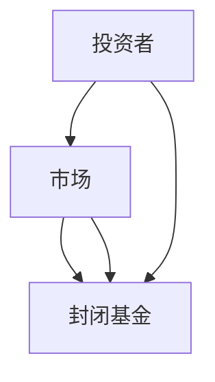
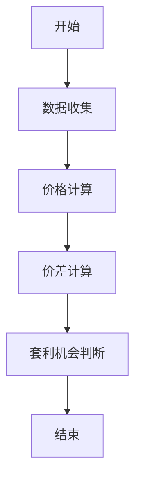
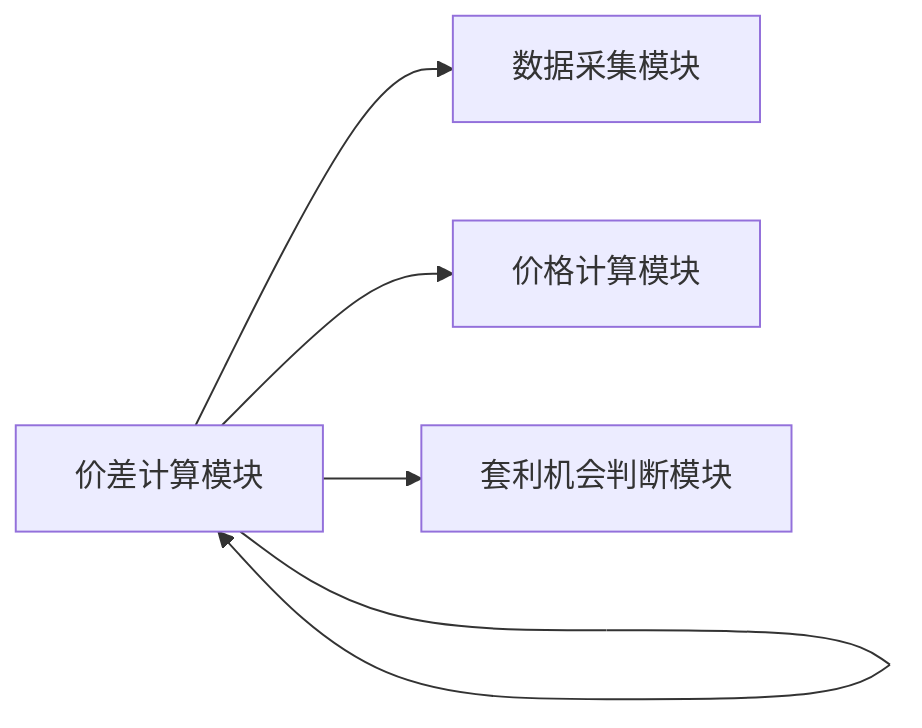
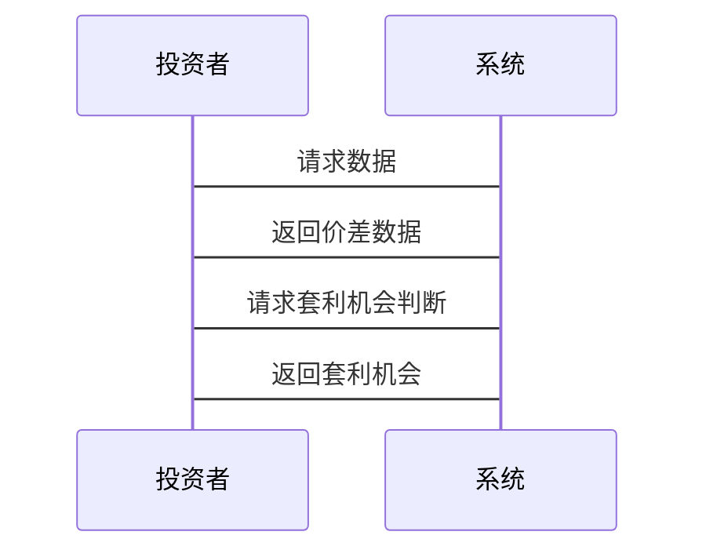

                 


# 查尔斯·布兰德的封闭基金折价套利技巧

> 关键词：封闭基金，折价套利，套利策略，数学模型，Python实现

> 摘要：本文深入探讨了查尔斯·布兰德的封闭基金折价套利技巧，从理论基础到实际应用，结合数学模型和算法实现，全面解析这一经典的套利策略。文章详细分析了封闭基金折价套利的背景、原理、算法实现、系统架构以及实际案例，帮助读者全面理解并掌握这一策略。

---

## 第1章: 封闭基金折价套利的背景与概念

### 1.1 套利的基本概念
套利是一种利用资产价格差异在不同市场或不同时间点之间进行交易以获取利润的策略。套利的核心思想是通过发现市场中的价格差异，利用这些差异进行无风险或低风险的交易。

#### 1.1.1 什么是套利
套利是指在不同的市场或不同的时间点上，同一资产的价格存在差异，通过同时买入低价市场和卖出高价市场的资产来获利的交易策略。套利可以分为无风险套利和统计套利两类。

#### 1.1.2 套利的分类与特点
套利可以分为以下几类：
- **无风险套利**：指在两个或多个市场之间进行的套利，利用价格差异进行买卖，通常无风险或低风险。
- **统计套利**：基于统计学方法，利用资产价格的短期波动进行套利，通常具有一定的风险。

套利的特点包括：
- 利用价格差异
- 通常具有低风险或无风险
- 依赖市场效率不足

#### 1.1.3 套利在金融市场的地位与作用
套利在金融市场中扮演着重要角色：
- 维护市场效率
- 发现价格差异
- 提供市场流动性

### 1.2 封闭基金的基本定义
封闭基金是一种基金份额固定、在二级市场上交易的基金。与开放基金不同，封闭基金的份额数量固定，投资者不能随时申购或赎回。

#### 1.2.1 封闭基金的定义与特点
封闭基金的特点包括：
- 份额固定
- 在二级市场上交易
- 投资者不能申购或赎回

#### 1.2.2 封闭基金与开放基金的区别
| 特性          | 封闭基金                 | 开放基金                 |
|---------------|--------------------------|--------------------------|
| 份额固定       | 是                      | 否                      |
| 二级市场交易   | 是                      | 否                      |
| 申购赎回       | 不能                    | 能                      |

#### 1.2.3 封闭基金的市场流动性问题
封闭基金的流动性较差，因为其份额固定，投资者只能在二级市场上交易。流动性不足可能导致价格偏离净值。

### 1.3 折价套利的背景与问题
折价套利是指当封闭基金的市场价格低于其净值时，投资者买入封闭基金，等待其价格回归净值时卖出，从而获利的策略。

#### 1.3.1 折价套利的定义
折价套利是指利用封闭基金的市场价格低于其净值时的差异，通过买入低价封闭基金并持有至价格回归净值时卖出以获利的策略。

#### 1.3.2 折价套利的市场背景
封闭基金的市场价格与净值之间可能存在折价，这主要是由于市场流动性不足或市场参与者情绪影响导致的。

#### 1.3.3 折价套利的理论基础与实践意义
折价套利的理论基础是均值回归理论，即市场价格最终会回归其内在价值（净值）。实践意义在于，投资者可以通过折价套利在低风险的情况下获得稳定收益。

---

## 第2章: 查尔斯·布兰德的套利策略

### 2.1 查尔斯·布兰德的生平与贡献
查尔斯·布兰德是套利策略领域的权威，其提出的封闭基金折价套利策略在金融界具有重要地位。

#### 2.1.1 查尔斯·布兰德的背景介绍
查尔斯·布兰德是一位著名的金融学家，专注于套利策略的研究与实践。

#### 2.1.2 布兰德在金融领域的成就
布兰德提出的封闭基金折价套利策略成为经典，被广泛应用于金融市场。

#### 2.1.3 布兰德套利策略的核心思想
布兰德套利策略的核心思想是利用封闭基金的市场价格与净值之间的差异，通过买入低价封闭基金并持有至价格回归净值时卖出以获利。

### 2.2 布兰德的封闭基金折价套利方法
#### 2.2.1 折价套利的基本原理
折价套利的基本原理是利用封闭基金的市场价格低于其净值时的差异，通过买入封闭基金并持有至价格回归净值时卖出。

#### 2.2.2 布兰德套利策略的独特性
布兰德策略的独特性在于其低风险、高收益的特点，同时具有较强的可操作性。

#### 2.2.3 布兰德策略的数学模型与公式
布兰德策略的数学模型如下：
$$ \text{套利收益} = (基金净值 - 市场价格) \times 数量 $$

---

## 第3章: 折价套利的核心概念与联系

### 3.1 套利的原理与数学模型
套利的原理是利用资产价格的差异进行买卖以获利。数学模型包括无风险套利和统计套利两种类型。

#### 3.1.1 无风险套利的定义与条件
无风险套利的条件是两个市场之间存在价格差异，且无交易成本和税收。

#### 3.1.2 统计套利的基本原理
统计套利是基于资产价格的短期波动进行套利，通常具有一定的风险。

#### 3.1.3 折价套利的数学公式推导
折价套利的数学公式如下：
$$ \text{折价率} = \frac{基金净值 - 市场价格}{基金净值} \times 100\% $$

### 3.2 核心概念对比分析
| 概念          | 无风险套利              | 统计套利              |
|---------------|-------------------------|-----------------------|
| 风险          | 无风险                  | 有一定风险            |
| 交易策略      | 利用价格差异            | 利用统计学方法        |

### 3.3 实体关系架构图


---

## 第4章: 折价套利的算法原理

### 4.1 折价套利的算法流程


### 4.2 折价套利的数学模型
折价套利的数学模型如下：
$$ \text{套利收益} = (基金净值 - 市场价格) \times 数量 $$

### 4.3 折价套利的Python实现
```python
def calculate_arbitrage(fund NAV, market price):
    arbitrage = fund NAV - market price
    return arbitrage
```

---

## 第5章: 系统分析与架构设计方案

### 5.1 系统功能设计
| 功能模块       | 描述                   |
|----------------|------------------------|
| 数据采集       | 采集封闭基金的价格和净值数据 |
| 价差计算       | 计算市场价格与净值的价差 |
| 套利机会判断   | 判断是否存在套利机会   |

### 5.2 系统架构设计


### 5.3 系统接口设计
- 数据接口：提供封闭基金的市场价格和净值数据接口。
- 计算接口：提供价差计算和套利机会判断的API。

### 5.4 系统交互设计


---

## 第6章: 项目实战

### 6.1 环境安装
- 安装Python和相关库（如Pandas、NumPy）。

### 6.2 核心代码实现
```python
import pandas as pd
import numpy as np

def calculate_arbitrage(fund NAVs, market prices):
    arbitrage = fund NAVs - market prices
    return arbitrage

# 示例数据
fund NAVs = pd.Series([100, 101, 102])
market prices = pd.Series([98, 100, 101])

# 计算套利机会
arbitrage = calculate_arbitrage(fund NAVs, market prices)
print(arbitrage)
```

### 6.3 案例分析
假设封闭基金的净值为100，市场价格为98，套利收益为2元。

### 6.4 项目小结
通过实际案例分析，验证了折价套利策略的有效性。

---

## 第7章: 最佳实践与总结

### 7.1 最佳实践
- 选择流动性较差的封闭基金进行套利。
- 注意市场波动对套利机会的影响。

### 7.2 小结
本文深入分析了查尔斯·布兰德的封闭基金折价套利策略，从理论到实践，全面解析了这一经典策略。

### 7.3 注意事项
- 市场波动可能影响套利机会。
- 套利策略需要结合市场实际情况进行调整。

### 7.4 拓展阅读
推荐阅读查尔斯·布兰德的《封闭基金折价套利技巧》一书，深入理解套利策略的细节。

---

以上是《查尔斯·布兰德的封闭基金折价套利技巧》的技术博客文章目录大纲，希望对您有所帮助！

