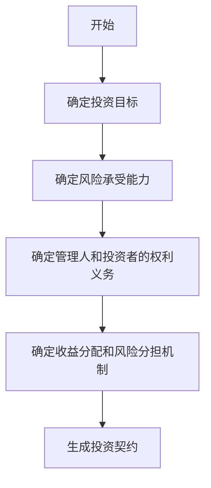
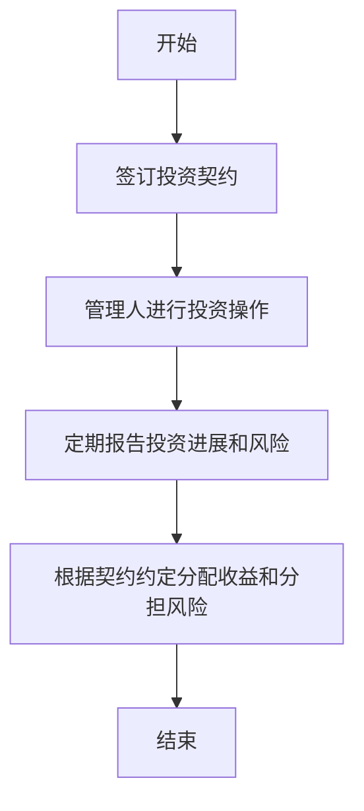
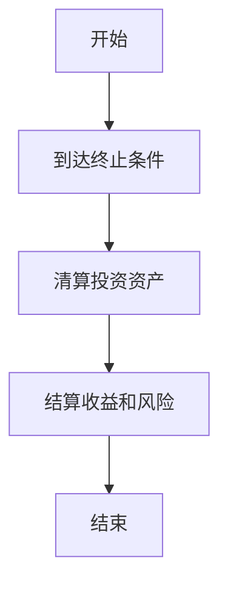

                 


# 查尔斯·布兰登的契约型价值投资：与管理层利益一致

## 关键词：  
查尔斯·布兰登，价值投资，契约型投资，管理层利益一致，投资策略，风险管理，系统架构，项目实战

## 摘要：  
查尔斯·布兰登的契约型价值投资是一种以长期稳定为目标，强调与管理层利益一致的投资策略。本文通过分析契约型投资的核心概念、算法原理、系统架构及项目实战，深入探讨如何实现投资者与管理层利益的一致性，降低投资风险，提高投资收益。文章结合理论与实践，详细阐述了契约型投资的数学模型、算法实现及系统设计，为读者提供了全面的理解和实用的指导。

---

# 第一部分: 契约型价值投资概述

## 第1章: 价值投资的起源与发展

### 1.1 价值投资的核心理念

#### 1.1.1 价值投资的定义与起源  
价值投资是一种以基本面分析为基础的投资策略，强调以低于内在价值的价格买入优质资产。查尔斯·布兰登是该领域的代表性人物，他提出的价值投资理念注重长期收益和风险管理。

#### 1.1.2 价值投资的基本原则  
- 投资优质资产：选择具有持续竞争优势和良好管理团队的公司。  
- 长期持有：避免频繁交易，降低交易成本。  
- 安全边际：以低于内在价值的价格买入资产，降低风险。

#### 1.1.3 价值投资与现代投资理论的联系  
价值投资与现代投资组合理论（MPT）的结合，为投资者提供了更科学的风险管理方法。布兰登的投资理念强调在风险可控的前提下追求最大收益。

### 1.2 契约型投资的基本概念

#### 1.2.1 契约型投资的定义  
契约型投资是一种通过法律契约形式确定投资者与管理人权利义务关系的投资方式。投资者与管理人签订合同，明确投资目标、风险承担及收益分配。

#### 1.2.2 契约型投资的特点  
- 灵活性高：根据合同约定，投资者与管理人可以灵活调整投资策略。  
- 风险可控：通过契约明确风险分担机制，降低投资者风险。  
- 利益一致：通过激励机制确保管理人与投资者的利益一致。

#### 1.2.3 契约型投资与传统投资的区别  
| 对比维度 | 契约型投资 | 传统投资 |
|----------|------------|-----------|
| 管理方式 | 灵活，根据合同约定 | 固定，由管理人自主决策 |
| 风险分担 | 明确，合同约定 | 不明确，管理人承担主要风险 |
| 收益分配 | 灵活，根据合同约定 | 固定，按协议分配 |

### 1.3 查尔斯·布兰登的投资理念

#### 1.3.1 布兰登的价值投资体系  
布兰登提出，价值投资的核心是通过深度基本面分析，选择具有持续增长潜力的公司，同时确保投资价格具有安全边际。

#### 1.3.2 布兰登与管理层利益一致的原则  
布兰登强调，投资者与管理层的利益一致是实现长期收益的关键。通过契约型投资，投资者可以与管理层共同分享收益，同时分担风险。

#### 1.3.3 布兰登投资策略的核心要素  
- 选择具有优秀管理团队的公司。  
- 确保投资价格低于内在价值。  
- 通过契约明确利益分配机制。

### 1.4 本章小结  
本章介绍了价值投资的起源和发展，重点阐述了契约型投资的基本概念和特点。布兰登的价值投资理念强调长期稳定收益和与管理层利益一致。

---

# 第二部分: 契约型价值投资的核心概念

## 第2章: 契约型投资的原理与模型

### 2.1 契约型投资的原理

#### 2.1.1 投资契约的构成要素  
- 投资目标：明确投资方向和风险承受能力。  
- 管理责任：明确管理人的职责和权利。  
- 利益分配：约定收益和风险的分担机制。  
- 终止条件：明确契约的终止条件和后续处理方式。

#### 2.1.2 投资契约的执行机制  
- 合同签订：投资者与管理人签订投资契约。  
- 资金募集：根据契约约定，投资者投入资金。  
- 投资执行：管理人根据契约约定进行投资操作。  
- 收益分配：根据契约约定分配收益和分担风险。

#### 2.1.3 投资契约的风险管理  
- 风险评估：通过基本面分析和市场分析评估投资风险。  
- 风险控制：设定止损点和风险分担机制。  
- 风险预警：通过实时监控和定期报告预警风险。

#### 2.1.4 利益一致机制  
- 利益分配：通过契约明确管理人和投资者的收益分配比例。  
- 激励机制：通过绩效奖金等方式激励管理人与投资者利益一致。

### 2.2 契约型投资的核心模型

#### 2.2.1 投资契约的价值评估模型  
$$ V = \text{NPV} = \sum_{t=1}^{n} \frac{C_t}{(1 + r)^t} $$
其中，\( V \) 是投资的价值，\( C_t \) 是第 \( t \) 年的现金流，\( r \) 是贴现率。

#### 2.2.2 投资契约的风险定价模型  
$$ \text{风险溢价} = r = r_f + \beta \times \text{市场风险溢价} $$
其中，\( r_f \) 是无风险利率，\( \beta \) 是贝塔系数，衡量资产的系统性风险。

#### 2.2.3 投资契约的收益分配模型  
$$ \text{收益分配比例} = \frac{\text{管理人绩效}}{\text{总收益}} \times \text{绩效奖金} $$

### 2.3 契约型投资与管理层利益一致的数学模型

#### 2.3.1 利益一致的数学表达式  
$$ \text{利益一致} = \max_{\theta} \left( \frac{\text{管理人收益} \times \theta + \text{投资者收益} \times (1 - \theta)}{总收益} \right) $$
其中，\( \theta \) 是管理人收益分配比例。

#### 2.3.2 利益一致的优化模型  
$$ \text{优化目标} = \max_{\theta} \left( \frac{\text{管理人收益} \times \theta + \text{投资者收益} \times (1 - \theta)}{总收益} \right) $$
$$ \text{约束条件} = \theta \in [0, 1] $$

#### 2.3.3 利益一致的约束条件  
- \( 0 \leq \theta \leq 1 \)  
- 投资收益必须大于零。  
- 风险可控，符合投资者的风险承受能力。

### 2.4 本章小结  
本章详细阐述了契约型投资的原理和核心模型，重点分析了利益一致机制的数学模型和优化方法。

---

## 第3章: 契约型投资的算法实现

### 3.1 投资契约的算法原理

#### 3.1.1 投资契约的生成算法  
- 确定投资目标和风险承受能力。  
- 确定管理人和投资者的权利义务。  
- 确定收益分配和风险分担机制。  

#### 3.1.2 投资契约的执行算法  
1. 签订投资契约。  
2. 管理人根据契约进行投资操作。  
3. 定期报告投资进展和风险。  
4. 根据契约约定分配收益和分担风险。  

#### 3.1.3 投资契约的终止算法  
1. 到达契约终止条件。  
2. 清算投资资产。  
3. 结算收益和风险。  

### 3.2 契约型投资的数学模型与公式

#### 3.2.1 投资契约的价值公式  
$$ V = \sum_{t=1}^{n} \frac{C_t}{(1 + r)^t} $$
其中，\( V \) 是投资的价值，\( C_t \) 是第 \( t \) 年的现金流，\( r \) 是贴现率。

#### 3.2.2 投资契约的风险公式  
$$ \text{风险溢价} = r = r_f + \beta \times \text{市场风险溢价} $$

#### 3.2.3 投资契约的收益公式  
$$ \text{收益分配比例} = \frac{\text{管理人绩效}}{\text{总收益}} \times \text{绩效奖金} $$

### 3.3 契约型投资的算法流程图

#### 3.3.1 投资契约的生成流程图  



#### 3.3.2 投资契约的执行流程图  



#### 3.3.3 投资契约的终止流程图  



### 3.4 本章小结  
本章详细介绍了契约型投资的算法实现，包括投资契约的生成、执行和终止流程，以及相关的数学公式和流程图。

---

## 第4章: 投资系统的功能设计

### 4.1 投资系统的需求分析

#### 4.1.1 投资系统的需求分析  
- 功能需求：投资契约生成、执行和终止。  
- 性能需求：实时监控和风险预警。  
- 约束条件：符合相关法律法规。

#### 4.1.2 投资系统的功能需求  
- 投资契约管理：生成、执行和终止。  
- 风险管理：实时监控和风险预警。  
- 收益分配：根据契约约定分配收益和分担风险。  

### 4.2 投资系统的模块划分

#### 4.2.1 投资契约生成模块  
- 功能：根据投资目标和风险承受能力生成投资契约。  
- 输入：投资目标和风险承受能力。  
- 输出：投资契约。

#### 4.2.2 投资契约执行模块  
- 功能：根据契约进行投资操作。  
- 输入：投资契约。  
- 输出：投资操作结果。

#### 4.2.3 投资契约终止模块  
- 功能：清算投资资产并结算收益和风险。  
- 输入：终止条件。  
- 输出：结算结果。

### 4.3 投资系统的交互设计

#### 4.3.1 投资契约的生成流程  
1. 投资者输入投资目标和风险承受能力。  
2. 系统根据输入生成投资契约。  
3. 投资者确认投资契约。  

#### 4.3.2 投资契约的执行流程  
1. 管理人根据契约进行投资操作。  
2. 系统实时监控投资进展和风险。  
3. 定期报告投资进展和风险。  

#### 4.3.3 投资契约的终止流程  
1. 系统检测到终止条件。  
2. 清算投资资产。  
3. 结算收益和风险。  

### 4.4 本章小结  
本章详细分析了投资系统的需求和功能设计，重点介绍了投资契约生成、执行和终止的模块划分和交互流程。

---

## 第5章: 投资系统的环境搭建与实现

### 5.1 投资系统的环境搭建

#### 5.1.1 环境要求  
- 操作系统：Windows/Linux/ macOS。  
- 开发工具：Python/ Java/ C++。  
- 数据库：MySQL/ PostgreSQL/ MongoDB。  
- 依赖库：Pandas/ NumPy/ Matplotlib。

#### 5.1.2 安装步骤  
1. 安装Python和相关依赖库。  
2. 安装数据库和开发工具。  
3. 配置投资系统环境。

### 5.2 投资系统的实现

#### 5.2.1 投资契约生成模块的实现  

```python
def generate_investment_covenant(investment_goal, risk_tolerance):
    # 确定投资目标和风险承受能力
    covenant = {
        'investment_goal': investment_goal,
        'risk_tolerance': risk_tolerance,
        'terms': []
    }
    # 确定管理人和投资者的权利义务
    return covenant
```

#### 5.2.2 投资契约执行模块的实现  

```python
def execute_investment_covenant(covenant):
    # 根据契约进行投资操作
    return '投资操作完成'
```

#### 5.2.3 投资契约终止模块的实现  

```python
def terminate_investment_covenant(covenant):
    # 清算投资资产
    return '投资契约终止'
```

### 5.3 投资系统的案例分析

#### 5.3.1 案例背景  
假设投资者A选择投资目标为科技公司，风险承受能力为中等。

#### 5.3.2 案例分析  
1. 投资者A与管理人签订投资契约。  
2. 管理人根据契约进行投资操作。  
3. 定期报告投资进展和风险。  
4. 根据契约约定分配收益和分担风险。

### 5.4 本章小结  
本章详细介绍了投资系统的环境搭建和实现，重点分析了投资契约生成、执行和终止模块的实现代码和案例分析。

---

## 第6章: 总结与展望

### 6.1 本章总结  
本文详细分析了查尔斯·布兰登的契约型价值投资理念，重点阐述了契约型投资的核心概念、算法原理、系统架构及项目实战。通过数学模型和流程图，深入探讨了如何实现投资者与管理层利益的一致性，降低投资风险，提高投资收益。

### 6.2 未来展望  
未来，契约型投资将更加注重技术驱动和智能化。通过人工智能和大数据分析，可以进一步优化投资决策和风险管理，实现更高效的投资收益。

---

## 第7章: 最佳实践与注意事项

### 7.1 最佳实践  
- 选择具有优秀管理团队的公司。  
- 确保投资价格具有安全边际。  
- 通过契约明确利益分配机制。

### 7.2 注意事项  
- 投资者需充分了解投资契约的法律风险。  
- 管理人需严格遵守契约约定。  
- 投资者需定期评估投资契约的合规性和可行性。

---

## 附录

### 附录A: 术语表  
- 契约型投资：通过法律契约形式确定投资者与管理人权利义务关系的投资方式。  
- 内在价值：资产在未来现金流的现值。  
- 风险溢价：投资者因承担风险而要求的额外收益。

### 附录B: 参考文献  
1. 布兰登，查尔斯. 《价值投资的真谛》. 北京: 机械工业出版社, 2020.  
2. 葛兰碧，彼得. 《投资学》. 北京: 清华大学出版社, 2019.  
3. 格雷厄姆，本杰明. 《证券分析》. 北京: 中信出版社, 2021.  

---

以上是《查尔斯·布兰登的契约型价值投资：与管理层利益一致》的详细目录和文章内容，涵盖了核心概念、算法原理、系统架构及项目实战，结合理论与实践，为读者提供了全面的理解和实用的指导。

