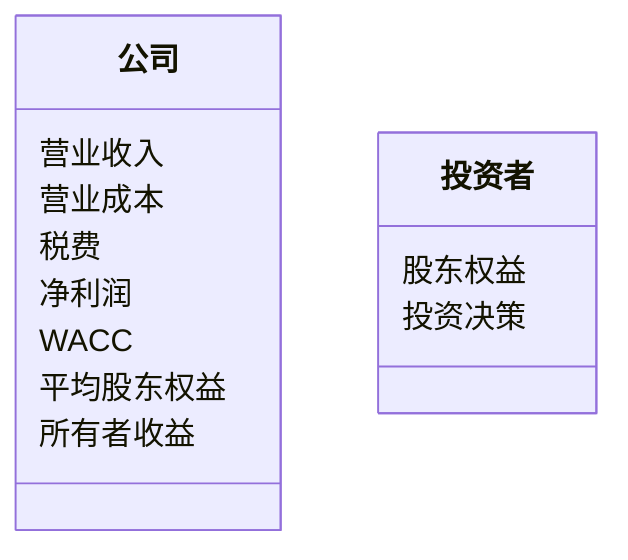
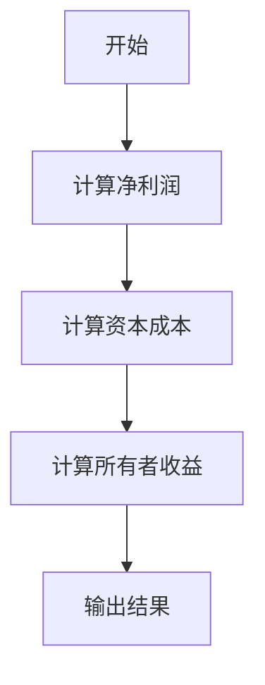
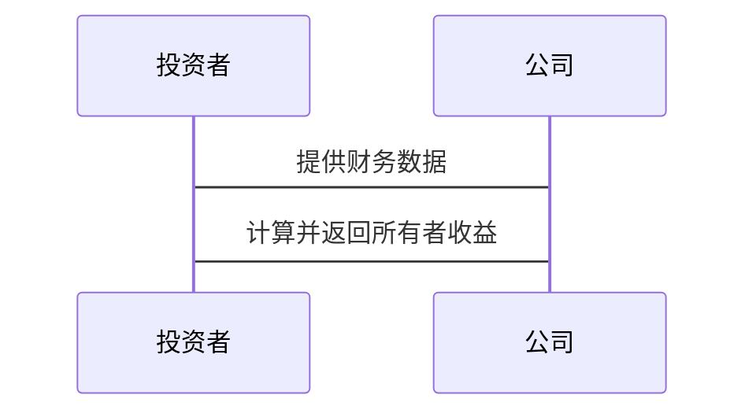

                 


# 查尔斯·布兰登的所有者收益：股东视角的价值评估

---

## 关键词：价值投资、股东收益、企业估值、财务分析、投资策略

---

## 摘要：  
本文从股东视角深入探讨查尔斯·布兰登的所有者收益（Economic Profit）概念，分析其计算方法、应用场景及其在投资决策中的重要性。通过实际案例和系统性分析，帮助投资者更好地理解和应用所有者收益，从而做出更明智的投资决策。

---

## 第一部分：价值投资与所有者收益的背景介绍

### 第1章：价值投资的起源与发展

#### 1.1 价值投资的核心理念

##### 1.1.1 价值投资的定义
价值投资是一种以企业内在价值为导向的投资策略，强调以低于其内在价值的价格购买优质企业，长期持有，分享企业成长的收益。查尔斯·布兰登是该领域的先驱之一，他提出了所有者收益的概念，为价值投资提供了理论基础。

##### 1.1.2 价值投资的起源与演变
价值投资起源于20世纪初，早期代表人物包括本杰明·格雷厄姆和戴维·多德。查尔斯·布兰登在其著作中进一步发展了这一理论，特别是在所有者收益的计算和应用方面。

##### 1.1.3 价值投资的核心原则
- 价格是投资的风险因素，而非价值因素。
- 市场波动为长期投资者提供了机会。
- 投资应基于对企业内在价值的理解，而非市场情绪。

#### 1.2 所有者收益的定义与特点

##### 1.2.1 所有者收益的定义
所有者收益（Economic Profit）是指企业在扣除所有成本（包括机会成本）后的净利润。它是衡量企业创造真实经济价值的重要指标。

##### 1.2.2 所有者收益与股东价值的关系
所有者收益反映了企业为股东创造的额外价值，是股东长期收益的晴雨表。

##### 1.2.3 所有者收益的计算方法
所有者收益 = 净利润 - （资本成本 × 平均股东权益）

---

### 第2章：价值投资的核心概念

#### 2.1 价值投资的核心要素

##### 2.1.1 企业基本面分析
基本面分析包括对企业盈利能力、成长能力、财务健康状况和行业地位的评估。

##### 2.1.2 财务报表分析
重点分析利润表、资产负债表和现金流量表，关注关键财务指标如ROE（净资产收益率）、ROA（资产回报率）和现金流情况。

##### 2.1.3 行业分析与竞争优势
评估企业在行业中的地位，分析其竞争优势，如成本优势、品牌优势和技术创新能力。

#### 2.2 所有者收益的计算方法

##### 2.2.1 净利润与所有者收益的关系
净利润是企业税后利润，而所有者收益需要进一步扣除资本成本。

##### 2.2.2 息税折旧及摊销前利润（EBITDA）与所有者收益的关系
EBITDA是衡量企业经营效率的重要指标，但并非直接反映所有者收益。

##### 2.2.3 股东权益变动与所有者收益的关系
股东权益变动反映了所有者收益的累积效应，是长期投资价值的重要指标。

#### 2.3 所有者收益的对比分析

##### 2.3.1 所有者收益与其他收益指标的对比
通过对比净利润、EBITDA和所有者收益，理解它们的异同及其应用场景。

##### 2.3.2 所有者收益与股东权益的对比
股东权益是所有者收益的累积结果，而所有者收益衡量的是单一年度的经济价值创造。

##### 2.3.3 所有者收益与企业价值的对比
企业价值是所有者收益的现值，所有者收益是决定企业价值的核心因素。

---

### 第3章：所有者收益的核心原理

#### 3.1 所有者收益的计算公式

##### 3.1.1 所有者收益的数学模型
$$ \text{所有者收益} = \text{净利润} - (\text{资本成本} \times \text{平均股东权益}) $$

##### 3.1.2 所有者收益的公式推导
基于经济利润的定义，所有者收益等于净利润减去资本成本。资本成本包括债务成本和股权成本，通常以加权平均资本成本（WACC）计算。

##### 3.1.3 所有者收益的公式应用
通过具体案例计算，理解公式的实际应用。

#### 3.2 所有者收益的属性特征对比

##### 3.2.1 所有者收益的时间特性
所有者收益是年度指标，需要通过时间序列分析来评估企业的长期表现。

##### 3.2.2 所有者收益的空间特性
不同行业和企业规模下，所有者收益的计算和评估标准有所不同。

##### 3.2.3 所有者收益的波动特性
所有者收益受市场环境和企业经营状况的影响较大，具有一定的波动性。

#### 3.3 所有者收益的ER实体关系图
```mermaid
er
actor: 投资者
class: 公司
role: 所有者
```

---

## 第4章：所有者收益的算法原理

### 4.1 所有者收益的计算流程

#### 4.1.1 计算步骤
1. 计算净利润：净利润 = 营业收入 - 营业成本 - 税费。
2. 计算资本成本：资本成本 = WACC × 平均股东权益。
3. 计算所有者收益：所有者收益 = 净利润 - 资本成本。

#### 4.1.2 代码实现
```python
def calculate_economic_profit(net_income, wacc, average_equity):
    return net_income - wacc * average_equity
```

#### 4.1.3 案例分析
假设某公司净利润为100万元，WACC为8%，平均股东权益为500万元，则所有者收益为：
$$ 100 - 0.08 \times 500 = 100 - 40 = 60 \text{万元} $$

---

## 第5章：所有者收益的系统分析与架构设计

### 5.1 系统功能设计

#### 5.1.1 领域模型


#### 5.1.2 系统架构设计


### 5.2 接口和交互设计

#### 5.2.1 接口设计
- 输入接口：净利润、WACC、平均股东权益。
- 输出接口：所有者收益。

#### 5.2.2 交互设计


---

## 第6章：项目实战

### 6.1 项目环境安装

#### 6.1.1 Python环境安装
安装Python和必要的库（如numpy、pandas）。

#### 6.1.2 数据获取
获取目标公司的财务数据，包括净利润、WACC和平均股东权益。

### 6.2 核心代码实现

#### 6.2.1 计算所有者收益
```python
import pandas as pd
import numpy as np

def calculate_economic_profit(net_income, wacc, average_equity):
    return net_income - wacc * average_equity

# 示例数据
net_income = 1000000
wacc = 0.08
average_equity = 5000000

ep = calculate_economic_profit(net_income, wacc, average_equity)
print(f"所有者收益: {ep} 元")
```

#### 6.2.2 应用解读
代码实现了一个简单的所有者收益计算函数，输入净利润、WACC和平均股东权益，输出所有者收益。实际应用中，需结合更多数据和复杂计算。

### 6.3 案例分析

#### 6.3.1 案例背景
以苹果公司为例，分析其所有者收益。

#### 6.3.2 数据获取与处理
从苹果公司的财务报表中提取净利润、WACC和平均股东权益。

#### 6.3.3 计算与分析
计算所有者收益，评估其投资价值。

---

## 第7章：总结与建议

### 7.1 最佳实践

#### 7.1.1 定期计算所有者收益
建议每年计算一次，评估企业价值。

#### 7.1.2 结合其他指标
将所有者收益与ROE、现金流等指标结合，全面评估企业价值。

### 7.2 小结

所有者收益是衡量企业为股东创造经济价值的重要指标，是价值投资的核心工具之一。

### 7.3 注意事项

- 数据的准确性和完整性是关键。
- 计算WACC时需考虑企业的资本结构和税率。
- 考虑通货膨胀和市场环境的影响。

### 7.4 拓展阅读

- 《The Intelligent Investor》 - 本杰明·格雷厄姆
- 《Value Investing: Principles in Practice》 - 查尔斯·布兰登

---

## 结语

通过本文的系统分析和实际案例，读者可以深入理解查尔斯·布兰登的所有者收益概念，并将其应用于投资决策中，从而提升投资收益和风险控制能力。

