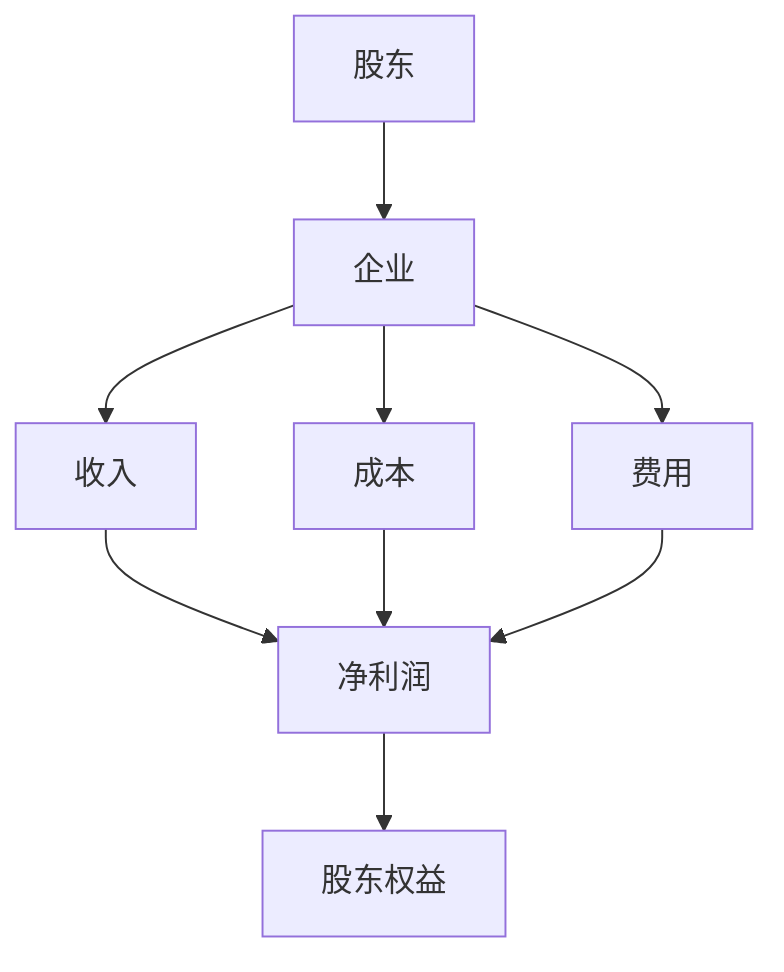
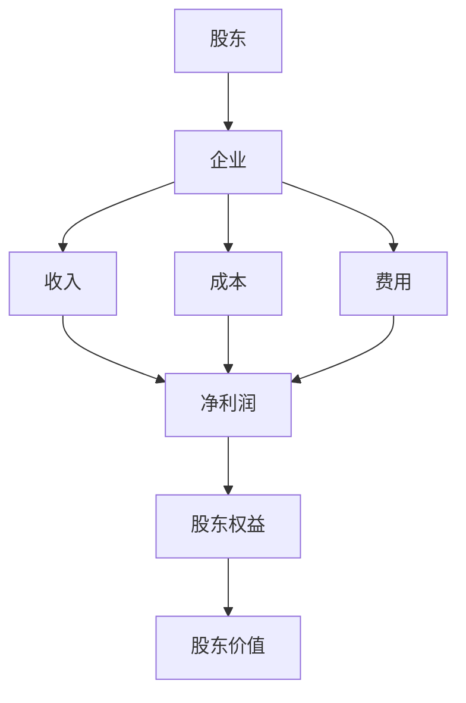
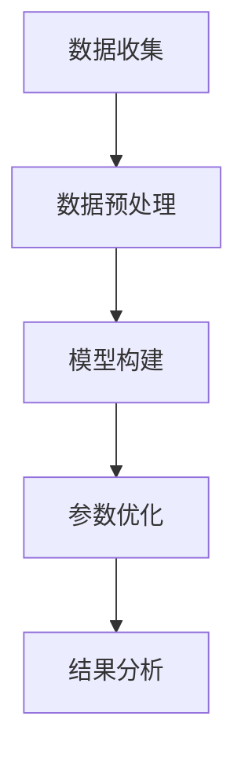
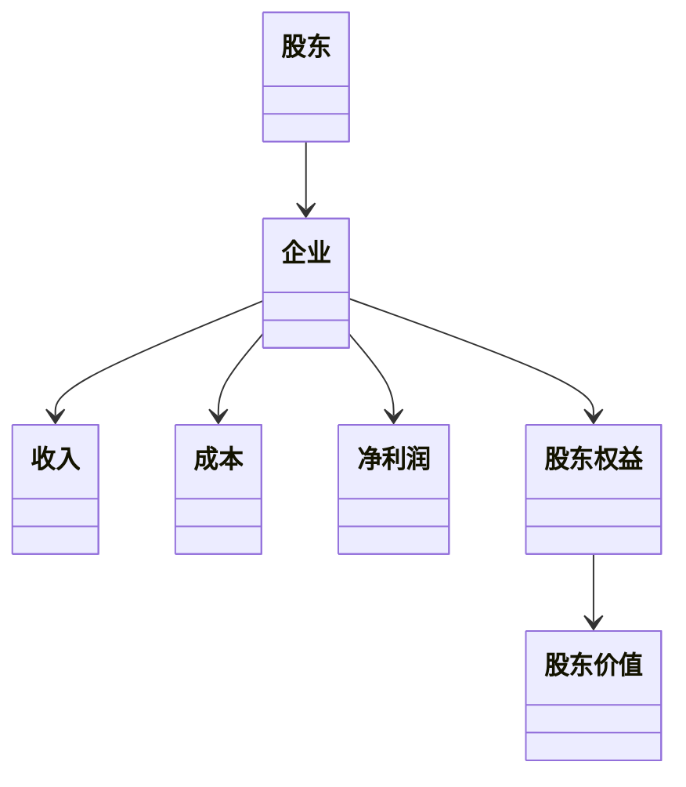

                 


# 查尔斯·布兰登的所有者盈利：股东视角的价值评估

**关键词：** 所有者盈利，股东视角，价值评估，查尔斯·布兰登，盈利能力，股东价值，财务分析

**摘要：** 本文从股东视角出发，详细探讨了查尔斯·布兰登的所有者盈利概念，分析了企业盈利能力与股东价值之间的关系，并通过数学模型、算法原理和实际案例，系统地阐述了如何进行价值评估。文章内容涵盖背景介绍、核心概念、算法原理、系统分析、项目实战及最佳实践，旨在为读者提供全面而深入的指导。

---

## 第1章：股东视角的盈利评估概述

### 1.1 问题背景与问题描述

#### 1.1.1 企业盈利的核心要素
企业在追求盈利的过程中，通常关注以下几个核心要素：
1. **收入**：企业的总收入来源，包括主营业务收入和其他收入。
2. **成本**：直接或间接用于生产或服务的成本，包括原材料、人工成本等。
3. **利润**：收入减去成本后的净利润，是衡量企业盈利能力的核心指标。
4. **股东权益**：股东对企业净资产的要求权，包括股本、公积和未分配利润等。

#### 1.1.2 股东视角的独特性
股东作为企业的所有者，关注的是其投资的回报率。与其他利益相关者（如债权人、管理层等）相比，股东更关注企业的长期盈利能力、资产使用效率以及风险控制能力。

#### 1.1.3 盈利评估的边界与外延
在进行盈利评估时，需要明确评估的边界和外延。边界通常包括企业的财务数据、市场环境、竞争状况等因素；外延则包括企业的未来增长潜力、行业趋势等。

#### 1.1.4 概念结构与核心要素
以下是盈利能力评估的核心要素对比表：

| 指标 | 定义 | 计算公式 | 重要性 |
|------|------|----------|--------|
| 净利润 | 收入减去所有成本和费用 | $ \text{净利润} = \text{收入} - \text{成本} - \text{费用} $ | 核心指标，直接反映企业盈利能力 |
| 股东权益 | 股东对企业净资产的要求权 | $ \text{股东权益} = \text{资产} - \text{负债} $ | 反映股东投资的价值 |
| 净资产收益率（ROE） | 净利润与股东权益的比率 | $ \text{ROE} = \frac{\text{净利润}}{\text{股东权益}} $ | 衡量股东投资回报的重要指标 |

#### 1.1.5 ER实体关系图（Mermaid流程图）


### 1.2 盈利评估的核心概念与联系

#### 1.2.1 盈利能力的定义与属性特征对比
盈利能力是指企业在一定时期内通过经营所获得的利润能力。以下是盈利能力与股东价值的对比表：

| 指标 | 定义 | 属性特征 | 关联性 |
|------|------|-----------|--------|
| 净利润 | 收入减去成本和费用 | 现金流、可持续性、风险 | 直接影响股东权益和ROE |
| 股东价值 | 股东对企业投资的价值 | 市场化、波动性、杠杆效应 | 由企业盈利能力决定 |
| ROI | 投资回报率 | 风险调整、周期性、可比性 | 用于评估投资效率 |

#### 1.2.2 股东价值与企业利润的关系
股东价值与企业利润密切相关。企业的净利润是股东价值的核心驱动力，而股东价值的波动也会影响企业的市场估值。

#### 1.2.3 ER实体关系图（Mermaid流程图）


---

## 第2章：核心概念与理论基础

### 2.1 盈利评估的核心概念

#### 2.1.1 股东权益与净利润的关系
股东权益是企业净资产的价值，而净利润是企业在一定时期内的利润。两者之间的关系可以用ROE（净资产收益率）来衡量：
$$ \text{ROE} = \frac{\text{净利润}}{\text{股东权益}} $$

#### 2.1.2 股东价值与企业利润的关联
股东价值不仅取决于企业的当前利润，还取决于未来的盈利能力。企业利润的增长潜力直接影响股东价值的提升。

#### 2.1.3 股东视角的财务指标分析
以下是股东视角的关键财务指标：

| 指标 | 定义 | 重要性 |
|------|------|--------|
| ROE | 净利润与股东权益的比率 | 衡量股东投资回报的核心指标 |
| ROA | 净利润与资产总额的比率 | 衡量资产使用效率的重要指标 |
| 杠杆比率 | 负债与股东权益的比率 | 反映企业财务风险的核心指标 |

### 2.2 盈利评估的理论基础

#### 2.2.1 股权价值的定义与计算公式
股权价值是指股东对企业投资的价值，通常可以用以下公式计算：
$$ \text{股权价值} = \text{净利润} \times \text{市盈率} $$

#### 2.2.2 净现值与股东价值的关系
净现值（NPV）是将未来现金流按折现率折算到当前的价值，用于评估投资项目的价值。NPV与股东价值密切相关：
$$ \text{NPV} = \sum_{t=1}^{n} \frac{\text{现金流}_t}{(1+r)^t} $$
其中，$r$ 是折现率，通常为股东要求的最低回报率。

#### 2.2.3 股东价值的驱动因素分析
股东价值的驱动因素主要包括：
1. 企业的盈利能力
2. 企业的成长潜力
3. 企业的财务风险
4. 行业的竞争状况
5. 宏观经济环境

### 2.3 盈利评估的数学模型与公式

#### 2.3.1 净现值公式
$$ NPV = \sum_{t=1}^{n} \frac{C_t}{(1+r)^t} $$
其中，$C_t$ 是第$t$年的现金流，$r$ 是折现率。

#### 2.3.2 内部收益率公式
$$ IRR = r \text{ 使得 } NPV = 0 $$

#### 2.3.3 股东权益公式
$$ \text{股东权益} = \text{资产} - \text{负债} $$

---

## 第3章：盈利评估的算法原理

### 3.1 算法原理概述

#### 3.1.1 盈利评估的步骤
1. 数据收集与预处理
2. 构建数学模型
3. 参数优化与验证
4. 结果分析与应用

#### 3.1.2 数据预处理与清洗
数据预处理是确保模型准确性的关键步骤，包括数据清洗、数据转换和数据标准化。

#### 3.1.3 盈利预测模型的构建
基于历史数据和市场环境，构建盈利预测模型，通常采用回归分析、时间序列分析等方法。

### 3.2 盈利预测模型的数学公式

#### 3.2.1 线性回归模型
$$ \text{净利润} = a \times \text{收入} + b \times \text{成本} + \epsilon $$
其中，$\epsilon$ 是误差项。

#### 3.2.2 时间序列模型
$$ \text{净利润}_t = \alpha \times \text{净利润}_{t-1} + \beta \times \text{收入}_t + \gamma \times \text{成本}_t $$

### 3.3 算法原理的Mermaid流程图

#### 3.3.1 算法流程图


#### 3.3.2 代码实现示例（Python）
```python
# 示例代码：计算ROE
def calculate_roe(net_profit, equity):
    return net_profit / equity

# 示例数据
net_profit = 1000000
equity = 5000000

# 计算ROE
roe = calculate_roe(net_profit, equity)
print(f"ROE: {roe:.2f}%")
```

---

## 第4章：系统分析与架构设计

### 4.1 系统分析

#### 4.1.1 问题场景介绍
企业需要通过系统化的方法进行盈利评估，以支持股东决策。

#### 4.1.2 系统功能设计
系统功能包括：
1. 数据采集与管理
2. 模型构建与分析
3. 结果展示与报告

#### 4.1.3 系统架构设计
系统架构包括：
1. 数据层：数据采集、存储和管理
2. 业务逻辑层：模型构建、参数优化
3. 用户界面层：结果展示、报告生成

### 4.2 系统架构的Mermaid类图



---

## 第5章：项目实战

### 5.1 项目实战：企业案例分析

#### 5.1.1 环境安装
安装必要的软件和工具，包括Python、数据分析库（Pandas、NumPy）等。

#### 5.1.2 数据收集与处理
从企业财务报表中收集收入、成本、净利润等数据，并进行清洗和预处理。

#### 5.1.3 模型实现
基于收集的数据，构建盈利预测模型，并进行参数优化。

#### 5.1.4 结果分析
分析模型结果，评估企业的盈利能力，并提出改进建议。

---

## 第6章：最佳实践与注意事项

### 6.1 小结
从股东视角进行盈利评估是企业价值管理的重要内容，需要结合企业的实际情况，采用系统化的方法进行分析。

### 6.2 注意事项
1. 数据的准确性和完整性
2. 模型的合理性和适用性
3. 结果的可解释性和实用性

### 6.3 拓展阅读
推荐相关书籍和资源，供读者深入学习。

---

通过以上章节的详细讲解和分析，读者可以全面理解查尔斯·布兰登的所有者盈利概念，并能够从股东视角进行企业价值评估。

