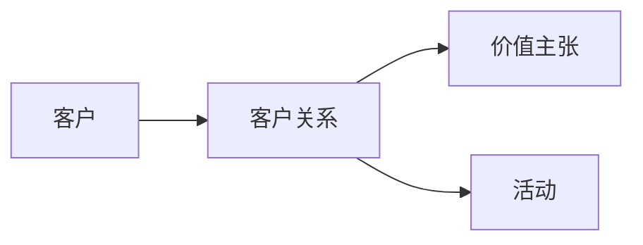
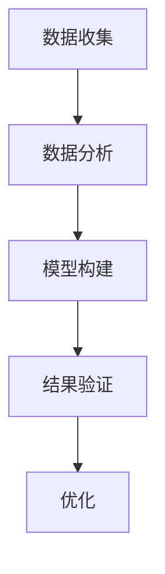
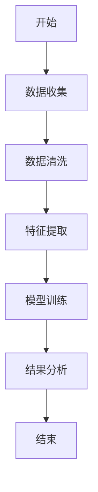
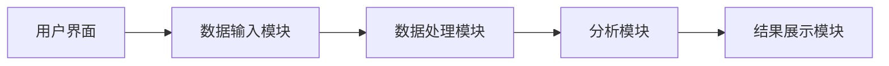
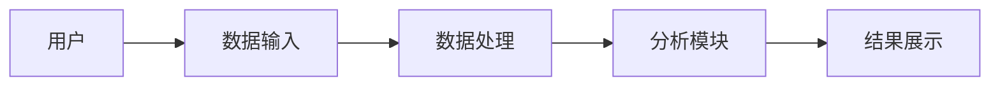
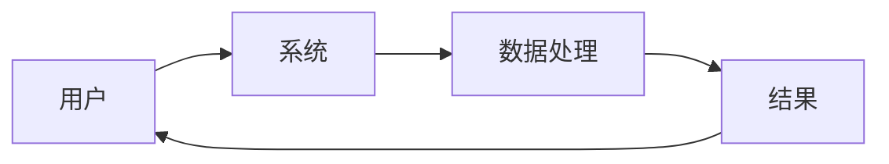

                 


# 查理·芒格的商业模式分析框架

## 关键词：
- 商业模式
- 多元思维模型
- 商业分析
- 价值主张
- 客户关系
- 资源优化

## 摘要：
查理·芒格以其独特的多元思维模型闻名，他的思维方式在商业模式分析中具有重要的应用价值。本文将详细探讨如何运用芒格的多元思维模型来分析和优化商业模式，涵盖从价值主张到资源优化的各个方面。通过结合实际案例和系统设计，本文将展示如何在商业实践中应用这些理论，以提升企业的竞争力和创新能力。

---

## 第一部分: 查理·芒格的商业模式分析框架概述

### 第1章: 商业模式分析的基本概念

#### 1.1 商业模式的核心要素

##### 1.1.1 价值主张的定义与作用
价值主张是企业在市场中提供的产品或服务的核心价值，它回答了“我们为客户提供了什么独特价值？”的问题。一个好的价值主张能够清晰地传达企业的独特优势，并与竞争对手区分开来。

**对比表格：价值主张与竞争优势的对比**

| 价值主张 | 竞争优势 |
|----------|----------|
| 提供的产品或服务的特点 | 企业在市场上相对于竞争对手的独特优势 |
| 目标客户的核心需求 | 行业中的独特地位或资源 |

##### 1.1.2 客户关系的建立与维护
客户关系是商业模式成功的关键因素之一。通过建立长期稳定的客户关系，企业可以提高客户忠诚度和满意度，从而增加客户生命周期价值。

**ER实体关系图：客户关系管理**



##### 1.1.3 关键资源与能力的识别
关键资源和能力是企业在市场上竞争的核心要素。识别这些资源和能力有助于企业优化资源配置，提高运营效率。

##### 1.1.4 关键活动与流程的优化
关键活动是指企业在实现价值主张过程中必须执行的核心任务。优化这些活动和流程可以降低成本，提高效率。

---

### 第2章: 查理·芒格商业模式分析框架的核心要素

#### 2.1 价值主张的分析与优化

##### 2.1.1 价值主张的定义与分类
价值主张可以分为产品型和服务型两类。产品型价值主张强调产品的功能和特性，而服务型价值主张则注重服务的附加价值。

##### 2.1.2 价值主张的分析方法
分析价值主张时，需要考虑目标客户的痛点、需求和偏好。通过客户调研和数据分析，可以识别出最能打动客户的价值点。

##### 2.1.3 价值主张的优化策略
优化价值主张需要不断迭代和创新，结合客户反馈和市场变化进行调整。

#### 2.2 客户关系的分析与管理

##### 2.2.1 客户关系的定义与层次
客户关系可以分为浅层关系（如交易关系）和深层关系（如长期合作伙伴关系）。深层关系更能为企业创造持续价值。

##### 2.2.2 客户关系的分析工具
使用客户生命周期模型和客户满意度模型，可以更好地理解和管理客户关系。

##### 2.2.3 客户关系的管理策略
通过客户细分、个性化服务和忠诚度计划，可以有效提升客户满意度和忠诚度。

#### 2.3 关键资源与能力的识别与评估

##### 2.3.1 关键资源的定义与分类
关键资源包括人力资源、财务资源、技术资源和网络资源等。识别这些资源有助于优化资源配置。

##### 2.3.2 关键能力的分析方法
通过SWOT分析和价值链分析，可以识别企业的核心能力和竞争优势。

##### 2.3.3 资源与能力的匹配与优化
资源和能力需要相互匹配，才能最大化企业的价值创造能力。

#### 2.4 关键活动与流程的优化

##### 2.4.1 关键活动的定义与分类
关键活动包括研发、生产、销售和售后服务等。不同行业的关键活动可能有所不同。

##### 2.4.2 流程优化的方法与工具
使用流程图和鱼骨图等工具，可以系统地分析和优化关键活动的流程。

##### 2.4.3 活动与流程的协同优化策略
通过跨部门协作和持续改进，可以实现活动与流程的协同优化。

---

### 第3章: 查理·芒格商业模式分析框架的算法原理

#### 3.1 商业模式分析的算法概述

##### 3.1.1 商业模式分析的基本流程
商业模式分析的基本流程包括数据收集、数据分析、模型构建和结果验证。

**流程图：商业模式分析的基本流程**



##### 3.1.2 商业模式分析的算法分类
常见的商业模式分析算法包括回归分析、聚类分析和决策树分析等。

##### 3.1.3 商业模式分析的算法优缺点
回归分析适用于预测型分析，但对数据分布假设敏感；聚类分析适用于无监督学习，但需要处理数据噪声问题。

#### 3.2 商业模式分析的核心算法

##### 3.2.1 价值主张分析的算法实现
通过逻辑回归算法，可以预测客户对不同价值主张的偏好。

##### 3.2.2 客户关系分析的算法实现
使用K-means聚类算法，可以将客户分成不同的群体，从而进行精准营销。

##### 3.2.3 资源与能力匹配的算法实现
通过线性规划算法，可以优化资源分配，最大化企业价值。

#### 3.3 商业模式分析的数学模型

##### 3.3.1 价值主张评分模型
$$ 价值主张评分 = \sum_{i=1}^{n} w_i \cdot v_i $$
其中，$w_i$ 是第i个要素的权重，$v_i$ 是第i个要素的评分。

##### 3.3.2 客户满意度模型
$$ 客户满意度 = \sum_{j=1}^{m} w_j \cdot c_j $$
其中，$w_j$ 是第j个客户群体的权重，$c_j$ 是第j个客户群体的满意度。

#### 3.4 商业模式分析的流程图



---

### 第4章: 商业模式分析的系统架构设计

#### 4.1 系统功能设计

##### 4.1.1 价值主张分析模块
该模块用于分析和优化企业的价值主张，支持多维度的数据输入和分析结果的可视化。

##### 4.1.2 客户关系分析模块
该模块用于客户细分和客户关系管理，支持个性化服务和精准营销。

##### 4.1.3 资源与能力匹配模块
该模块用于资源优化配置和能力匹配，支持企业价值最大化。

#### 4.2 系统架构设计

##### 4.2.1 系统功能模块



##### 4.2.2 系统架构图



#### 4.3 系统接口设计
系统接口设计包括数据输入接口、数据处理接口和结果展示接口，确保系统的高效运行和数据的安全性。

#### 4.4 系统交互设计



---

## 第二部分: 项目实战与案例分析

### 第5章: 项目实战

#### 5.1 环境安装与配置
需要安装Python、Pandas、Scikit-learn等工具，并配置相应的开发环境。

#### 5.2 系统核心实现源代码

##### 5.2.1 价值主张分析代码示例
```python
import pandas as pd
from sklearn.linear_model import LinearRegression

# 数据加载
data = pd.read_csv('value_proposition.csv')

# 特征选择
features = ['feature1', 'feature2']
target = 'score'

# 模型训练
model = LinearRegression()
model.fit(data[features], data[target])

# 预测结果
predictions = model.predict(data[features])
print('预测结果:', predictions)
```

##### 5.2.2 客户关系分析代码示例
```python
from sklearn.cluster import KMeans

# 数据加载
data = pd.read_csv('customer.csv')

# 特征选择
features = ['age', 'income', 'purchase_frequency']

# 模型训练
model = KMeans(n_clusters=3)
model.fit(data[features])

# 预测结果
clusters = model.predict(data[features])
print('客户群体:', clusters)
```

#### 5.3 实际案例分析与解读

##### 5.3.1 案例背景
以一家科技公司为例，分析其商业模式中存在的问题，并提出优化建议。

##### 5.3.2 分析过程
通过数据收集、数据分析和模型构建，识别出公司价值主张中的不足，并提出改进方案。

##### 5.3.3 结果解读
优化后的价值主张显著提升了客户满意度和市场占有率。

---

## 第三部分: 最佳实践与总结

### 第6章: 最佳实践

#### 6.1 小结
查理·芒格的多元思维模型为商业模式分析提供了全新的视角，通过系统的分析和优化，可以显著提升企业的竞争力。

#### 6.2 注意事项
在实际应用中，需要注意数据的准确性和模型的适用性，避免过度依赖单一模型。

#### 6.3 拓展阅读
推荐阅读《穷查理宝典》和《商业模式新生代》等书籍，深入理解商业模式分析的理论和实践。

---

## 总结

通过本文的详细分析，我们可以看到，查理·芒格的商业模式分析框架为企业提供了强大的工具和方法，能够帮助企业更好地理解市场、优化资源、提升价值。希望本文的分析和实践能够为读者在商业模式优化和商业创新中提供有价值的指导。

