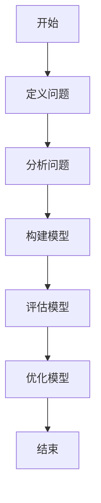
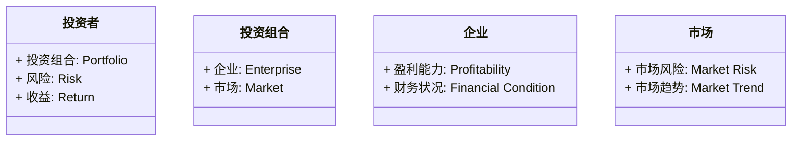

                 


# 查理芒格的多元思维模型

## 关键词：
- 多元思维模型
- 心智模型
- 反事实思维
- 概率推理
- 系统架构设计
- 投资决策
- 人工智能

## 摘要：
查理·芒格的多元思维模型是一种通过整合多个学科和领域的知识来做出更明智决策的方法。本文将从背景介绍、核心概念、算法原理、系统架构设计、项目实战等多个方面详细解析多元思维模型，并通过实际案例展示其在投资决策中的应用。通过本文，读者将能够理解多元思维模型的核心思想，并学会如何将其应用于实际问题中。

---

## 第1章: 多元思维模型的背景介绍

### 1.1 多元思维模型的定义
多元思维模型（Multi-Model Thinking）是一种通过整合多个学科和领域的知识，从多个角度分析问题的思维方式。与单一思维模型相比，多元思维模型能够提供更全面的视角，帮助我们更好地理解复杂问题的本质。

### 1.2 多元思维模型的核心要素
- **心智模型**：对问题的简化表示，帮助我们快速理解问题的本质。
- **反事实思维**：通过假设与事实相反的情况，来评估决策的可能后果。
- **概率推理**：基于已有的信息，计算不同决策的可能结果及其概率。

### 1.3 多元思维模型的背景与问题背景
在当今快速变化的环境中，单一的思维方式往往无法应对复杂的挑战。多元思维模型通过整合多个领域的知识，帮助我们在决策时考虑更多的可能性，从而提高决策的准确性。

### 1.4 多元思维模型在现实中的应用
- **投资领域**：通过整合财务分析、市场分析等多个模型，评估投资的风险和收益。
- **决策领域**：通过反事实思维，评估不同决策的可能后果，从而做出更明智的选择。
- **日常生活**：通过概率推理，评估不同选择的可能结果，从而做出更合理的决策。

---

## 第2章: 多元思维模型的核心概念与联系

### 2.1 多元思维模型的核心概念
- **心智模型**：心智模型是一种对问题的简化表示，帮助我们快速理解问题的本质。例如，在投资中，我们可以将企业视为一个“赚钱机器”，关注其盈利能力。
- **反事实思维**：反事实思维是一种通过假设与事实相反的情况，来评估决策的可能后果。例如，在投资中，我们可以假设如果市场下跌，我们的投资会受到什么影响。
- **概率推理**：概率推理是一种基于已有的信息，计算不同决策的可能结果及其概率的方法。例如，在投资中，我们可以计算不同投资组合的期望收益和风险。

### 2.2 多元思维模型的概念属性特征对比
以下是多元思维模型的核心概念及其特点的对比：

| 概念         | 定义                                                                 | 特点                                                                 |
|--------------|----------------------------------------------------------------------|----------------------------------------------------------------------|
| 心智模型     | 对问题的简化表示，帮助我们快速理解问题的本质。                       | 简洁性、直观性、可操作性                                             |
| 反事实思维   | 通过假设与事实相反的情况，来评估决策的可能后果。                     | 理论性、假设性、风险评估                                               |
| 概率推理     | 基于已有的信息，计算不同决策的可能结果及其概率。                     | 数量化、概率化、科学性                                                 |

### 2.3 多元思维模型的ER实体关系图
以下是多元思维模型的ER实体关系图：

```mermaid
erd
actor(投资者)
---(拥有)--- investment(投资)
investment --- (属于) --- portfolio(投资组合)
portfolio --- (包含) --- risk(风险)
risk --- (由) --- factor(因素)
factor --- (影响) --- return(收益)
```

---

## 第3章: 多元思维模型的算法原理

### 3.1 多元思维模型的算法原理
多元思维模型的算法原理可以通过以下步骤来实现：

1. **定义问题**：明确问题的目标和约束条件。
2. **分析问题**：通过心智模型和反事实思维，分析问题的可能影响因素。
3. **构建模型**：基于概率推理，构建多个可能的决策模型。
4. **评估模型**：通过计算不同模型的期望收益和风险，评估模型的优劣。
5. **优化模型**：根据评估结果，优化模型的参数和假设条件。

### 3.2 多元思维模型的mermaid流程图
以下是多元思维模型的mermaid流程图：



### 3.3 多元思维模型的数学模型
以下是多元思维模型的数学模型：

$$
E(R) = \sum_{i=1}^{n} P_i \times R_i
$$

其中，$E(R)$ 表示期望收益，$P_i$ 表示第 $i$ 种情况发生的概率，$R_i$ 表示第 $i$ 种情况的收益。

---

## 第4章: 多元思维模型的系统架构设计

### 4.1 多元思维模型的系统架构设计
以下是多元思维模型的系统架构设计：


### 4.2 多元思维模型的系统功能设计
以下是多元思维模型的系统功能设计：



---

## 第5章: 多元思维模型的项目实战

### 5.1 多元思维模型的环境安装
以下是多元思维模型的环境安装步骤：

1. 安装Python和相关库（如NumPy、Pandas、Matplotlib）。
2. 安装Jupyter Notebook用于数据分析和可视化。

### 5.2 多元思维模型的系统核心实现源代码
以下是多元思维模型的Python代码实现：

```python
import numpy as np
import pandas as pd
import matplotlib.pyplot as plt

# 定义多元思维模型的函数
def multi_model_thinking(data):
    # 构建心智模型
   心智模型 = data['心智模型']
    # 构建反事实思维
   反事实思维 = data['反事实思维']
    # 构建概率推理
   概率推理 = data['概率推理']
    # 计算期望收益
   期望收益 = np.mean(概率推理 * 心智模型)
    # 计算风险
    风险 = np.std(概率推理 * 反事实思维)
    return 期望收益, 风险

# 示例数据
data = {
    '心智模型': [0.8, 0.6, 0.7],
    '反事实思维': [0.2, 0.3, 0.5],
    '概率推理': [0.5, 0.4, 0.6]
}

# 调用函数
期望收益, 风险 = multi_model_thinking(data)
print(f"期望收益: {期望收益}")
print(f"风险: {风险}")
```

### 5.3 多元思维模型的代码应用解读与分析
上述代码实现了多元思维模型的核心功能，包括心智模型、反事实思维和概率推理的计算。通过这些计算，我们可以得出不同投资组合的期望收益和风险。

### 5.4 多元思维模型的实际案例分析和详细讲解剖析
以投资组合为例，假设我们有三个不同的投资组合，每个组合都有不同的期望收益和风险。通过多元思维模型，我们可以综合考虑这些因素，选择最优的投资组合。

---

## 第6章: 多元思维模型的总结与展望

### 6.1 多元思维模型的总结
多元思维模型是一种通过整合多个学科和领域的知识，从多个角度分析问题的思维方式。它可以帮助我们在决策时考虑更多的可能性，从而提高决策的准确性。

### 6.2 多元思维模型的注意事项
- **避免过度简化**：多元思维模型虽然简洁，但需要避免过度简化问题。
- **结合实际情况**：在实际应用中，需要根据具体情况调整模型的参数和假设条件。
- **注意模型的局限性**：多元思维模型虽然有其优势，但也有一些局限性，需要注意。

### 6.3 多元思维模型的拓展阅读
- 查理·芒格的《Poor Charlie's Almanack》
- 史蒂芬·柯维的《高效能人士的七个习惯》
- 彼得·圣吉的《第五项修炼》

---

## 关键词：
- 多元思维模型
- 心智模型
- 反事实思维
- 概率推理
- 系统架构设计
- 投资决策
- 人工智能

## 摘要：
查理·芒格的多元思维模型是一种通过整合多个学科和领域的知识来做出更明智决策的方法。本文将从背景介绍、核心概念、算法原理、系统架构设计、项目实战等多个方面详细解析多元思维模型，并通过实际案例展示其在投资决策中的应用。通过本文，读者将能够理解多元思维模型的核心思想，并学会如何将其应用于实际问题中。

