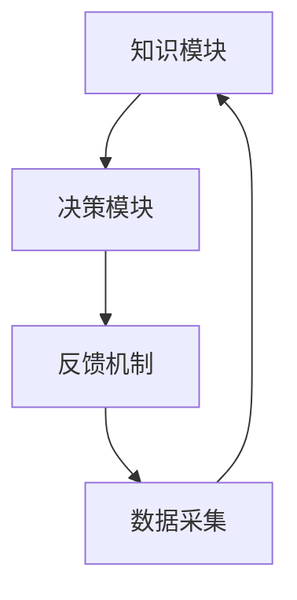

                 


# 《查理芒格的多元思维模型：价值投资的跨学科应用》

## 关键词：多元思维模型，查理·芒格，价值投资，跨学科应用，投资决策，心理学，经济学

## 摘要：  
查理·芒格的多元思维模型是一种跨学科的投资哲学，它通过整合心理学、经济学、认知科学等多个领域的知识，帮助投资者做出更明智的投资决策。本文将深入探讨多元思维模型的核心理念，分析其在价值投资中的应用，并通过实际案例和跨学科视角，揭示如何利用多元思维模型优化投资策略，降低决策风险，实现长期稳健的投资回报。

---

## 第一部分: 多元思维模型的背景与基础

### 第1章: 多元思维模型的起源与核心理念

#### 1.1 查理·芒格的生平与思想体系  
查理·芒格是伯克希尔哈撒韦公司的副主席，被誉为“巴菲特的导师”。他提出多元思维模型的概念，强调通过跨学科的视角理解问题，避免单一思维的局限性。芒格的思想体系以实用性为核心，主张通过整合多个学科的知识，构建一个全面的认知框架。  

#### 1.2 多元思维模型的核心概念  
多元思维模型是一种将多个学科的核心原理整合起来，用于分析和解决复杂问题的方法。其核心理念包括：  
1. **知识的多样性**：通过学习多个学科的知识，避免单一学科的局限性。  
2. **知识的连接性**：将不同领域的知识相互连接，形成一个完整的认知体系。  
3. **知识的实用性**：将知识应用于实际投资决策中，避免纸上谈兵。  

#### 1.3 多元思维模型的哲学基础  
多元思维模型的哲学基础包括：  
- **系统论**：强调事物之间的相互关联和整体性。  
- **复杂性理论**：认识到现实世界的复杂性，避免简化问题。  
- **认知科学**：关注人类思维的局限性和偏差。  

---

### 第2章: 多元思维模型的跨学科应用基础

#### 2.1 心理学与行为经济学  
心理学和行为经济学揭示了人类决策的非理性特征，例如：  
- **心理账户**：人们会将资金分成不同的账户，导致决策失误。  
- **行为偏见**：如从众心理、过度自信等，影响投资决策。  

#### 2.2 经济学基础  
经济学为价值投资提供了理论基础：  
- **微观经济学**：分析个体行为和市场机制。  
- **宏观经济学**：研究经济周期对投资的影响。  
- **机会成本**：帮助投资者权衡不同选择的优劣。  

#### 2.3 认知科学与决策理论  
认知科学揭示了人类思维的局限性：  
- **认知偏差**：如确认偏差、锚定效应等，影响投资决策。  
- **认知负荷**：过多的信息会导致决策疲劳。  

---

## 第二部分: 价值投资的跨学科分析

### 第3章: 投资决策中的心理学陷阱

#### 3.1 心理账户与投资决策  
心理账户是投资者将资金分成不同部分的倾向，可能导致以下问题：  
- **过度分散投资**：降低投资回报。  
- **决策失误**：因账户分割而忽略整体投资策略。  

#### 3.2 行为偏见与投资决策  
行为偏见是投资者常见的非理性行为：  
- **羊群效应**：跟随市场潮流，可能导致追涨杀跌。  
- **过度自信**：高估自己的判断能力，导致盲目投资。  

#### 3.3 认知偏差与投资策略  
认知偏差对投资决策的影响：  
- **确认偏差**：倾向于寻找支持自己观点的信息，忽略反面证据。  
- **锚定效应**：对初始信息过于依赖，影响价格判断。  

---

### 第4章: 价值投资的经济学分析

#### 4.1 价值投资的核心原理  
价值投资强调购买被市场低估的股票，其核心在于：  
- **内在价值**：计算企业的真正价值，而非关注市场价格波动。  
- **安全边际**：在价格低于内在价值时买入，降低投资风险。  

#### 4.2 财务报表分析与投资决策  
财务报表分析是价值投资的重要工具：  
- **利润表**：分析企业的盈利能力。  
- **资产负债表**：评估企业的财务健康状况。  
- **现金流表**：判断企业的现金流稳定性。  

#### 4.3 经济周期与投资策略  
经济周期对投资策略的影响：  
- **经济扩张期**：适合成长型投资。  
- **经济衰退期**：适合价值型投资。  

---

### 第5章: 系统性风险与投资组合管理

#### 5.1 系统性风险的来源  
系统性风险是整个市场的风险，包括：  
- **市场波动**：如股市大跌。  
- **经济政策**：如货币政策变化。  

#### 5.2 投资组合的构建与优化  
投资组合管理的核心在于：  
- **分散投资**：降低单一资产的风险。  
- **动态调整**：根据市场变化优化投资组合。  

#### 5.3 风险管理与心理调整  
风险管理不仅是技术问题，更是心理问题：  
- **止损策略**：设定止损点，避免重大损失。  
- **心理调整**：保持理性，避免情绪化决策。  

---

## 第三部分: 多元思维模型的系统性应用

### 第6章: 多元思维模型的系统架构设计

#### 6.1 系统架构概述  
多元思维模型的系统架构包括：  
- **知识模块**：多个学科的核心原理。  
- **决策模块**：基于知识模块的决策逻辑。  
- **反馈机制**：根据市场反馈调整投资策略。  

#### 6.2 系统功能设计  
系统功能设计包括：  
- **数据采集**：收集市场数据和公司信息。  
- **分析模块**：应用多元思维模型进行分析。  
- **决策模块**：生成投资决策建议。  

#### 6.3 系统架构图  
以下是系统架构的 mermaid 图：  



---

### 第7章: 项目实战与代码实现

#### 7.1 项目背景与目标  
本项目旨在通过多元思维模型，构建一个基于价值投资的股票筛选系统。  

#### 7.2 核心代码实现  

```python
import pandas as pd
import numpy as np

def calculate_intrinsic_value(financial_data):
    # 计算内在价值的简单模型
    # 假设使用市盈率法
    industry_avg_pe = financial_data['行业平均市盈率']
    company_pe = financial_data['公司市盈率']
    if company_pe < industry_avg_pe * 0.8:
        return "低估"
    else:
        return "高估"

# 示例数据
data = {
    '公司': ['公司A', '公司B'],
    '行业平均市盈率': [15, 15],
    '公司市盈率': [12, 18]
}

df = pd.DataFrame(data)
df['估值'] = df.apply(lambda x: calculate_intrinsic_value(x), axis=1)
print(df)
```

#### 7.3 实际案例分析  
以公司A为例，其市盈率为12，低于行业平均市盈率15的80%，即12 < 12，因此公司A被判定为低估，适合投资。  

---

## 第四部分: 总结与展望

### 第8章: 总结与小结

#### 8.1 核心观点总结  
多元思维模型通过整合多个学科的知识，帮助投资者做出更明智的投资决策。  

#### 8.2 小结与最佳实践  
- **持续学习**：不断扩展知识面，丰富多元思维模型。  
- **实践应用**：将理论应用于实际投资中，不断优化策略。  
- **风险管理**：重视风险管理，避免重大损失。  

---

## 结语  

查理·芒格的多元思维模型不仅是价值投资的指南，更是跨学科思考的典范。通过将心理学、经济学、认知科学等领域的知识整合起来，投资者可以更好地理解市场、分析公司、做出更明智的决策。未来，随着人工智能和大数据技术的发展，多元思维模型的应用将更加广泛和深入，为投资者创造更大的价值。  

--- 

希望这篇文章能为您提供有价值的见解和启发！

