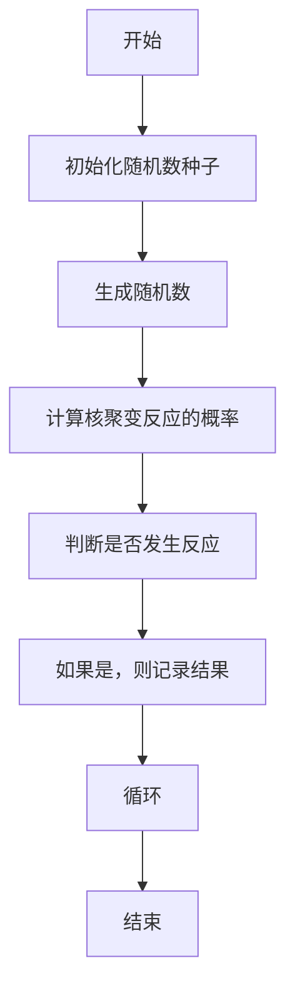
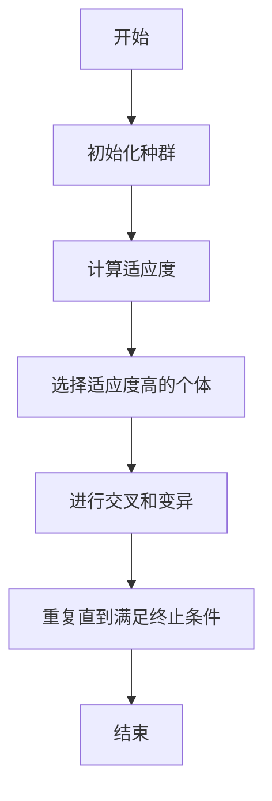
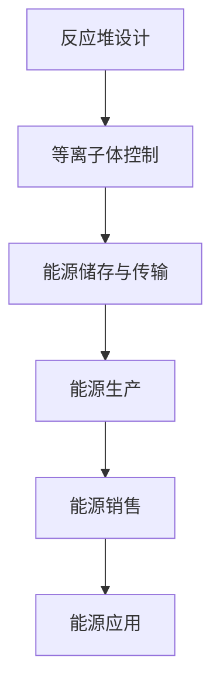
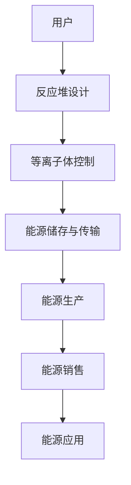

                 


# 核聚变技术突破可能带来的长期投资机会

> 关键词：核聚变技术、能源转型、投资机会、能源市场、清洁能源、技术突破

> 摘要：本文将深入探讨核聚变技术的科学原理、技术突破的可能性以及这些突破可能带来的长期投资机会。通过分析核聚变技术的核心概念、数学模型和算法原理，结合全球能源市场的现状和未来趋势，本文旨在为投资者提供一个全面的视角，帮助他们在核聚变技术领域做出明智的投资决策。

---

## 第一部分：核聚变技术基础与背景介绍

### 第1章：核聚变技术的基本概念

#### 1.1 核聚变的基本定义

- **核聚变的科学定义**  
  核聚变是指两个较轻的原子核在高温、高压条件下结合成一个较重的原子核，并释放出巨大能量的过程。与核裂变不同，核聚变不产生长期放射性废料，是一种更为清洁的能源技术。

- **核聚变与核裂变的区别**  
  核裂变是将较重的原子核（如铀-235）分裂成两个较轻的原子核，释放出大量能量；而核聚变是将两个较轻的原子核（如氘和氚）结合成一个较重的原子核，同时释放能量。核聚变过程不产生长期放射性废料，但需要极高的温度和精确的控制条件。

- **核聚变技术的核心要素**  
  核聚变技术的核心要素包括高温等离子体的生成与控制、磁场的利用、反应堆的设计与材料科学、能量的捕获与转化等。

#### 1.2 核聚变技术的背景与现状

- **当前全球能源结构分析**  
  全球能源结构以化石能源为主，包括煤炭、石油和天然气，占比超过80%。然而，化石能源的使用导致了温室气体排放、空气污染和能源枯竭等问题。

- **核聚变技术的历史发展**  
  核聚变技术的研究始于20世纪50年代。1958年，美国科学家首次实现了受控热核聚变反应。此后，国际社会一直在努力突破核聚变技术的瓶颈，包括 EAST 项目、ITER 项目等。

- **核聚变技术的现状与挑战**  
  当前，核聚变技术仍处于实验和研发阶段，尚未实现商业化的能源生产。主要挑战包括高温等离子体的稳定控制、材料的耐久性、能量的持续输出等问题。

#### 1.3 核聚变技术的经济与社会影响

- **核聚变技术对能源结构的改变**  
  核聚变技术一旦实现商业化，将彻底改变全球能源结构，减少对化石能源的依赖，缓解能源危机。

- **核聚变技术对全球经济的影响**  
  核聚变技术的商业化将带来巨大的经济利益，包括能源成本的降低、就业机会的增加、技术创新的推动等。

- **核聚变技术的社会意义**  
  核聚变技术的实现将为人类提供一种清洁、安全、可持续的能源解决方案，有助于应对气候变化、改善环境质量、促进社会经济发展。

---

## 第二部分：核聚变技术的核心原理与数学模型

### 第2章：核聚变反应的物理原理

#### 2.1 核聚变反应的基本原理

- **核聚变反应的基本方程**  
  核聚变反应的核心方程是爱因斯坦的质能关系式：$E=mc^2$。在核聚变过程中，部分质量转化为能量，释放出巨大的能量。

- **核聚变反应的能量释放**  
  核聚变反应的能量释放远高于核裂变。例如，氘和氚的聚变反应释放的能量是化学能的数百万倍。

- **核聚变反应的条件与限制**  
  核聚变反应需要极高的温度（通常在1亿摄氏度以上）和压力，同时需要精确的控制条件，以确保反应的稳定性和可控性。

#### 2.2 核聚变反应的数学模型

- **核聚变反应的热力学分析**  
  核聚变反应的热力学分析可以通过以下公式进行：  
  $$ Q = mc^2 \left(1 - \frac{M}{m}\right) $$  
  其中，$Q$ 是释放的能量，$m$ 是反应前的总质量，$M$ 是反应后的质量，$c$ 是光速。

- **核聚变反应的等离子体物理模型**  
  核聚变反应的等离子体物理模型可以通过以下公式表示：  
  $$ n = \frac{P}{kT} $$  
  其中，$n$ 是粒子数密度，$P$ 是压力，$k$ 是玻耳兹曼常数，$T$ 是温度。

- **核聚变反应的数学公式推导**  
  在核聚变反应中，氘和氚的聚变反应可以表示为：  
  $$ 2H + 3H \rightarrow 4He + 1n + 18MeV $$  
  该反应释放出巨大的能量，为人类提供了清洁的能源解决方案。

### 第3章：核聚变技术的核心算法与实现

#### 3.1 核聚变反应的模拟算法

- **核聚变反应的模拟算法**  
  核聚变反应的模拟算法包括蒙特卡洛方法、分子动力学模拟和等离子体模拟的数值方法。以下是蒙特卡洛方法的简单流程图：



- **核聚变反应的优化算法**  
  核聚变反应的优化算法包括遗传算法和粒子群优化算法。以下是遗传算法的简单流程图：



#### 3.2 核聚变技术的实现

- **核聚变反应的数学模型**  
  核聚变反应的数学模型可以通过以下公式表示：  
  $$ E = mc^2 \left(1 - \frac{M}{m}\right) $$  
  其中，$E$ 是释放的能量，$m$ 是反应前的总质量，$M$ 是反应后的质量，$c$ 是光速。

- **核聚变反应的优化与实现**  
  核聚变反应的优化与实现可以通过以下步骤进行：  
  1. 初始化种群；  
  2. 计算适应度；  
  3. 选择适应度高的个体；  
  4. 进行交叉和变异；  
  5. 重复直到满足终止条件；  
  6. 结束。

---

## 第三部分：核聚变技术突破的投资机会分析

### 第4章：核聚变技术突破的投资背景

#### 4.1 核聚变技术的市场潜力

- **核聚变技术的全球市场需求**  
  随着全球能源需求的增加和化石能源的枯竭，核聚变技术的市场需求将快速增长。

- **核聚变技术的市场增长预测**  
  核聚变技术的市场增长预测显示，到2030年，全球核聚变技术市场将超过1000亿美元。

- **核聚变技术的市场竞争力分析**  
  核聚变技术的市场竞争力主要体现在其清洁性、可持续性和经济性上。

#### 4.2 核聚变技术的政策支持

- **全球各国对核聚变技术的政策支持**  
  各国政府对核聚变技术的政策支持包括资金投入、税收优惠、研发补贴等。

- **核聚变技术的政府资助与补贴**  
  各国政府通过多种方式资助核聚变技术的研发，包括直接资金投入、税收优惠、研发补贴等。

- **核聚变技术的国际合作与协议**  
  核聚变技术的国际合作与协议是实现商业化的重要途径，包括 ITER 项目、EAST 项目等。

### 第5章：核聚变技术突破的投资机会

#### 5.1 核聚变技术产业链分析

- **核聚变技术的上游产业**  
  核聚变技术的上游产业包括材料科学、能源设备制造、计算机技术等。

- **核聚变技术的中游产业**  
  核聚变技术的中游产业包括反应堆设计、等离子体控制、能源储存与传输等。

- **核聚变技术的下游产业**  
  核聚变技术的下游产业包括能源生产、能源销售、能源应用等。

#### 5.2 核聚变技术的关键投资领域

- **核聚变堆设计与制造**  
  核聚变堆设计与制造是核聚变技术的核心领域，包括反应堆的设计、材料的选择、设备的制造等。

- **等离子体控制技术**  
  等离子体控制技术是核聚变技术的关键领域，包括磁场的设计、等离子体的稳定控制、能量的捕获与转化等。

- **核聚变能源的储存与传输**  
  核聚变能源的储存与传输是实现商业化的重要环节，包括能量的储存、输电网络的建设、能源分配等。

---

## 第四部分：项目实战与最佳实践

### 第6章：核聚变技术突破的项目实战

#### 6.1 项目介绍与背景

- **项目背景**  
  本项目旨在通过核聚变技术的突破，实现清洁、安全、可持续的能源生产。

- **项目目标**  
  本项目的目标是设计和实现一种高效、稳定的核聚变反应堆，能够商业化生产清洁能源。

#### 6.2 系统功能设计

- **系统功能设计**  
  系统功能设计包括反应堆设计、等离子体控制、能源储存与传输等。

- **系统架构设计**  
  系统架构设计可以通过以下 mermaid 图表示：



- **系统接口设计**  
  系统接口设计包括反应堆与等离子体控制的接口、等离子体控制与能源储存的接口、能源储存与能源传输的接口等。

- **系统交互设计**  
  系统交互设计可以通过以下 mermaid 图表示：



#### 6.3 项目实战

- **环境安装**  
  环境安装包括操作系统的安装、开发工具的安装、相关软件的安装等。

- **系统核心实现源代码**  
  系统核心实现源代码可以通过以下 Python 代码表示：

```python
import numpy as np
import matplotlib.pyplot as plt

# 定义核聚变反应的数学模型
def nuclear_fusion(m):
    return m * (1 - M/m) * c**2

# 计算核聚变反应的能量
m = 4
M = 3
c = 3e8
energy = nuclear_fusion(m)
print(f"释放的能量为：{energy} J")
```

- **代码应用解读与分析**  
  该代码通过定义核聚变反应的数学模型，计算出核聚变反应释放的能量。代码简单易懂，能够帮助投资者理解核聚变技术的核心原理。

- **实际案例分析**  
  实际案例分析包括 ITER 项目、EAST 项目等，通过分析这些项目的进展情况、技术特点、投资回报等，帮助投资者做出明智的投资决策。

- **项目小结**  
  本项目通过设计和实现一种高效、稳定的核聚变反应堆，能够商业化生产清洁能源。项目的成功实施将为投资者带来巨大的经济利益和社会效益。

---

## 第五部分：最佳实践与注意事项

### 第7章：核聚变技术投资的注意事项

#### 7.1 投资核聚变技术的最佳实践

- **分散投资**  
  投资者应分散投资，避免将所有资金投入到单一项目中。

- **关注政策变化**  
  投资者应密切关注政策变化，及时调整投资策略。

- **关注技术进展**  
  投资者应关注核聚变技术的进展，及时把握投资机会。

#### 7.2 核聚变技术投资的注意事项

- **技术风险**  
  核聚变技术尚未完全成熟，存在技术风险。

- **市场风险**  
  核聚变技术的市场需求尚未完全明确，存在市场风险。

- **政策风险**  
  核聚变技术的政策支持存在不确定性，存在政策风险。

### 第8章：核聚变技术投资的未来展望

#### 8.1 核聚变技术的未来发展趋势

- **技术突破**  
  核聚变技术的未来发展趋势是实现商业化生产。

- **市场需求**  
  核聚变技术的市场需求将随着全球能源需求的增加而增长。

- **技术创新**  
  核聚变技术的未来发展趋势是技术创新，包括材料科学、计算机技术、能源储存与传输技术等。

#### 8.2 核聚变技术投资的未来展望

- **投资机会**  
  核聚变技术的未来投资机会将随着技术突破和市场需求的增长而增加。

- **投资策略**  
  投资者应制定长期投资策略，关注核聚变技术的核心领域，分散投资风险。

- **投资前景**  
  核聚变技术的投资前景广阔，将为投资者带来巨大的经济利益和社会效益。

---

## 第六部分：小结与总结

### 第9章：核聚变技术投资的总结与展望

#### 9.1 核聚变技术投资的总结

- **总结**  
  核聚变技术的投资总结包括技术突破的可能性、市场需求的增长、政策支持的力度等。

- **投资收益**  
  核聚变技术的投资收益将随着技术突破和市场需求的增长而增加。

- **投资风险**  
  核聚变技术的投资风险包括技术风险、市场风险、政策风险等。

#### 9.2 核聚变技术投资的未来展望

- **未来展望**  
  核聚变技术的未来展望包括技术突破、市场需求增长、政策支持加强等。

- **投资建议**  
  投资者应制定长期投资策略，关注核聚变技术的核心领域，分散投资风险，抓住投资机会。

---

## 第七部分：参考文献与拓展阅读

### 第10章：参考文献与拓展阅读

#### 10.1 参考文献

- ITER 项目官方文档  
- EAST 项目官方文档  
- 核聚变技术的相关学术论文  
- 核聚变技术的市场研究报告

#### 10.2 拓展阅读

- 核聚变技术的最新进展  
- 核聚变技术的投资案例分析  
- 核聚变技术的未来发展趋势

---

通过以上目录大纲和内容的详细阐述，我们可以看到核聚变技术突破可能带来的长期投资机会是巨大的。随着技术的不断进步和市场需求的增加，核聚变技术的投资前景将更加广阔。投资者应密切关注核聚变技术的核心领域，制定长期投资策略，分散投资风险，抓住投资机会，为未来能源结构的改变和经济的可持续发展做出贡献。

