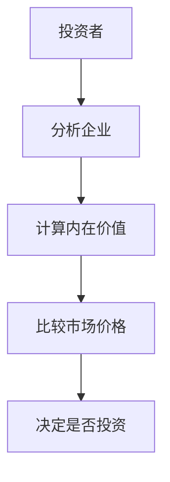
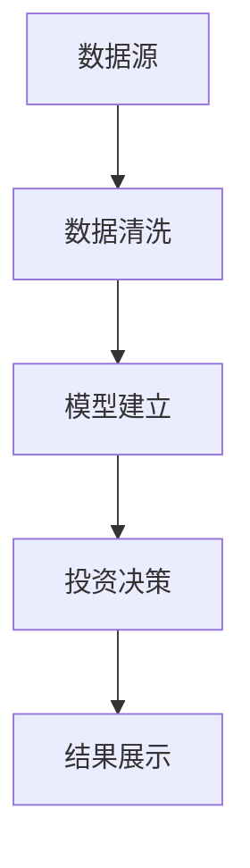

                 


# 格雷厄姆价值投资理念在当代市场的应用

> 关键词：价值投资、格雷厄姆、内在价值、安全边际、现代市场、投资策略

> 摘要：本文深入探讨了格雷厄姆的价值投资理念，结合当代市场环境，分析其在投资决策中的应用。通过系统分析和实际案例，本文展示了如何将格雷厄姆的核心思想与现代投资策略相结合，帮助投资者在复杂多变的市场中实现稳健收益。

---

# 第一部分：价值投资的核心概念

## 第1章：价值投资的核心概念

### 1.1 价值投资的定义与背景

价值投资是一种投资策略，强调以低于内在价值的价格购买优质资产。该理念由本杰明·格雷厄姆在20世纪初提出，至今仍是投资领域的重要理论之一。

#### 1.1.1 投资的基本问题与背景

- **问题背景**：投资者在市场中面临信息不对称、价格波动和情绪影响等挑战。
- **核心目标**：寻找被市场低估的资产，长期持有以实现收益。

#### 1.1.2 价值投资的起源与发展

- 格雷厄姆在《 Intelligent Investor》中首次系统阐述了价值投资理念。
- 现代价值投资结合了基本面分析和行为金融学，适应市场变化。

#### 1.1.3 格雷厄姆与价值投资的联系

- 格雷厄姆是价值投资的奠基人，其理念强调安全边际和长期投资。

### 1.2 格雷厄姆的价值投资理念

#### 1.2.1 安全边际的概念与重要性

- **安全边际**：指股票价格与内在价值之间的差距，确保投资的安全性。
- **重要性**：通过安全边际，投资者可以降低市场波动带来的风险。

#### 1.2.2 内在价值的计算方法

- 内在价值是企业未来现金流的现值，需考虑企业盈利能力、成长性和财务状况。

#### 1.2.3 股票与企业价值的关系

- 股票是企业的部分所有权，投资股票即投资企业。

---

## 第2章：格雷厄姆价值投资模型的核心原理

### 2.1 核心概念与联系

#### 2.1.1 核心概念对比表

| 概念         | 定义与特点               |
|--------------|--------------------------|
| 内在价值     | 未来现金流的现值         |
| 安全边际     | 股票价格与内在价值的差距 |
| 投资策略     | 买入低估资产，长期持有   |

#### 2.1.2 实体关系图（Mermaid流程图）



### 2.2 格雷厄姆投资模型的数学公式

#### 2.2.1 内在价值公式

$$
\text{内在价值} = \sum_{t=1}^{n} \frac{\text{现金流}_t}{(1 + r)^t}
$$

其中，$r$为折现率，$\text{现金流}_t$为第$t$年的现金流。

#### 2.2.2 安全边际计算公式

$$
\text{安全边际} = \text{内在价值} - \text{市场价格}
$$

#### 2.2.3 举例说明与实际应用

例如，某企业内在价值为$50，市场价格为$40，则安全边际为$10，具有较高的投资价值。

---

## 第3章：格雷厄姆理念在现代市场的应用

### 3.1 当代市场环境的变化

#### 3.1.1 现代市场的特点与挑战

- 信息传播速度快，市场波动加剧。
- 科技进步改变企业价值评估方式。

#### 3.1.2 技术进步对投资的影响

- 数据分析技术提升投资决策的科学性。
- 算法交易改变市场结构。

#### 3.1.3 市场波动性与投资策略的调整

- 需要结合技术分析和基本面分析，灵活调整策略。

### 3.2 格雷厄姆理念的现代应用

#### 3.2.1 企业基本面分析

- 财务指标分析：ROE、ROA、净利润率等。
- 行业地位分析：市场占有率、竞争格局。

#### 3.2.2 市场波动与投资机会

- 在市场恐慌时寻找低估资产。
- 在市场繁荣时保持谨慎。

#### 3.2.3 风险控制与投资组合管理

- 分散投资降低风险。
- 定期调整投资组合，保持合理配置。

---

## 第4章：价值投资的系统分析与架构设计

### 4.1 投资系统的构建

#### 4.1.1 数据收集与处理

- 数据来源：财务报表、市场数据、行业报告。
- 数据清洗：处理缺失值、异常值。

#### 4.1.2 投资模型的建立

- 基于格雷厄姆理念，构建内在价值评估模型。
- 使用Python进行数据处理和建模。

#### 4.1.3 决策支持系统的设计

- 可视化工具展示投资机会。
- 自动生成投资建议。

### 4.2 系统架构图（Mermaid流程图）



---

## 第5章：价值投资的项目实战

### 5.1 投资案例分析

#### 5.1.1 案例背景与目标

- 分析某科技公司，判断其是否低估。

#### 5.1.2 数据收集与分析

- 收集财务数据、行业报告、市场数据。
- 计算内在价值，比较市场价格。

#### 5.1.3 投资决策与实施

- 确定安全边际，决定是否投资。

### 5.2 代码实现与应用解读

#### 5.2.1 环境安装与配置

- 安装Python、Pandas、NumPy等工具。

#### 5.2.2 核心代码实现

```python
import pandas as pd
import numpy as np

# 示例：计算内在价值
def calculate_intrinsic_value(cash_flows, discount_rate):
    return np.sum(cash_flows / (1 + discount_rate) ** np.arange(len(cash_flows)))

cash_flows = [100, 120, 150]  # 示例现金流
discount_rate = 0.05
intrinsic_value = calculate_intrinsic_value(cash_flows, discount_rate)
print(f"内在价值为：{intrinsic_value:.2f}")
```

#### 5.2.3 代码分析与优化

- 使用蒙特卡洛模拟评估风险。
- 结合机器学习预测市场波动。

---

## 第6章：价值投资的最佳实践与小结

### 6.1 最佳实践Tips

#### 6.1.1 投资心态的调整

- 长期思维，避免短期波动干扰。
- 保持耐心，耐心持有优质资产。

#### 6.1.2 风险控制的策略

- 分散投资，降低集中风险。
- 定期审视投资组合，及时调整。

#### 6.1.3 持续学习与优化

- 关注市场变化，学习新知识。
- 总结经验，优化投资策略。

### 6.2 小结与展望

- 格雷厄姆的理念在现代市场中依然适用。
- 投资者需结合新技术和新环境，灵活运用价值投资策略。

---

## 第7章：注意事项与拓展阅读

### 7.1 投资中的常见误区

#### 7.1.1 过度自信的风险

- 避免盲目自信，保持理性分析。

#### 7.1.2 忽略市场变化的后果

- 定期评估市场环境，及时调整策略。

#### 7.1.3 情绪化决策的危害

- 避免被市场情绪左右，坚持价值投资。

### 7.2 拓展阅读与资源推荐

#### 7.2.1 格雷厄姆经典著作

- 《The Intelligent Investor》

#### 7.2.2 现代投资理论书籍

- 《Portfolio Selection》

#### 7.2.3 实用投资工具与平台

- Python的Pandas库，量化交易平台。

---

通过以上章节的详细分析和实际案例，我们可以看到，格雷厄姆的价值投资理念在当代市场中依然具有重要的指导意义。投资者需要结合现代技术和市场环境，灵活运用这些理念，以实现稳健的投资收益。

