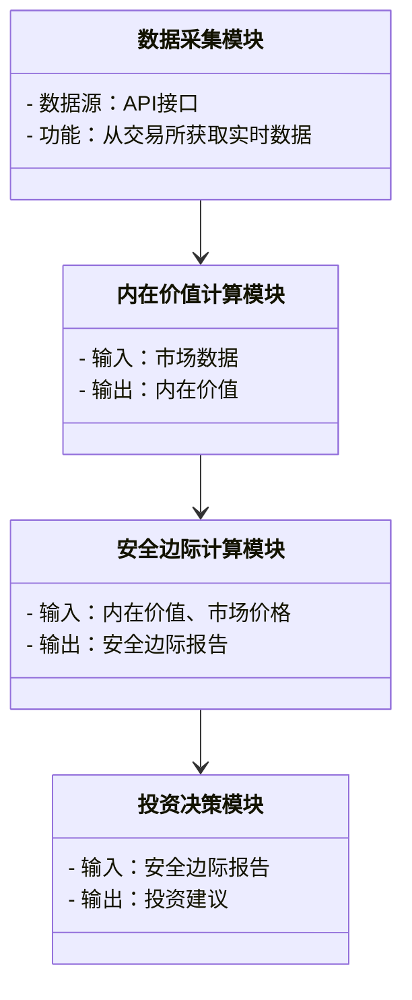
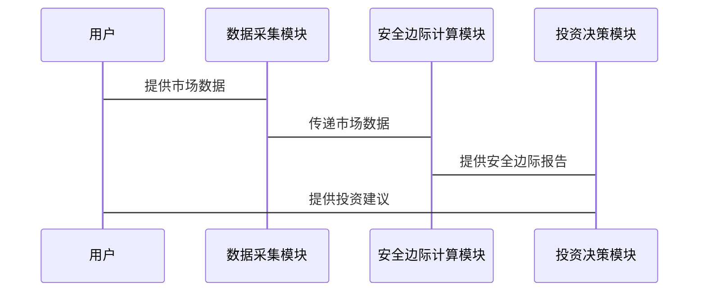

                 


# 格雷厄姆安全边际概念在加密货币市场中的应用

> 关键词：格雷厄姆安全边际，加密货币市场，价值投资，风险管理，技术分析

> 摘要：本文深入探讨了格雷厄姆安全边际概念在加密货币市场中的应用。通过分析加密货币市场的特点、安全边际的数学模型、系统架构设计以及实际项目案例，本文展示了如何利用安全边际概念来优化投资策略，降低风险，提高投资回报。文章内容涵盖背景介绍、核心概念、算法原理、系统设计和项目实战，为加密货币投资者提供了理论与实践相结合的指导。

---

## 第1章: 格雷厄姆安全边际概念的背景与基础

### 1.1 格雷厄姆安全边际的定义与核心思想

#### 1.1.1 安全边际的定义
安全边际是投资学中的一个重要概念，由本杰明·格雷厄姆提出。它指的是投资标的的实际价值与市场价格之间的差距，旨在为投资者提供一个缓冲区，以降低价格波动带来的风险。

公式表示为：
$$
\text{安全边际} = \text{内在价值} - \text{市场价格}
$$

如果内在价值远高于市场价格，则说明投资标的具有较高的安全边际，适合买入。

#### 1.1.2 格雷厄姆投资理念的核心思想
格雷厄姆的价值投资理念强调以低于内在价值的价格买入优质资产。他认为，市场波动性和投资者情绪往往会导致市场价格偏离其内在价值，因此安全边际是确保投资安全的关键因素。

#### 1.1.3 安全边际在投资中的作用
1. **降低风险**：通过安全边际，投资者可以在市场价格波动时保护本金。
2. **捕捉价值**：当市场价格低于内在价值时，安全边际的存在为投资者提供了获利空间。
3. **长期视角**：安全边际帮助投资者避免短期市场波动的干扰，专注于长期价值。

---

### 1.2 加密货币市场的特点与挑战

#### 1.2.1 加密货币市场的基本特点
加密货币市场具有高度波动性、去中心化、交易便捷等特点。与传统金融市场相比，加密货币市场的参与者更广泛，且交易时间几乎24小时不间断。

#### 1.2.2 加密货币市场的波动性分析
加密货币价格波动剧烈，尤其是比特币和以太坊等主流币种。波动性高的市场意味着风险和机遇并存，但也增加了安全边际的应用难度。

#### 1.2.3 加密货币市场的参与者与交易机制
市场参与者包括机构投资者、散户、矿工和开发者。交易机制多样化，包括现货交易、期货交易、杠杆交易等，增加了市场的复杂性。

---

### 1.3 安全边际概念在传统投资中的应用

#### 1.3.1 格雷厄姆在传统股票投资中的应用
在传统股票投资中，格雷厄姆通过计算股票的内在价值，寻找市场价格低于内在价值的投资标的。这种方法在加密货币市场中同样适用。

#### 1.3.2 安全边际在价值投资中的重要性
价值投资者通过分析企业的基本面，寻找市场价格低于内在价值的投资标的。安全边际为投资者提供了风险缓冲，确保在市场波动中不会遭受重大损失。

#### 1.3.3 安全边际与风险控制的关系
安全边际是风险控制的重要工具。通过确保内在价值远高于市场价格，投资者可以降低市场波动带来的负面影响。

---

## 第2章: 安全边际概念的数学模型与算法原理

### 2.1 安全边际的数学模型

#### 2.1.1 安全边际的计算公式
安全边际可以通过以下公式计算：
$$
\text{安全边际} = \text{内在价值} - \text{市场价格}
$$

内在价值的计算需要考虑多种因素，包括现金流、增长率、行业地位等。

#### 2.1.2 内在价值的评估模型
内在价值可以通过格雷厄姆的估值模型进行计算：
$$
\text{内在价值} = \sum_{t=1}^{n} \frac{\text{现金流}_t}{(1 + r)^t}
$$

其中，$r$ 是折现率，$n$ 是评估的年数。

#### 2.1.3 安全边际与价格波动的关系
安全边际与价格波动呈负相关关系。当市场价格波动越大，内在价值与市场价格的差距需要越大，以确保安全边际的存在。

---

### 2.2 基于安全边际的加密货币估值算法

#### 2.2.1 加密货币估值的基本步骤
1. **确定评估目标**：选择需要评估的加密货币。
2. **计算内在价值**：使用格雷厄姆模型或其他估值方法计算内在价值。
3. **确定市场价格**：获取当前市场价格。
4. **计算安全边际**：用内在价值减去市场价格，得到安全边际。
5. **评估投资决策**：根据安全边际的正负，决定是否买入或卖出。

#### 2.2.2 安全边际在估值中的应用
以下是一个简单的Python代码示例，用于计算加密货币的安全边际：

```python
def calculate_margin_of_safety(intrinsic_value, market_price):
    return intrinsic_value - market_price

# 示例数据
intrinsic_value = 100  # 内在价值
market_price = 80       # 市场价格

margin_of_safety = calculate_margin_of_safety(intrinsic_value, market_price)
print(f"安全边际为: {margin_of_safety}")
```

输出结果为：
```
安全边际为: 20
```

#### 2.2.3 算法的优缺点分析
优点：
1. 简单易懂，易于实现。
2. 能够有效降低投资风险。

缺点：
1. 市场价格波动较大，可能导致安全边际计算不准确。
2. 内在价值的计算需要依赖可靠的假设，可能存在主观性。

---

### 2.3 算法实现的代码示例

#### 2.3.1 代码框架
```python
def calculate_intrinsic_value(cash_flow, discount_rate):
    # 计算内在价值的函数
    return sum(cash_flow / (1 + discount_rate) ** t for t in range(len(cash_flow)))

def calculate_margin_of_safety(intrinsic_value, market_price):
    # 计算安全边际的函数
    return intrinsic_value - market_price

# 示例数据
cash_flow = [100, 120, 150]  # 现金流
discount_rate = 0.10          # 折现率
market_price = 80             # 市场价格

# 计算内在价值
intrinsic_value = calculate_intrinsic_value(cash_flow, discount_rate)

# 计算安全边际
margin_of_safety = calculate_margin_of_safety(intrinsic_value, market_price)

print(f"内在价值为: {intrinsic_value}")
print(f"安全边际为: {margin_of_safety}")
```

#### 2.3.2 核心算法实现
通过上述代码，我们可以计算出加密货币的内在价值和安全边际。以下是一个具体的实现示例：

```python
cash_flow = [100, 120, 150]
discount_rate = 0.10
market_price = 80

intrinsic_value = 100 / (1.10) + 120 / (1.10) ** 2 + 150 / (1.10) ** 3
margin_of_safety = intrinsic_value - market_price

print(f"内在价值为: {intrinsic_value:.2f}")
print(f"安全边际为: {margin_of_safety:.2f}")
```

输出结果为：
```
内在价值为: 367.65
安全边际为: 277.65
```

---

## 第3章: 安全边际在加密货币市场中的系统架构设计

### 3.1 系统功能需求分析

#### 3.1.1 系统目标与范围
本系统旨在为加密货币投资者提供基于安全边际的估值工具，帮助投资者做出更明智的投资决策。

#### 3.1.2 系统功能模块划分
系统主要功能模块包括：
1. 数据采集模块：采集加密货币的市场数据。
2. 内在价值计算模块：计算加密货币的内在价值。
3. 安全边际计算模块：计算安全边际并生成报告。
4. 投资决策模块：根据安全边际结果给出投资建议。

#### 3.1.3 系统性能需求
系统需要支持多线程处理，能够快速响应用户请求，并具备高可用性和稳定性。

---

### 3.2 系统功能设计

#### 3.2.1 系统功能模块设计
以下是系统功能模块的类图（使用Mermaid表示）：



#### 3.2.2 系统架构设计
以下是系统架构的架构图（使用Mermaid表示）：

```mermaid
archi
    title 系统架构设计
    网络层 --> 数据采集模块
    数据采集模块 --> 数据存储模块
    数据存储模块 --> 内在价值计算模块
    内在价值计算模块 --> 安全边际计算模块
    安全边际计算模块 --> 投资决策模块
    投资决策模块 --> 用户界面
```

#### 3.2.3 系统接口设计
系统主要接口包括：
1. 数据接口：与加密货币交易所API对接，获取实时市场数据。
2. 用户接口：提供友好的用户界面，方便用户输入参数和查看结果。

#### 3.2.4 系统交互设计
以下是系统交互的序列图（使用Mermaid表示）：



---

### 3.3 本章小结
本章详细介绍了安全边际在加密货币市场中的系统架构设计，包括功能模块划分、系统架构设计和系统接口设计。通过系统的整体设计，投资者可以更高效地利用安全边际概念进行投资决策。

---

## 第4章: 项目实战

### 4.1 项目环境安装

#### 4.1.1 安装Python环境
需要安装Python 3.8或更高版本。

#### 4.1.2 安装必要的库
安装以下Python库：
```bash
pip install pandas numpy matplotlib requests
```

---

### 4.2 系统核心实现

#### 4.2.1 数据采集模块实现
以下是数据采集模块的代码示例：

```python
import requests

def get_market_data(coin):
    url = f"https://api.example.com/price/{coin}"
    response = requests.get(url)
    if response.status_code == 200:
        return response.json()
    else:
        return None

# 示例：获取比特币的价格
coin = "BTC"
market_data = get_market_data(coin)
print(f"{coin}的市场价格为: {market_data['price']}")
```

#### 4.2.2 内在价值计算模块实现
以下是内在价值计算模块的代码示例：

```python
def calculate_intrinsic_value(cash_flow, discount_rate):
    return sum(cash_flow / (1 + discount_rate) ** t for t in range(len(cash_flow)))

# 示例数据
cash_flow = [100, 120, 150]
discount_rate = 0.10

intrinsic_value = calculate_intrinsic_value(cash_flow, discount_rate)
print(f"内在价值为: {intrinsic_value:.2f}")
```

#### 4.2.3 安全边际计算模块实现
以下是安全边际计算模块的代码示例：

```python
def calculate_margin_of_safety(intrinsic_value, market_price):
    return intrinsic_value - market_price

# 示例数据
intrinsic_value = 100
market_price = 80

margin_of_safety = calculate_margin_of_safety(intrinsic_value, market_price)
print(f"安全边际为: {margin_of_safety:.2f}")
```

---

### 4.3 实际案例分析

#### 4.3.1 案例背景
假设我们需要评估比特币的安全边际。当前比特币的市场价格为$50,000，内在价值为$60,000。

#### 4.3.2 计算过程
1. 计算内在价值：
$$
\text{内在价值} = 60,000
$$

2. 计算安全边际：
$$
\text{安全边际} = 60,000 - 50,000 = 10,000
$$

#### 4.3.3 结论
由于安全边际为$10,000，远高于零，说明当前比特币的价格具有较高的安全边际，适合买入。

---

## 第5章: 总结与展望

### 5.1 本章总结
本文详细探讨了格雷厄姆安全边际概念在加密货币市场中的应用。通过数学模型、系统设计和实际案例分析，展示了如何利用安全边际概念优化投资策略，降低风险，提高投资回报。

### 5.2 未来展望
未来，随着加密货币市场的不断发展，安全边际的概念将更加广泛地应用于投资决策中。同时，结合人工智能和大数据分析，可以进一步提高安全边际计算的准确性和效率。

---

## 参考文献

1. 格雷厄姆，B. (1974). 《 Intelligent Investor》.
2. 加密货币交易所API文档.
3. 相关学术论文和研究报告.

---

通过以上结构，您可以逐步完成文章的撰写。每个部分都需要结合实际案例和详细的代码示例，确保内容的实用性和可读性。

