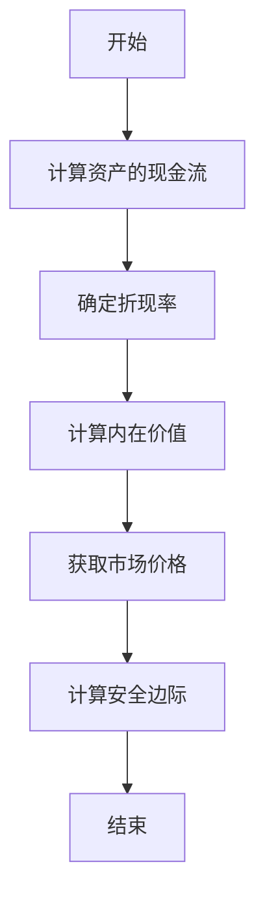
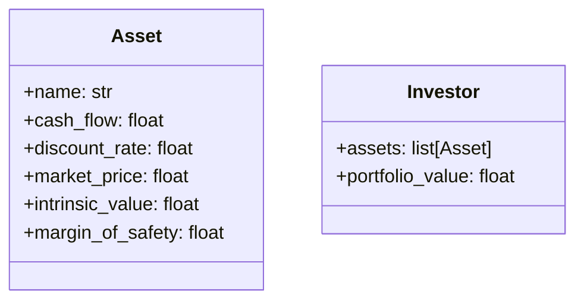
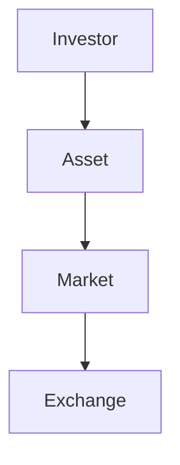
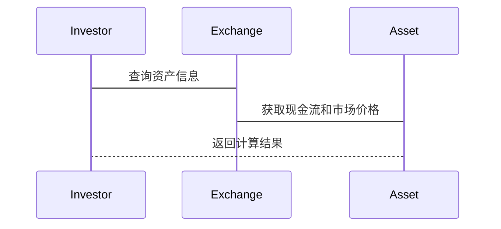

                 


# 格雷厄姆安全边际概念在去中心化金融(DeFi)中的应用

> 关键词：格雷厄姆安全边际，去中心化金融，DeFi，投资决策，风险管理

> 摘要：本文探讨了格雷厄姆的安全边际概念在去中心化金融（DeFi）中的应用，分析了DeFi市场的现状与特点，详细阐述了安全边际在DeFi资产定价和风险控制中的具体应用，提出了结合DeFi保险机制的最佳实践方案。

---

## 第1章: 格雷厄姆安全边际概念的核心原理

### 1.1 安全边际的基本定义与核心要素

#### 1.1.1 安全边际的定义
安全边际是本杰明·格雷厄姆提出的一个投资理念，指以低于资产内在价值的价格购买资产，从而在市场波动时提供保护。其核心在于通过价格折扣来降低投资风险。

#### 1.1.2 安全边际的核心要素
- **内在价值**：资产的真实价值，基于未来现金流的折现值。
- **市场价格**：资产在市场上的交易价格。
- **价格折扣**：市场价格与内在价值之间的差距，即安全边际。

#### 1.1.3 安全边际的数学模型与公式
安全边际可以通过以下公式计算：
$$
\text{安全边际} = \text{内在价值} - \text{市场价格}
$$

### 1.2 格雷厄姆安全边际与投资决策的关系

#### 1.2.1 安全边际在投资中的作用
安全边际为投资者提供了一种防御性的投资策略，通过降低购买价格来减少潜在损失。

#### 1.2.2 安全边际与风险控制的联系
安全边际通过降低市场价格与内在价值的差距，帮助投资者在市场波动中规避风险。

#### 1.2.3 安全边际在资产定价中的应用
通过计算安全边际，投资者可以选择具有足够价格折扣的资产，从而提高投资的安全性。

### 1.3 格雷厄姆安全边际的哲学与实践

#### 1.3.1 格雷厄姆的价值投资理念
格雷厄姆主张以低于内在价值的价格购买资产，长期持有，等待市场回归理性。

#### 1.3.2 安全边际的哲学基础
安全边际体现了保守、谨慎的投资理念，强调在不确定性中寻找确定性。

#### 1.3.3 安全边际在现代金融中的应用案例
例如，在股票投资中，投资者通过计算市盈率和市净率等指标，寻找具有安全边际的标的。

---

## 第2章: 去中心化金融（DeFi）的基本原理与特点

### 2.1 DeFi的定义与核心特征

#### 2.1.1 DeFi的定义
DeFi（Decentralized Finance）是基于区块链技术的去中心化金融应用，通过智能合约实现金融功能。

#### 2.1.2 DeFi的核心特征
- **去中心化**：无须传统金融机构作为中介。
- **透明性**：所有交易记录在区块链上，公开可查。
- **智能合约**：自动执行交易和协议。

#### 2.1.3 DeFi与传统金融的区别
DeFi去除了中间人的角色，降低了交易成本，提高了效率，但同时也带来了更高的风险。

### 2.2 DeFi的主要应用场景

#### 2.2.1 借贷
通过智能合约实现去中心化借贷，无需信用评估。

#### 2.2.2 交易
建立去中心化交易所，用户可以直接进行代币交易。

#### 2.2.3 投资
通过DeFi平台提供多种投资工具，如杠杆交易和流动性挖矿。

### 2.3 DeFi的生态系统与关键组件

#### 2.3.1 智能合约
DeFi的核心，自动执行协议和交易。

#### 2.3.2 去中心化交易所
提供代币交易的平台，如Uniswap。

#### 2.3.3 数字资产发行与管理
通过智能合约发行和管理代币。

### 2.4 DeFi的风险与挑战

#### 2.4.1 智能合约风险
智能合约代码错误可能导致重大损失。

#### 2.4.2 市场波动风险
DeFi市场的高波动性增加了投资难度。

#### 2.4.3 法律与监管风险
DeFi的去中心化特性使其面临法律和监管的不确定性。

---

## 第3章: 格雷厄姆安全边际概念在DeFi中的应用背景

### 3.1 DeFi市场的现状与发展趋势

#### 3.1.1 DeFi市场的规模与增长
近年来，DeFi市场迅速增长，吸引了大量投资者和机构的关注。

#### 3.1.2 DeFi市场的参与者与生态
DeFi生态包括开发者、用户、交易所和借贷平台等。

#### 3.1.3 DeFi市场的未来趋势
随着技术进步和市场成熟，DeFi将更加普及和多样化。

### 3.2 DeFi投资中的风险与不确定性

#### 3.2.1 投资风险的来源
包括市场波动、智能合约漏洞和监管风险。

#### 3.2.2 市场波动对投资的影响
DeFi市场的高波动性可能导致投资损失。

#### 3.2.3 投资者心理与行为对DeFi的影响
投资者情绪波动可能加剧市场的波动性。

### 3.3 格雷厄姆安全边际在DeFi投资中的潜在价值

#### 3.3.1 安全边际在DeFi投资中的应用逻辑
通过计算安全边际，投资者可以选择具有足够价格折扣的DeFi资产。

#### 3.3.2 安全边际在DeFi风险控制中的作用
安全边际为投资者提供了一种防御性的投资策略，降低风险敞口。

#### 3.3.3 安全边际在DeFi资产定价中的意义
通过合理评估内在价值和市场价格，投资者可以做出更明智的投资决策。

---

## 第4章: 格雷厄姆安全边际与DeFi投资决策的结合

### 4.1 安全边际在DeFi资产定价中的应用

#### 4.1.1 DeFi资产的内在价值评估
通过贴现现金流模型等方法评估DeFi资产的内在价值。

#### 4.1.2 安全边际与DeFi资产的市场价值关系
计算内在价值与市场价格的差距，判断是否存在足够的安全边际。

#### 4.1.3 安全边际在DeFi资产选择中的应用
选择具有足够安全边际的DeFi资产进行投资，降低风险。

### 4.2 安全边际在DeFi风险控制中的应用

#### 4.2.1 DeFi投资中的风险识别
识别智能合约漏洞、市场波动和流动性风险等潜在风险。

#### 4.2.2 安全边际在风险控制中的具体应用
通过计算安全边际，确定风险可控的投资范围。

#### 4.2.3 安全边际与DeFi保险机制的结合
引入保险机制，进一步降低投资者的风险敞口。

---

## 第5章: 数学模型与算法实现

### 5.1 安全边际的计算公式

#### 5.1.1 内在价值的计算
使用贴现现金流模型评估资产的内在价值：
$$
\text{内在价值} = \frac{\text{现金流}}{r}
$$
其中，r为折现率。

#### 5.1.2 市场价格与安全边际的关系
通过比较市场价格与内在价值，计算安全边际：
$$
\text{安全边际} = \text{内在价值} - \text{市场价格}
$$

### 5.2 用mermaid流程图展示算法步骤



### 5.3 Python代码实现

```python
def calculate_intrinsic_value(cash_flow, discount_rate):
    return cash_flow / discount_rate

def calculate_margin_of_safety(intrinsic_value, market_price):
    return intrinsic_value - market_price

# 示例
cash_flow = 100
discount_rate = 0.1
market_price = 80

intrinsic_value = calculate_intrinsic_value(cash_flow, discount_rate)
margin_of_safety = calculate_margin_of_safety(intrinsic_value, market_price)

print(f"内在价值: {intrinsic_value}")
print(f"安全边际: {margin_of_safety}")
```

---

## 第6章: 系统分析与架构设计

### 6.1 问题场景介绍

#### 6.1.1 DeFi投资中的风险控制
投资者需要在DeFi市场中选择具有足够安全边际的资产。

### 6.2 系统功能设计

#### 6.2.1 领域模型设计


### 6.3 系统架构设计

#### 6.3.1 系统架构图


### 6.4 系统交互设计

#### 6.4.1 投资者与DeFi平台的交互


---

## 第7章: 项目实战

### 7.1 环境安装

#### 7.1.1 安装Python和必要的库
安装Python和Pandas、Matplotlib等数据分析库。

### 7.2 系统核心实现源代码

```python
import pandas as pd

def calculate_intrinsic_value(cash_flows, discount_rate):
    return sum(cash_flows) / discount_rate

def calculate_margin_of_safety(intrinsic_value, market_price):
    return intrinsic_value - market_price

# 示例数据
cash_flows = [100, 120, 150]
discount_rate = 0.1
market_prices = [80, 90, 100]

# 计算内在价值和安全边际
intrinsic_values = [calculate_intrinsic_value(cf, discount_rate) for cf in cash_flows]
margins = [calculate_margin_of_safety(iv, mp) for iv, mp in zip(intrinsic_values, market_prices)]

# 输出结果
for iv, mp, ma in zip(intrinsic_values, market_prices, margins):
    print(f"现金流: {iv}, 市场价格: {mp}, 安全边际: {ma}")
```

### 7.3 案例分析与代码解读

#### 7.3.1 选择合适的DeFi资产
通过计算安全边际，选择具有足够价格折扣的资产。

#### 7.3.2 评估风险因素
分析市场波动、智能合约漏洞等风险因素，确保投资的安全性。

### 7.4 项目总结

通过本项目，我们展示了如何将格雷厄姆的安全边际概念应用到DeFi投资中，帮助投资者在不确定的市场中做出更明智的决策。

---

## 第8章: 最佳实践与总结

### 8.1 最佳实践 tips

#### 8.1.1 定期评估资产的价值
市场波动频繁，需要定期重新评估资产的内在价值和市场价格。

#### 8.1.2 结合多种风险控制措施
除了安全边际，还应结合其他风险控制措施，如分散投资和保险机制。

### 8.2 小结

格雷厄姆的安全边际概念为DeFi投资提供了一种科学的决策框架，通过合理应用，投资者可以在高波动性的市场中降低风险，提高投资收益。

### 8.3 注意事项

- **谨慎选择投资标的**：确保选择的资产具有足够的安全边际和合理的风险敞口。
- **持续关注市场动态**：及时调整投资策略，应对市场变化。
- **结合多种策略**：将安全边际与其他投资策略相结合，优化投资效果。

### 8.4 拓展阅读

- 格雷厄姆的《证券分析》
- DeFi相关的技术文档和白皮书
- 相关学术论文和研究报告

---

通过以上结构，我们可以系统地探讨格雷厄姆安全边际概念在DeFi中的应用，从理论到实践，帮助投资者在去中心化金融领域做出更明智的投资决策。

