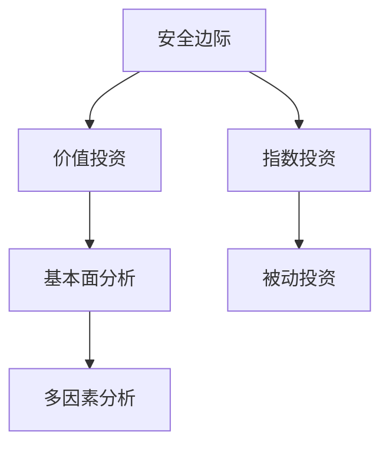
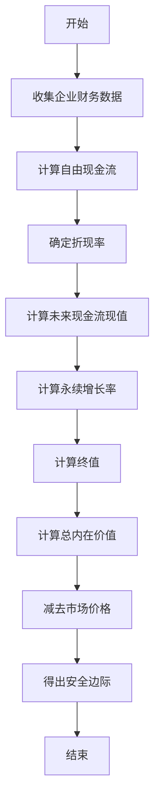
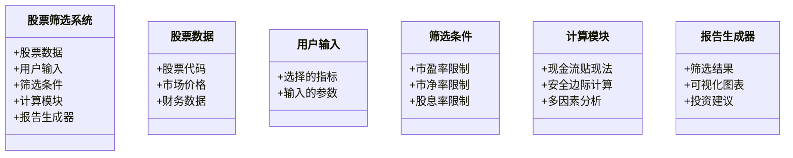
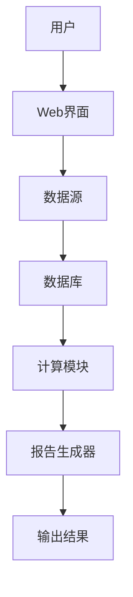
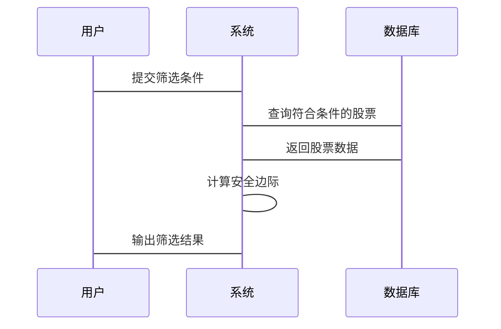

                 


# 格雷厄姆安全边际概念在特价股票选择中的应用

## 关键词
格雷厄姆安全边际，价值投资，特价股票，股票分析，投资策略，风险管理

## 摘要
本文深入探讨了格雷厄姆安全边际概念在特价股票选择中的应用。首先介绍了安全边际的核心思想及其在投资中的重要性，分析了特价股票的定义、分类及其市场特点。接着，详细阐述了安全边际在特价股票选择中的具体应用，包括内在价值计算、安全边际分析、多因素筛选模型等。通过构建基于安全边际的股票筛选系统，结合实际案例分析，展示了如何利用该系统进行有效的投资决策。最后，总结了安全边际在投资中的优势，并提出了相应的风险管理策略和投资建议。

---

# 第一部分：格雷厄姆安全边际概念的背景介绍

## 第1章：安全边际概念的起源与核心思想

### 1.1 格雷厄姆投资理论的起源

#### 1.1.1 投资学派的演变
现代投资学的发展可以追溯到20世纪初，以本杰明·格雷厄姆和大卫·多德为代表的价值投资学派对投资理论产生了深远影响。早期的投资理论多关注市场的波动性和技术分析，而格雷厄姆提出的价值投资理念则为投资者提供了一种基于基本面分析的投资方法。

#### 1.1.2 格雷厄姆的价值投资理念
格雷厄姆在《 Intelligent Investor 》一书中提出，投资的本质是寻找那些市场价格低于其内在价值的股票。他强调，投资者应关注企业的基本面，而不是市场的短期波动。

#### 1.1.3 安全边际概念的提出
安全边际是格雷厄姆投资理论的核心思想之一。他认为，通过购买那些市场价格显著低于其内在价值的股票，可以为投资者提供一个“安全垫”，从而降低投资风险。

### 1.2 特价股票的定义与分类

#### 1.2.1 特价股票的定义
特价股票通常指那些市场价格显著低于其内在价值的股票。这类股票通常被市场低估，可能因为行业周期、市场情绪或其他外部因素导致其价格被压制。

#### 1.2.2 价值型股票与成长型股票的区别
价值型股票关注的是低市盈率、低市净率等估值指标，而成长型股票则关注高增长潜力。特价股票更偏向于价值型股票，但其价格通常远低于其内在价值。

#### 1.2.3 特价股票的分类
根据不同的估值指标，特价股票可以分为以下几类：
- 低市盈率股票
- 低市净率股票
- 高股息率股票
- 绝对低估值股票

### 1.3 安全边际在特价股票中的应用背景

#### 1.3.1 当前市场环境下的投资机会
当前市场环境下，由于全球经济不确定性增加，投资者更倾向于寻找具有安全边际的股票，以规避市场波动带来的风险。

#### 1.3.2 安全边际在市场波动中的作用
在市场波动加剧的情况下，安全边际能够为投资者提供一个缓冲区，避免因市场下跌而遭受重大损失。

#### 1.3.3 机构投资者与个人投资者的策略差异
机构投资者通常采用多元化策略，而个人投资者更倾向于寻找具有高安全边际的特价股票，以实现超额收益。

---

# 第二部分：核心概念与联系

## 第2章：安全边际的核心概念与联系

### 2.1 安全边际的原理与计算

#### 2.1.1 内在价值的计算方法
内在价值是基于企业未来现金流的现值计算得出的。格雷厄姆建议使用现金流贴现法（DCF）来评估企业的内在价值。

#### 2.1.2 安全边际的计算公式
$$ \text{安全边际} = \text{内在价值} - \text{市场价格} $$

### 2.2 核心要素与对比分析

#### 2.2.1 核心要素对比表格

| 指标       | 定义与计算方法                                  | 对安全边际的影响                   |
|------------|-------------------------------------------------|------------------------------------|
| 市盈率（P/E） | 市场价格/每股收益                             | 低市盈率可能意味着安全边际较高       |
| 市净率（P/B） | 市场价格/每股净资产                           | 低市净率可能意味着安全边际较高       |
| 股息率      | 每股股息/市场价格                             | 高股息率可能意味着安全边际较高       |
| 资产负债率   | 负债/资产                                     | 低负债率可能意味着财务风险较低       |
| 净利润增长率 | （本年净利润 - 上年净利润）/上年净利润         | 高增长率可能意味着未来现金流增加     |

#### 2.2.2 安全边际与其他投资策略的关系

##### 图2-1：安全边际与其他投资策略的关系（Mermaid图）



---

# 第三部分：算法原理

## 第3章：安全边际的算法原理

### 3.1 基于现金流贴现法的安全边际计算

#### 3.1.1 算法流程图

##### 图3-1：现金流贴现法流程图（Mermaid图）



#### 3.1.2 Python代码实现

```python
import pandas as pd
import numpy as np

def calculate_intrinsic_value(financial_data, discount_rate):
    # 假设 financial_data 包含收入、成本、税率等信息
    # 计算自由现金流
    free_cash_flow = financial_data.revenue * (1 - financial_data.tax_rate) - financial_data.capex
    
    # 计算终值（永续增长）
    terminal_growth_rate = 0.02  # 假设永续增长率为2%
    terminal_value = free_cash_flow * (1 + terminal_growth_rate) / (discount_rate - terminal_growth_rate)
    
    # 计算未来现金流的现值
    present_value = (free_cash_flow / (1 + discount_rate)) + (terminal_value / (1 + discount_rate)**2)
    
    return present_value

# 示例数据
data = {
    'revenue': 1000000,
    'tax_rate': 0.2,
    'capex': 200000,
    'discount_rate': 0.08
}
financial_data = pd.DataFrame(data)

intrinsic_value = calculate_intrinsic_value(financial_data, data['discount_rate'])
market_price = 50  # 假设市场价格为50元
safety_margin = intrinsic_value - market_price

print(f"内在价值: {intrinsic_value:.2f}")
print(f"市场价格: {market_price:.2f}")
print(f"安全边际: {safety_margin:.2f}")
```

#### 3.1.3 数学模型与公式

##### 图3-2：现金流贴现法的数学模型

$$ \text{内在价值} = \frac{\text{自由现金流}}{1 + r} + \frac{\text{终值}}{(1 + r)^2} $$

其中：
- 自由现金流 = 收入 - 成本 - 税费 - 投资支出
- 终值 = 自由现金流 × (1 + 终值增长率) / (折现率 - 终值增长率)
- 折现率 \( r \) 通常基于市场利率和风险溢价

---

# 第四部分：系统分析与架构设计

## 第4章：基于安全边际的股票筛选系统

### 4.1 项目背景与目标

#### 4.1.1 项目背景
本项目旨在开发一个基于安全边际的股票筛选系统，帮助投资者快速识别具有高安全边际的特价股票。

#### 4.1.2 项目目标
- 提供用户友好的界面，输入筛选条件
- 自动计算股票的内在价值和安全边际
- 输出符合条件的股票列表
- 提供可视化报告和投资建议

### 4.2 系统功能设计

#### 4.2.1 领域模型（Mermaid类图）



### 4.3 系统架构设计

#### 4.3.1 系统架构图（Mermaid架构图）



#### 4.3.2 关键接口与交互流程

##### 图4-1：系统交互流程（Mermaid序列图）



---

# 第五部分：项目实战

## 第5章：基于安全边际的股票筛选系统实现

### 5.1 环境搭建与安装

#### 5.1.1 安装Python与相关库
```bash
pip install pandas numpy matplotlib
```

#### 5.1.2 数据获取与处理
使用Yahoo Finance API获取股票数据，并进行清洗和预处理。

### 5.2 核心代码实现

#### 5.2.1 安全边际计算模块

```python
def calculate_safety_margin(stock_data, financial_data, discount_rate):
    # 计算自由现金流
    free_cash_flow = financial_data['收入'] * (1 - financial_data['税率']) - financial_data['资本支出']
    
    # 计算终值
    terminal_growth_rate = 0.02
    terminal_value = free_cash_flow * (1 + terminal_growth_rate) / (discount_rate - terminal_growth_rate)
    
    # 计算未来现金流现值
    present_value = (free_cash_flow / (1 + discount_rate)) + (terminal_value / (1 + discount_rate)**2)
    
    # 计算安全边际
    safety_margin = present_value - stock_data['市场价格']
    
    return safety_margin
```

#### 5.2.2 数据可视化模块

```python
import matplotlib.pyplot as plt

def visualize_safety_margin(stocks, safety_margins):
    plt.figure(figsize=(10, 6))
    plt.bar(stocks, safety_margins)
    plt.title('安全边际可视化')
    plt.xlabel('股票代码')
    plt.ylabel('安全边际')
    plt.show()
```

### 5.3 实际案例分析

#### 5.3.1 案例背景
假设我们有以下股票数据：

| 股票代码 | 市场价格 | 市盈率 | 市净率 | 股息率 |
|----------|----------|--------|--------|--------|
| A        | 50       | 10     | 2      | 5%     |
| B        | 40       | 8      | 1.5     | 8%     |
| C        | 30       | 6      | 1       | 10%    |

#### 5.3.2 计算过程
使用上述代码计算每只股票的安全边际，并生成可视化图表。

#### 5.3.3 结果分析
通过分析结果，我们可以识别出哪些股票具有较高的安全边际，并优先考虑这些股票作为投资标的。

---

# 第六部分：最佳实践与总结

## 第6章：基于安全边际的投资策略

### 6.1 最佳实践

#### 6.1.1 长期投资策略
安全边际较高的股票通常适合长期投资，因为其内在价值会在未来逐步体现。

#### 6.1.2 分散投资策略
通过分散投资，降低单一股票的风险，同时提高整体投资组合的安全边际。

### 6.2 小结

#### 6.2.1 投资理念总结
安全边际是价值投资的核心理念，通过寻找市场价格低于内在价值的股票，可以有效降低投资风险并实现超额收益。

#### 6.2.2 风险管理总结
在实际投资中，除了关注安全边际，还应结合市场环境、行业周期和公司基本面进行综合分析。

### 6.3 注意事项

#### 6.3.1 市场波动风险
市场波动可能导致安全边际迅速缩小，投资者需要定期监控投资组合。

#### 6.3.2 财务造假风险
部分公司可能存在财务造假，投资者需要仔细分析财务数据，避免误判。

#### 6.3.3 时间周期风险
安全边际的计算基于长期假设，短期市场波动可能影响其准确性。

### 6.4 拓展阅读

#### 6.4.1 经典书籍推荐
- 《 Intelligent Investor 》——本杰明·格雷厄姆
- 《 The Art of Value Investing 》——莫里斯·格雷厄姆

#### 6.4.2 网络资源推荐
- 格雷厄姆投资俱乐部
- 价值投资论坛

---

通过本文的详细分析，读者可以深入了解格雷厄姆安全边际概念在特价股票选择中的应用，并通过实际案例和系统设计掌握如何利用这一理念进行有效的投资决策。希望本文能为投资者提供有价值的参考，帮助他们在复杂多变的市场中实现稳健的投资收益。

