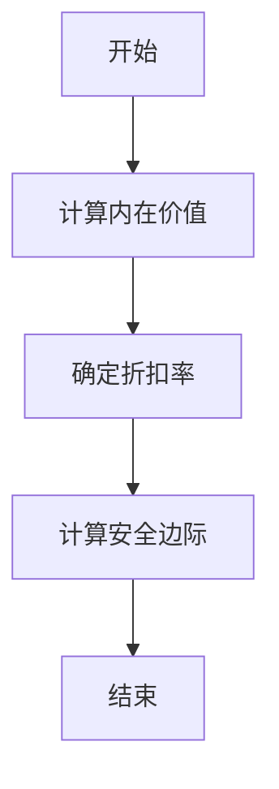
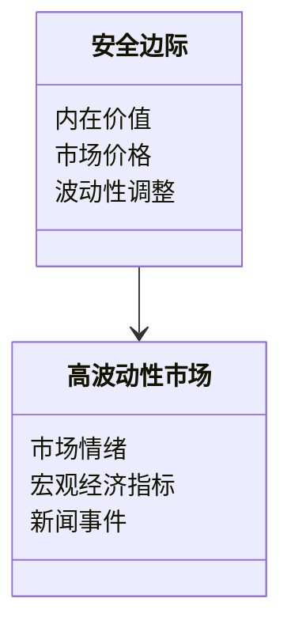

                 


# 格雷厄姆安全边际概念在高波动性市场中的应用

> 关键词：安全边际，高波动性市场，投资策略，价值投资，风险管理

> 摘要：本文探讨了格雷厄姆的安全边际概念在高波动性市场中的应用，分析了安全边际在高波动性环境下的重要性，详细讲解了安全边际的计算方法，并结合实际案例进行了深入分析。

---

# 第一部分: 格雷厄姆安全边际概念基础

## 第1章: 安全边际的基本概念

### 1.1 安全边际的定义与历史背景

#### 1.1.1 安全边际的定义
安全边际是指资产的市场价格低于其内在价值的部分。格雷厄姆在其价值投资理论中强调，安全边际是保护投资者免受市场波动和估值错误影响的重要因素。

#### 1.1.2 格雷厄姆的价值投资理论
格雷厄姆的价值投资理论认为，市场波动性和投资者情绪会影响资产价格，但内在价值是决定长期投资回报的关键。通过购买价格低于内在价值的资产，投资者可以降低短期波动带来的风险。

#### 1.1.3 安全边际在投资中的作用
安全边际通过提供一个缓冲区，帮助投资者在市场波动中避免重大损失，同时捕捉长期收益。它是一种保守的投资策略，尤其适用于高波动性市场。

### 1.2 高波动性市场的特点

#### 1.2.1 市场波动性的定义
市场波动性是指资产价格在短时间内剧烈波动的程度，通常由市场情绪、新闻事件和宏观经济因素引发。

#### 1.2.2 高波动性市场的特征
高波动性市场具有价格波动剧烈、市场参与者情绪化、信息传播速度快等特点，这些特征增加了投资的不确定性和风险。

#### 1.2.3 高波动性市场对投资者的影响
在高波动性市场中，投资者面临更高的风险和潜在回报。价格波动可能导致短期亏损，但长期来看，内在价值仍起决定作用。

---

## 第2章: 安全边际与高波动性市场的联系

### 2.1 安全边际在高波动性市场中的应用

#### 2.1.1 高波动性市场中安全边际的重要性
在高波动性市场中，安全边际能够帮助投资者在市场低谷时买入资产，避免在市场高点被套牢，从而降低投资风险。

#### 2.1.2 安全边际与市场波动性的关系
安全边际与市场波动性呈反比关系。市场波动性越高，安全边际的重要性越大，因为投资者需要更大的折扣来抵消价格波动带来的风险。

#### 2.1.3 高波动性市场中安全边际的计算方法
在高波动性市场中，计算安全边际时需要考虑市场波动性对内在价值的影响，适当调整安全边际的比例。

### 2.2 核心概念与联系

#### 2.2.1 核心概念原理
安全边际通过提供一个价格折扣，确保在市场波动时，投资者能够以低于内在价值的价格买入资产，从而降低投资风险。

#### 2.2.2 核心概念属性特征对比表格
| 属性          | 安全边际             | 高波动性市场特征     |
|---------------|----------------------|--------------------|
| 定义          | 资产价格低于内在价值 | 市场价格波动剧烈     |
| 作用          | 降低投资风险         | 增加投资不确定性     |
| 计算方式      | 内在价值减去价格     | 波动率、市场情绪等    |

#### 2.2.3 ER实体关系图架构的 Mermaid 流程图


---

## 第3章: 安全边际的算法原理

### 3.1 安全边际的计算方法

#### 3.1.1 内在价值的计算
内在价值是基于资产的未来现金流折现值计算得出的。公式如下：
$$ \text{内在价值} = \sum_{t=1}^{n} \frac{\text{现金流}_t}{(1 + r)^t} $$
其中，r为折现率，n为现金流的时间跨度。

#### 3.1.2 安全边际的确定
安全边际通常设定为内在价值的30%-50%，以确保在市场波动中具备足够的缓冲空间：
$$ \text{安全边际} = \text{内在价值} \times (1 - \text{折扣率}) $$

#### 3.1.3 算法原理的数学模型和公式
结合高波动性市场的特点，安全边际的计算公式可以调整为：
$$ \text{调整后安全边际} = \text{内在价值} \times (1 - \text{折扣率} - \text{波动性调整}) $$

### 3.2 算法原理的 mermaid 流程图



### 3.3 代码实现

```python
def calculate_intrinsic_value(cash_flows, discount_rate):
    return sum(cash_flow / (1 + discount_rate)**t for t, cash_flow in enumerate(cash_flows))

def calculate_margin_of_safety(intrinsic_value, price, discount):
    mos = intrinsic_value * (1 - discount)
    return mos if mos > price else 0
```

---

## 第4章: 数学模型与公式

### 4.1 内在价值的计算公式
$$ \text{内在价值} = \frac{\text{现金流}}{(1 + r)^n} $$

### 4.2 安全边际的计算公式
$$ \text{安全边际} = \text{内在价值} - \text{市场价格} $$

---

## 第5章: 系统分析与架构设计方案

### 5.1 领域模型设计



### 5.2 系统架构设计


---

## 第6章: 项目实战

### 6.1 环境安装
安装Python和必要的库，如pandas、numpy。

### 6.2 核心代码实现

```python
import pandas as pd

def calculate_intrinsic_value(cash_flows, discount_rate):
    return sum(flow / (1 + discount_rate)**i for i, flow in enumerate(cash_flows))

def calculate_margin_of_safety(intrinsic_value, market_price, discount):
    mos = intrinsic_value * (1 - discount)
    return mos

# 示例数据
cash_flows = [100, 120, 150]
discount_rate = 0.10
market_price = 100

# 计算内在价值
iv = calculate_intrinsic_value(cash_flows, discount_rate)
# 计算安全边际
mos = calculate_margin_of_safety(iv, market_price, 0.3)

print(f"内在价值: {iv}")
print(f"安全边际: {mos}")
```

### 6.3 案例分析

假设某公司的现金流为$100、$120、$150，折现率为10%，市场价格为$100。计算得出内在价值为$370，安全边际为$129。由于市场价格低于安全边际，建议买入。

---

## 第7章: 最佳实践

### 7.1 小结
在高波动性市场中，安全边际是降低投资风险的重要工具。通过合理计算安全边际，投资者可以在市场波动中保持稳健的投资策略。

### 7.2 注意事项
- 定期重新评估内在价值和安全边际。
- 在高波动性市场中，适当增加安全边际的比例。

### 7.3 拓展阅读
- 格雷厄姆的《证券分析》
- 《投资学原理》

---

# 结语

通过本文的探讨，读者可以深入了解格雷厄姆安全边际概念在高波动性市场中的应用，并掌握实际操作的方法。希望这些知识能帮助投资者在复杂多变的市场中做出明智的投资决策。

