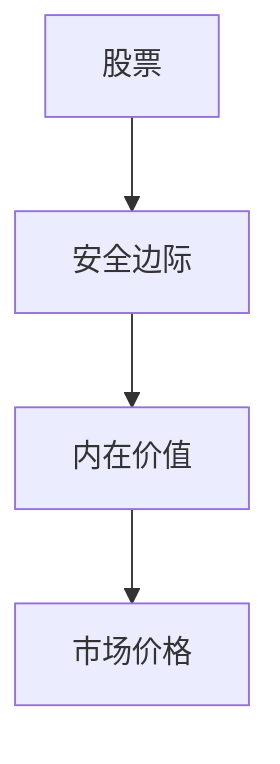
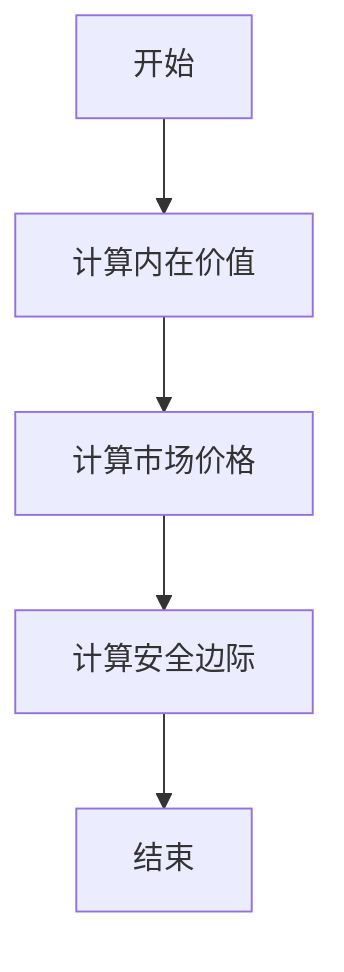
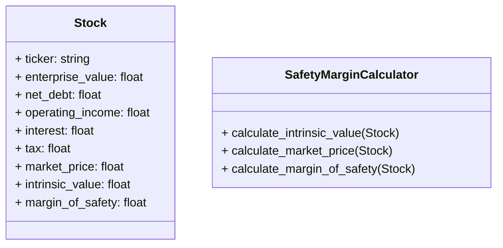
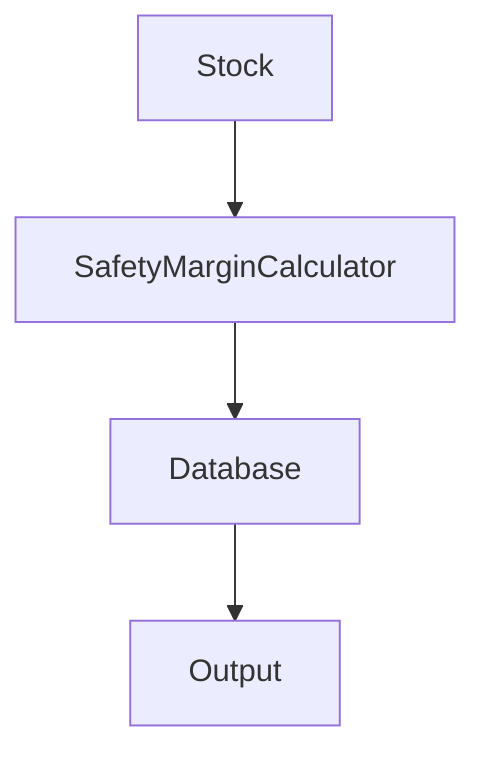
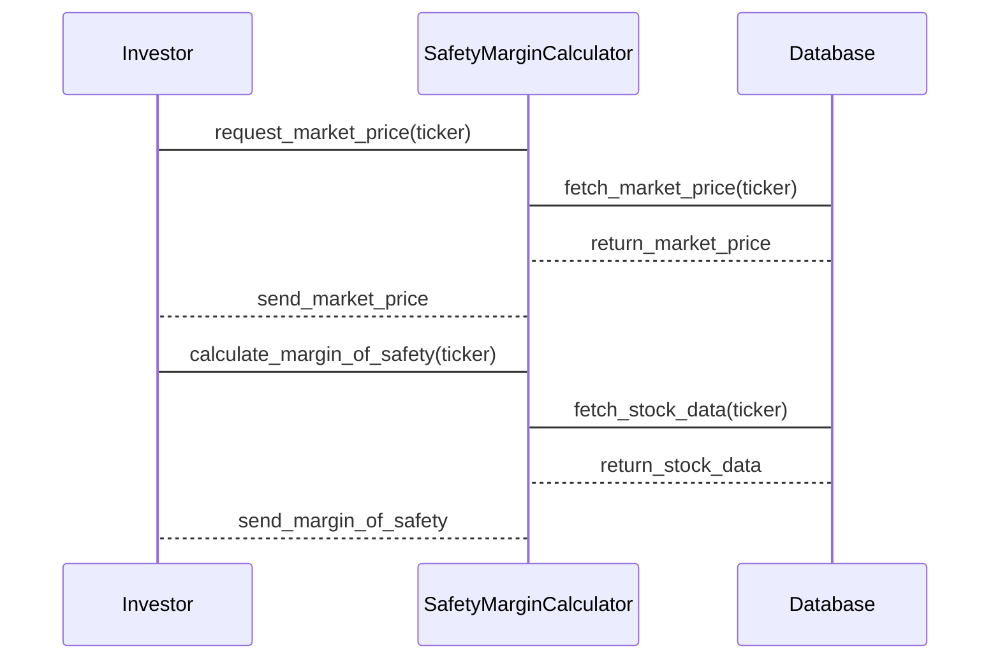

                 


# 格雷厄姆安全边际理念在特价股票中的应用

> 关键词：格雷厄姆、安全边际、价值投资、特价股票、投资策略、内在价值

> 摘要：本文深入探讨了格雷厄姆的安全边际理念在特价股票投资中的应用，通过详细分析安全边际的计算方法、与价值投资的关系以及在特价股票筛选中的实际应用，帮助投资者理解如何利用安全边际理念降低投资风险，抓住投资机会。文章结合理论与实践，提供具体的算法和系统设计，指导读者在实际投资中应用安全边际理念。

---

## 第一部分: 格雷厄姆安全边际理念概述

### 第1章: 安全边际理念的起源与发展

#### 1.1 格雷厄姆投资理论的起源
- **格雷厄姆的生平与投资理念**  
  本杰明·格雷厄姆（Benjamin Graham）是20世纪最伟大的投资理论家之一，被誉为“价值投资之父”。他提出了“安全边际”理念，强调以低于内在价值的价格买入股票，以降低投资风险并确保长期收益。

- **安全边际理念的提出背景**  
  格雷厄姆的安全边际理念诞生于20世纪初的经济动荡时期，尤其是在1929年大萧条期间，他通过研究市场波动和投资者心理，提出了安全边际的概念，以帮助投资者在市场恐慌中找到低估的投资机会。

- **安全边际理念的核心思想**  
  格雷厄姆认为，安全边际是股票的市场价格与内在价值之间的差距。通过购买市场价格低于内在价值的股票，投资者可以降低投资风险并获得超额收益。

#### 1.2 安全边际理念的核心概念
- **安全边际的定义与计算方法**  
  安全边际 = 内在价值 - 市场价格  
  内在价值是股票的真实价值，通常通过基本面分析计算得出。市场价格是股票在二级市场的交易价格。

- **安全边际与投资风险的关系**  
  安全边际越大，投资风险越小。当市场价格远低于内在价值时，股票的安全边际较高，投资者可以以较低的风险获得较高的收益。

- **安全边际在价值投资中的地位**  
  安全边际是价值投资的核心原则之一。格雷厄姆强调，投资者应始终寻找市场价格低于内在价值的股票，以确保投资的安全性。

#### 1.3 安全边际理念与价值投资的联系
- **价值投资的基本原理**  
  价值投资是一种投资策略，强调以低于内在价值的价格买入股票，长期持有，等待市场价值回归。

- **安全边际理念在价值投资中的应用**  
  安全边际理念是价值投资的重要组成部分。通过计算安全边际，投资者可以确定股票的低估程度，从而选择具有较高安全边际的股票进行投资。

- **安全边际与市场波动的关系**  
  市场波动可能导致股票价格短期偏离内在价值，但安全边际理念帮助投资者在市场波动中找到低估的投资机会。

---

### 第2章: 安全边际理念在特价股票中的应用背景

#### 2.1 特价股票的定义与特点
- **特价股票的定义**  
  特价股票是指市场价格远低于内在价值的股票，通常具有较高的安全边际。

- **特价股票的特点**  
  1. 市场价格低于内在价值。  
  2. 公司基本面良好，具有长期增长潜力。  
  3. 市场关注度低，流动性可能较低。  
  4. 受短期市场波动影响较大。

- **特价股票与市场周期的关系**  
  在市场低迷时期，特价股票更容易出现，投资者可以利用市场恐慌寻找低估的投资机会。

#### 2.2 安全边际理念在特价股票中的应用价值
- **特价股票投资的风险与机会**  
  特价股票的投资风险主要来自于市场波动和公司基本面的变化。然而，通过安全边际理念，投资者可以降低投资风险，抓住市场低估的机会。

- **安全边际理念在降低投资风险中的作用**  
  安全边际理念通过计算股票的内在价值和市场价格，帮助投资者识别低估股票，避免过度支付，从而降低投资风险。

- **特价股票投资中的安全边际策略**  
  投资者应通过计算安全边际，选择具有较高安全边际的特价股票，确保投资的安全性和收益性。

---

### 第3章: 安全边际理念的核心概念与联系

#### 3.1 安全边际的计算方法
- **内在价值的计算公式**  
  内在价值（Intrinsic Value）是股票的真实价值，通常通过基本面分析计算得出。  
  $$ \text{内在价值} = \frac{\text{净利润} \times (1 + \text{增长率})}{\text{资本成本} - \text{增长率}} $$  

- **安全边际的计算公式**  
  $$ \text{安全边际} = \text{内在价值} - \text{市场价格} $$  

- **安全边际与内在价值的关系**  
  安全边际越大，股票的投资价值越高。投资者应优先选择具有较高安全边际的股票。

#### 3.2 核心概念的对比分析
- **安全边际与市盈率的对比**  
  市盈率（P/E）是市场价格与每股收益的比率，反映股票的估值水平。  
  安全边际关注股票的市场价格与内在价值的差距，而市盈率关注市场价格与收益的关系。

- **安全边际与市净率的对比**  
  市净率（P/B）是市场价格与每股净资产的比率，反映股票的资产估值。  
  安全边际关注股票的市场价格与内在价值的差距，而市净率关注资产的估值水平。

- **安全边际与股息率的对比**  
  股息率（Dividend Yield）是股息与市场价格的比率，反映股票的分红能力。  
  安全边际关注股票的市场价格与内在价值的差距，而股息率关注分红能力。

#### 3.3 实体关系图（ER图）


---

### 第4章: 安全边际理念的算法原理

#### 4.1 安全边际计算的算法流程


#### 4.2 安全边际计算的Python实现
```python
def calculate_intrinsic_value(enterprise_value, net_debt, operating_income, interest, tax):
    return (enterprise_value - net_debt)

def calculate_market_price(stock ticker):
    # 假设stock ticker为股票代码，返回当前市场价格
    return get_market_price(stock_ticker)

def calculate_margin_of_safety(intrinsic_value, market_price):
    return intrinsic_value - market_price

# 示例：计算某股票的安全边际
ticker = "AAPL"
iv = calculate_intrinsic_value(enterprise_value=1000000000, net_debt=200000000, operating_income=500000000, interest=100000000, tax=50000000)
mp = calculate_market_price(ticker)
mos = calculate_margin_of_safety(iv, mp)
print(f"内值: {iv}, 市场价格: {mp}, 安全边际: {mos}")
```

---

### 第5章: 系统分析与架构设计

#### 5.1 问题场景介绍
- 投资者需要快速筛选具有高安全边际的特价股票，以降低投资风险并获得超额收益。

#### 5.2 系统功能设计
- **功能设计**  
  1. 计算股票的内在价值。  
  2. 获取股票的市场价格。  
  3. 计算股票的安全边际。  
  4. 筛选出具有高安全边际的特价股票。  

- **领域模型（Mermaid类图）**  


#### 5.3 系统架构设计
- **系统架构（Mermaid架构图）**  


#### 5.4 接口设计
- **API接口**  
  1. `get_market_price(ticker)`  
  2. `calculate_intrinsic_value(stock)`  
  3. `calculate_margin_of_safety(stock)`  

#### 5.5 交互流程（Mermaid序列图）  


---

### 第6章: 项目实战

#### 6.1 环境安装
- **Python环境**  
  安装Python和必要的库（如pandas、numpy、requests）。  
  ```bash
  pip install pandas numpy requests
  ```

#### 6.2 系统核心实现源代码
```python
import requests

def get_market_price(ticker):
    url = f"https://api.example.com/stock_price?ticker={ticker}"
    response = requests.get(url)
    return response.json()['price']

def calculate_intrinsic_value(stock):
    return (stock.enterprise_value - stock.net_debt)

def calculate_margin_of_safety(stock):
    iv = calculate_intrinsic_value(stock)
    mp = get_market_price(stock.ticker)
    return iv - mp

# 示例：计算某股票的安全边际
class Stock:
    def __init__(self, ticker, enterprise_value, net_debt):
        self.ticker = ticker
        self.enterprise_value = enterprise_value
        self.net_debt = net_debt

stock = Stock("AAPL", 1000000000, 200000000)
margin_of_safety = calculate_margin_of_safety(stock)
print(f"股票代码: {stock.ticker}, 内在价值: {stock.enterprise_value - stock.net_debt}, 市场价格: {get_market_price(stock.ticker)}, 安全边际: {margin_of_safety}")
```

#### 6.3 代码应用解读与分析
- **代码解读**  
  1. `get_market_price(ticker)` 函数通过API获取股票的市场价格。  
  2. `calculate_intrinsic_value(stock)` 函数计算股票的内在价值。  
  3. `calculate_margin_of_safety(stock)` 函数计算股票的安全边际。  

- **案例分析**  
  假设某股票的内在价值为100元，市场价格为80元，其安全边际为20元。投资者可以以80元的价格买入该股票，确保投资的安全性。

---

### 第7章: 最佳实践与小结

#### 7.1 投资建议
- **选择具有高安全边际的股票**  
  投资者应优先选择具有高安全边际的特价股票，以降低投资风险并获得超额收益。

- **关注公司基本面**  
  在计算安全边际的同时，投资者应关注公司的基本面，确保内在价值的准确性。

- **长期投资**  
  安全边际理念强调长期投资，投资者应耐心等待市场价值回归，避免短期波动的影响。

#### 7.2 注意事项
- **市场波动风险**  
  市场波动可能导致股票价格短期偏离内在价值，投资者应保持冷静，避免盲目跟风。

- **数据准确性**  
  内在价值的计算依赖于公司基本面数据，投资者应确保数据的准确性，以提高安全边际计算的准确性。

- **持续学习与调整**  
  投资环境不断变化，投资者应持续学习，根据市场变化调整投资策略。

#### 7.3 拓展阅读
- **《证券分析》（The Analysis of Investment Value）**  
  作者：本杰明·格雷厄姆、戴维·多德（David Dodd）  
  简介：本书详细阐述了安全边际理念和价值投资的基本原理。

- **《巴菲特的 investment philosophy》**  
  作者：沃伦·巴菲特（Warren Buffett）  
  简介：巴菲特深受格雷厄姆影响，书中进一步阐述了价值投资的实践方法。

---

通过本文的详细分析，读者可以深入了解格雷厄姆安全边际理念在特价股票投资中的应用，掌握如何利用安全边际理念降低投资风险，抓住投资机会。希望本文能为投资者提供有价值的参考和指导。

