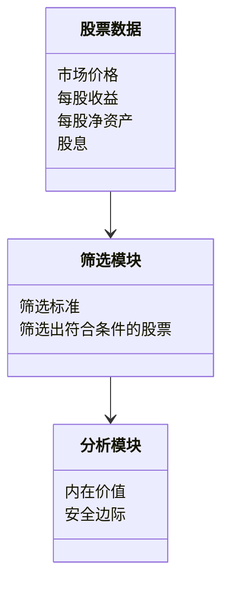
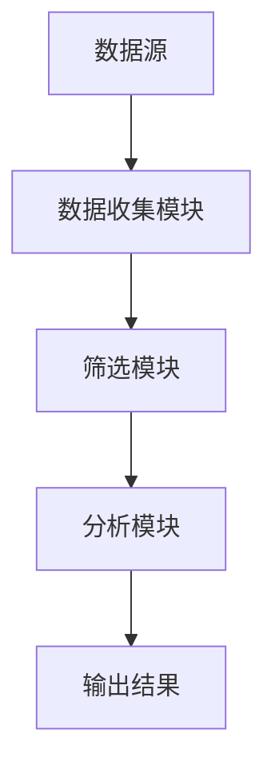

                 


# 《格雷厄姆特价股票投资策略解析》

> **关键词**：格雷厄姆、特价股票、价值投资、安全边际、内在价值、投资策略  
> **摘要**：本文系统解析了格雷厄姆的价值投资策略，重点介绍了特价股票的核心概念、筛选标准、数学模型以及实际应用。通过详细的分析和实例，帮助投资者理解如何利用格雷厄姆的策略实现稳健投资。

---

# 第一部分: 格雷厄姆特价股票投资策略背景与核心概念

## 第1章: 特价股票与投资策略概述

### 1.1 特价股票的定义与特点

#### 1.1.1 什么是特价股票
特价股票是指市场价格低于其内在价值的股票。这种股票通常被市场低估，具有较大的上涨潜力。格雷厄姆认为，投资者应寻找那些市场价格低于其内在价值的股票，以实现长期收益。

#### 1.1.2 特价股票的核心特征
- **低估性**：市场价格低于内在价值。
- **稳定性**：公司财务状况稳定，具有较强的抗风险能力。
- **低市盈率和低市净率**：市盈率（P/E）和市净率（P/B）低于行业平均水平。

#### 1.1.3 特价股票与普通股票的区别
| 特性         | 特价股票          | 普通股票          |
|--------------|-------------------|-------------------|
| 市盈率（P/E） | 低于行业平均值    | 接近或高于行业平均值 |
| 市净率（P/B） | 低于行业平均值    | 接近或高于行业平均值 |
| 股息率       | 较高             | 较低             |
| 投资风险     | 较低             | 较高             |

### 1.2 格雷厄姆投资策略的背景

#### 1.2.1 格雷厄姆与价值投资的起源
本杰明·格雷厄姆（Benjamin Graham）被誉为“价值投资之父”，他的投资理念起源于20世纪30年代的大萧条时期。在市场恐慌和股价暴跌的背景下，格雷厄姆发现许多优质股票被市场低估，具有较大的投资机会。

#### 1.2.2 大萧条时期的投资策略演变
在大萧条时期，格雷厄姆开始系统地研究股票的价值，提出了“安全边际”的概念。他认为，投资者应以低于内在价值的价格买入股票，以降低投资风险。

#### 1.2.3 格雷厄姆策略的现代应用
尽管格雷厄姆的投资策略诞生于20世纪，但其核心理念在现代投资中依然具有重要的指导意义。许多机构投资者和散户投资者都借鉴了他的策略，寻找被低估的股票进行投资。

---

## 第2章: 格雷厄姆投资策略的核心概念

### 2.1 安全边际

#### 2.1.1 安全边际的定义
安全边际是指股票的市场价格与内在价值之间的差异。格雷厄姆认为，投资者应以低于内在价值的价格买入股票，以确保投资的安全性。

#### 2.1.2 安全边际的计算方法
安全边际 = 内在价值 - 市场价格

#### 2.1.3 安全边际的重要性
安全边际是格雷厄姆策略的核心，它确保了投资者在市场波动中能够获得稳定的收益。即使市场出现短期波动，投资者仍能以较低的风险实现长期收益。

### 2.2 内在价值

#### 2.2.1 内在价值的定义
内在价值是指股票基于其基本面因素（如盈利能力、资产价值等）所具有的真实价值。它是股票的理论价值，不受市场情绪影响。

#### 2.2.2 内在价值的计算公式
内在价值的计算公式通常基于公司财务指标，如净利润、股东权益等。一个常用的公式是：
$$
\text{内在价值} = \frac{\text{净利润} \times (1 + \text{增长率})}{\text{资本成本} - \text{增长率}}
$$

#### 2.2.3 内在价值与市场价的关系
内在价值是指导投资的核心，而市场价格则反映了市场的短期情绪。当市场价格低于内在价值时，投资者应考虑买入；当市场价格高于内在价值时，应考虑卖出。

### 2.3 股票筛选标准

#### 2.3.1 低市盈率股票
市盈率（P/E）是衡量股票价值的重要指标。格雷厄姆建议投资者选择市盈率低于行业平均水平的股票。

#### 2.3.2 低市净率股票
市净率（P/B）是股票价格与每股净资产的比率。格雷厄姆认为，市净率低于1的股票具有较大的投资潜力。

#### 2.3.3 高股息率股票
高股息率股票是指股息收益率较高的股票。格雷厄姆认为，高股息率股票具有较高的安全边际，适合长期投资。

---

## 第3章: 核心概念与联系

### 3.1 核心概念原理

#### 3.1.1 安全边际与内在价值的关系
安全边际是内在价值与市场价格之间的差额。当市场价格低于内在价值时，安全边际为正，投资具有较高的安全性和收益潜力。

#### 3.1.2 特价股票的筛选逻辑
格雷厄姆的筛选逻辑基于以下原则：
1. 选择低市盈率和低市净率的股票。
2. 选择具有较高股息率的股票。
3. 确保股票的市场价格低于其内在价值。

#### 3.1.3 格雷厄姆策略的数学模型
格雷厄姆策略的数学模型可以表示为：
$$
\text{安全边际} = \text{内在价值} - \text{市场价格}
$$
其中，内在价值基于公司的基本面指标计算，市场价格则由市场决定。

### 3.2 概念属性特征对比表

| 概念       | 定义                           | 计算公式                     | 重要性 |
|------------|--------------------------------|------------------------------|--------|
| 安全边际   | 内在价值与市场价格的差额       | 内在价值 - 市场价格          | 高     |
| 内在价值   | 股票基于基本面的真实价值       | 基于净利润和增长率计算        | 高     |
| 市盈率     | 股票价格与每股收益的比率       | 市场价格 / 每股收益         | 中     |
| 市净率     | 股票价格与每股净资产的比率     | 市场价格 / 每股净资产       | 中     |
| 股息率     | 每股股息与股票价格的比率       | 每股股息 / 市场价格         | 高     |

---

## 第4章: 算法原理与数学模型

### 4.1 算法原理

#### 4.1.1 筛选流程
格雷厄姆的股票筛选流程可以表示为：
1. 确定筛选标准（如低市盈率、低市净率、高股息率）。
2. 收集相关股票的数据。
3. 计算内在价值。
4. 确定安全边际。
5. 筛选出符合条件的股票。

#### 4.1.2 筛选标准的数学模型
- 市盈率（P/E）：
  $$
  \text{P/E} = \frac{\text{市场价格}}{\text{每股收益}}
  $$
- 市净率（P/B）：
  $$
  \text{P/B} = \frac{\text{市场价格}}{\text{每股净资产}}
  $$
- 股息率（Dividend Yield）：
  $$
  \text{股息率} = \frac{\text{每股股息}}{\text{市场价格}} \times 100\%
  $$

### 4.2 数学模型与公式

#### 4.2.1 内在价值公式
$$
\text{内在价值} = \frac{\text{净利润} \times (1 + \text{增长率})}{\text{资本成本} - \text{增长率}}
$$

#### 4.2.2 安全边际公式
$$
\text{安全边际} = \text{内在价值} - \text{市场价格}
$$

#### 4.2.3 示例计算
假设某公司净利润为100万元，增长率为5%，资本成本为10%。则：
$$
\text{内在价值} = \frac{100 \times (1 + 0.05)}{0.10 - 0.05} = \frac{105}{0.05} = 2100 \text{万元}
$$
如果市场价格为2000万元，则安全边际为：
$$
\text{安全边际} = 2100 - 2000 = 100 \text{万元}
$$

---

## 第5章: 系统分析与架构设计

### 5.1 系统功能设计

#### 5.1.1 领域模型
- **输入**：股票数据（市场价格、每股收益、每股净资产、股息等）。
- **输出**：筛选出的特价股票列表。

#### 5.1.2 功能模块
1. 数据收集模块：从数据源获取股票信息。
2. 筛选模块：根据筛选标准筛选出符合条件的股票。
3. 分析模块：计算内在价值和安全边际。

#### 5.1.3 类图


### 5.2 系统架构设计

#### 5.2.1 架构图


---

## 第6章: 项目实战

### 6.1 环境安装

#### 6.1.1 Python环境
安装Python和必要的库（如pandas、numpy）。

#### 6.1.2 数据源
从Yahoo Finance获取股票数据。

### 6.2 核心实现

#### 6.2.1 数据收集
```python
import pandas as pd
import numpy as np

# 从Yahoo Finance获取股票数据
def get_stock_data(ticker):
    data = pd.DataFrame()
    # 实现数据获取逻辑
    return data
```

#### 6.2.2 筛选模块
```python
def screen_stocks(data, criteria):
    selected = data[(data['P/E'] < criteria['pe']) &
                    (data['P/B'] < criteria['pb']) &
                    (data['股息率'] > criteria['dividend_yield'])]
    return selected
```

#### 6.2.3 分析模块
```python
def calculate_intrinsic_value(data):
    data['内在价值'] = data['净利润'] * (1 + data['增长率']) / (data['资本成本'] - data['增长率'])
    data['安全边际'] = data['内在价值'] - data['市场价格']
    return data
```

### 6.3 实际案例分析

#### 6.3.1 案例分析
假设我们筛选某行业中的股票，筛选标准为：
- 市盈率 < 15
- 市净率 < 2
- 股息率 > 3%

#### 6.3.2 数据分析
```python
# 假设data为筛选后的数据
data = get_stock_data(ticker='AAPL')
selected = screen_stocks(data, criteria={'pe':15, 'pb':2, 'dividend_yield':3%})
analyzed = calculate_intrinsic_value(selected)
print(analyzed)
```

---

## 第7章: 最佳实践与小结

### 7.1 最佳实践

#### 7.1.1 投资策略
- 分散投资：避免过度集中于某一只股票。
- 长期持有：耐心等待股价回归内在价值。

#### 7.1.2 风险控制
- 设定止损点：当股价跌破内在价值时，及时止损。
- 定期调整：根据市场变化，定期重新评估投资组合。

### 7.2 小结
格雷厄姆的特价股票投资策略通过寻找市场价格低于内在价值的股票，帮助投资者实现稳健的投资收益。通过本文的解析，读者可以更好地理解格雷厄姆策略的核心思想，并将其应用于实际投资中。

---

通过以上结构，您可以逐步深入理解格雷厄姆的特价股票投资策略，并将其应用于实际投资中。希望本文对您有所帮助！

