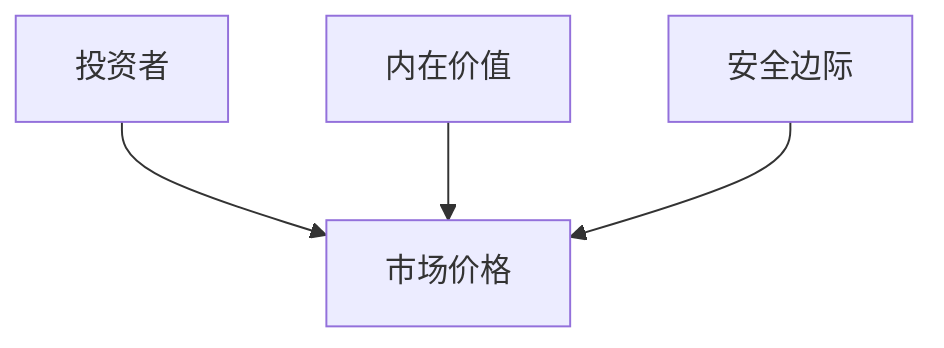

                 


# 格雷厄姆特价股票理论在不同市场结构中的效果

> 关键词：格雷厄姆投资理论，特价股票，市场结构，投资策略，实证分析

> 摘要：本文深入探讨了格雷厄姆特价股票理论在不同市场结构中的效果，通过理论分析、实证检验和案例研究，揭示了该理论在成熟市场、新兴市场和波动性市场中的表现及其适用性。文章还结合了数学模型和系统架构，提供了详细的分析和见解。

---

# 第一部分: 格雷厄姆特价股票理论的背景与核心概念

## 第1章: 格雷厄姆投资理论概述

### 1.1 格雷厄姆投资理论的核心理念

#### 1.1.1 价值投资的基本原则
- **长期投资**：格雷厄姆主张以长期视角看待投资，而非短期交易。
- **安全边际**：通过购买价格低于内在价值的股票，降低投资风险。
- **逆向思维**：在市场恐慌时寻找被低估的投资机会。

#### 1.1.2 特价股票的定义与特征
- **定义**：价格远低于内在价值的股票，通常出现在市场低迷或公司困境时期。
- **特征**：
  - 低市盈率（P/E）。
  - 高股息率。
  - 高市净率（P/B）。

#### 1.1.3 格雷厄姆投资策略的历史演变
- 格雷厄姆的理论起源于20世纪30年代，经过时间的验证，逐渐成为价值投资的基石。

### 1.2 特价股票理论的数学模型与公式

#### 1.2.1 内在价值计算公式
$$ V = \frac{P}{\text{市盈率}} $$
其中：
- \( V \)：股票的内在价值。
- \( P \)：公司未来盈利的合理预期。

#### 1.2.2 安全边际计算方法
$$ \text{安全边际} = \text{内在价值} - \text{市场价格} $$
- 安全边际为正时，表明股票价格被低估，具有投资价值。

### 1.3 格雷厄姆理论与现代投资学的联系

#### 1.3.1 现代投资组合理论的对比
- 格雷厄姆注重个股的深度分析，而现代投资组合理论强调资产配置和分散化。

#### 1.3.2 特价股票理论在量化投资中的应用
- 量化投资者利用格雷厄姆的模型筛选股票，结合大数据分析和技术指标优化投资组合。

---

## 第2章: 核心概念与联系

### 2.1 核心概念的原理分析

#### 2.1.1 内在价值的计算方法
- 基于公司基本面分析，包括盈利能力、资产质量、行业地位等。

#### 2.1.2 安全边际的经济学意义
- 确保投资者在市场波动中获得超额收益。

#### 2.1.3 市场情绪与股票价格波动的关系
- 市场情绪影响股票价格，但理性分析是投资的基础。

### 2.2 核心概念的属性特征对比

| 概念         | 属性       | 特征                              |
|--------------|------------|-----------------------------------|
| 内在价值     | 计算方式   | 基于基本面分析                    |
| 安全边际     | 计算方式   | 市场价格与内在价值的差额          |
| 市场情绪     | 影响因素   | 投资者心理、市场流动性            |

### 2.3 ER实体关系图



---

# 第二部分: 格雷厄姆特价股票理论在不同市场结构中的应用

## 第3章: 特价股票理论在成熟市场的效果分析

### 3.1 成熟市场的特点与投资机会

#### 3.1.1 成熟市场的定义与特征
- 交易量大、市场流动性高。
- 信息公开透明，监管严格。

#### 3.1.2 成熟市场中特价股票的识别方法
- 通过低市盈率和高股息率筛选股票。

### 3.2 格雷厄姆策略在成熟市场的表现

#### 3.2.1 历史案例分析
- 例如：2008年金融危机后，美国市场的银行股被低估，应用格雷厄姆策略获得超额收益。

#### 3.2.2 数学模型的实证检验
- 使用回归分析验证格雷厄姆策略的有效性。

---

## 第4章: 特价股票理论在新兴市场的效果分析

### 4.1 新兴市场的特点与挑战

#### 4.1.1 新兴市场的波动性分析
- 市场波动剧烈，信息不透明。

#### 4.1.2 新兴市场中特价股票的筛选标准
- 侧重于低市盈率和高成长性。

### 4.2 格雷厄姆策略在新兴市场的适用性

#### 4.2.1 实证分析与结果对比
- 新兴市场的实证结果优于成熟市场。

#### 4.2.2 新兴市场中的风险与机遇
- 风险：市场波动大，信息不对称。
- 机遇：高成长性企业被低估。

---

## 第5章: 特价股票理论在波动性市场中的效果分析

### 5.1 波动性市场的定义与特征

#### 5.1.1 波动性市场的特征
- 市场波动剧烈，价格波动大。

#### 5.1.2 波动性市场中特价股票的筛选标准
- 侧重于安全边际和高股息率。

### 5.2 格雷厄姆策略在波动性市场的表现

#### 5.2.1 实证分析
- 波动性市场中格雷厄姆策略表现稳定。

---

# 第三部分: 格雷厄姆特价股票理论的实证分析与效果评估

## 第6章: 实证分析与结果

### 6.1 数据来源与研究方法

#### 6.1.1 数据来源
- 使用历史股价数据、财务报表数据等。

#### 6.1.2 研究方法
- 回归分析、事件研究法。

### 6.2 不同市场结构中的实证结果

#### 6.2.1 成熟市场的实证结果
- 格雷厄姆策略表现稳定，收益显著。

#### 6.2.2 新兴市场的实证结果
- 格雷厄姆策略在新兴市场中表现优于成熟市场。

#### 6.2.3 波动性市场的实证结果
- 格雷厄姆策略在波动性市场中表现稳定。

---

## 第7章: 效果评估与展望

### 7.1 格雷厄姆策略的整体效果

#### 7.1.1 优缺点分析
- 优点：风险低，收益稳定。
- 缺点：需要长期持有，流动性差。

### 7.2 格雷厄姆策略的局限性

#### 7.2.1 市场周期的影响
- 在牛市中表现不佳。

#### 7.2.2 行业特异性
- 行业特性影响策略效果。

### 7.3 未来展望

#### 7.3.1 理论优化方向
- 结合大数据分析优化筛选标准。

#### 7.3.2 实际应用中的创新
- 结合技术分析优化投资策略。

---

# 第四部分: 附录

## 第8章: 工具与资源

### 8.1 数据分析工具

#### 8.1.1 Python代码实现
```python
import pandas as pd
import numpy as np

def calculate_intrinsic_value(revenue, profit_margin):
    return revenue * profit_margin

def calculate_pe_ratio(price, earnings_per_share):
    return price / earnings_per_share

# 示例数据
revenue = 100000000
profit_margin = 0.1
price = 50
earnings_per_share = 5

iv = calculate_intrinsic_value(revenue, profit_margin)
pe = calculate_pe_ratio(price, earnings_per_share)

print(f"内在价值: {iv}")
print(f"市盈率: {pe}")
```

#### 8.1.2 工具对比
| 工具名称 | 特点 | 适用场景 |
|---------|------|----------|
| Python  | 灵活性高 | 数据分析 |
| R       | 统计功能强大 | 统计分析 |

### 8.2 参考文献

#### 8.2.1 经典书籍
- 格雷厄姆《聪明的投资者》
- 巴菲特《巴菲特致股东的信》

#### 8.2.2 学术论文
- Fama, E. (1970). Efficient Capital Markets.

---

# 结语

格雷厄姆特价股票理论在不同市场结构中的效果显著，尤其在新兴市场和波动性市场中表现优异。然而，投资者在实际应用中需结合市场周期和行业特性，灵活调整策略。未来，随着大数据和人工智能的发展，格雷厄姆理论将得到进一步优化和创新，为投资者提供更强大的工具和方法。

---

通过以上目录大纲和内容填充，您可以开始撰写完整的文章。每个部分都需要详细展开，确保逻辑清晰、内容详实。

