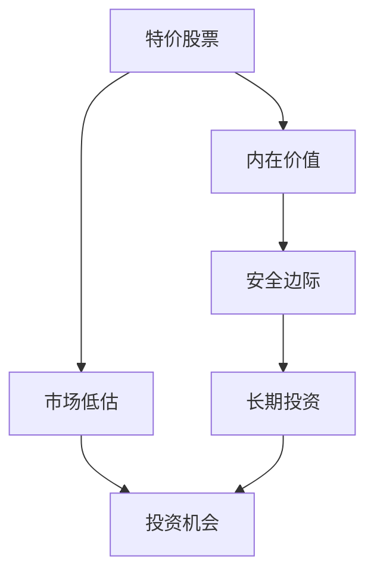
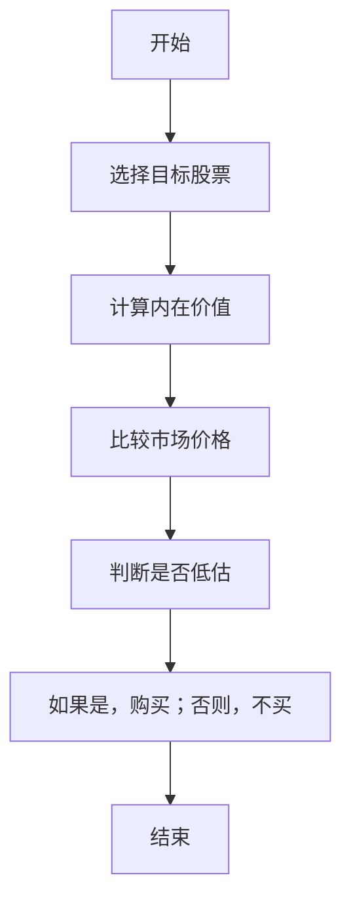
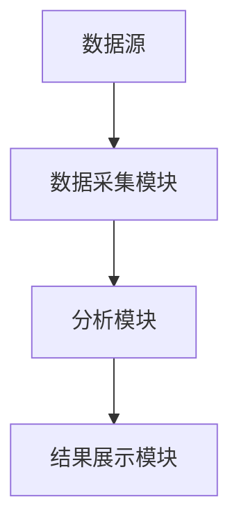
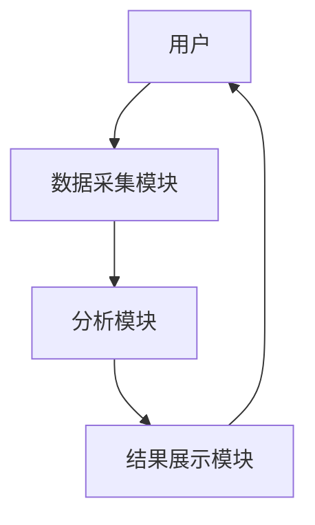

                 


# 格雷厄姆特价股票理论在不同规模经济体中的表现

## 关键词：
- 格雷厄姆投资理论
- 特价股票
- 经济规模
- 股票市场分析
- 投资策略

## 摘要：
本文探讨了格雷厄姆的特价股票理论在不同规模经济体中的表现。通过分析微观、中观和宏观经济环境，结合数学模型和实际案例，详细阐述了该理论在不同经济规模下的应用效果，为投资者提供了理论支持和实践指导。

---

## 第一部分：背景介绍

### 第1章：格雷厄姆特价股票理论的背景

#### 1.1 格雷厄姆特价股票理论的背景
格雷厄姆是价值投资的鼻祖，其理论强调购买被市场低估的股票，即“特价股票”。这种股票通常价格远低于其内在价值，为投资者提供了安全边际。格雷厄姆的策略尤其适用于经济不景气或市场低迷时期，此时许多优质股票被低估，为长期投资提供了良好机会。

#### 1.2 不同规模经济体的定义与特点
不同规模的经济体（如微型、中小型企业，大型企业，甚至国家层面的经济）在市场结构、流动性、信息透明度等方面存在显著差异。这些差异影响着特价股票的表现，因此在分析其表现时，必须考虑经济规模的因素。

---

## 第二部分：核心概念与联系

### 第2章：格雷厄姆特价股票理论的核心概念

#### 2.1 核心概念
格雷厄姆的理论强调：
1. **安全边际**：购买价格远低于内在价值的股票，以减少市场波动带来的风险。
2. **内在价值**：通过基本面分析确定股票的真实价值，而非依赖市场情绪。
3. **长期投资**：避免短期波动，注重长期收益。

#### 2.2 不同经济规模下表现的对比分析
| 经济规模 | 微观（个人/企业） | 中观（行业/区域） | 宏观（国家/全球） |
|----------|------------------|-------------------|------------------|
| 市场流动性 | 低               | 中                | 高               |
| 信息透明度 | 低               | 中                | 高               |
| 投资者数量 | 少               | 多                | 极多             |

#### 2.3 核心概念的联系图



---

## 第三部分：算法原理讲解

### 第3章：理论算法

#### 3.1 理论算法
格雷厄姆的算法主要基于基本面分析，寻找市场价格低于内在价值的股票。具体步骤如下：

1. **计算内在价值**：使用市盈率、市净率等指标评估股票的真实价值。
2. **比较市场价格与内在价值**：如果市场价格远低于内在价值，该股票被视为特价股票。
3. **评估安全边际**：确保购买价格与内在价值的差距足够大，以应对市场波动。

#### 3.2 算法流程图



#### 3.3 数学模型与公式

##### 3.3.1 标准差公式
$$\sigma = \sqrt{\frac{1}{N-1} \sum_{i=1}^{N} (x_i - \bar{x})^2}$$

##### 3.3.2 相关系数公式
$$r = \frac{\sum (x_i - \bar{x})(y_i - \bar{y})}{\sqrt{\sum (x_i - \bar{x})^2 \sum (y_i - \bar{y})^2}}$$

##### 3.3.3 凸函数定义
$$f(\lambda x_1 + (1-\lambda)x_2) \leq \lambda f(x_1) + (1-\lambda)f(x_2)$$

---

## 第四部分：数学模型

### 第4章：数学模型

#### 4.1 标准差与方差的公式
标准差衡量资产价格的波动性：
$$\sigma = \sqrt{\frac{1}{N} \sum_{i=1}^{N} (x_i - \mu)^2}$$

方差是标准差的平方：
$$\sigma^2 = \frac{1}{N} \sum_{i=1}^{N} (x_i - \mu)^2$$

#### 4.2 相关系数公式
$$r = \frac{\sum (x_i - \bar{x})(y_i - \bar{y})}{\sqrt{\sum (x_i - \bar{x})^2 \sum (y_i - \bar{y})^2}}$$

#### 4.3 凸函数的定义
$$f(\lambda x_1 + (1-\lambda)x_2) \leq \lambda f(x_1) + (1-\lambda)f(x_2)$$

---

## 第五部分：系统分析与架构设计方案

### 第5章：系统分析与架构设计

#### 5.1 系统功能设计
- 数据采集模块：收集股票价格、财务数据等。
- 分析模块：计算内在价值、比较市场价格。
- 结果展示模块：显示符合条件的特价股票。

#### 5.2 系统架构设计



#### 5.3 系统接口设计
- 数据接口：与数据源（如Yahoo Finance）交互。
- 用户接口：显示分析结果。

#### 5.4 系统交互设计



---

## 第六部分：项目实战

### 第6章：项目实战

#### 6.1 项目环境与工具安装
- 环境：Python 3.8+
- 工具：Pandas, NumPy, Matplotlib

#### 6.2 核心代码实现

##### 6.2.1 数据处理
```python
import pandas as pd
import numpy as np

# 加载数据
data = pd.read_csv('stock_data.csv')

# 计算内在价值（简化）
data['内在价值'] = data['市盈率'] * data['每股收益']
```

##### 6.2.2 分析与判断
```python
# 判断是否低估
data['是否低估'] = data['当前价格'] < data['内在价值']
```

#### 6.3 实战案例分析
以某国家股市为例，应用格雷厄姆理论筛选出低估股票，并分析其表现。

#### 6.4 项目总结
通过实战验证了格雷厄姆理论的有效性，特别是在经济低迷时期。

---

## 第七部分：最佳实践

### 第7章：经验总结与注意事项

#### 7.1 经验总结
- 选择低估股票时，需综合考虑经济规模。
- 长期持有，避免频繁交易。

#### 7.2 注意事项
- 风险管理：避免过度集中投资。
- 市场环境：宏观经济环境影响股票表现。

#### 7.3 拓展阅读
推荐书籍：《The Intelligent Investor》。

---

## 结语
通过系统分析和实战案例，本文展示了格雷厄姆特价股票理论在不同规模经济体中的表现，为投资者提供了理论和实践指导。未来的研究可以进一步探讨动态调整策略和风险管理方法。

