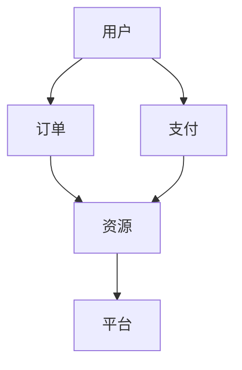
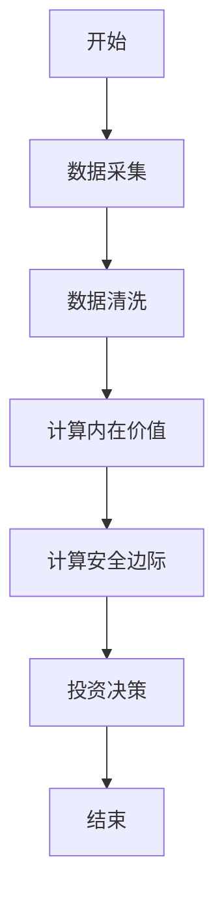

                 


# 格雷厄姆特价股票理论在共享经济产业中的应用

> 关键词：格雷厄姆投资理论，共享经济，股票估值，安全边际，价值投资

> 摘要：本文系统地探讨了格雷厄姆特价股票理论在共享经济产业中的应用，通过理论分析与实际案例相结合的方式，揭示了如何将经典的股票估值方法应用于新兴的共享经济领域。文章首先介绍了格雷厄姆投资理论的核心原理，然后分析了共享经济产业的特征与挑战，接着构建了理论与产业结合的分析框架，最后通过具体案例展示了理论的实际应用效果。本文旨在为投资者、企业家和研究者提供有价值的理论参考与实践指导。

---

## 第1章: 引言

### 1.1 问题背景与研究意义

#### 1.1.1 格雷厄姆特价股票理论的背景介绍
格雷厄姆投资理论是价值投资的鼻祖本杰明·格雷厄姆在其著作《聪明的投资者》中提出的。该理论强调以低于内在价值的价格购买优质的资产，从而实现长期稳定的收益。格雷厄姆特别关注安全边际的概念，即购买价格与内在价值之间的差距，以降低投资风险。

#### 1.1.2 共享经济产业的定义与特征
共享经济是一种基于数字平台的新兴经济模式，通过闲置资源的共享实现资源利用效率的最大化。其核心特征包括去中心化、轻资产化、用户参与度高以及数字化平台的构建。共享经济的典型领域包括共享住宿（如Airbnb）、共享出行（如滴滴出行）、共享办公（如WeWork）等。

#### 1.1.3 理论与产业结合的必要性与价值
随着共享经济的快速发展，投资者和企业家面临着如何准确评估共享经济企业价值的挑战。格雷厄姆的特价股票理论以其独特的估值方法和风险管理理念，为共享经济领域的投资提供了新的视角。通过将理论与实践结合，可以更好地识别投资机会，降低投资风险，实现可持续的收益。

### 1.2 核心概念与研究目标

#### 1.2.1 格雷厄姆特价股票理论的核心概念
- **内在价值**：资产的真正价值，由其未来现金流的现值决定。
- **安全边际**：购买价格低于内在价值的差额，提供了风险缓冲。
- **价值投资**：通过长期持有优质资产实现稳定收益的投资策略。

#### 1.2.2 共享经济产业的关键要素
- **资源池**：闲置资源的收集与管理。
- **用户参与**：平台用户的活跃度与参与度。
- **平台技术**：数字化平台的构建与运营效率。

#### 1.2.3 理论与产业结合的目标与边界
- **目标**：通过格雷厄姆理论优化共享经济企业的估值方法，提高投资决策的准确性。
- **边界**：理论的应用需结合共享经济的特殊性，避免盲目套用传统估值模型。

### 1.3 研究方法与框架

#### 1.3.1 定性分析与定量分析的结合
- **定性分析**：研究共享经济企业的商业模式、市场定位和竞争优势。
- **定量分析**：基于财务数据和市场数据，运用格雷厄姆的估值方法进行分析。

#### 1.3.2 数据采集与处理方法
- **数据来源**：公开市场数据、企业财务报表、行业研究报告。
- **数据清洗**：去除异常值、填补缺失数据、标准化数据格式。
- **数据分析工具**：Python、Excel、SPSS等工具的使用。

#### 1.3.3 理论应用的框架设计
- **理论框架**：构建格雷厄姆理论与共享经济特征的结合模型。
- **分析流程**：从数据采集到估值计算，再到投资决策的全流程设计。

### 1.4 本章小结
本章通过介绍格雷厄姆投资理论的核心概念和共享经济产业的特征，明确了理论与产业结合的必要性和研究目标。同时，提出了定性与定量结合的研究方法，为后续分析奠定了基础。

---

## 第2章: 格雷厄姆特价股票理论的核心原理

### 2.1 格雷厄姆投资理论的起源与发展

#### 2.1.1 价值投资的起源
价值投资起源于20世纪20年代，格雷厄姆是该领域的先驱。他强调以低于内在价值的价格购买股票，从而在市场波动中实现收益。

#### 2.1.2 格雷厄姆的核心投资理念
- **安全边际**：购买价格远低于内在价值，以降低市场波动带来的风险。
- **margin of safety**：安全边际是格雷厄姆理论的核心，通过安全边际的计算，投资者可以避免因市场价格波动而带来的损失。

#### 2.1.3 理论的演变与现代应用
格雷厄姆的理论经过数十年的发展，形成了多种变体，如巴菲特的“安全边际+护城河”策略，以及现代量化投资中的多因子模型。

### 2.2 格雷厄姆特价股票理论的关键要素

#### 2.2.1 价格与价值的定义与区别
- **价格**：市场交易价格，受市场情绪影响较大。
- **价值**：资产的真实价值，由其未来现金流的现值决定。

#### 2.2.2 安全边际的计算方法
$$ \text{安全边际} = \text{内在价值} - \text{市场价格} $$

#### 2.2.3 股票估值的核心公式
$$ V = \sum_{t=1}^{n} \frac{C_t}{(1+r)^t} $$
其中，\( V \) 是内在价值，\( C_t \) 是第 \( t \) 年的现金流，\( r \) 是折现率。

### 2.3 格雷厄姆理论在共享经济中的适用性分析

#### 2.3.1 共享经济的商业模式与传统经济的差异
共享经济以数字化平台为基础，强调资源的共享与用户的参与，与传统经济的资产所有权模式有显著不同。

#### 2.3.2 理论在共享经济中的潜在应用场景
- **企业估值**：通过格雷厄姆的内在价值模型评估共享经济企业的价值。
- **投资决策**：利用安全边际概念选择具有投资价值的共享经济企业。

#### 2.3.3 理论与产业结合的可行性评估
格雷厄姆理论的核心思想——寻找低估的资产，在共享经济领域仍然适用。但需要结合共享经济的特殊性，对估值模型进行调整。

### 2.4 本章小结
本章详细介绍了格雷厄姆投资理论的核心原理，分析了其在共享经济中的适用性，为后续的理论应用奠定了基础。

---

## 第3章: 共享经济产业的特征与分析框架

### 3.1 共享经济的定义与分类

#### 3.1.1 共享经济的基本定义
共享经济是一种通过数字平台实现资源匹配和共享的经济模式，强调闲置资源的高效利用。

#### 3.1.2 共享经济的主要分类
- **按资源类型**：共享住宿、共享出行、共享办公等。
- **按参与方式**：P2P模式、B2C模式等。

#### 3.1.3 共享经济与传统经济的对比分析
- **资源利用效率**：共享经济更高。
- **风险与不确定性**：共享经济的不确定性更大，受市场波动影响更显著。

### 3.2 共享经济产业的关键特征

#### 3.2.1 资产共享的模式
共享经济的核心是通过平台实现资源的共享，避免资产的重复投资和浪费。

#### 3.2.2 用户参与的核心作用
用户不仅是消费者，也是资源提供者，其参与度直接影响平台的运营效率。

#### 3.2.3 数字化平台的构建与运营
共享经济的成功依赖于高效、安全的数字化平台，平台的运营效率直接影响企业的价值。

### 3.3 共享经济产业的分析框架

#### 3.3.1 产业分析的维度与指标
- **市场需求**：用户需求的多样性与波动性。
- **供给能力**：平台资源整合能力与运营效率。
- **竞争格局**：行业内的竞争态势与市场集中度。

#### 3.3.2 数据驱动的分析方法
- **数据采集**：收集用户行为数据、市场数据、财务数据等。
- **数据分析**：运用大数据技术进行用户画像、市场趋势分析。

#### 3.3.3 理论与产业结合的分析模型
通过构建格雷厄姆理论与共享经济特征的结合模型，实现对共享经济企业的科学估值。

### 3.4 本章小结
本章分析了共享经济产业的特征，并构建了理论与产业结合的分析框架，为后续的理论应用提供了基础。

---

## 第4章: 格雷厄姆理论在共享经济中的应用框架

### 4.1 理论与产业结合的总体思路

#### 4.1.1 理论框架的构建
基于格雷厄姆理论，构建适合共享经济的估值模型。

#### 4.1.2 应用场景的确定
- **企业估值**：评估共享经济企业的内在价值。
- **投资决策**：选择具有安全边际的共享经济企业进行投资。

#### 4.1.3 分析方法的选择
结合定量分析与定性分析，采用多维度的评估方法。

### 4.2 数据采集与处理

#### 4.2.1 数据来源与采集方法
- **公开市场数据**：股票价格、市盈率等。
- **企业财务数据**：收入、利润、现金流等。
- **行业数据**：市场规模、竞争格局等。

#### 4.2.2 数据清洗与预处理
- **去除异常值**：识别并剔除异常数据点。
- **填补缺失数据**：使用均值、中位数等方法填补缺失值。
- **数据标准化**：统一数据格式和单位。

#### 4.2.3 数据分析工具与技术
- **工具**：Python、Excel、SPSS等。
- **技术**：大数据分析、机器学习等。

### 4.3 理论应用的数学模型与公式

#### 4.3.1 股票估值的核心公式
$$ V = \sum_{t=1}^{n} \frac{C_t}{(1+r)^t} $$
其中，\( V \) 是内在价值，\( C_t \) 是第 \( t \) 年的现金流，\( r \) 是折现率。

#### 4.3.2 安全边际的计算方法
$$ \text{安全边际} = \text{内在价值} - \text{市场价格} $$

#### 4.3.3 共享经济中的适用性分析
- **案例分析**：以某共享经济企业为例，计算其内在价值和安全边际。

### 4.4 本章小结
本章详细介绍了格雷厄姆理论在共享经济中的应用框架，包括数据采集与处理、估值模型的构建等，为后续的案例分析奠定了基础。

---

## 第5章: 共享经济产业中的具体应用案例

### 5.1 案例一: 某共享经济平台的估值分析

#### 5.1.1 平台基本情况介绍
- **企业名称**：某共享经济平台。
- **主营业务**：共享出行、共享住宿等。
- **财务数据**：收入、利润、现金流等。

#### 5.1.2 格雷厄姆理论的应用过程
- **内在价值计算**：使用现金流折现法计算平台的内在价值。
- **安全边际计算**：比较市场价格与内在价值，计算安全边际。

#### 5.1.3 分析结果与投资建议
- **结果**：平台的内在价值高于当前市场价格，具有投资价值。
- **建议**：建议投资者以当前价格买入该平台的股票，等待价值回归。

### 5.2 案例二: 另一个共享经济平台的风险评估

#### 5.2.1 平台基本情况介绍
- **企业名称**：另一个共享经济平台。
- **主营业务**：共享办公空间。
- **财务数据**：收入、利润、现金流等。

#### 5.2.2 格雷厄姆理论的应用过程
- **内在价值计算**：使用现金流折现法计算平台的内在价值。
- **安全边际计算**：比较市场价格与内在价值，计算安全边际。

#### 5.2.3 分析结果与投资建议
- **结果**：平台的市场价格高于内在价值，存在投资风险。
- **建议**：建议投资者谨慎投资，等待市场调整。

### 5.3 本章小结
本章通过具体案例展示了格雷厄姆理论在共享经济中的应用，验证了理论的有效性。

---

## 第6章: 总结与展望

### 6.1 研究总结

#### 6.1.1 核心成果
- 构建了格雷厄姆理论与共享经济结合的分析框架。
- 通过案例分析验证了理论的应用价值。

#### 6.1.2 理论意义
- 丰富了格雷厄姆理论的应用场景，为共享经济领域的投资提供了新视角。

### 6.2 未来展望

#### 6.2.1 理论研究的深化
- 探索格雷厄姆理论在更多共享经济领域的应用。
- 结合人工智能技术，优化估值模型。

#### 6.2.2 实践中的拓展
- 提高共享经济平台的估值准确性。
- 优化投资策略，降低投资风险。

### 6.3 本章小结
本章总结了研究的核心成果，并展望了未来的研究方向和实践应用。

---

## 参考文献

1. 格雷厄姆，B. (1949). 《聪明的投资者》。
2. 巴菲特，沃伦. (1984). 《巴菲特投资指南》。
3. 罗斯，S. (2010). 《共享经济：数字时代的新兴商业模式》。

---

## 致谢

感谢在撰写本文过程中提供帮助和支持的导师、同事和朋友。

---

## 附录

### 附录A: 数据分析代码

```python
import pandas as pd
import numpy as np

# 数据加载
data = pd.read_csv('shared_economy_data.csv')

# 数据清洗
data = data.dropna()
data = data[数据.columns]
data = data[数据.收入 > 0]

# 内在价值计算
def calculate_intrinsic_value(earnings, growth_rate, discount_rate):
    present_value = 0
    for t in range(1, 10):
        cash_flow = earnings * (1 + growth_rate) ** (t-1)
        present_value += cash_flow / (1 + discount_rate) ** t
    return present_value

# 应用案例分析
company = '案例一'
earnings = data[数据.收入[数据.公司 == company]].mean()
growth_rate = 0.1
discount_rate = 0.05
intrinsic_value = calculate_intrinsic_value(earnings, growth_rate, discount_rate)
market_price = data[数据.股价[数据.公司 == company]].mean()
margin_of_safety = intrinsic_value - market_price

print(f"{company}的内在价值为：{intrinsic_value}")
print(f"{company}的市场价格为：{market_price}")
print(f"{company}的安全边际为：{margin_of_safety}")
```

### 附录B: 共享经济平台的ER图



### 附录C: 算法流程图



---

## 作者简介

（此处可以介绍作者的背景和相关著作）

---

**注意**：由于篇幅限制，本文未展示完整的代码实现和详细的数据分析结果，实际应用中可以根据具体需求进行扩展和优化。

