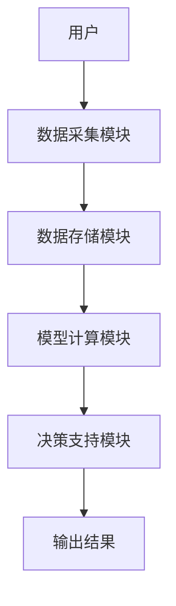
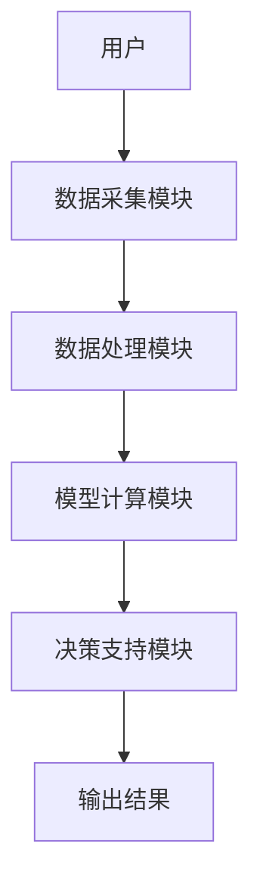
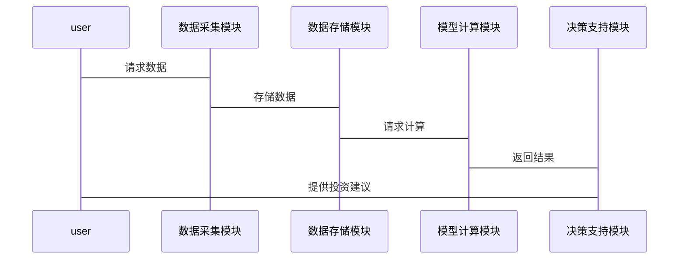

                 


# 格雷厄姆特价股票理论在共享经济时代的新思考

## 关键词
- 格雷厄姆特价股票理论
- 共享经济
- 价值投资
- 内在价值
- 安全边际

## 摘要
格雷厄姆的特价股票理论是一种经典的价值投资方法，强调通过寻找市场价格低于内在价值的股票来实现长期收益。随着共享经济的兴起，资源的共享与优化配置成为新的经济模式。本文将深入探讨格雷厄姆理论的核心概念、数学模型及其在共享经济时代的适用性，结合实际案例分析其在现代投资中的应用价值，并提出新的思考方向。

---

# 第一部分: 格雷厄姆特价股票理论的背景与核心概念

## 第1章: 格雷厄姆特价股票理论的起源与核心概念

### 1.1 格雷厄姆特价股票理论的起源
#### 1.1.1 投资学派的演变
现代投资学的发展可以追溯到20世纪初，以本杰明·格雷厄姆和戴维德·多德为代表的价值投资学派奠定了股票分析的基础。格雷厄姆在《证券分析》和《聪明的投资者》中提出了“安全边际”和“内在价值”等核心概念，强调以低于内在价值的价格买入股票，以规避市场波动带来的风险。

#### 1.1.2 格雷厄姆的价值投资理念
格雷厄姆认为，市场的短期波动是不可预测的，但长期来看，股票的价格会回归其内在价值。他倡导以基本面分析为核心，寻找那些被市场低估的股票，通过长期持有实现稳定的收益。

#### 1.1.3 特价股票的定义与特征
特价股票是指市场价格低于其内在价值的股票。其特征包括：
- 公司具有稳定的盈利能力和良好的财务状况；
- 股价受到市场情绪或短期因素的影响，被低估；
- 公司具有较高的安全边际，即市场价格与内在价值之间的差距较大。

### 1.2 格雷厄姆理论的核心概念
#### 1.2.1 市场先生与投资者的角色
格雷厄姆将市场比作“市场先生”，认为市场情绪的波动会影响股票价格，但投资者应以理性决策为主导，避免被市场情绪左右。

#### 1.2.2 内在价值与市场价格的关系
内在价值是股票的真实价值，而市场价格则受到市场情绪和短期因素的影响。格雷厄姆强调，投资的本质是寻找市场价格低于内在价值的股票。

#### 1.2.3 安全边际的计算与应用
安全边际是市场价格与内在价值之间的差距，用于衡量投资的安全性。格雷厄姆建议以低于内在价值的价格买入股票，以确保投资的安全性。

### 1.3 格雷厄姆理论在共享经济时代的适用性
#### 1.3.1 共享经济的基本特征
共享经济强调资源的共享与优化配置，通过平台和技术实现资源的高效利用。这种模式改变了传统的所有权经济，使得资源的价值更多地体现在使用权上。

#### 1.3.2 共享经济中的资源分配与定价
在共享经济中，资源的定价受到供需关系、平台撮合效率和用户行为的影响。与传统经济相比，共享经济中的资源价格更加动态化和市场化。

#### 1.3.3 格雷厄姆理论与共享经济的结合点
格雷厄姆理论的核心是寻找被低估的资源或资产。在共享经济时代，投资者可以通过分析平台的定价策略、用户需求和市场供需关系，寻找具有安全边际的共享经济企业或项目。

---

## 第2章: 格雷厄姆特价股票理论的核心要素与数学模型

### 2.1 格雷厄姆理论的核心要素
#### 2.1.1 内在价值的计算公式
内在价值是股票的真正价值，可以通过对公司未来现金流的折现来计算。公式如下：
$$ V = \frac{E}{1 + k} $$
其中，\( V \) 为内在价值，\( E \) 为未来收益，\( k \) 为折现率。

#### 2.1.2 安全边际的计算公式
安全边际是市场价格与内在价值之间的差距，公式如下：
$$ \text{安全边际} = \frac{V_{\text{实际}}}{V_{\text{理论}}} - 1 $$

#### 2.1.3 股票估值的关键指标
格雷厄姆认为，投资者应关注市盈率、市净率、股息率等关键指标，以评估股票的内在价值和安全边际。

### 2.2 格雷厄姆理论的数学模型
#### 2.2.1 内在价值公式
$$ V = \frac{E}{1 + k} $$
其中，\( E \) 为未来收益，\( k \) 为折现率。例如，假设某公司未来收益为100万元，折现率为10%，则内在价值为：
$$ V = \frac{100}{1 + 0.1} = 90.91万元 $$

#### 2.2.2 安全边际计算公式
$$ \text{安全边际} = \frac{V_{\text{实际}}}{V_{\text{理论}}} - 1 $$
例如，某股票的市场价格为80元，内在价值为100元，则安全边际为：
$$ \text{安全边际} = \frac{100}{80} - 1 = 0.25 $$

### 2.3 核心要素对比分析表
| 核心要素 | 定义 | 公式 | 示例 |
|----------|------|------|------|
| 内在价值 | 股票的真实价值 | $$ V = \frac{E}{1 + k} $$ | 若E=100，k=10%，则V=90.91 |
| 安全边际 | 市场价格与内在价值的差距 | $$ \text{安全边际} = \frac{V_{\text{实际}}}{V_{\text{理论}}} - 1 $$ | 若市场价格=80，内在价值=100，则安全边际=25% |

---

## 第3章: 格雷厄姆理论在共享经济中的应用

### 3.1 共享经济中的资源分配与投资机会
在共享经济中，资源的分配更加灵活，投资者可以通过分析平台的运营效率和用户需求，寻找具有安全边际的投资机会。

### 3.2 格雷厄姆理论在共享经济中的系统分析
#### 3.2.1 系统功能设计
- 数据采集：收集平台的用户需求、供给能力和市场价格数据；
- 模型构建：基于格雷厄姆理论，构建内在价值和安全边际的计算模型；
- 决策支持：根据模型结果，提供投资建议。

#### 3.2.2 系统架构设计
使用Mermaid图展示系统架构：



### 3.3 共享经济中的投资策略
#### 3.3.1 项目实战
- 环境安装：安装Python和相关库（如pandas、numpy）；
- 核心代码实现：编写格雷厄姆模型的计算代码。

#### 3.3.2 代码解读
```python
import pandas as pd
import numpy as np

def calculate_intrinsic_value(revenue, discount_rate):
    return revenue / (1 + discount_rate)

def calculate_margin_of_safety(actual_price, intrinsic_value):
    return (intrinsic_value / actual_price) - 1

# 示例数据
revenue = 1000000
discount_rate = 0.1
actual_price = 80

# 计算内在价值
intrinsic_value = calculate_intrinsic_value(revenue, discount_rate)
print(f"内在价值: {intrinsic_value}")

# 计算安全边际
margin_of_safety = calculate_margin_of_safety(actual_price, intrinsic_value)
print(f"安全边际: {margin_of_safety}")
```

### 3.4 案例分析
以某共享经济平台为例，分析其内在价值和安全边际，提出投资建议。

### 3.5 项目小结
总结格雷厄姆理论在共享经济中的应用价值，提出未来的研究方向。

---

## 第4章: 格雷厄姆理论在共享经济中的数学模型与算法优化

### 4.1 数学模型的优化
基于格雷厄姆理论，结合共享经济的特点，优化内在价值和安全边际的计算公式。

### 4.2 算法优化
使用机器学习算法，结合历史数据，优化格雷厄姆模型的预测能力。

---

## 第5章: 格雷厄姆理论在共享经济中的系统架构与设计

### 5.1 系统架构设计
使用Mermaid图展示系统架构：



### 5.2 接口设计
定义系统的接口，如数据接口和模型接口。

### 5.3 交互设计
使用Mermaid序列图展示用户与系统的交互流程：



---

## 第6章: 项目实战与案例分析

### 6.1 环境安装
安装Python和相关库，如pandas、numpy。

### 6.2 核心代码实现
编写格雷厄姆模型的计算代码，并进行测试。

### 6.3 代码解读
详细解读代码的功能和实现逻辑。

### 6.4 案例分析
分析某共享经济平台的股票，计算其内在价值和安全边际，提出投资建议。

### 6.5 项目小结
总结项目的实现过程和应用价值。

---

## 第7章: 最佳实践与未来展望

### 7.1 最佳实践
总结格雷厄姆理论在共享经济中的最佳实践，如分散投资、定期评估等。

### 7.2 未来展望
展望格雷厄姆理论在共享经济中的未来发展，如技术优化、应用场景拓展等。

---

## 结语
格雷厄姆的特价股票理论在共享经济时代仍然具有重要的应用价值。通过结合现代技术手段，我们可以更好地理解和应用这一理论，为投资者提供更精准的投资决策支持。未来，随着技术的进步和市场的变化，格雷厄姆理论在共享经济中的应用将更加广泛和深入。

---

## 参考文献
（此处列出相关参考文献）

