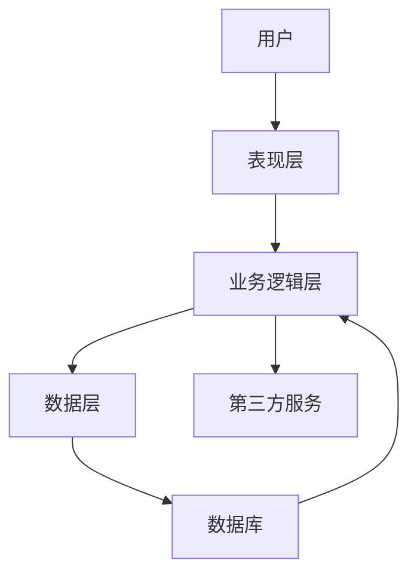

                 


# 第四章: 再生金融的系统架构与设计

## 第4章 系统架构与设计

### 4.1 系统功能设计

#### 4.1.1 再生金融平台的核心功能模块

- **用户管理模块**：
  - 用户注册与登录
  - 用户信息维护
  - 用户权限管理
  - 安全设置（密码重置、双因素认证等）

- **资源评估模块**：
  - 企业资源数据采集
  - 资源价值评估
  - 资源优化建议

- **交易模块**：
  - 股票买卖交易
  - 资源置换交易
  - 价格监控与提醒

- **数据可视化模块**：
  - 股票价格与内在价值对比图
  - 安全边际动态变化图
  - 资源利用率统计图

- **风险管理模块**：
  - 风险评估与预警
  - 投资组合优化
  - 风险对冲策略

#### 4.1.2 核心功能模块的实现逻辑

- **用户管理模块**：
  ```mermaid
  graph TD
      A[用户] --> B[登录/注册]
      B --> C[用户认证]
      C --> D[权限管理]
      D --> E[操作记录]
      E --> F[退出]
  ```

- **资源评估模块**：
  ```mermaid
  graph TD
      A[企业数据] --> B[数据预处理]
      B --> C[资源价值评估]
      C --> D[评估结果]
      D --> E[优化建议]
  ```

- **交易模块**：
  ```mermaid
  graph TD
      A[用户] --> B[提交订单]
      B --> C[订单处理]
      C --> D[交易确认]
      D --> E[交易完成]
  ```

### 4.2 系统架构设计

#### 4.2.1 系统架构分层

- **数据层（Data Layer）**：
  - 数据库设计与管理
  - 资源数据存储
  - 交易数据存储
  - 用户数据存储

- **业务逻辑层（Business Logic Layer）**：
  - 资源评估逻辑
  - 交易逻辑
  - 风险管理逻辑
  - 安全边际计算逻辑

- **表现层（Presentation Layer）**：
  - 用户界面设计
  - 数据可视化展示
  - 交互逻辑设计

#### 4.2.2 系统架构图



#### 4.2.3 核心组件与模块化设计

- **核心组件**：
  - 用户认证组件
  - 资源评估组件
  - 交易引擎组件
  - 数据可视化组件

- **模块化设计**：
  - 每个功能模块独立开发
  - 使用API进行模块间通信
  - 模块化设计便于扩展与维护

### 4.3 系统接口设计

#### 4.3.1 内部接口设计

- **资源评估接口**：
  ```python
  def calculate_intrinsic_value(financial_data):
      # 计算内在价值
      pass
  ```

- **交易接口**：
  ```python
  def execute_trade(order):
      # 执行交易
      pass
  ```

#### 4.3.2 外部接口设计

- **与企业系统的接口**：
  - 数据接口：REST API
  - 授权接口：OAuth 2.0
  - 通知接口：Webhooks

- **与第三方服务的接口**：
  - 支付接口：支付宝、微信支付
  - 第三方数据源：股票行情API

### 4.4 系统交互设计

#### 4.4.1 用户与系统的交互流程

- **登录流程**：
  ```mermaid
  graph TD
      A[用户] --> B[登录页面]
      B --> C[输入用户名和密码]
      C --> D[提交]
      D --> E[系统认证]
      E --> F[登录成功或失败]
  ```

- **资源评估流程**：
  ```mermaid
  graph TD
      A[用户] --> B[提交资源数据]
      B --> C[数据预处理]
      C --> D[资源评估]
      D --> E[显示评估结果]
  ```

- **交易流程**：
  ```mermaid
  graph TD
      A[用户] --> B[选择交易类型]
      B --> C[输入交易参数]
      C --> D[提交订单]
      D --> E[订单处理]
      E --> F[交易完成]
  ```

#### 4.4.2 关键交互场景

- **资源评估场景**：
  ```mermaid
  graph TD
      A[用户] --> B[提交资源数据]
      B --> C[数据预处理]
      C --> D[资源价值计算]
      D --> E[显示安全边际]
      E --> F[用户确认或修改]
  ```

- **交易场景**：
  ```mermaid
  graph TD
      A[用户] --> B[选择股票]
      B --> C[查看安全边际]
      C --> D[提交购买请求]
      D --> E[订单处理]
      E --> F[交易完成]
  ```

## 第4章 小结

本章详细介绍了再生金融系统的架构与设计，从功能模块到系统架构，从接口设计到交互流程，为后续的系统实现奠定了基础。通过模块化设计和分层架构，确保系统的可扩展性和可维护性。同时，通过详细的交互设计，确保用户体验的流畅性和系统的高效性。

接下来的章节将重点介绍系统的实现部分，包括环境搭建、核心代码实现、案例分析等，帮助读者更好地理解和应用格雷厄姆特价股票理论在再生金融中的实际应用。

