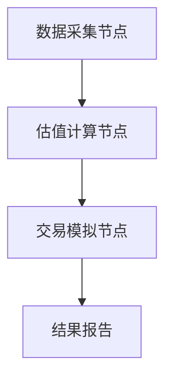

                 


# 《格雷厄姆特价股票理论在分数化所有权证券中的运用》

## 关键词：格雷厄姆投资理论、分数化所有权证券、价值投资、证券分析、分布式系统架构

## 摘要：
本文探讨了格雷厄姆特价股票理论在分数化所有权证券中的应用，通过结合价值投资原则与现代分布式系统架构，提出了一种创新的证券分析方法。文章详细分析了分数化所有权证券的定义、特点及其与格雷厄姆理论的契合点，提出了基于数学模型的证券估值算法，并设计了一个支持分数化所有权的分布式证券分析系统。通过实际案例和系统实现，本文展示了如何利用格雷厄姆理论提升分数化证券的评估精度和交易效率，为投资者和系统设计者提供了新的思路和实践指南。

---

## 第一章: 引言

### 1.1 核心概念与问题背景
- **问题背景**：传统证券市场中，投资者往往因资金不足或投资门槛高而无法参与优质资产的投资。近年来，分数化所有权证券的兴起为投资者提供了以更低门槛持有优质资产的机会。
- **核心概念**：
  - **格雷厄姆特价股票理论**：由 Benjamin Graham 提出的价值投资方法，强调以低于内在价值的价格买入股票。
  - **分数化所有权证券**：将资产的所有权分割成可转让的分数单位，允许投资者按比例持有资产。

### 1.2 问题描述
- 格雷厄姆的理论在传统证券市场中已得到广泛应用，但在分数化所有权证券领域仍需进一步探索其适用性。
- 分数化所有权证券的流动性、估值方法和交易机制与传统证券存在显著差异，传统投资理论需要进行调整和优化。

### 1.3 研究目标
- 探讨格雷厄姆特价股票理论在分数化所有权证券中的应用。
- 提出基于格雷厄姆理论的分数化证券估值模型和交易策略。

---

## 第二章: 格雷厄姆特价股票理论的核心概念

### 2.1 价值投资的基本原理
- **内在价值**：格雷厄姆认为，股票的内在价值是其未来现金流的现值。
- **安全边际**：购买价格低于内在价值，以确保投资的安全性。

### 2.2 分数化所有权证券的定义与特点
- **定义**：将资产（如股票、房地产等）的所有权分割成多个可交易的分数单位，每个单位代表资产的一部分所有权。
- **特点**：
  - **低门槛**：投资者可以用少量资金参与优质资产。
  - **高流动性**：分数化证券可以通过二级市场进行交易。
  - **透明性**：每个分数单位的估值清晰可查。

---

## 第三章: 格雷厄姆理论与分数化所有权证券的结合

### 3.1 分数化所有权证券的估值模型
- **基于格雷厄姆的估值方法**：使用市盈率（P/E）和市净率（P/B）等指标评估分数化证券的内在价值。
- **数学模型**：
  - 内在价值公式：
    $$\text{Intrinsic Value} = \frac{\text{Earnings Per Share} \times (1 + g)}{r}$$
    其中，$g$ 是预期增长率，$r$ 是期望回报率。
  - 安全边际计算：
    $$\text{Margin of Safety} = \text{Intrinsic Value} - \text{Market Price}$$

### 3.2 分数化所有权证券的流动性优化
- **交易机制**：通过分布式账本技术实现分数化证券的实时交易和结算。
- **流动性提升**：利用市场深度算法确保分数化证券的流动性。

---

## 第四章: 系统架构与技术实现

### 4.1 系统功能设计
- **数据采集模块**：实时获取分数化证券的市场数据。
- **估值计算模块**：基于格雷厄姆理论计算分数化证券的内在价值。
- **交易模拟模块**：模拟交易过程并评估投资回报。

### 4.2 分布式系统架构
- **节点分布**：采用分布式架构，确保系统的高可用性。
- **数据流**：
  1. 数据采集节点获取市场数据。
  2. 估值计算节点计算内在价值。
  3. 交易模拟节点模拟交易并生成报告。

### 4.3 系统交互流程


---

## 第五章: 项目实战

### 5.1 环境搭建
- **工具安装**：安装 Python、Jupyter Notebook 和相关库（如 pandas、numpy）。

### 5.2 核心代码实现
```python
import pandas as pd
import numpy as np

def calculate_intrinsic_value(eps, growth_rate, required_return):
    return eps * (1 + growth_rate) / required_return

def calculate_margin_of_safety(intrinsic_value, market_price):
    return intrinsic_value - market_price

# 示例数据
eps = 5
growth_rate = 0.1
required_return = 0.12
market_price = 40

iv = calculate_intrinsic_value(eps, growth_rate, required_return)
mos = calculate_margin_of_safety(iv, market_price)

print(f"内在价值: {iv}")
print(f"安全边际: {mos}")
```

### 5.3 实际案例分析
- 以某分数化股票为例，计算其内在价值和安全边际，评估其投资价值。

---

## 第六章: 应用案例与未来展望

### 6.1 应用案例分析
- **案例一**：利用格雷厄姆理论评估某分数化股票的投资价值。
- **案例二**：通过分布式系统实现分数化证券的实时交易和结算。

### 6.2 未来展望
- **技术创新**：结合人工智能和大数据技术，进一步优化分数化证券的估值模型。
- **市场扩展**：探索分数化所有权证券在更多资产类别中的应用。

---

## 第七章: 结论与建议

### 7.1 核心结论
- 格雷厄姆特价股票理论为分数化所有权证券的估值和交易提供了理论支持。
- 分数化所有权证券的应用降低了投资门槛，提高了市场流动性。

### 7.2 投资者建议
- 选择具有较高安全边际的分数化证券进行投资。
- 关注市场的流动性风险和监管政策变化。

### 7.3 开发者建议
- 在系统设计中充分考虑分布式架构的可扩展性和安全性。
- 持续优化估值模型，提高评估精度。

---

## 参考文献
1. Benjamin Graham, *The Intelligent Investor*.
2. 小岛哲哉，*《匠人精神》*.
3. 国内证券市场相关研究报告。

---

通过本文的分析和实践，我们展示了如何将格雷厄姆的价值投资理念与分数化所有权证券相结合，为投资者和系统设计者提供了新的视角和方法。

